# AI Chat Search

Search across your ChatGPT and Claude conversations. Conversations you open are saved in your
browser, and one search box finds them again, with the matching words highlighted. No account,
no server, no analytics: the index never leaves your browser.

| Search (light) | Search (dark) |
| --- | --- |
| 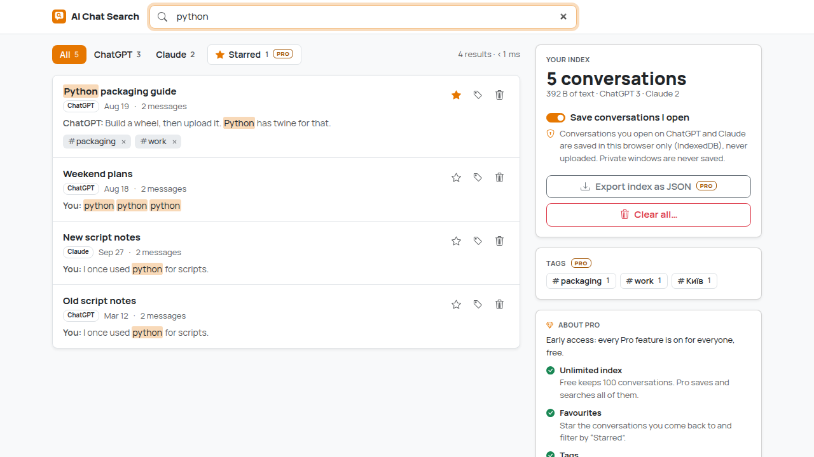 | 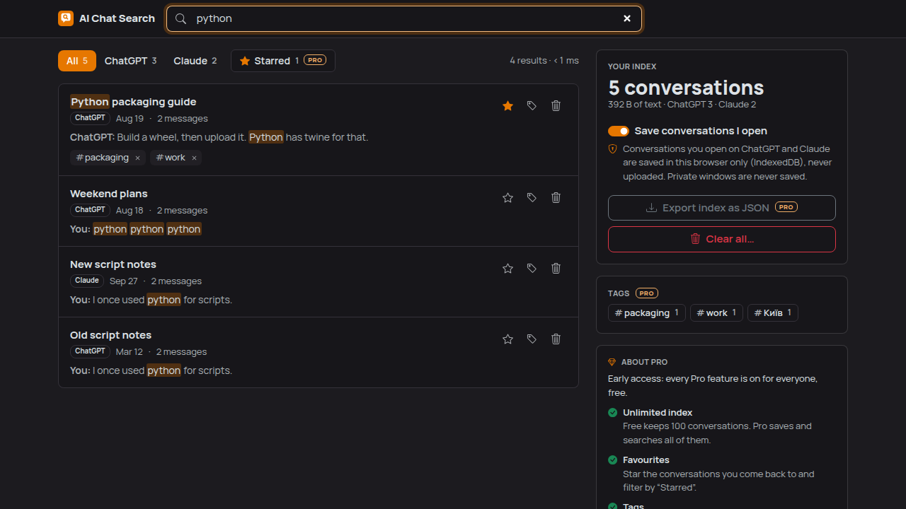 |

| Toolbar popup | Popup (dark) | Page not recognised |
| --- | --- | --- |
| 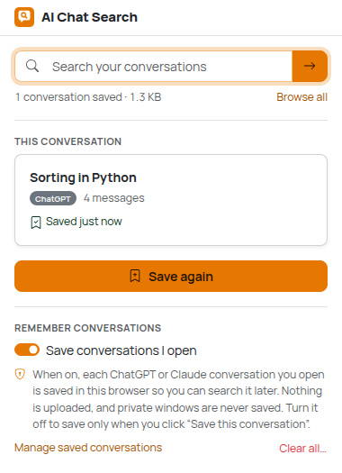 | 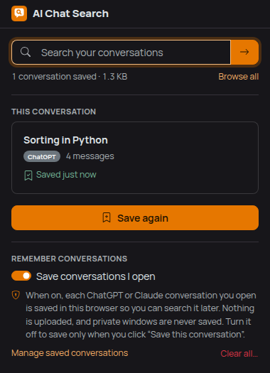 | 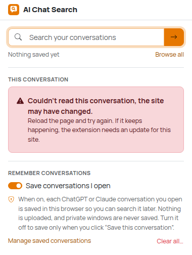 |

| Stars and tags, filtered by a tag | Tags (dark) | Side panel: tags and About Pro |
| --- | --- | --- |
| 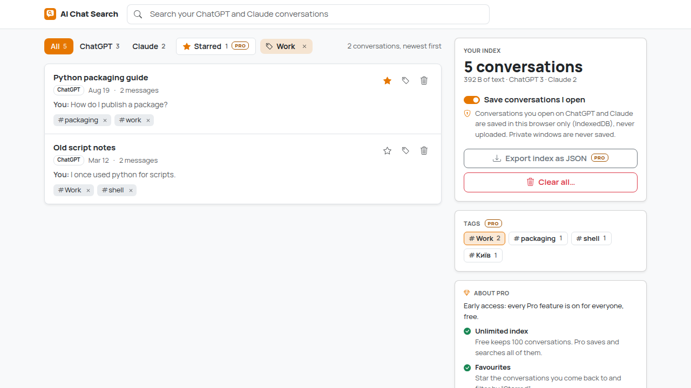 | 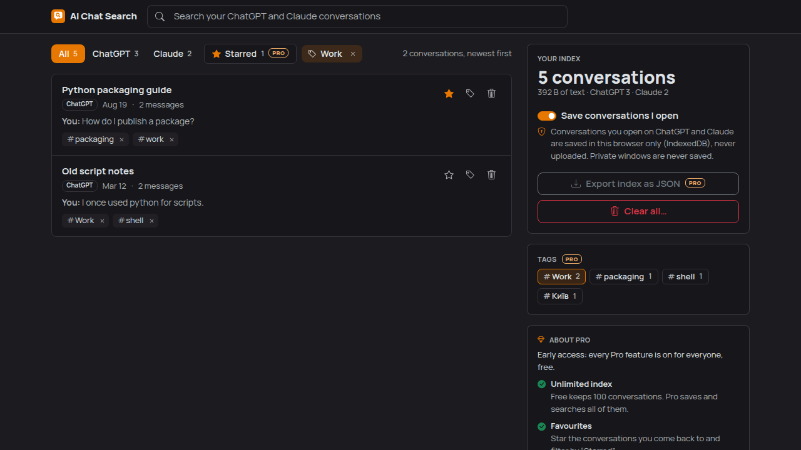 | 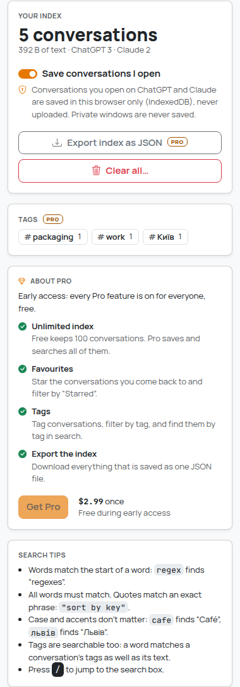 |

| Free plan, index full (search page) | Free plan, index full (popup) |
| --- | --- |
| 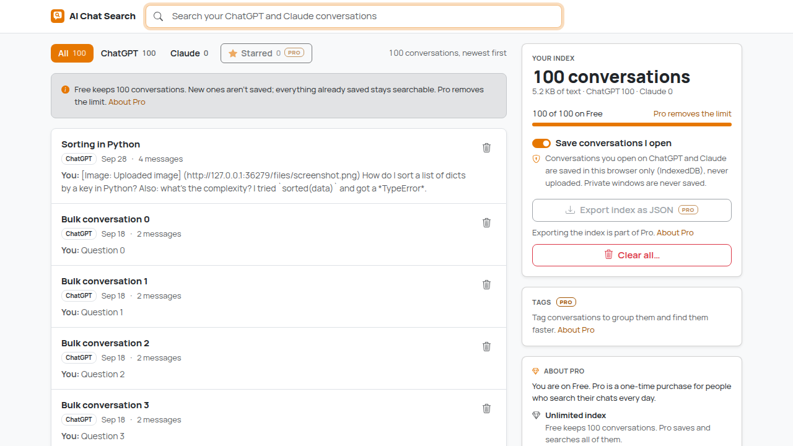 | 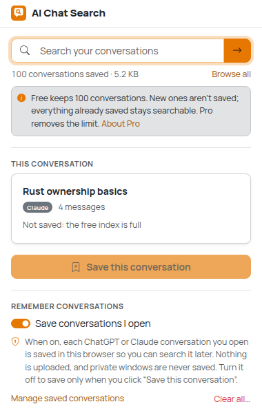 |

| Nothing saved yet | Clear all (confirmation) |
| --- | --- |
| 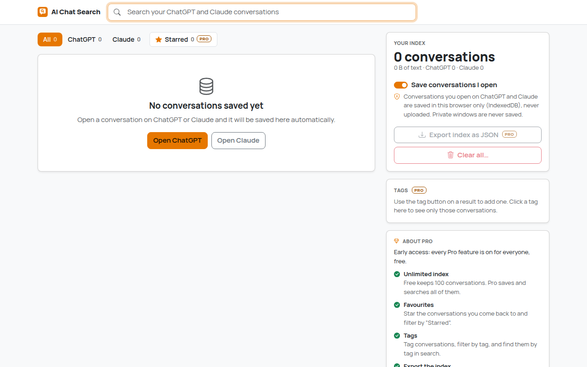 | 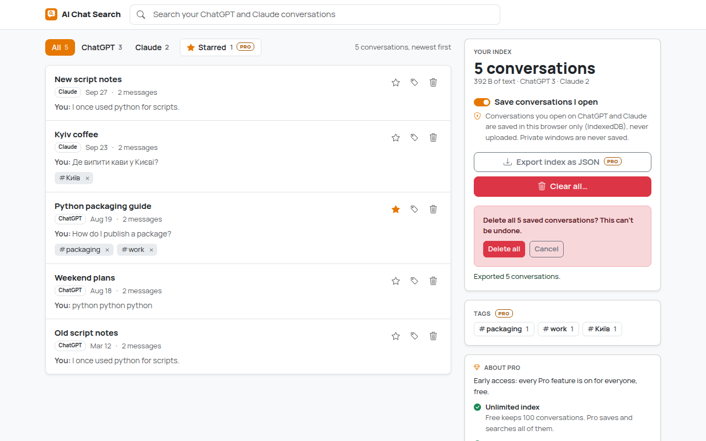 |

The screenshots come from the e2e test. It runs on local fixture pages that copy the DOM of
ChatGPT and Claude, and on seeded data, not on the real sites (see
[What is verified](#what-is-verified-and-what-isnt)).

## How to use

1. Install: build it (`npm install && npm run build`), open `chrome://extensions`, turn on
   **Developer mode**, click **Load unpacked** and pick the `dist/` folder.
2. Open conversations on [chatgpt.com](https://chatgpt.com) or [claude.ai](https://claude.ai)
   as usual. Each one is saved once the page has settled (1.5 s without changes), and again when
   it changes.
   A reply that is still being written is saved once it is finished. Tabs that were already open
   need one reload after installing.
3. To search, click the toolbar button, type in the box and press Enter. The search page opens.
   Or click **Browse all**.
4. On the search page:
   - Results update as you type. Filter by **All / ChatGPT / Claude**.
   - Click a result to open the conversation on its site.
   - The trash icon removes one conversation from the index; **Undo** brings it back.
   - **Star** a result (star icon) to keep it handy, then turn on the **Starred** filter to see
     only starred conversations. Click the star again to unstar. <sup>PRO</sup>
   - **Tag** a result (tag icon): type a tag and press Enter (several at once with commas,
     `work, ideas`), <kbd>Esc</kbd> or **Done** closes the field. Tags show under the result;
     click a tag to see only conversations with it (also from the **Tags** list in the side
     panel), and × to remove it (with **Undo**). Tags are searchable: a word in the search box
     also matches tags, and matching tags are highlighted. Tags ignore case and accents
     (`Work` = `work`), up to 20 per conversation. <sup>PRO</sup>
   - **Export index as JSON** downloads everything that's saved <sup>PRO</sup>; **Clear all…**
     deletes it (after a confirmation).
   - Filters combine and live in the address (`?q=…&site=claude&starred=1&tag=work`), so a
     filtered view can be bookmarked.
   - Press <kbd>/</kbd> to jump to the search box, <kbd>Esc</kbd> to clear it.
5. Prefer to choose what's saved? Turn off **Save conversations I open** (popup or search page).
   Then open a conversation, click the toolbar button and click **Save this conversation**.

Search syntax:

- `regex`: words match the beginning of a word ("regexes" too).
- `sort key`: every word must match, anywhere in the conversation or its title.
- `"sort by key"`: an exact phrase, within one message.
- Case and accents don't matter: `cafe` finds "Café", `київ` finds "Київ", `м'ясо` finds "м’ясо".
- Chinese and Japanese text is matched character by character, so a query matches inside sentences.

If the toolbar icon shows an amber **!** on a chat tab, the extension can't read that conversation
("Couldn't read this conversation, the site may have changed"). Nothing is saved from that page
until the extension is updated for the site's new layout (see
[Site adapters](#site-adapters-and-unverified-selectors)).

## Free vs Pro

| | Free | Pro ($2.99 once) |
| --- | --- | --- |
| Auto-save, manual save, search (prefixes, phrases, every script), site filter, delete, clear all | Yes | Yes |
| Conversations in the index | Up to 100 | Unlimited |
| Favourites: star conversations, **Starred** filter | | Yes |
| Tags: add/remove, filter by tag, tags are searchable | | Yes |
| Export the index as JSON | | Yes |

**Early access: right now everyone gets Pro, free.** Payments aren't set up yet, so
`EARLY_ACCESS` in `src/core/plan.ts` is `true`: every Pro feature is on and there is no limit.
The **About Pro** card in the search page's side panel lists the features and the price, says
"Free during early access", and its **Get Pro** button is disabled.

How the free limit behaves (once early access ends):

- When 100 conversations are saved, **new** conversations aren't saved, automatically or with
  the popup button. Conversations that are already saved keep being updated when you open them.
- Nothing is ever deleted or hidden: everything already saved stays searchable, even above 100
  (for example after early access ends). Delete a few conversations to make room.
- The popup and the search page show one calm line ("Free keeps 100 conversations. New ones
  aren't saved; everything already saved stays searchable. Pro removes the limit.") with a link
  to the About Pro card, and the search page shows a small "82 of 100 on Free" meter.
- Pro features show a small `PRO` badge. Things you made are never locked: without Pro you can
  still see your stars and tags, filter by them, unstar and remove tags; only adding new ones and
  exporting need Pro.

Implementation: `src/core/plan.ts` is the plan seam described in `docs/MONETIZATION.md`
(`hasFeature`, `limitsFor`, `EARLY_ACCESS`, `PRO_PRICE`, pure and unit-tested).
`src/storage/plan.ts` reads the stored plan (`plan` in `chrome.storage.local`, sanitized,
default `'free'`); nothing writes it yet, a future `src/payments/` adapter will. Every Pro check
goes through these two files. The limit is enforced in the service worker, in the same
IndexedDB transaction that saves, so it can't be passed by two saves at once.

## Privacy, and why auto-save is on by default

What is saved: for each conversation you open on ChatGPT or Claude, the title, the address, and
the text of your messages and the replies. It is stored in IndexedDB inside the extension (not in
the chat site's storage), in this browser profile only. Nothing is uploaded, synced or shared.
There are no network requests of the extension's own (checked by the e2e test).

**Auto-save is on by default.** Search is only useful if it has your conversations, and a search
tool that asks you to remember to save each chat mostly finds nothing. The data is text you
already have in your ChatGPT/Claude account, copied to your own disk, and it only ever comes from
the three chat sites. To keep this a clear, reversible choice:

- The popup explains what is saved and has the switch right there. Turning it off stops new saves
  at once. The **Save this conversation** button still works for explicit saves.
- **Private (incognito) windows are never saved automatically**, even if you allow the extension
  in incognito. This is checked in the content script and again in the service worker. A manual
  save from a private window still works, because you asked for it.
- **Clear all** is one click plus a confirmation, in the popup and on the search page. Single
  conversations can be deleted from the results.
- Pages without a conversation address are never saved. As far as we know ChatGPT's temporary
  chats don't get one, so they aren't saved either (unverified, like the selectors below).

### Permissions

| Permission | Why |
| --- | --- |
| `storage` | The auto-save setting and the plan (`chrome.storage.local`) |
| `unlimitedStorage` | The index lives in IndexedDB. Without it, Chrome treats that data as evictable cache and may delete it when the disk is under pressure, and a few thousand long conversations can pass tens of MB. No permission warning is shown for it |
| Content script on `https://chatgpt.com/*`, `https://chat.openai.com/*`, `https://claude.ai/*` | Read the open conversation. `chat.openai.com` is ChatGPT's old address, which still redirects. No other site is matched, and there are no `host_permissions` |

Not requested: `tabs` (the popup messages the active tab by id and opens pages with
`chrome.tabs.create`, neither needs it), `downloads` (the JSON export uses an `<a download>` link),
`<all_urls>`, `scripting`, `activeTab`, `history`, `bookmarks`.

## How search works

- **Saving.** The content script reads the conversation through the site adapter and sends it to
  the service worker, because IndexedDB in a content script would belong to the chat site. The
  service worker stores `{title, url, site, messages as text, createdAt, updatedAt, savedAt}` plus
  a precomputed search text. A content hash skips writes when nothing changed. The user's
  `starred` flag and `tags` live on the same record and are carried over when the conversation is
  saved again; the save (read, limit check, write) and star/tag changes each run in one
  IndexedDB transaction, so neither can overwrite the other.
- **Normalization** (`src/search/normalize.ts`): per character, NFKD, drop combining marks,
  lowercase, a few special letters (ß → ss, ł → l, …). Apostrophes inside words and invisible
  characters are dropped. Tokens are runs of letters/digits, and Han/Hiragana/Katakana characters
  are one-character tokens. For Cyrillic this also folds й → и, ї → і, ё → е; queries fold the
  same way, so matching stays consistent.
- **Index.** Each saved conversation stores its search text: folded tokens joined by single
  spaces, messages separated. A query scans those strings with `indexOf`: `" term"` finds word
  prefixes, `" exact phrase "` finds phrases. That is the "precomputed normalized text" design,
  not an inverted index, because:
  - It handles prefixes, phrases and every script with the same few lines of code.
  - There's nothing to build when the search page opens. In a quick benchmark during
    development, building an inverted index over 1,000 conversations with a realistic vocabulary
    (300k distinct words) took about 1 s, on every page load.
  - It's fast enough: `test/perf.test.ts` searches 1,000 synthetic conversations (14.5 M
    characters, English + Ukrainian + code-like tokens). Typical queries take 9-22 ms on the build
    machine, and a five-common-word query about 40 ms. The test fails above 100 ms.
  - Scaling is linear. At a few thousand long conversations expect tens of milliseconds more per
    query; searching still happens on a short typing debounce.
- **Ranking** (`src/search/engine.ts`): all words must match (AND). For each word or phrase, the
  score adds `log(1 + occurrences)` (counting stops at 20) plus a title bonus of 2.5; phrases
  weigh 1.5×. A word can also match one of the conversation's tags, which adds a bonus of 2
  (so a conversation tagged `invoices` ranks above one that only mentions the word). The total is
  multiplied by a recency factor: 1.5× for a conversation updated today, 1.25× after 30 days,
  towards 1× for old ones. Ties go to the most recently updated. The Starred and tag filters
  narrow the candidates before searching, like the site filter.
- **Snippets and highlights** (`src/search/snippet.ts`): the message matching the most words is
  chosen, and the excerpt is the ~200-character window with the most matches. Positions are
  mapped from the folded text back to the original, so "Львівській" is highlighted for the query
  `ЛЬВІВСЬКІЙ`. Highlights are built from text nodes and `<mark>` elements. Conversation text is
  never inserted as HTML.

### Index export format (Pro)

```json
{
  "schemaVersion": 1,
  "kind": "ai-chat-search-index",
  "exportedAt": "2026-09-27T11:03:09.000Z",
  "conversations": [
    {
      "source": "chatgpt",
      "conversationId": "…",
      "title": "Sorting in Python",
      "url": "https://chatgpt.com/c/…",
      "createdAt": "…",
      "updatedAt": "…",
      "starred": false,
      "tags": ["work"],
      "messages": [{ "role": "user", "text": "…" }, { "role": "assistant", "text": "…" }]
    }
  ]
}
```

`starred` and `tags` were added without bumping `schemaVersion` (new fields only). The index
stores plain text. For Markdown or PDF copies of a conversation, use Chat Exporter.

## Site adapters and unverified selectors

Everything that depends on a chat site's page lives in one file per site:
`src/sites/chatgpt.ts` and `src/sites/claude.ts`. Both implement the same interface
(`src/sites/types.ts`): `detect()`, `getConversationId()`, `getConversationTitle()`,
`getMessages()`, `isStreaming()`, `injectButtonTarget()` (unused here, kept for parity with Chat
Exporter) and a `chromeSelector` for UI inside messages. When a site changes its markup, the fix
is a change to that one file.

**All site selectors below are unverified.** chatgpt.com and claude.ai were not reachable from
the environment this was built in, and both need a login. The selectors come from knowledge of
the sites' DOM as of 2025. The fixture pages in `e2e/fixtures/` replicate exactly these
assumptions, so the tests prove the logic, not the selectors.

ChatGPT (`src/sites/chatgpt.ts`):

| Selector | Used for | Status |
| --- | --- | --- |
| `[data-message-author-role]` (`user` / `assistant`; `tool` and `system` are skipped) | Messages and their roles | Unverified (widely used by other tools) |
| `.markdown` inside an assistant message | Assistant message body (falls back to the whole message) | Unverified guess |
| `.result-streaming`, `[data-testid="stop-button"]` | A reply is being written (saving waits) | Unverified guesses |
| `nav a[href$="/c/<id>"]` | Title fallback when `document.title` is just "ChatGPT" | Unverified guess |
| `[data-testid$="turn-action-button"]`, `.sr-only` | UI to drop inside messages | Unverified guesses |
| URL `/c/<id>`, `/g/<gpt>/c/<id>`, `/share/<id>` | Conversation id (the index key) | Unverified |

Claude (`src/sites/claude.ts`):

| Selector | Used for | Status |
| --- | --- | --- |
| `[data-testid="user-message"]` | User messages | Unverified (widely used by other tools) |
| `.font-claude-response`, `.font-claude-message` | Assistant messages (newer and older class name) | Unverified guesses |
| `[data-is-streaming="true"]`, `button[aria-label="Stop response"]` | A reply is being written (saving waits) | Unverified guesses |
| `[data-testid="chat-menu-trigger"]` | Title fallback | Unverified guess |
| `[data-testid="action-bar-copy"]`, `[data-testid="action-bar-retry"]` | UI to drop inside messages | Unverified guesses |
| URL `/chat/<id>`, `/share/<id>` | Conversation id (the index key) | Unverified |

Site-independent assumptions (in `src/core/htmlToMarkdown.ts`): code in `<pre><code>`, KaTeX
math with `<annotation encoding="application/x-tex">`, user messages with
`white-space: pre-wrap`. These are also unverified against the live sites.

**Failing loudly.** `readConversation()` (`src/core/read.ts`) refuses to read a conversation URL
without recognisable messages, without a user message, or without an assistant reply (unless one
is being written). After a 10-second grace period for slow pages, the toolbar icon gets a **!**
badge and the popup shows "Couldn't read this conversation, the site may have changed." Nothing
half-read is saved.

## What is verified and what isn't

Verified (automated, in this repository):

- 137 unit tests (`npm test`): normalization (Latin, Cyrillic, apostrophes, CJK, compatibility
  forms), query parsing, ranking order, AND/prefix/phrase semantics, site, Starred and tag
  filters, tag search and ranking, snippets and highlight positions, records (change detection,
  dates, size, migration of old search text, star and tags kept across saves), tag cleaning, the
  plan seam (sanitized plan, early access, features, limits) and the free-limit policy, the JSON
  export, the auto-save policy (off / private window / manual), settings, message
  validation, the shared HTML → text converter, both adapters against the fixture pages, and a
  performance test (1,000 conversations, every query under 100 ms).
- 19 end-to-end tests (`npm run test:e2e`) with the built extension in Chromium 141:
  - saving when a conversation is opened (ChatGPT and Claude), after single-page navigation, not
    again when unchanged, and only after a streaming reply finishes;
  - auto-save off with a manual save from the popup;
  - the popup (privacy text, search box opening the search page, clear all);
  - search ranking and `<mark>` highlights, phrases, prefixes, Cyrillic and diacritics, site
    filter, opening a result;
  - live updates while the search page is open;
  - delete with undo, JSON export (with stars and tags), clear all;
  - favourites: star/unstar, the Starred filter, stars and tags kept when the chat page saves a
    newer copy, filters restored from the address;
  - tags: add from the keyboard (several at once, duplicates refused), tag search with
    highlights, filter from the side panel and from a chip, remove with undo;
  - the About Pro card during early access (price, disabled Get Pro, PRO badges, nothing locked);
  - the free plan with a full index (EARLY_ACCESS overridden in the test build): a saved
    conversation still updates, a new one is refused and nothing is deleted, the notices in the
    popup and on the search page, Pro controls locked but an existing star removable, and room
    made by deleting one;
  - the badge and error on a changed layout;
  - the production manifest, and that no network requests leave the browser.

Not verified:

- **The extension has never run on the real chatgpt.com or claude.ai.** Before publishing, check
  by hand on both sites: open a few conversations (including a long one), wait for a reply to
  finish, switch conversations without reloading, search for words from each. If something fails,
  compare the live DOM with the selector tables above.
- Private windows: the "never auto-save in incognito" rule is unit-tested (policy function) but
  not end-to-end (Playwright can't easily drive an extension in an incognito window).

## Development

Requires Node.js 22.12+.

```bash
npm install
npm run build        # production build -> dist/
npm run dev          # rebuild on change (with source maps) -> dist/
npm run typecheck
npm test             # unit tests (vitest + happy-dom), including the performance test
npm run check        # typecheck + unit tests + build
npm run test:e2e     # builds dist/ and dist-e2e/, then drives dist-e2e/ in real Chromium
```

`test:e2e` needs Chromium. It is auto-detected in some environments; otherwise set
`CHROMIUM_PATH=/path/to/chromium`. It writes all screenshots to `e2e/output/` (ignored by git)
and refreshes the curated ones in `screenshots/`.

The e2e build (`dist-e2e/`) differs from production only in test plumbing: the content script also
runs on `http://127.0.0.1/*` (the local fixture server; `/chatgpt/…` and `/claude/…` paths pick
the adapter), timings are shorter, the service worker exposes `__searchTest` for seeding data and
reporting refused saves, and an `e2eEarlyAccess` key in `chrome.storage.local` can switch early
access off so the free plan can be tested. The e2e test checks that `dist/` has none of these.

After changing `static/icons/icon.svg`, render the PNGs with `node scripts/make-icons.mjs`.

### Styling

Bootstrap 5.3 compiled from Sass with the AI Chat Search theme (`src/styles/_theme.scss`, primary
`#e67700`), Bootstrap Icons (imported per file, turned into element descriptors at build time) and
bundled Manrope / JetBrains Mono (Latin, Latin Extended, Cyrillic), following
`docs/design-system.md`. `#e67700` on white is 3:1, so links use a darker shade (5.6:1) and
filled primary buttons use dark text. There is no in-page UI: the extension shows nothing on the
chat sites except the toolbar badge when a page can't be read.

## Project structure

```
src/
  core/        Pure logic: types, HTML → text/Markdown converter, readConversation(),
               plan.ts (Free vs Pro seam), tags.ts (tag cleaning and counting)
  sites/       One adapter per chat site (all site-specific selectors) + adapter selection
  search/      Normalization, query parsing, ranking, snippets (pure)
  storage/     Record model (pure), IndexedDB, settings, stored plan
  content/     Content script: page watcher, capture after the page settles
  background/  Service worker: saves, toolbar badge, auto-save and free-limit policy
  popup/       Toolbar popup
  page/        Search page
  platform/    Messages between contexts (typed, validated)
  styles/      Sass: theme, fonts, popup, search page
  ui/          DOM builder, icons, downloads, formatting
static/        manifest.json, HTML, icons
test/          Unit tests (incl. perf.test.ts)
e2e/           Chromium smoke test and fixture pages (copies of ChatGPT/Claude DOM)
screenshots/   Curated screenshots from the e2e test
```

`src/core`, `src/sites`, `src/content/watch.ts` and the fixtures are shared with Chat Exporter
(`../chat-exporter`) by copy, not by import: each extension is self-contained and works without
the other. Keep the copies identical when fixing a selector.

## Known limitations

- Never tested on the live sites (see above).
- Only conversations you open are indexed; the extension doesn't crawl your history (that would
  need the sites' private APIs). Only what's in the page's DOM is saved, and each save replaces
  the previous copy. If a site renders only part of a long conversation (lazy loading), the saved
  copy has what was on the page at that moment.
- Claude's incognito chats: their URL scheme couldn't be checked. If they use normal `/chat/<id>`
  addresses they would be auto-saved; turn auto-save off before using them, or delete them from
  the index.
- Matching is by word prefix, not substring: `state` doesn't find `useState`. Diacritics folding
  treats й/и, ї/і, ё/е as the same letter.
- The search page loads the whole index into memory. Fine for thousands of conversations, but it
  isn't designed for hundreds of thousands.
- Deleting a conversation on ChatGPT or Claude doesn't remove it from the index; delete it on the
  search page.
- Stars and tags are set on the search page only (not from the popup). They live on the saved
  record, so deleting a conversation or **Clear all** removes them too (delete has **Undo**).
- **Get Pro** does nothing yet: there is no payments integration, and while `EARLY_ACCESS` is on
  everyone has Pro anyway (see [Free vs Pro](#free-vs-pro)).
