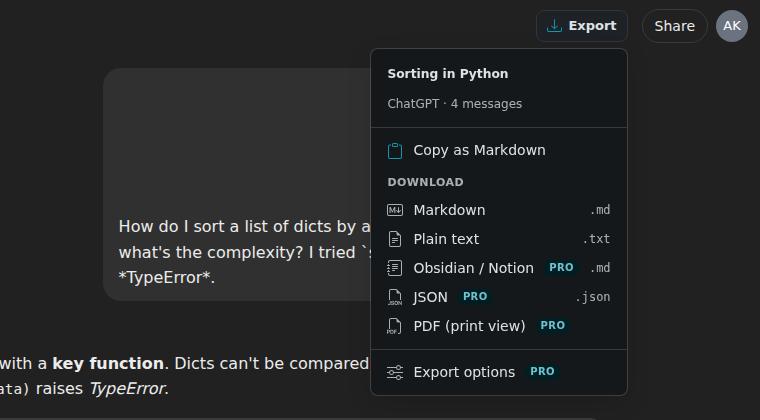
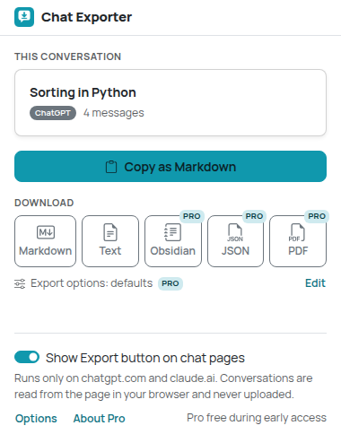
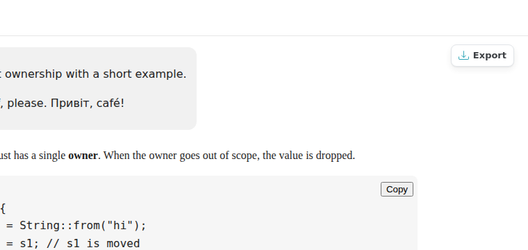
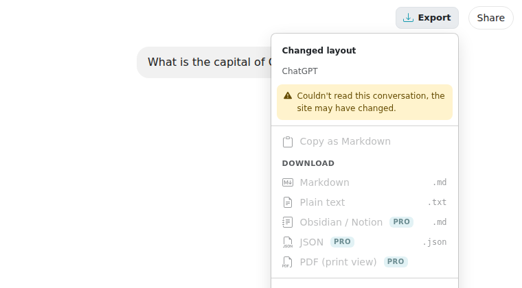
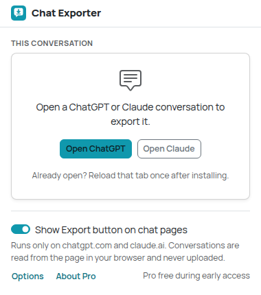
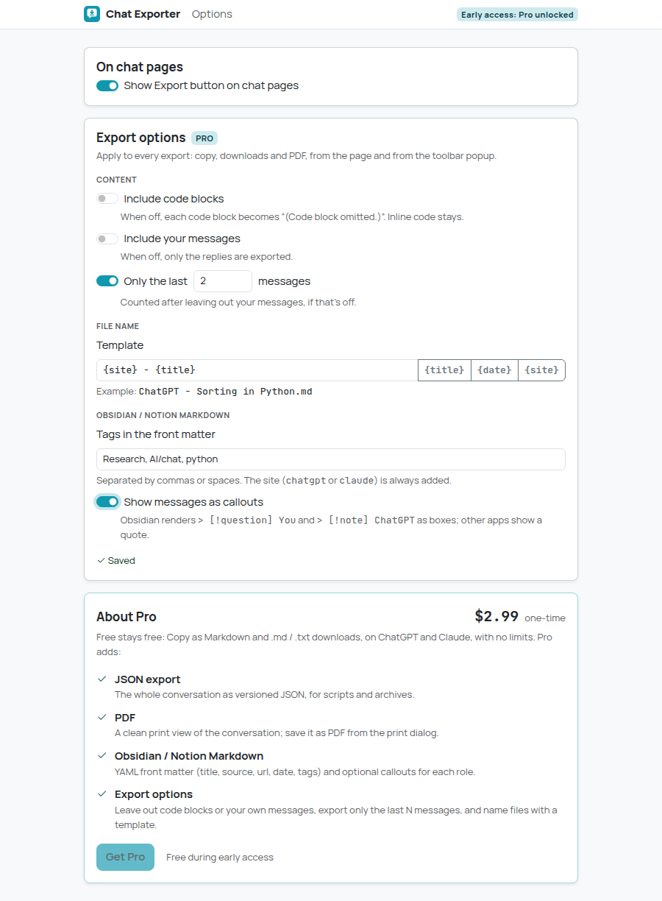
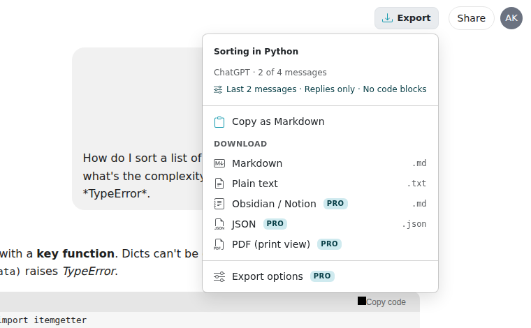
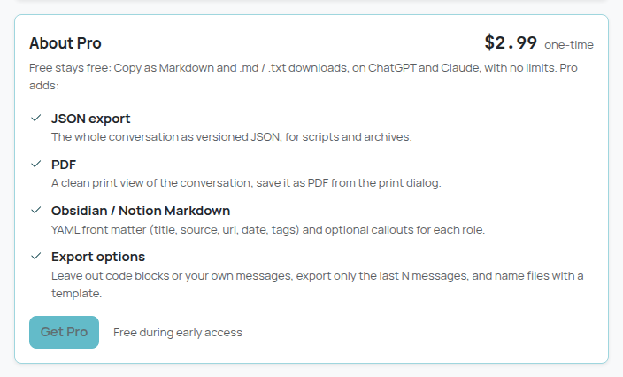
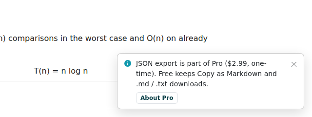

# Chat Exporter

Export ChatGPT and Claude conversations to **Markdown**, **plain text**, **Obsidian / Notion
Markdown**, **JSON** or **PDF**, or copy them as Markdown. Everything happens in your browser: no
account, no server, no analytics.

| In-page menu (light) | In-page menu (dark) |
| --- | --- |
|  |  |

| Toolbar popup | Popup (dark) | Print view (Save as PDF) |
| --- | --- | --- |
|  |  |  |

| Floating button (no header spot found) | Site layout not recognised | Not on a chat page |
| --- | --- | --- |
|  |  |  |

| Options page (export options, Pro) | Menu with export options applied | About Pro | Pro feature on the free plan |
| --- | --- | --- | --- |
|  |  |  |  |

The screenshots come from the e2e test. It runs on local fixture pages that copy the DOM of
ChatGPT and Claude, not on the real sites (see [What is verified](#what-is-verified-and-what-isnt)).

## How to use

1. Install: build it (`npm install && npm run build`), open `chrome://extensions`, turn on
   **Developer mode**, click **Load unpacked** and pick the `dist/` folder.
2. Open a conversation on [chatgpt.com](https://chatgpt.com) or [claude.ai](https://claude.ai).
   Tabs that were already open need one reload after installing.
3. Click **Export** in the page. It sits next to the site's **Share** button when it can find
   one, otherwise it floats at the top right, under the site's header.
4. Pick what you want:
   - **Copy as Markdown**: the whole conversation goes to the clipboard.
   - **Markdown** or **Plain text**: the file is downloaded as `<conversation title> <date>.md|txt`.
   - **Obsidian / Notion** (Pro): Markdown with YAML front matter, ready to drop into a vault.
   - **JSON** (Pro): the versioned JSON export.
   - **PDF (print view)** (Pro): a print-friendly copy opens in a new tab and the print dialog
     appears. Choose **Save as PDF** as the destination. The suggested file name follows the file
     name template (by default the title and date).
   - **Export options** (Pro): opens the options page.
5. The toolbar button (popup) offers the same actions for the conversation in the active tab.
   **Edit** next to the export options summary, **Options** and **About Pro** open the options page.
6. **Export options** (Pro, on the options page, `chrome://extensions` → Chat Exporter → Extension
   options, or from the menu). They apply to every export, from the page and from the popup, and
   are saved as you change them:
   - **Include code blocks**: when off, each code block becomes `(Code block omitted.)`. Inline
     code stays.
   - **Include your messages**: when off, only the replies are exported.
   - **Only the last N messages** (1–999), counted after leaving out your messages.
   - **File name template** with `{title}`, `{date}` and `{site}` (e.g. `{site} - {title}` →
     `ChatGPT - Sorting in Python.md`). Characters that aren't allowed in file names are replaced.
   - **Obsidian / Notion Markdown**: the **tags** for the front matter and **callouts** for roles.

   When options change what is exported, the menu says so ("ChatGPT · 2 of 4 messages", "Last 2
   messages · Replies only · No code blocks") and the popup shows "2 of 4 messages".
7. Don't want the button on the page? Turn off **Show Export button on chat pages** in the popup
   or on the options page. The popup keeps working.

If a reply is still being written, the menu says so and the export contains what is on the page
at that moment. The unfinished reply is marked as incomplete.

If the extension can't recognise the page ("Couldn't read this conversation, the site may have
changed"), nothing is exported. That usually means ChatGPT or Claude changed their page and the
extension needs an update (see [Site adapters](#site-adapters-and-unverified-selectors)).

## Free vs Pro

| | Free | Pro ($2.99 one-time) |
| --- | --- | --- |
| Copy as Markdown | Yes | Yes |
| Download Markdown (.md) and plain text (.txt) | Yes | Yes |
| Obsidian / Notion Markdown (front matter, callouts) | | Yes |
| JSON | | Yes |
| PDF (print view) | | Yes |
| Export options: code blocks, your messages, last N, file name template | | Yes |

**Early access: every Pro feature is free for now.** Payments aren't set up yet, so
`EARLY_ACCESS = true` in `src/core/plan.ts` unlocks everything. Pro features carry a small `PRO`
badge in the menu, the popup and on the options page, and the options page has an **About Pro**
card with the price and a disabled **Get Pro** button ("Free during early access").

On the free plan (once early access ends), Pro items stay in the menu with a lock on their badge.
Picking one shows a short note ("JSON export is part of Pro ($2.99, one-time). Free keeps Copy as
Markdown and .md / .txt downloads.") with an **About Pro** button, and nothing is exported. Export
options you saved are kept but not applied; exports use the defaults. Nothing is ever deleted.

How it's built (see `docs/MONETIZATION.md` at the repo root): `src/core/plan.ts` is pure and
unit-tested (`hasFeature`, `limitsFor`, `sanitizePlan`, `PRO_FEATURES`, `PRO_PRICE`). The stored
plan is `plan` in `chrome.storage.local`, sanitized on read (anything but `'pro'` is `'free'`); only
a future `src/payments/` adapter will write it. Every Pro check (menu, popup, options page and the
service worker, which refuses a print request for PDF on the free plan) goes through `hasFeature`.

## Formats

**Markdown**

````markdown
# Sorting in Python

- Source: ChatGPT
- URL: <https://chatgpt.com/c/…>
- Exported: 2026-09-27 14:03
- Messages: 4

---

## You

How do I sort a list of dicts by a key?

## ChatGPT

Use `sorted()` with a **key function**:

```python
by_age = sorted(people, key=itemgetter("age"))
```
````

Headings inside messages are moved two levels down, so `## You` / `## ChatGPT` stay the top of
the outline. The converter handles headings, paragraphs, bold/italic/strikethrough, inline code,
fenced code with the language (from `language-*` classes or the code block's label), nested
lists, task lists, tables (GFM), links, blockquotes, images (as links:
`[Image: alt](url)`) and math (TeX source from KaTeX: `$…$` inline, `$$…$$` for display). UI
text inside messages ("Copy code", edit and copy buttons, screen-reader labels) is removed.
Everything else is escaped, so text like `<script>` or `2 * 3` stays literal.

**Obsidian / Notion Markdown** (Pro)

````markdown
---
title: "Sorting in Python"
source: "ChatGPT"
url: "https://chatgpt.com/c/…"
date: 2026-09-27
tags:
  - "ai-chat"
  - "chatgpt"
---

## You

How do I sort a list of dicts by a key?

## ChatGPT

Use `sorted()` with a **key function**:
````

Every value is a double-quoted YAML string, so titles with `:`, `#`, quotes or a leading `---`
can't break the front matter. The tags are yours (default `ai-chat`; letters, digits, `_`, `-`
and `/` are kept, so `#Research, AI/chat` becomes `Research`, `AI/chat`) plus the site. There is
no `# Title` heading, because note apps show the file name as the title. With **callouts** on,
each message is an Obsidian callout instead of a `##` section:

```markdown
> [!question] You
> How do I sort a list of dicts by a key?

> [!note] ChatGPT
> Use `sorted()` with a **key function**:
```

**JSON** (versioned: `schemaVersion` is bumped only on breaking changes)

```json
{
  "schemaVersion": 1,
  "source": "chatgpt",
  "title": "Sorting in Python",
  "url": "https://chatgpt.com/c/…",
  "conversationId": "…",
  "exportedAt": "2026-09-27T11:03:09.000Z",
  "messages": [
    { "role": "user", "markdown": "How do I sort…", "text": "How do I sort…" },
    { "role": "assistant", "markdown": "Use `sorted()`…", "text": "Use sorted()…", "incomplete": true }
  ]
}
```

`source` is `"chatgpt"` or `"claude"`, `role` is `"user"` or `"assistant"`. `conversationId` is
`null` on pages without one, and `incomplete` is only present on a reply that was still being written.

**Plain text**: title, source line, then `You:` / `ChatGPT:` sections separated by a rule.
Code keeps its indentation; tables become `a | b` rows; links are `text (url)`.

**PDF**: an extension page renders the conversation with the extension's own Markdown renderer
(`src/render/markdown.ts`). It escapes every character of the conversation and only creates
http(s)/mailto links. Images are shown as links and math as TeX source, so the print view never
loads anything from the network.

## Privacy

- Runs only on `chatgpt.com`, `chat.openai.com` and `claude.ai`. Other pages are never touched.
- Reads the conversation from the page you have open when you export it (and, for the popup, when
  you open the popup). It never calls the sites' private APIs.
- Nothing is uploaded and there are no network requests of its own (checked by the e2e test).
- Stored data (`chrome.storage.local`): the "show button" setting, the export options, and the plan
  (`plan`; only a future payments adapter writes it). For the PDF view, the
  conversation is handed to the print tab through `chrome.storage.session`, which lives in memory
  and is cleared when the browser closes. Only the 5 most recent hand-offs are kept.

### Permissions

| Permission | Why |
| --- | --- |
| `storage` | Settings, export options and plan, and the in-memory hand-off of a conversation to the print view (`chrome.storage.session`) |
| Content script on `https://chatgpt.com/*`, `https://chat.openai.com/*`, `https://claude.ai/*` | Show the Export button and read the conversation. `chat.openai.com` is ChatGPT's old address, which still redirects. No other site is matched, and there are no `host_permissions` |

Not requested, and why it isn't needed:

- **`downloads`**: files are saved through an `<a download>` click (in the page's shadow DOM or
  in the popup).
- **`tabs`**: the popup sends messages to the active tab by id, and the print view and the options
  page are opened with `chrome.tabs.create`. None of that needs the permission. The options page is
  declared with `options_ui`, which needs no permission either.
- **`clipboardWrite`**: copying happens right after your click, which the Clipboard API allows.
- **`<all_urls>`, `scripting`, `activeTab`**: the content script is declared for the three chat
  origins only.

## Site adapters and unverified selectors

Everything that depends on a chat site's page lives in one file per site:
`src/sites/chatgpt.ts` and `src/sites/claude.ts`. Both implement the same interface
(`src/sites/types.ts`): `detect()`, `getConversationId()`, `getConversationTitle()`,
`getMessages()`, `isStreaming()`, `injectButtonTarget()` and a `chromeSelector` for UI inside
messages. When a site changes its markup, the fix is a change to that one file.

**All site selectors below are unverified.** chatgpt.com and claude.ai were not reachable from
the environment this was built in, and both need a login. The selectors come from knowledge of
the sites' DOM as of 2025. The fixture pages in `e2e/fixtures/` replicate exactly these
assumptions, so the tests prove the logic, not the selectors.

ChatGPT (`src/sites/chatgpt.ts`):

| Selector | Used for | Status |
| --- | --- | --- |
| `[data-message-author-role]` (`user` / `assistant`; `tool` and `system` are skipped) | Messages and their roles | Unverified (widely used by other tools) |
| `.markdown` inside an assistant message | Assistant message body (falls back to the whole message) | Unverified guess |
| `.result-streaming`, `[data-testid="stop-button"]` | A reply is being written | Unverified guesses |
| `#conversation-header-actions` (prepend), else `[data-testid="share-chat-button"]` (before) | Where the Export button goes | Unverified guesses; falls back to the floating button |
| `nav a[href$="/c/<id>"]` | Title fallback when `document.title` is just "ChatGPT" | Unverified guess |
| `[data-testid$="turn-action-button"]`, `.sr-only` | UI to drop inside messages | Unverified guesses |
| URL `/c/<id>`, `/g/<gpt>/c/<id>`, `/share/<id>` | Conversation id | Unverified |

Claude (`src/sites/claude.ts`):

| Selector | Used for | Status |
| --- | --- | --- |
| `[data-testid="user-message"]` | User messages | Unverified (widely used by other tools) |
| `.font-claude-response`, `.font-claude-message` | Assistant messages (newer and older class name) | Unverified guesses |
| `[data-is-streaming="true"]`, `button[aria-label="Stop response"]` | A reply is being written | Unverified guesses |
| `button[data-testid="share-button"]` | Where the Export button goes | Unverified guess; falls back to the floating button |
| `[data-testid="chat-menu-trigger"]` | Title fallback | Unverified guess |
| `[data-testid="action-bar-copy"]`, `[data-testid="action-bar-retry"]` | UI to drop inside messages | Unverified guesses |
| URL `/chat/<id>`, `/share/<id>` | Conversation id | Unverified |

Site-independent assumptions (in `src/core/htmlToMarkdown.ts`): code blocks are
`<pre>` with a `<code class="language-…">` (the language label in ChatGPT's code header or above
Claude's code block is used when there's no class); math is KaTeX with
`<annotation encoding="application/x-tex">`; user messages use `white-space: pre-wrap`
(Tailwind `whitespace-pre-wrap`). These are also unverified against the live sites.

**Failing loudly.** `readConversation()` (`src/core/read.ts`) refuses to export instead of
producing half a conversation when a conversation URL has no recognisable messages, when no
user message is found, or when no assistant reply is found and none is being written. The user
sees "Couldn't read this conversation, the site may have changed."

## What is verified and what isn't

Verified (automated, in this repository):

- 144 unit tests (`npm test`): the HTML → Markdown/text converter (headings, lists, code, tables,
  math, links, images, escaping, UI chrome, leaving out code blocks), both adapters against the
  fixture pages, the Markdown/Obsidian/JSON/text formats (YAML quoting, callouts), file names and
  templates, the plan seam (early access, free vs Pro, sanitized plan), export options (sanitizing,
  tags, last N, replies only), the print renderer (including XSS attempts), settings and message
  validation.
- 24 end-to-end tests (`npm run test:e2e`) with the built extension in Chromium 141: PRO badges
  during early access, the Obsidian download, the options page (every export option saved and
  applied to Markdown, Obsidian, JSON, text, PDF and the popup, file name template), the free
  plan (locks, the Pro note and its About Pro button, free exports ignoring saved options, the
  service worker refusing PDF), the About Pro card, button
  placement in the header and as a floating button, re-insertion after a simulated single-page
  navigation, the menu (keyboard, Escape, outside click), Markdown/JSON/text downloads (captured
  and checked), copy to clipboard, the print view (rendering, auto print dialog, no markup from
  the conversation), streaming replies, the friendly error on a changed layout, the popup
  (exports, empty and error states, the setting), dark pages, hostile page CSS, the production
  manifest (including that the test hooks are compiled out of `dist/`), and that no network
  requests leave the browser.

**Not verified: the extension has never run on the real chatgpt.com or claude.ai.** Also not
verified: opening the Obsidian export in Obsidian (front matter as properties, callouts) and
importing it into Notion. The format follows Obsidian's documented syntax; Notion's Markdown import
may show the front matter as text. Those sites
weren't reachable from the build environment. Before publishing, check it by hand on both sites:
a long conversation with code, tables and math; a reply still being written; navigating between
conversations; light and dark themes. If something fails, compare the live DOM with the selector
tables above.

## Development

Requires Node.js 22.12+.

```bash
npm install
npm run build        # production build -> dist/
npm run dev          # rebuild on change (with source maps) -> dist/
npm run typecheck
npm test             # unit tests (vitest + happy-dom)
npm run check        # typecheck + unit tests + build
npm run test:e2e     # builds dist/ and dist-e2e/, then drives dist-e2e/ in real Chromium
```

`test:e2e` needs Chromium. It is auto-detected in some environments; otherwise set
`CHROMIUM_PATH=/path/to/chromium`. It writes all screenshots to `e2e/output/` (ignored by git)
and refreshes the curated ones in `screenshots/`.

The e2e build (`dist-e2e/`) differs from production in these ways only: the content script also
runs on `http://127.0.0.1/*` (the local fixture server; `/chatgpt/…` and `/claude/…` paths pick
the adapter), shadow roots are open so the test can reach the button, the popup accepts
`?tab=<id>` (it's opened as a normal tab), and `e2eEarlyAccess: false` in storage turns early
access off so the free plan can be tested. All of it sits behind `__E2E__`; the e2e test checks
that `dist/` has none of it.

After changing `static/icons/icon.svg`, render the PNGs with `node scripts/make-icons.mjs`.

### Styling

Bootstrap 5.3 compiled from Sass with the Chat Exporter theme (`src/styles/_theme.scss`, primary
`#1098ad`), Bootstrap Icons and bundled Manrope / JetBrains Mono (Latin, Latin Extended, Cyrillic),
following `docs/design-system.md`. Notes:

- `#1098ad` on white is 3.4:1, so links use a darker shade (5:1) and filled primary buttons use
  dark text (Bootstrap's `$min-contrast-ratio: 4.5`).
- The in-page UI has its own Sass entry (`src/styles/inpage.scss`): system fonts, no reboot,
  `:root` rewritten to `:host`, and `rem` converted to `px`, so a site's root font size can't
  resize it. It follows the chat site's theme (from `color-scheme` / the page background) rather
  than the OS setting, because the button sits inside the site's header.
- Bootstrap Icons are imported per file and turned into element descriptors at build time
  (`scripts/build.mjs`). The UI creates them with `createElementNS`, so nothing parses markup at
  runtime and pages that enforce Trusted Types can't break the button.

## Project structure

```
src/
  core/        Pure logic: types, HTML → Markdown/text converter, readConversation(), plan (Free vs Pro)
  sites/       One adapter per chat site (all site-specific selectors) + adapter selection
  export/      Markdown / Obsidian / JSON / text formats, file names, export options (pure)
  render/      Safe Markdown → HTML renderer for the print view (pure)
  content/     Content script: button, menu, toasts (shadow DOM), page watcher, theme detection
  background/  Service worker: hands conversations to the print view
  popup/       Toolbar popup
  options/     Options page (export options, About Pro)
  print/       Print view page
  platform/    Messages between contexts (typed, validated)
  storage/     Settings and the stored plan
  styles/      Sass: theme, fonts, popup, print view, in-page UI
  ui/          DOM builder, icons, clipboard, downloads
static/        manifest.json, HTML, icons
test/          Unit tests
e2e/           Chromium smoke test and fixture pages (copies of ChatGPT/Claude DOM)
screenshots/   Curated screenshots from the e2e test
```

`src/core`, `src/sites`, `src/content/watch.ts` and the fixtures are shared with AI Chat Search
(`../ai-chat-search`) by copy, not by import: each extension is self-contained. Keep the copies
identical when fixing a selector. (Chat Exporter's copies of `htmlToMarkdown.ts` and `read.ts` also
have the optional `omitCode` used by the export options; the rest is identical.)

## Known limitations

- Never tested on the live sites (see above).
- Only what's in the page's DOM is exported. If a site lazily loads older messages of a long
  conversation, scroll to the top first. Content hidden behind collapsed UI (e.g. Claude's
  "thinking" section, artifacts shown as cards) is exported as it appears, or not at all.
- Images are links to their original URLs, which may expire or need a login. Uploaded files are
  exported as their visible names.
- "Only the last N messages" counts messages as exported: a reply split around a tool call on the
  site counts as one.
- Math is exported and printed as TeX source. It isn't rendered in the print view.
- Table cells are flattened to one line; merged cells aren't reproduced.
- The PDF comes from Chrome's print dialog, so page breaks and headers/footers follow Chrome's
  print settings.
- Pasted code in user messages keeps its indentation in plain text and in the raw Markdown, but
  a Markdown viewer won't show the indentation (user messages are plain text on the sites).
