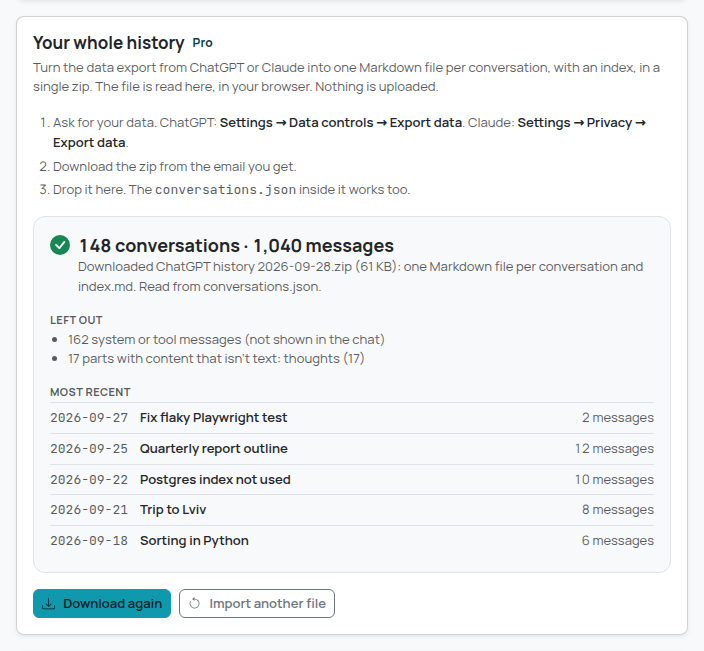
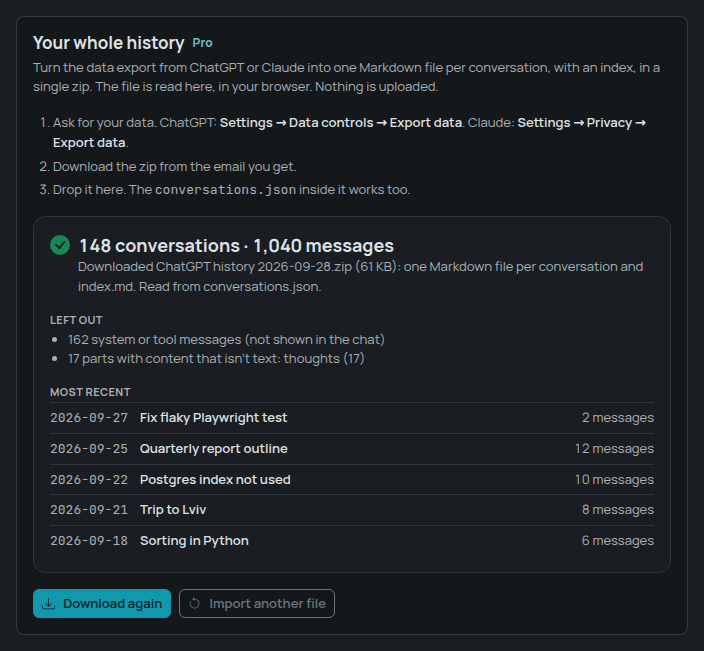
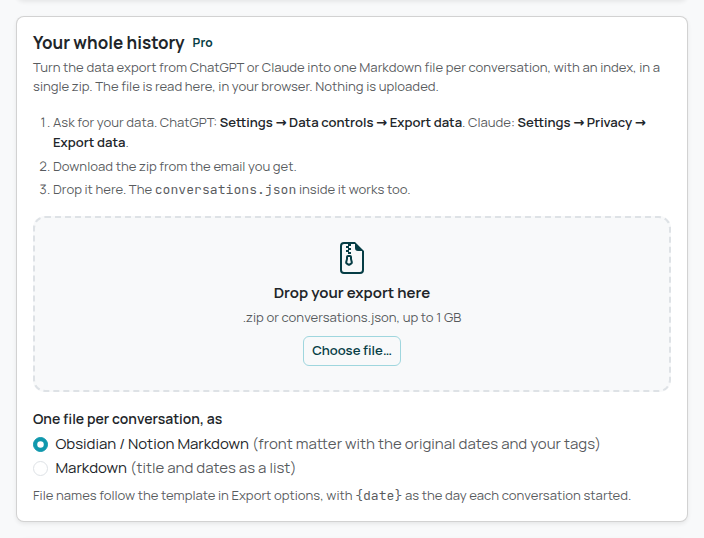
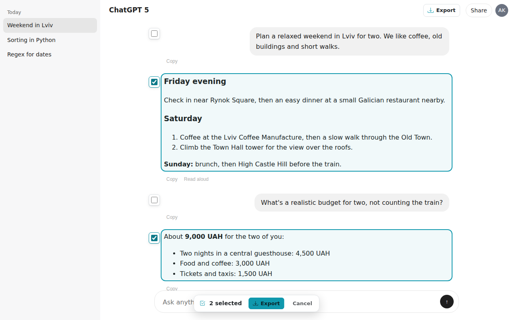
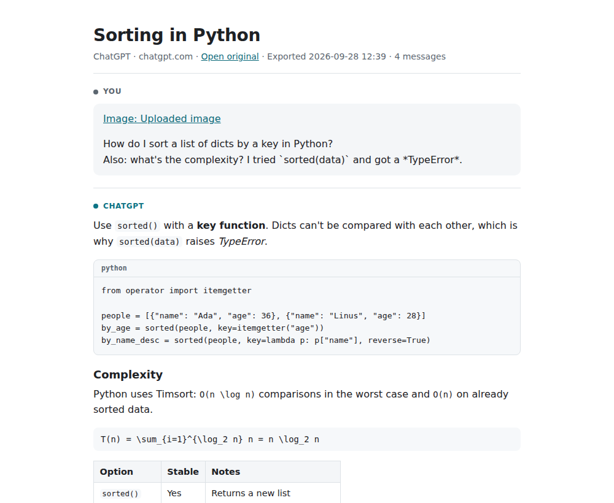
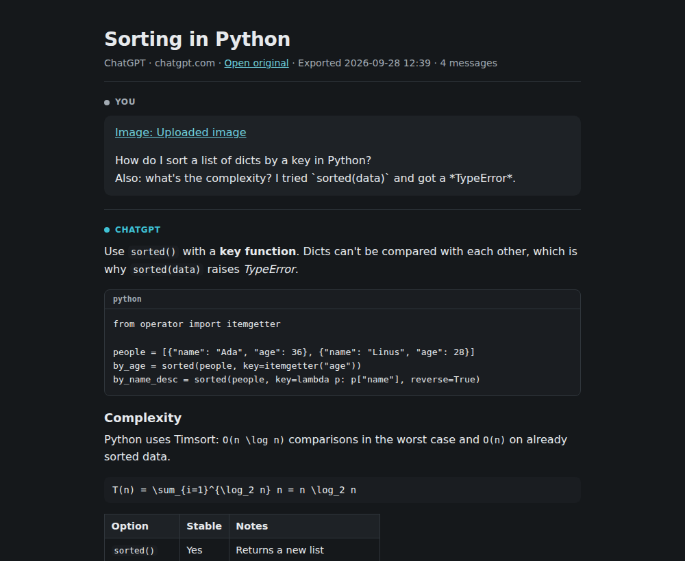
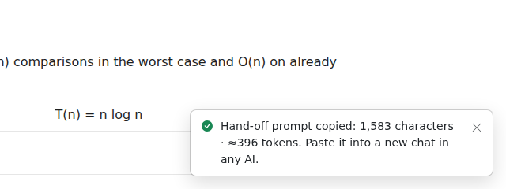
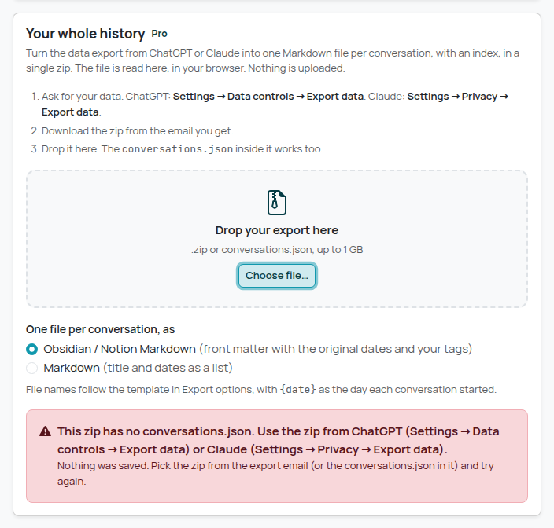

# Chat Exporter

Export ChatGPT and Claude conversations to **Markdown**, **plain text**, **HTML**, **Obsidian /
Notion Markdown**, **JSON** or **PDF**, copy them as Markdown, export **only the messages you
pick**, or hand a conversation over to **another AI**. And turn **your whole history**, from the
data export ChatGPT and Claude email you, into one Markdown file per conversation. Everything
happens in your browser: no account, no server, no analytics.

| In-page menu (light) | In-page menu (dark) |
| --- | --- |
|  |  |

| Your whole history (Pro): the summary | Light and dark | Before dropping the export |
| --- | --- | --- |
|  |  |  |

| Select messages | Standalone HTML (light) | Standalone HTML (dark) |
| --- | --- | --- |
|  |  |  |

| Toolbar popup | Popup (dark), hand-off copied | Print view (Save as PDF) |
| --- | --- | --- |
|  |  |  |

| Continue in another AI | Floating button (no header spot found) | Site layout not recognised | Not on a chat page |
| --- | --- | --- | --- |
|  |  |  |  |

| Options page (export options, Pro) | Menu with export options applied | About Pro | Pro feature on the free plan | Not a ChatGPT or Claude export |
| --- | --- | --- | --- | --- |
|  |  |  |  |  |

The screenshots come from the e2e test. It runs on local fixture pages that copy the DOM of
ChatGPT and Claude, and on fixture export files, not on the real sites (see
[What is verified](#what-is-verified-and-what-isnt)).

## How to use

1. Install: build it (`npm install && npm run build`), open `chrome://extensions`, turn on
   **Developer mode**, click **Load unpacked** and pick the `dist/` folder.
2. Open a conversation on [chatgpt.com](https://chatgpt.com) or [claude.ai](https://claude.ai).
   Tabs that were already open need one reload after installing.
3. Click **Export** in the page. It sits next to the site's **Share** button when it can find
   one, otherwise it floats at the top right, under the site's header.
4. Pick what you want:
   - **Copy as Markdown**: the whole conversation goes to the clipboard.
   - **Continue in another AI**: copies a paste-ready hand-off prompt ("Here is our earlier
     conversation from ChatGPT. Continue from where it ends." and the conversation: the last
     messages in full, older ones shortened to their first lines, code kept). Its size in
     tokens is shown next to the item, and the characters and tokens after copying. Paste it
     into a new chat in any AI.
   - **Select messages…**: a checkbox appears beside each message (it floats above the page;
     the site itself isn't changed) and a small bar shows "3 selected · Export · Cancel".
     **Export** opens the menu for just those messages, in any format (copy, hand-off, files,
     PDF). Tick with the mouse or with Tab and Space; **Escape** or **Cancel** leaves without
     exporting, and the selection ends after an export or when you open another conversation.
   - **Markdown**, **Plain text** or **HTML**: the file is downloaded as
     `<conversation title> <date>.md|txt|html`. HTML is a single file that opens anywhere, in
     light or dark.
   - **Obsidian / Notion** (Pro): Markdown with YAML front matter, ready to drop into a vault.
   - **JSON** (Pro): the versioned JSON export.
   - **PDF (print view)** (Pro): a print-friendly copy opens in a new tab and the print dialog
     appears. Choose **Save as PDF** as the destination. The suggested file name follows the file
     name template (by default the title and date). The header shows the site's domain and an
     **Open original** link.
   - **Export options** (Pro): opens the options page.
5. The toolbar button (popup) offers the same exports for the conversation in the active tab:
   **Copy as Markdown**, **Continue in another AI** (with its size), and six format tiles.
   **Edit** next to the export options summary, **Options**, **Whole history** and **About Pro**
   open the options page.
6. **Your whole history** (Pro, on the options page, or **Whole history** in the popup):
   1. Ask for your data. ChatGPT: **Settings → Data controls → Export data**. Claude:
      **Settings → Privacy → Export data**. You get an email with a link to a zip.
   2. Drop the zip on the drop zone, or **Choose file…** (the `conversations.json` inside the
      zip works too).
   3. Choose **Obsidian / Notion Markdown** (front matter with the original dates and your
      tags; the default) or **Markdown**.
   4. A progress bar counts the conversations; **Cancel** stops without saving anything. Then
      one zip is downloaded, and a summary shows how many conversations and messages were
      exported, what was left out and why (system and tool messages, hidden messages, content
      that isn't text such as "thoughts"), and the five most recent conversations.
      **Download again** saves the same zip; **Import another file** starts over.

   The file is read in the options page, in your browser; nothing is uploaded and nothing is
   stored. If the file isn't an export, the page says what's wrong ("This zip has no
   conversations.json…", "This isn't a zip or a JSON file…", "No ChatGPT or Claude
   conversations were found…").
7. **Export options** (Pro, on the options page, `chrome://extensions` → Chat Exporter → Extension
   options, or from the menu). They apply to every export, from the page and from the popup, and
   are saved as you change them:
   - **Include code blocks**: when off, each code block becomes `(Code block omitted.)`. Inline
     code stays.
   - **Include your messages**: when off, only the replies are exported.
   - **Only the last N messages** (1–999), counted after leaving out your messages.
   - **File name template** with `{title}`, `{date}` and `{site}` (e.g. `{site} - {title}` →
     `ChatGPT - Sorting in Python.md`). Characters that aren't allowed in file names are replaced.
   - **Obsidian / Notion Markdown**: the **tags** for the front matter and **callouts** for roles.

   When options change what is exported, the menu says so ("ChatGPT · 2 of 4 messages", "Last 2
   messages · Replies only · No code blocks") and the popup shows "2 of 4 messages". A selection
   of messages is exported as picked ("Include your messages" and "Only the last N" don't apply
   to it; "Include code blocks" does). The history import uses the file name template, tags and
   callouts; its content is always complete.
8. Don't want the button on the page? Turn off **Show Export button on chat pages** in the popup
   or on the options page. The popup keeps working.

If a reply is still being written, the menu says so and the export contains what is on the page
at that moment. The unfinished reply is marked as incomplete.

If the extension can't recognise the page ("Couldn't read this conversation, the site may have
changed"), nothing is exported. That usually means ChatGPT or Claude changed their page and the
extension needs an update (see [Site adapters](#site-adapters-and-unverified-selectors)).

## Free vs Pro

| | Free | Pro ($2.99 one-time) |
| --- | --- | --- |
| Copy as Markdown | Yes | Yes |
| Continue in another AI (hand-off prompt with its size) | Yes | Yes |
| Select messages, then export only those | Yes | Yes |
| Download Markdown (.md), plain text (.txt) and HTML (.html) | Yes | Yes |
| **Your whole history**: the ChatGPT or Claude data export as one Markdown file per conversation, with an index | | Yes |
| Obsidian / Notion Markdown (front matter, callouts) | | Yes |
| JSON | | Yes |
| PDF (print view) | | Yes |
| Export options: code blocks, your messages, last N, file name template | | Yes |

**Early access: every Pro feature is free for now.** Payments aren't set up yet, so
`EARLY_ACCESS = true` in `src/core/plan.ts` unlocks everything. Pro features carry a small `PRO`
badge in the menu and a quiet "Pro" label in the popup and on the options page; a lock appears
only where the current plan doesn't include the feature (so none during early access). The
options page has an **About Pro** card with the price and a disabled **Get Pro** button ("Free
during early access").

On the free plan (once early access ends), Pro items stay in the menu with a lock on their badge.
Picking one shows a short note ("JSON export is part of Pro ($2.99, one-time). Free keeps copying
and .md, .txt and .html downloads.") with an **About Pro** button, and nothing is exported. The
history import shows "Your whole history is part of Pro" and its drop zone is disabled (a dropped
file is ignored). Export options you saved are kept but not applied; exports use the defaults.
Nothing is ever deleted.

How it's built (see `docs/MONETIZATION.md` at the repo root): `src/core/plan.ts` is pure and
unit-tested (`hasFeature`, `limitsFor`, `sanitizePlan`, `PRO_FEATURES`, `PRO_PRICE`; the
features are `json`, `pdf`, `obsidian`, `export-options` and `history-import`). The stored plan
is `plan` in `chrome.storage.local`, sanitized on read (anything but `'pro'` is `'free'`); only a
future `src/payments/` adapter will write it. Every Pro check (menu, popup, options page and the
service worker, which refuses a print request for PDF on the free plan) goes through
`hasFeature`.

## Formats

**Markdown**

````markdown
# Sorting in Python

- Source: ChatGPT
- URL: <https://chatgpt.com/c/…>
- Exported: 2026-09-27 14:03
- Messages: 4

---

## You

How do I sort a list of dicts by a key?

## ChatGPT

Use `sorted()` with a **key function**:

```python
by_age = sorted(people, key=itemgetter("age"))
```
````

Headings inside messages are moved two levels down, so `## You` / `## ChatGPT` stay the top of
the outline. The converter handles headings, paragraphs, bold/italic/strikethrough, inline code,
fenced code with the language (from `language-*` classes or the code block's label), nested
lists, task lists, tables (GFM), links, blockquotes, images (as links:
`[Image: alt](url)`) and math (TeX source from KaTeX: `$…$` inline, `$$…$$` for display). UI
text inside messages ("Copy code", edit and copy buttons, screen-reader labels) is removed.
Everything else is escaped, so text like `<script>` or `2 * 3` stays literal.

**Obsidian / Notion Markdown** (Pro)

````markdown
---
title: "Sorting in Python"
source: "ChatGPT"
url: "https://chatgpt.com/c/…"
date: 2026-09-27
tags:
  - "ai-chat"
  - "chatgpt"
---

## You

How do I sort a list of dicts by a key?

## ChatGPT

Use `sorted()` with a **key function**:
````

Every value is a double-quoted YAML string, so titles with `:`, `#`, quotes or a leading `---`
can't break the front matter. The tags are yours (default `ai-chat`; letters, digits, `_`, `-`
and `/` are kept, so `#Research, AI/chat` becomes `Research`, `AI/chat`) plus the site. There is
no `# Title` heading, because note apps show the file name as the title. With **callouts** on,
each message is an Obsidian callout instead of a `##` section:

```markdown
> [!question] You
> How do I sort a list of dicts by a key?

> [!note] ChatGPT
> Use `sorted()` with a **key function**:
```

**JSON** (versioned: `schemaVersion` is bumped only on breaking changes)

```json
{
  "schemaVersion": 1,
  "source": "chatgpt",
  "title": "Sorting in Python",
  "url": "https://chatgpt.com/c/…",
  "conversationId": "…",
  "exportedAt": "2026-09-27T11:03:09.000Z",
  "messages": [
    { "role": "user", "markdown": "How do I sort…", "text": "How do I sort…" },
    { "role": "assistant", "markdown": "Use `sorted()`…", "text": "Use sorted()…", "incomplete": true }
  ]
}
```

`source` is `"chatgpt"` or `"claude"`, `role` is `"user"` or `"assistant"`. `conversationId` is
`null` on pages without one, and `incomplete` is only present on a reply that was still being written.

**Plain text**: title, source line, then `You:` / `ChatGPT:` sections separated by a rule.
Code keeps its indentation; tables become `a | b` rows; links are `text (url)`.

**HTML** (free): one self-contained `.html` file that opens in any browser and can be mailed or
archived as it is. The header has the title, the site, its domain (`chatgpt.com`) with an **Open
original** link, the export date and the message count. The CSS is inline and follows the
reader's light or dark setting (`prefers-color-scheme`); code blocks are styled with their
language label; it prints cleanly. There are no scripts, fonts or images inside, and a
`Content-Security-Policy` meta tag (`default-src 'none'; style-src 'unsafe-inline'`) makes sure
opening the file loads nothing. Messages go through the same escaping renderer as the PDF.

**Hand-off prompt** ("Continue in another AI", free): copied to the clipboard, ready to paste
into a new chat anywhere.

````text
Here is our earlier conversation from ChatGPT. Continue from where it ends.

Title: Sorting in Python
The first 6 messages are shortened to their first lines (code is kept); the last 6 messages are complete.

<conversation>
[User, shortened]
How do I sort a list of dicts by a key?

[ChatGPT, shortened]
Use `sorted()` with a **key function**. …

```python
by_age = sorted(people, key=itemgetter("age"))
```

[User]
…
</conversation>
````

The last 6 messages go in full; older ones keep their first two lines (at most 240 characters)
and every code block. The size is shown before you copy (in the menu and the popup, e.g.
`≈1.2k tokens`) and after (`4,210 characters · ≈1,050 tokens`). The token count is a rough
estimate (about 4 characters per token for English and code, 2 for other scripts); real
tokenizers differ by model.

**PDF**: an extension page renders the conversation with the extension's own Markdown renderer
(`src/render/markdown.ts`). It escapes every character of the conversation and only creates
http(s)/mailto links. Images are shown as links and math as TeX source, so the print view never
loads anything from the network.

**Your whole history** (Pro): one zip, `ChatGPT history 2026-09-28.zip` (or `Claude history …`):

```
index.md
Sorting in Python 2026-09-27.md
Sorting in Python 2026-09-27 (2).md
Trip to Lviv 2026-08-14.md
…
```

Each conversation is a Markdown file made by the same code as a page export, in the Obsidian /
Notion format (default) or plain Markdown. The file name follows your template, with `{date}`
the day the conversation started; names that collide get ` (2)`, ` (3)`… (compared without case,
like Windows and macOS). The conversation's own dates go into the file:

````markdown
---
title: "Sorting in Python"
source: "ChatGPT"
url: "https://chatgpt.com/c/6710aa01-…"
date: 2026-09-27
created: 2026-09-27T12:02
updated: 2026-09-27T12:09
tags:
  - "ai-chat"
  - "chatgpt"
---
````

(plain Markdown lists `- Created:` and `- Updated:` under the URL instead). `index.md` lists every
conversation newest first, grouped by month, with links to the files:

```markdown
# ChatGPT history

- Conversations: 148
- Messages: 1,040
- Imported: 2026-09-28 14:03 from `conversations.json`

## 2026-09

- 2026-09-27 · [Fix flaky Playwright test](Fix%20flaky%20Playwright%20test%202026-09-27.md) · 2 messages
```

What you typed is escaped the same way as on a page export (so `2 * 3` stays literal); replies
are kept as the Markdown the site stored. Times are in your computer's time zone.

## Your whole history: supported exports

The import engine is `src/core/import/` (self-contained: only standard web APIs, no Chrome APIs,
no imports from outside the folder, so AI Chat Search can copy the folder as it is).

- **Input**: the zip from the export email, or the `conversations.json` from it. Only
  `conversations.json` is read from the zip, at any folder depth (the shallowest one wins; macOS
  `__MACOSX/` copies are ignored). Images, audio and the other files are never inflated.
- **Which export** is decided per conversation from its shape, not from the file name.
- **ChatGPT** (`conversations.json` is a list of `{ id | conversation_id, title, create_time,
  update_time, current_node, mapping }`): the visible thread is the path from `current_node` up
  through `parent` to the root, so edited or regenerated branches you weren't looking at are left
  out (without a usable `current_node`, the most recent leaf). User and assistant turns are kept;
  system and tool messages and messages marked `is_visually_hidden_from_conversation` are left
  out and counted. Content types: `text` (parts joined), `code` (a fenced block with its
  language), `multimodal_text` (text parts; images become `[image]`, voice messages their
  transcript); other types (e.g. `thoughts`, `execution_output`) are left out and counted by
  type. A reply split around a tool call stays one turn. Citation markers in private-use
  characters (U+E200…U+E201) are removed. Times are Unix seconds.
- **Claude** (a list of `{ uuid, name, created_at, updated_at, chat_messages: [{ sender, text,
  content?, created_at, attachments?, files? }] }`): `content` text blocks are preferred when
  there are any, otherwise `text`; other block types (e.g. `thinking`, `tool_use`) are left out
  and counted; attachments and files become `[File: name]` lines. Times are ISO 8601.
- A conversation without a title gets the first line of its first message (at most 80
  characters), else "Untitled conversation". Conversations with nothing to keep are counted and
  skipped.
- **Unverified**: both formats follow exports as documented and seen in 2024–2025. No current
  export could be downloaded in the environment this was built in (it needs a real account), so
  the fixtures in `e2e/fixtures/chatgpt-export.json` and `e2e/fixtures/claude-export.json` were
  written from that description. If a newer export doesn't work, the summary shows what was left
  out and the error says "its format may have changed".

Safety and size:

- The zip reader is hand-written (`src/core/import/zip.ts`): it reads only the end of the file,
  the central directory and the one entry (a multi-gigabyte export is never loaded whole), and
  supports stored and deflated entries (`DecompressionStream('deflate-raw')`) and Zip64.
- Zip bombs: at most 200,000 entries and a 64 MB central directory; `conversations.json` may be
  at most 1 GB uncompressed, which is enforced while inflating too (a header that lies about the
  size stops the import), and the CRC-32 is checked. Password-protected zips and other
  compression methods get a clear error.
- The JSON is parsed one conversation at a time (a streaming splitter), so a big history doesn't
  need one giant string. Output is compressed per file (`CompressionStream('deflate-raw')`) and
  written by a hand-written zip writer (at most 65,535 files and 4 GB per zip).

## Privacy

- The content script runs only on `chatgpt.com`, `chat.openai.com` and `claude.ai`. Other pages
  are never touched.
- Reads the conversation from the page you have open when you open the menu or export it (and,
  for the popup, when you open the popup). It never calls the sites' private APIs.
- The history import reads the file you choose or drop in the options page, in your browser. It
  is kept in memory only while that page is open (for **Download again**) and never stored or
  uploaded.
- Nothing is uploaded and there are no network requests of its own (checked by the e2e test).
  Links in exports (the conversation's URL, "Open original") are only followed if you click them.
- Stored data (`chrome.storage.local`): the "show button" setting, the export options, and the plan
  (`plan`; only a future payments adapter writes it). For the PDF view, the
  conversation is handed to the print tab through `chrome.storage.session`, which lives in memory
  and is cleared when the browser closes. Only the 5 most recent hand-offs are kept. See
  [PRIVACY.md](PRIVACY.md) for the full policy.

### Permissions

| Permission | Why |
| --- | --- |
| `storage` | Settings, export options and plan, and the in-memory hand-off of a conversation to the print view (`chrome.storage.session`) |
| Content script on `https://chatgpt.com/*`, `https://chat.openai.com/*`, `https://claude.ai/*` | Show the Export button in the page, read the open conversation when you export it, and show the checkboxes of "Select messages". `chat.openai.com` is ChatGPT's old address, which still redirects. No other site is matched, and there are no `host_permissions` |

Not requested, and why it isn't needed:

- **`downloads`**: files (and the history zip) are saved through an `<a download>` click (in the
  page's shadow DOM, in the popup or on the options page).
- **`tabs`**: the popup sends messages to the active tab by id, and the print view and the options
  page are opened with `chrome.tabs.create`. None of that needs the permission. The options page is
  declared with `options_ui`, which needs no permission either.
- **`clipboardWrite`**: copying happens right after your click, which the Clipboard API allows.
- **`<all_urls>`, `scripting`, `activeTab`**: the content script is declared for the three chat
  origins only. Reading an export file needs no permission: you pick it.

## Site adapters and unverified selectors

Everything that depends on a chat site's page lives in one file per site:
`src/sites/chatgpt.ts` and `src/sites/claude.ts`. Both implement the same interface
(`src/sites/types.ts`): `detect()`, `getConversationId()`, `getConversationTitle()`,
`getMessages()`, `isStreaming()`, `injectButtonTarget()` and a `chromeSelector` for UI inside
messages. When a site changes its markup, the fix is a change to that one file.

**All site selectors below are unverified.** chatgpt.com and claude.ai were not reachable from
the environment this was built in, and both need a login. The selectors come from knowledge of
the sites' DOM as of 2025. The fixture pages in `e2e/fixtures/` replicate exactly these
assumptions, so the tests prove the logic, not the selectors.

ChatGPT (`src/sites/chatgpt.ts`):

| Selector | Used for | Status |
| --- | --- | --- |
| `[data-message-author-role]` (`user` / `assistant`; `tool` and `system` are skipped) | Messages and their roles | Unverified (widely used by other tools) |
| `.markdown` inside an assistant message | Assistant message body (falls back to the whole message) | Unverified guess |
| `.result-streaming`, `[data-testid="stop-button"]` | A reply is being written | Unverified guesses |
| `#conversation-header-actions` (prepend), else `[data-testid="share-chat-button"]` (before) | Where the Export button goes | Unverified guesses; falls back to the floating button |
| `nav a[href$="/c/<id>"]` | Title fallback when `document.title` is just "ChatGPT" | Unverified guess |
| `[data-testid$="turn-action-button"]`, `.sr-only` | UI to drop inside messages | Unverified guesses |
| URL `/c/<id>`, `/g/<gpt>/c/<id>`, `/share/<id>` | Conversation id | Unverified |

Claude (`src/sites/claude.ts`):

| Selector | Used for | Status |
| --- | --- | --- |
| `[data-testid="user-message"]` | User messages | Unverified (widely used by other tools) |
| `.font-claude-response`, `.font-claude-message` | Assistant messages (newer and older class name) | Unverified guesses |
| `[data-is-streaming="true"]`, `button[aria-label="Stop response"]` | A reply is being written | Unverified guesses |
| `button[data-testid="share-button"]` | Where the Export button goes | Unverified guess; falls back to the floating button |
| `[data-testid="chat-menu-trigger"]` | Title fallback | Unverified guess |
| `[data-testid="action-bar-copy"]`, `[data-testid="action-bar-retry"]` | UI to drop inside messages | Unverified guesses |
| URL `/chat/<id>`, `/share/<id>` | Conversation id | Unverified |

Site-independent assumptions (in `src/core/htmlToMarkdown.ts`): code blocks are
`<pre>` with a `<code class="language-…">` (the language label in ChatGPT's code header or above
Claude's code block is used when there's no class); math is KaTeX with
`<annotation encoding="application/x-tex">`; user messages use `white-space: pre-wrap`
(Tailwind `whitespace-pre-wrap`). These are also unverified against the live sites.

**Failing loudly.** `readConversation()` (`src/core/read.ts`) refuses to export instead of
producing half a conversation when a conversation URL has no recognisable messages, when no
user message is found, or when no assistant reply is found and none is being written. The user
sees "Couldn't read this conversation, the site may have changed."

## What is verified and what isn't

Verified (automated, in this repository):

- 225 unit tests (`npm test`): the HTML → Markdown/text converter (headings, lists, code,
  tables, math, links, images, escaping, UI chrome, leaving out code blocks, typed text), both
  adapters against the fixture pages, reading a selection of messages, the
  Markdown/Obsidian/JSON/text/HTML formats (YAML quoting, callouts, conversation dates, no
  scripts or remote resources in HTML), file names and templates, the hand-off prompt (recent
  and shortened messages, code kept, token estimate), the plan seam, export options, the print
  renderer (including XSS attempts), settings and message validation, and the history import:
  the zip reader and writer (against zips made and read by node:zlib, Zip64, data descriptors,
  archive comments, entry-count and size caps, a bomb that lies about its size, CRC mismatch,
  encrypted and unknown methods), the streaming JSON splitter (every chunking), the ChatGPT tree
  walk (branches, hidden and system messages, multimodal, code, tool calls, thoughts, missing
  `current_node`, cycles, empty titles, dates), Claude content blocks and attachments, format
  detection, errors, cancelling, and the history zip (file names, suffixes, front matter dates,
  index.md, speed with thousands of same-titled conversations).
- 33 end-to-end tests (`npm run test:e2e`) with the built extension in Chromium 141:
  everything the previous version covered (PRO badges, every download format, copy, the print
  view, the options page and every export option, the free plan and the service worker's check,
  About Pro, button placement, SPA navigation, streaming, the friendly error, the popup, dark
  pages, hostile page CSS, the production manifest and compiled-out test hooks, no network
  requests), plus: the HTML file (self-contained, opened and rendered light and dark, loads
  nothing), Continue in another AI from the menu and the popup (the prompt, and that the shown
  size matches it), Select messages (checkbox positions, keyboard, following the scroll, not
  over the site's header, the site's DOM untouched, export of just the selection, Escape,
  navigation, Claude, and an everyday chat for the screenshot), the history import from a ChatGPT zip made by node:zlib (the zip that
  comes out is unzipped and checked file by file), a dropped Claude `conversations.json` with the
  Markdown format and a file name template, errors (no conversations.json, not a zip, unknown
  format, damaged zip), Cancel on a 40 MB export, a realistic 148-conversation export, the
  locked import on the free plan, the popup's Pro labels and locks, and the print view's domain
  and "Open original" link.

**Not verified: the extension has never run on the real chatgpt.com or claude.ai, and the
history import has never read a real, current export.** Also not verified: opening the
Obsidian export in Obsidian (front matter as properties, callouts) and importing it into Notion.
The format follows Obsidian's documented syntax; Notion's Markdown import may show the front
matter as text. Those sites weren't reachable from the build environment. Before publishing,
check it by hand (see [`store/listing.md`](store/listing.md)): a long conversation with code,
tables and math; a reply still being written; navigating between conversations; light and dark
themes; Select messages on a long conversation; a real ChatGPT and a real Claude export. If
something fails, compare the live DOM with the selector tables above, or the export with the
format description.

## Development

Requires Node.js 22.12+.

```bash
npm install
npm run build        # production build -> dist/
npm run dev          # rebuild on change (with source maps) -> dist/
npm run typecheck
npm test             # unit tests (vitest + happy-dom)
npm run check        # typecheck + unit tests + build
npm run test:e2e     # builds dist/ and dist-e2e/, then drives dist-e2e/ in real Chromium
npm run package      # typecheck + tests + checked, deterministic store zip in release/
node scripts/store-assets.mjs   # store graphics from screenshots/ into store/assets/
```

`test:e2e` needs Chromium. It is auto-detected in some environments; otherwise set
`CHROMIUM_PATH=/path/to/chromium`. It writes all screenshots to `e2e/output/` (ignored by git)
and refreshes the curated ones in `screenshots/`.

The e2e test serves the fixture pages from a local server and starts Chromium with
`--host-resolver-rules` mapping `chatgpt.com`, `claude.ai` and `news.example.com` (port 80) to
it, so the pages have their real host names (the adapters pick the site by host, as in
production) and nothing is ever sent to the real sites. The e2e build (`dist-e2e/`) differs from
production in these ways only: the content script also matches `http://chatgpt.com/*` and
`http://claude.ai/*` (the fixture origins), shadow roots are open so the test can reach the
button, the popup accepts `?tab=<id>` (it's opened as a normal tab), and `e2eEarlyAccess: false`
in storage turns early access off so the free plan can be tested. All of it sits behind
`__E2E__`; the e2e test checks that `dist/` has none of it.

After changing `static/icons/icon.svg`, render the PNGs with `node scripts/make-icons.mjs`.

Store: [`store/listing.md`](store/listing.md) (listing text, permission justifications, hand
checks), [`store/assets.json`](store/assets.json) (what goes on the graphics),
[`PRIVACY.md`](PRIVACY.md) (privacy policy).

### Styling

Bootstrap 5.3 compiled from Sass with the Chat Exporter theme (`src/styles/_theme.scss`, primary
`#1098ad`), Bootstrap Icons and bundled Manrope / JetBrains Mono (Latin, Latin Extended, Cyrillic),
following `docs/design-system.md`. Notes:

- `#1098ad` on white is 3.4:1, so links use a darker shade (5:1) and filled primary buttons use
  dark text (Bootstrap's `$min-contrast-ratio: 4.5`).
- The in-page UI has its own Sass entry (`src/styles/inpage.scss`): system fonts, no reboot,
  `:root` rewritten to `:host`, and `rem` converted to `px`, so a site's root font size can't
  resize it. It follows the chat site's theme (from `color-scheme` / the page background) rather
  than the OS setting, because the button sits inside the site's header.
- Bootstrap Icons are imported per file and turned into element descriptors at build time
  (`scripts/build.mjs`). The UI creates them with `createElementNS`, so nothing parses markup at
  runtime and pages that enforce Trusted Types can't break the button.

## Project structure

```
src/
  core/        Pure logic: types, HTML → Markdown/text converter, readConversation(), hand-off prompt, plan (Free vs Pro)
    import/    History import (self-contained, copied by AI Chat Search): zip reader/writer, JSON splitter, ChatGPT and Claude parsers
  sites/       One adapter per chat site (all site-specific selectors) + adapter selection
  export/      Markdown / Obsidian / JSON / text / HTML formats, the history zip, file names, export options (pure)
  render/      Safe Markdown → HTML renderer for the print view and the HTML export (pure)
  content/     Content script: button, menu, selection, toasts (shadow DOM), page watcher, theme detection
  background/  Service worker: hands conversations to the print view
  popup/       Toolbar popup
  options/     Options page (history import, export options, About Pro)
  print/       Print view page
  platform/    Messages between contexts (typed, validated)
  storage/     Settings and the stored plan
  styles/      Sass: theme, fonts, popup, options, print view, in-page UI
  ui/          DOM builder, icons, clipboard, downloads
static/        manifest.json, HTML, icons
test/          Unit tests
e2e/           Chromium smoke test and fixture pages (copies of ChatGPT/Claude DOM) and export files
screenshots/   Curated screenshots from the e2e test
scripts/       Build, icons, store package (package.mjs) and store graphics (store-assets.mjs)
store/         Store listing, graphics config and rendered graphics
```

`src/core`, `src/sites`, `src/content/watch.ts` and the fixtures are shared with AI Chat Search
(`../ai-chat-search`) by copy, not by import: each extension is self-contained. Keep the copies
identical when fixing a selector. (Chat Exporter's copies of `htmlToMarkdown.ts` and `read.ts` also
have the optional `omitCode` and `selected` used by the export options and the selection, and
`plainTextToMarkdown`; the rest is identical.) `src/core/import/` is meant to be copied as a
whole folder.

## Known limitations

- Never tested on the live sites, and the history import never on a real export (see above).
- Only what's in the page's DOM is exported. If a site lazily loads older messages of a long
  conversation, scroll to the top first. Content hidden behind collapsed UI (e.g. Claude's
  "thinking" section, artifacts shown as cards) is exported as it appears, or not at all.
- Images are links to their original URLs, which may expire or need a login. Uploaded files are
  exported as their visible names.
- "Only the last N messages" counts messages as exported: a reply split around a tool call on the
  site counts as one. Likewise, "Select messages" shows a checkbox per block the site renders; a
  reply split around a tool call is exported whole when any of its blocks is ticked.
- The selection checkboxes float above the page and follow it as it scrolls (they stay inside
  the thread's scrolling area). If a site re-renders its messages, the checkboxes are re-bound to
  them; ticks are kept by position.
- The hand-off token count is an estimate, not a real tokenizer.
- History import: only conversations are exported, not the images, audio or files in the export
  (images become `[image]`, attachments their names). Only the branch you last saw of an edited
  ChatGPT conversation is kept. `conversations.json` can be at most 1 GB, and very large single
  conversations are limited by the browser's memory. Password-protected zips aren't supported.
  One zip holds at most 65,535 conversations.
- Math is exported and printed as TeX source. It isn't rendered in the print view or the HTML file.
- Table cells are flattened to one line; merged cells aren't reproduced.
- The PDF comes from Chrome's print dialog, so page breaks and headers/footers follow Chrome's
  print settings.
- Pasted code in user messages keeps its indentation in plain text and in the raw Markdown, but
  a Markdown viewer won't show the indentation (user messages are plain text on the sites).
