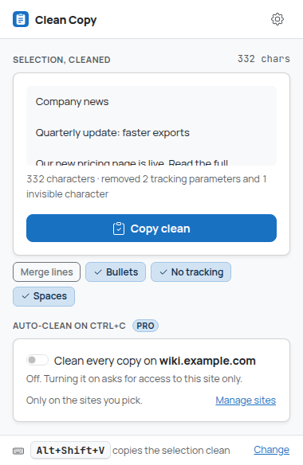
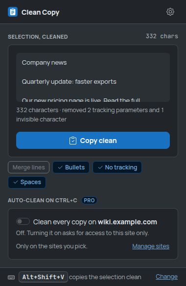
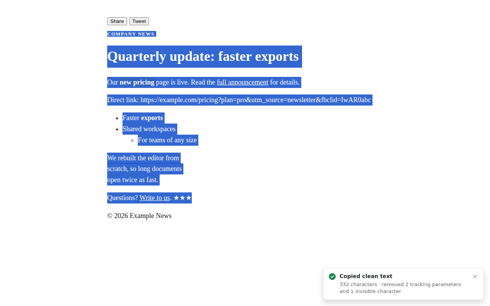
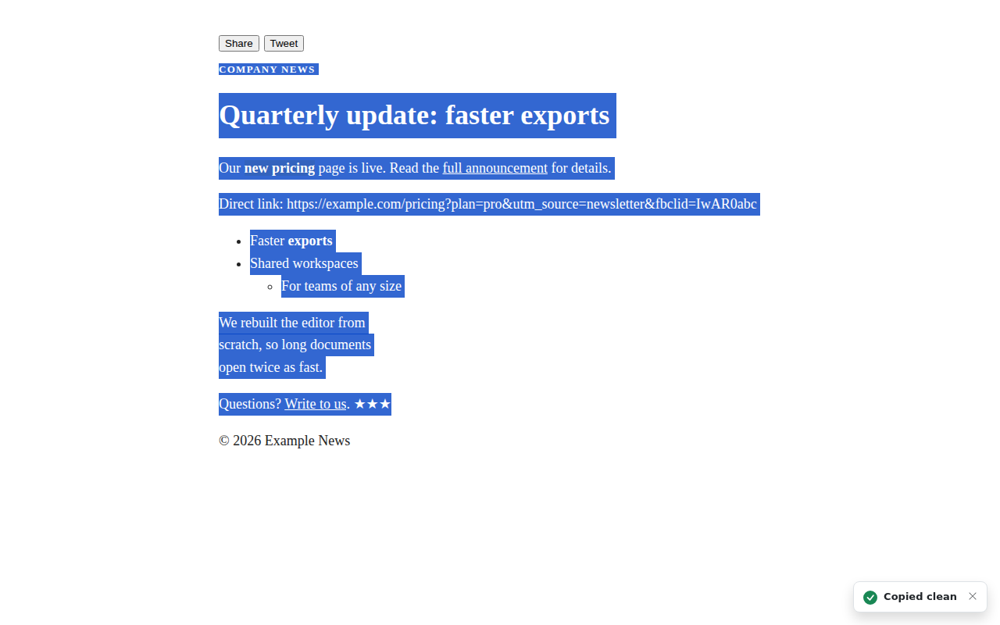
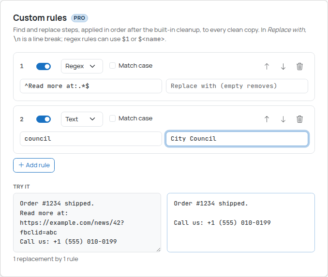

# Clean Copy

Copy text **without fonts, colors, links and invisible junk**. Select, press **Alt+Shift+V** (or
right-click → **Copy clean**) and paste plain, tidy text into an email, a doc or a chat.

With Pro, you don't even need the shortcut: **every normal Ctrl+C / Cmd+C on the sites you choose
comes out clean**, and your own **cleanup rules** (find and replace, regex) run on every copy.

| Toolbar popup | Dark mode |
| --- | --- |
|  |  |



## How Clean Copy is different

Clean Copy does one thing: it makes ordinary copies clean. Its main feature is **automatic**
cleaning of the copies you already make (Ctrl+C on sites you pick, plus your own rules), not a
menu of output formats. If you want Markdown, HTML or table formats, that's a different
extension (Universal Copy, from the same author); Clean Copy only ever puts plain text on the
clipboard.

## How to use

### Copy clean (free)

1. Select text on a page.
2. Press **Alt+Shift+V**, or right-click the selection and choose **Copy clean**.
3. A small note in the bottom-right corner confirms it, and says what was removed
   ("removed 2 tracking parameters and 1 invisible character"). Paste anywhere.

Change the key at `chrome://extensions/shortcuts` (the popup and the settings page have a
**Change** link).

**The toolbar popup** shows the current selection *already cleaned*, with a **Copy clean**
button and quick switches (Merge lines, Bullets, No tracking, Spaces) that update the preview
as you click them. The gear opens the settings.

What "clean" means:

- Only text goes on the clipboard (`text/plain`, no `text/html`), so fonts, colors, sizes,
  backgrounds and links don't come along. Link text stays; the link itself goes.
- Only what's visible is copied: hidden elements, screen-reader-only text, `aria-hidden`
  decorations, buttons, scripts and `user-select: none` junk are skipped.
- Invisible characters (zero-width spaces, BOM, soft hyphens) are removed; no-break spaces
  become normal spaces.
- Structure is kept as plain text: paragraphs separated by a blank line, lists as `- item`
  (nested lists indented), table rows as tab-separated lines, code as it is.

Options (settings page, or the quick switches in the popup):

| Option | Default | What it does |
| --- | --- | --- |
| Line breaks | Keep | **Merge into paragraphs** joins wrapped lines (PDFs, emails, fixed-width text) and re-joins words hyphenated at a line end (`exam-`/`ple` → `example`). Blank lines, list items and table rows stay separate. |
| Keep list bullets | On | Off: `- item` becomes `item`. Numbered lists keep their numbers. |
| Remove tracking parameters | On | Removes `utm_*`, `fbclid`, `gclid`, `msclkid`, `mc_eid` and ~40 more from **every web address in the copied text**, plus site-specific ones (`si` on YouTube/Spotify, `ref`/`pd_rd_*` on Amazon, ...). Only whole parameters are dropped; the rest of the address is kept byte for byte. |
| Collapse extra spaces | On | Runs of spaces become one, trailing spaces go. Indentation at the start of a line and tabs are kept. |

### Auto-clean on Ctrl+C (Pro)



1. Open a site where you copy a lot (a news site, a wiki, your company intranet).
2. Click the Clean Copy icon and turn on **Clean every copy on _this site_**. Chrome asks to
   let Clean Copy read and change data on **that site only**; accept.
3. From now on, every normal copy there (Ctrl+C, Cmd+C, Edit → Copy, the page's own copy
   button if it uses the standard copy event) comes out clean, with your options and rules.
   Tabs already open on that site start cleaning right away, no reload needed.

Manage the list in **Settings → Auto-clean on Ctrl+C**: add a site by typing it
(`news.example.com` or a full address), see which ones are **Active**, and remove one with the
trash icon. Removing a site stops auto-clean immediately (open tabs included), unregisters the
script and gives the permission back to Chrome. If a site shows **Allow access**, its
permission was refused or removed (e.g. on `chrome://extensions`); click it to ask again.

- **Text fields and editors are left alone** by default: copying inside an input, a textarea or
  a rich editor (Google Docs, Notion, code editors) keeps the editor's own behavior. Turn on
  *Also clean copies inside text fields and editors* to clean those too.
- **Sites that add text to your copy** ("Read more at: https://...?utm_source=copy"): Clean Copy
  cleans the text the site put on the clipboard (tracking parameters out, styled HTML dropped).
  Add a rule to remove the "Read more" line entirely (see below).
- The small "Copied clean" note can be turned off.

A site is an exact host name: `docs.example.com` does not cover `example.com` or
`www.example.com`. That keeps each permission as narrow as possible.

### Custom cleanup rules (Pro)



**Settings → Custom rules → Add rule.** Each rule finds **Text** (literal) or a **Regex** and
replaces it with something (empty removes it). Rules run **in order** (arrows reorder them),
**after** the built-in cleanup, on every clean copy: the shortcut, the menu, the popup and
auto-clean.

- *Match case* is off by default. In regex mode `^` and `$` match at every line.
- In *Replace with*, `\n` is a line break and `\t` a tab. Regex rules can use `$1`, `$<name>`,
  `$&` (the whole match) and `$$` (a dollar sign).
- The **Try it** box shows the result live as you type; errors are shown under the rule and
  invalid rules are skipped (never half-applied).

Examples:

| Find | Mode | Replace with | Effect |
| --- | --- | --- | --- |
| `^Read more at:.*$` | Regex | (empty) | Drops "Read more at: ..." lines that sites append |
| `^Sent from my \w+$` | Regex | (empty) | Drops mail signatures |
| `(\d{3})-(\d{4})` | Regex | `$1 $2` | `555-0199` → `555 0199` |
| `; ` | Text | `\n` | One item per line |

Safety: rules run inside web pages on every copy, so they are checked before use. Patterns
with nested repetition such as `(a+)+` or `(\w+\s?)*`, which can take forever on some text, are
rejected with an explanation. Every copy also has a time budget (150 ms) and a match cap
(100,000) checked between matches, and output size limits; when a limit is hit, the rest of the
rules are skipped and the note says so.

### Free vs Pro

| | Free | Pro ($1.99 once) |
| --- | --- | --- |
| Copy clean: shortcut, right-click menu, popup with live preview | Yes | Yes |
| Options: line breaks, bullets, tracking parameters, spaces | Yes | Yes |
| **Auto-clean every Ctrl+C** on chosen sites | | Yes |
| **Custom cleanup rules** (text or regex, ordered, live preview) | | Yes |

Until payments are set up, Clean Copy is in **early access: every Pro feature is on for
everyone** (the settings page says so; the Get Pro button is disabled). All Pro checks go
through `src/core/plan.ts` (`EARLY_ACCESS`, `hasFeature`, `limitsFor`); see
`docs/MONETIZATION.md`. If Pro ever ends for a user, their sites and rules are kept, not deleted;
they just stop being applied.

## Privacy

Everything runs locally. Clean Copy has no backend, no account, no analytics and no third-party
code, and it makes no network requests (fonts and icons are bundled).

- Without auto-clean, nothing is read from a page until you use the shortcut, the menu or the
  toolbar button on it (`activeTab`, no access to all sites, no always-on content scripts).
- With auto-clean, Clean Copy runs only on the sites you added and granted, and only acts on a
  copy there. Nothing leaves the page except the clean text you copied.
- Settings, sites and rules are stored in `chrome.storage.local`, in this browser only.

Full privacy policy: [`PRIVACY.md`](PRIVACY.md).

### Permissions

| Permission | Why |
| --- | --- |
| `activeTab` | Read the selection in the current tab, only after you invoke Clean Copy on it |
| `scripting` | Inject the reader and the confirmation into that tab on demand; register the auto-clean script for the sites you added |
| `contextMenus` | The **Copy clean** right-click item |
| `storage` | Settings, sites and rules (and a short-lived message for the popup when a page can't show one) |
| `offscreen` | A hidden extension page that writes to the clipboard for the background worker |
| `clipboardWrite` | Put the clean text on the clipboard |
| `optional_host_permissions: *://*/*` | **Optional, never granted at install.** Auto-clean (Pro) asks for one site at a time (`*://news.example.com/*`) when you add it, and gives it back when you remove it |

## Development

Requires Node.js 22.12+.

```bash
npm install
npm run build        # production build -> dist/
npm run dev          # rebuild on change (with source maps) -> dist/
npm run typecheck
npm test             # unit tests (vitest; jsdom for the DOM reader)
npm run test:e2e     # builds dist/ and dist-e2e/, drives dist-e2e/ in real Chromium
npm run screenshots  # same, and refreshes screenshots/
npm run icons        # re-render the PNG icons after changing static/icons/icon.svg
npm run check        # typecheck + unit tests + build
```

`test:e2e` needs Chromium (`CHROMIUM_PATH`, auto-detected at
`/opt/pw-browsers/chromium-1194/chrome-linux/chrome`). It serves local fixture pages as
`wiki.example.com` and `blog.example.org` (two different sites; Chromium's
`--host-resolver-rules` maps both to a local server, so screenshots show no `127.0.0.1` or port)
and checks, among others: the exact clean text and that only `text/plain` is on the clipboard,
that Chrome really assigns Alt+Shift+V, the popup preview and quick options, auto-clean turned
on from the popup with **real Ctrl+C key presses** (open tab, reload, other site untouched, text
fields, a site that appends "Read more"), rules validated and previewed in settings and applied,
removal stopping auto-clean in open tabs and unregistering the script, a strict-CSP page, no
network requests, and that `dist/` has no test hooks.

The e2e build differs from `dist/` only in a test hook (`__E2E__`, compiled out of `dist/`) and
host access granted up front, because automation can't click native context menus or accept
permission prompts.

### Load the extension in Chrome

1. `npm install && npm run build`
2. Open `chrome://extensions`, turn on **Developer mode**
3. **Load unpacked** → select `dist/`

### Packaging for the Chrome Web Store

`dist/` is the complete extension: no source maps, no test code, unminified identifiers for easy
review, and `THIRD_PARTY_NOTICES.txt` (Bootstrap, Bootstrap Icons: MIT; Manrope, JetBrains Mono:
SIL OFL 1.1). Zip the *contents* of `dist/`. Listing text: [`store/listing.md`](store/listing.md).

## Project structure

```
src/
  core/        Pure logic, unit-tested: cleaner (the pipeline), urls (tracking parameters),
               rules (validation, safe regex engine), plan, settings, sites; plus the snapshot,
               whitespace and plain-text converter copied from Universal Copy
  page/        Selection reader (visible content only), toast, page.js entry (injected on demand)
  content/     autoclean.js: the copy-event listener registered for granted sites only
  background/  Service worker: menu, shortcut, copy flow, clipboard, auto-clean registration
  offscreen/   Offscreen document that writes to the clipboard
  popup/       Toolbar popup: live preview, Copy clean, quick options, auto-clean switch
  options/     Settings: cleanup, shortcut, sites, rules, About Pro, privacy
  platform/    executeScript wrappers and messages between contexts
  storage/     chrome.storage wrappers (sanitized on read)
  styles/      Sass: theme (#1971c2), extension pages, in-page toast
  ui/          DOM, icon, clipboard, format and site-management helpers
static/        manifest.json, HTML, icons
test/          Unit tests
e2e/           Chromium smoke test and fixture pages
store/         Chrome Web Store listing text
screenshots/   Curated screenshots for this README
```

Auto-clean works like this: adding a site stores it and requests `*://host/*`. The background
keeps one dynamic content script (`chrome.scripting.registerContentScripts`, id
`clean-copy-auto-clean`) whose `matches` are exactly the sites that are listed **and** granted;
it re-syncs on startup, on permission changes (including from `chrome://extensions`), and when
the list changes, and injects into tabs already open on a newly added site. The content script
listens to the `copy` event on `window` (bubbling, so it runs after the page's own handlers),
reads the selection (or the text the page put on the clipboard), runs the same pipeline as Copy
clean, and replaces the clipboard data with `text/plain` only. It re-reads its settings on every
storage change and does nothing for a host that isn't in the list, so a removal takes effect in
open tabs without a reload.

## Limits

- At most 2,000,000 characters and 200,000 elements are read from a selection.
- Rules: 50 rules, 500 characters per pattern, 1,000 per replacement; applied to copies up to
  1,000,000 characters; 150 ms and 100,000 matches per copy; output up to 2,000,000 characters.
- Auto-clean: up to 100 sites.

## Known limitations

- Pages Chrome doesn't let extensions script (`chrome://`, the Chrome Web Store, the built-in PDF
  viewer) can't be read. There **Copy clean** cleans the text Chrome reports for the selection
  (line breaks collapsed) and a badge on the icon confirms it. Auto-clean can't run there.
- Auto-clean only sees copies that fire the standard `copy` event. Sites that write to the
  clipboard with the async Clipboard API (some "copy" buttons) aren't changed, and a page
  handler registered on `window` *after* Clean Copy's runs later and may override it. Cut
  (Ctrl+X) is never changed.
- Merge lines works on plain text, so it also joins lines of code and poems; keep it off (the
  default) when you copy those. Collapse extra spaces also squeezes alignment spaces inside a
  line of code.
- The regex safety check rejects the well-known catastrophic patterns, not every slow pattern;
  the per-copy time budget is checked between matches, so a single pathological match can
  still take a moment.
- Tracking-parameter lists are curated, not exhaustive; unknown parameters are kept.
- Content inside shadow DOM (some web components) and cross-origin iframes isn't part of the
  page selection; the shortcut falls back to frames it may read.
- Verified in headless Chromium 141 on Linux with local fixture pages. **Unverified**: real
  sites (the sandbox blocks them; news sites with copy attribution, Google Docs, Notion), the
  real permission prompt (the e2e build has host access up front, so granting through the
  prompt and **giving the permission back on removal** are not exercised by automation; the
  script unregistration is), macOS (Cmd+C, Option+Shift+V), and pasting into real mail/doc apps.
- The shortcut is **Alt+Shift+V**; the e2e test checks Chrome really assigns it.
