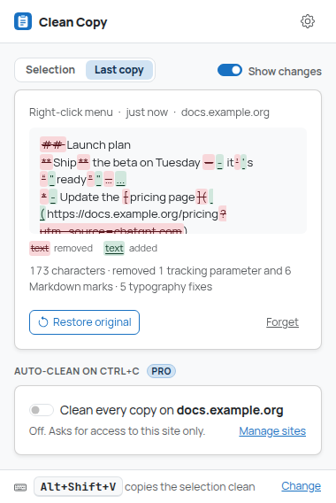
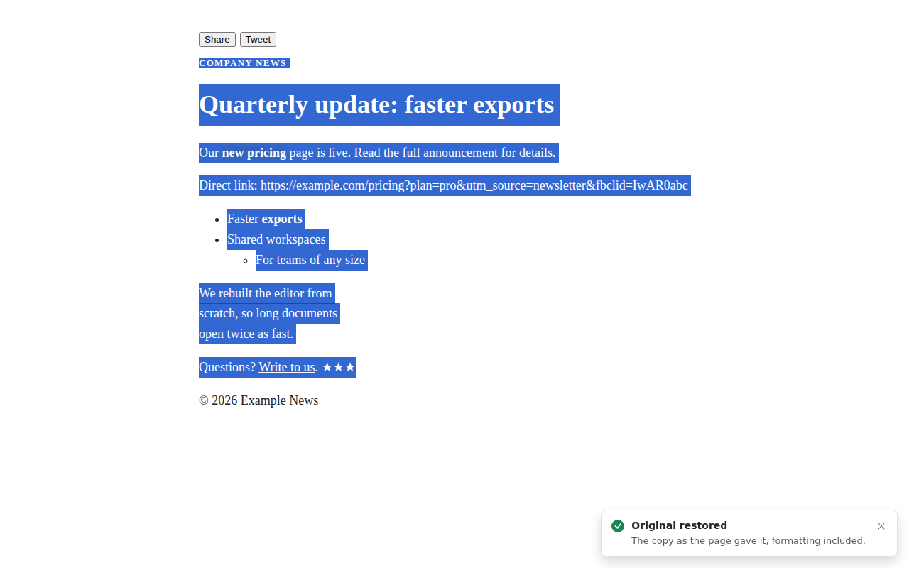
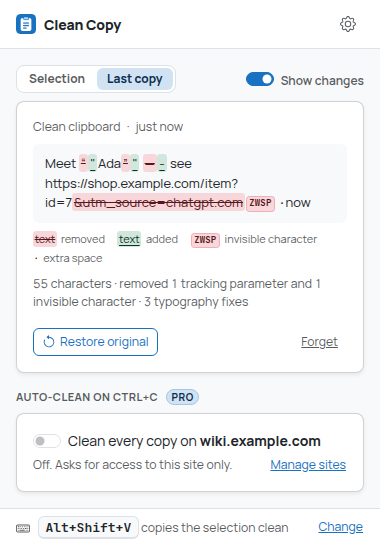
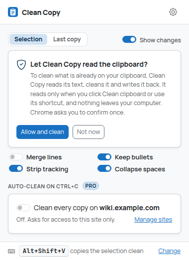
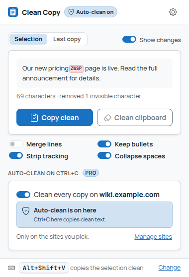

# Clean Copy

Copy text **without fonts, colors, links and invisible junk**. Select, press **Alt+Shift+V** (or
right-click → **Copy clean**) and paste plain, tidy text into an email, a doc or a chat.

Cleaning you can **see and undo**: every clean copy says what it removed, **Undo** puts the
original back on the clipboard (formatting included), and **Show changes** highlights every
removal inline: tracking parameters struck through, invisible characters as small markers,
merged line breaks as ↵.

With Pro, you don't even need the shortcut: **every normal Ctrl+C / Cmd+C on the sites you choose
comes out clean** (or on all sites, with one switch), and your own **cleanup rules** (find and
replace, regex, ready-made presets) run on every copy.

| Toolbar popup | Dark mode |
| --- | --- |
|  |  |

| Undo in the page | Show changes |
| --- | --- |
|  |  |

## How Clean Copy is different

Clean Copy does one thing: it makes ordinary copies clean. Its main feature is **automatic**
cleaning of the copies you already make (Ctrl+C on sites you pick, plus your own rules), and it
never hides what it did: every change can be seen and undone. It is not a menu of output
formats: if you want Markdown, HTML or table formats, that's a different extension (Universal
Copy, from the same author); Clean Copy only ever puts plain text on the clipboard.

## How to use

### Copy clean (free)

1. Select text on a page.
2. Press **Alt+Shift+V**, or right-click the selection and choose **Copy clean**.
3. A small note in the bottom-right corner confirms it and says what was removed
   ("removed 2 tracking parameters and 1 invisible character"). Paste anywhere.
4. Changed your mind? Click **Undo** in the note: the original goes back on the clipboard, as the
   page would have copied it (text and formatting), and the note says **Original restored**.



Change the key at `chrome://extensions/shortcuts` (the popup and the settings page have a
**Change** link).

**The toolbar popup** has two views:

- **Selection** shows the current selection *already cleaned*, with every removal highlighted
  inline, a **Copy clean** button and **Clean clipboard** (below). Four switches under it,
  **Merge lines**, **Keep bullets**, **Strip tracking** and **Collapse spaces**, update the
  preview as you click them.
- **Last copy** shows the last clean copy (from the shortcut, the menu, the popup, auto-clean or
  Clean clipboard): where and when it was made, its text with the changes highlighted, a key to the
  marks, **Restore original** (then **Copy clean again**) and **Forget**.

**Show changes** (the switch next to the views, on by default) turns the highlighting on or off.
The highlighting comes from the cleanup steps themselves, not from comparing texts: each step
reports exactly what it removed and why, so a tracking parameter is marked as a tracking
parameter and a merged line break as a merged line break.

| Mark | Meaning |
| --- | --- |
| ~~struck through~~ (red) | Removed: a tracking parameter, a bullet, Markdown syntax, text a rule removed. Hover for the reason |
| `ZWSP`, `SHY`, `BOM`, `WJ` | An invisible character that was removed (zero-width space, soft hyphen, byte order mark, word joiner) |
| ↵ | A line break that was merged into the paragraph |
| · | An extra space that was collapsed |
| underlined (green) | Added: a straight quote replacing a curly one, `(url)` after a Markdown link, a rule's replacement |



### Clean clipboard (free)

Already copied something messy (from an app, a PDF, an AI chat)? Click **Clean clipboard** in
the popup: Clean Copy reads the text on the clipboard, cleans it with your options and rules, and
writes it back. The popup switches to **Last copy** to show what was removed; **Restore
original** undoes it (text and formatting).

The first time, the popup explains what reading the clipboard means (**Allow and clean** / **Not
now**) before Chrome asks you to confirm the optional `clipboardRead` permission. The clipboard
is read only when you click the button (or use its keyboard shortcut). If the text is already
clean, the button says **Already clean**; an empty clipboard says so too.



There is also a keyboard command, **Clean the text that is on the clipboard**, without a key by
default (Chrome doesn't allow many free combinations): set one at
`chrome://extensions/shortcuts`. It confirms in the page with the same note and Undo.

### What "clean" means

- Only text goes on the clipboard (`text/plain`, no `text/html`), so fonts, colors, sizes,
  backgrounds and links don't come along. Link text stays; the link itself goes (unless you turn
  on **Keep link addresses**).
- Only what's visible is copied: hidden elements, screen-reader-only text, `aria-hidden`
  decorations, buttons, scripts and `user-select: none` junk are skipped.
- Invisible characters (zero-width spaces, BOM, soft hyphens) are removed; no-break spaces
  become normal spaces.
- Structure is kept as plain text: paragraphs separated by a blank line, lists as `- item`
  (nested lists indented), table rows as tab-separated lines, code as it is.

Options (settings page; the first four are also the popup's switches):

| Option | Default | What it does |
| --- | --- | --- |
| Line breaks | Keep | **Merge into paragraphs** joins wrapped lines (PDFs, emails, fixed-width text) and re-joins words hyphenated at a line end (`exam-`/`ple` → `example`). Blank lines, list items and table rows stay separate. |
| Keep list bullets | On | Off: `- item` becomes `item`. Numbered lists keep their numbers. |
| Remove tracking parameters | On | Removes `utm_*`, `fbclid`, `gclid`, `msclkid`, `mc_eid` and ~40 more from **every web address in the copied text**, plus site-specific ones (`si` on YouTube/Spotify, `ref`/`pd_rd_*` on Amazon, ...). Only whole parameters are dropped; the rest of the address is kept byte for byte. |
| Collapse extra spaces | On | Runs of spaces become one, trailing spaces go. Indentation at the start of a line and tabs are kept. |
| Keep link addresses | Off | Links keep their address after the text: `the guide (https://example.com/guide)` (tracking parameters removed from it too). |
| Plain typography | Off | Curly quotes → straight (`“ ” ‘ ’` → `" '`), `…` → `...`, thin, hair and other fixed-width spaces → normal spaces. **Dashes**: *Become hyphens* (default: `–` → `-`, `—` → ` - `, using the spaces already there) or *Stay as they are*. |
| Remove Markdown syntax | Off | `# headings`, `**bold**`, `*italic*`, `__`, `_`, `~~strike~~` and `` `code` `` become plain text; `[text](url)` → `text (url)`, `` → `alt`, `<https://…>` → the address; `*` and `+` bullets become `- ` (**Keep bullets** decides whether it stays); `---`/`***`/`===` lines go. Fenced code blocks (```` ``` ```` or `~~~`) are kept verbatim, fences included. Quotes (`>`), tables and numbered lists are left alone. |

### Auto-clean on Ctrl+C (Pro)


1. Open a site where you copy a lot (a news site, a wiki, your company intranet).
2. Click the Clean Copy icon and turn on **Clean every copy on _this site_**. Chrome asks to
   let Clean Copy read and change data on **that site only**; accept.
3. From now on, every normal copy there (Ctrl+C, Cmd+C, Edit → Copy, the page's own copy
   button if it uses the standard copy event) comes out clean, with your options and rules.
   Tabs already open on that site start cleaning right away, no reload needed.

You always know when Ctrl+C is being rewritten: tabs on such a site get a small blue **ON**
badge on the toolbar icon, and the popup says **Auto-clean is on here** (in the header and in the
auto-clean card). Every auto-cleaned copy is kept for **Undo** (in the note) and **Last copy**
like any other.



Manage the list in **Settings → Auto-clean on Ctrl+C**: add a site by typing it
(`news.example.com` or a full address), see which ones are **Active**, and remove one with the
trash icon. Removing a site stops auto-clean immediately (open tabs included), unregisters the
script and gives the permission back to Chrome. If a site shows **Allow access**, its
permission was refused or removed (e.g. on `chrome://extensions`); click it to ask again.

**All sites**: one switch under the list cleans every copy on every site. It asks Chrome for
access to all sites (the `*://*/*` pattern already declared as optional) and registers the
auto-clean script everywhere. Per-site stays the default and is recommended: Clean Copy then
runs only where you choose. Turning All sites off gives the all-sites access back; the access
you granted to the sites in your list stays (a site that was added while All sites was on, and
so never got its own access, shows **Allow access**).

- **Text fields and editors are left alone** by default: copying inside an input, a textarea or
  a rich editor (Google Docs, Notion, code editors) keeps the editor's own behavior. Turn on
  *Also clean copies inside text fields and editors* to clean those too.
- **Sites that add text to your copy** ("Read more at: https://...?utm_source=copy"): Clean Copy
  cleans the text the site put on the clipboard (tracking parameters out, styled HTML dropped).
  Undo gives back exactly what the site put there. Add a rule (or the **Read more** preset) to
  remove the line entirely.
- The small "Copied clean" note (with Undo) can be turned off; **Last copy** in the popup still
  has Restore original.

A site is an exact host name: `docs.example.com` does not cover `example.com` or
`www.example.com`. That keeps each permission as narrow as possible.

### Custom cleanup rules (Pro)


**Settings → Custom rules → Add rule**, or pick a ready-made rule from **Add from preset**:

| Preset | Rule |
| --- | --- |
| Remove "Read more at …" lines | regex `^Read more at:?.*$` → (nothing) |
| Remove "Sent from my iPhone" | regex `^Sent from my [\w ]{2,40}\.?$` → (nothing) |
| Remove "Get Outlook for …" | regex `^Get Outlook for .*$` → (nothing) |
| Remove quoted reply lines ("> …") | regex `^[ \t]*>.*$` → (nothing) |
| Remove "utm_source=chatgpt.com" from links | regex `(\?)utm_source=chatgpt\.com&\|[?&]utm_source=chatgpt\.com(?![\w.%-])` → `$1` (useful when *Remove tracking parameters* is off) |

Each rule finds **Text** (literal) or a **Regex** and replaces it with something (empty removes
it). Rules run **in order** (arrows reorder them), **after** the built-in cleanup, on every clean
copy: the shortcut, the menu, the popup, Clean clipboard and auto-clean. Their changes show in
Show changes like the built-in ones.

- *Match case* is off by default. In regex mode `^` and `$` match at every line.
- In *Replace with*, `\n` is a line break and `\t` a tab. Regex rules can use `$1`, `$<name>`,
  `$&` (the whole match) and `$$` (a dollar sign).
- The **Try it** box shows the result live as you type (the built-in cleanup, then the rules,
  like a real copy); errors are shown under the rule and invalid rules are skipped (never
  half-applied).

Examples:

| Find | Mode | Replace with | Effect |
| --- | --- | --- | --- |
| `^Read more at:.*$` | Regex | (empty) | Drops "Read more at: ..." lines that sites append |
| `^Sent from my \w+$` | Regex | (empty) | Drops mail signatures |
| `(\d{3})-(\d{4})` | Regex | `$1 $2` | `555-0199` → `555 0199` |
| `; ` | Text | `\n` | One item per line |

Safety: rules run inside web pages on every copy, so they are checked before use. Patterns
with nested repetition such as `(a+)+` or `(\w+\s?)*`, which can take forever on some text, are
rejected with an explanation. Every copy also has a time budget (150 ms) and a match cap
(100,000) checked between matches, and output size limits; when a limit is hit, the rest of the
rules are skipped and the note says so.

The settings page is long, so a **sticky section nav** (Cleanup · Shortcut · Auto-clean · Rules
· Pro · Privacy) stays at the top and highlights the section you're reading.

### Free vs Pro

| | Free | Pro ($1.99 once) |
| --- | --- | --- |
| Copy clean: shortcut, right-click menu, popup with live preview | Yes | Yes |
| **Undo** (original back, formatting included) and **Show changes** | Yes | Yes |
| **Clean clipboard** (popup button and keyboard command) | Yes | Yes |
| Options: line breaks, bullets, tracking parameters, spaces, link addresses, plain typography, remove Markdown | Yes | Yes |
| **Auto-clean every Ctrl+C** on chosen sites, or on **all sites** | | Yes |
| **Custom cleanup rules** (text or regex, ordered, presets, live preview) | | Yes |

Until payments are set up, Clean Copy is in **early access: every Pro feature is on for
everyone** (the settings page says so; the Get Pro button is disabled). All Pro checks go
through `src/core/plan.ts` (`EARLY_ACCESS`, `hasFeature`, `limitsFor`); see
`docs/MONETIZATION.md`. If Pro ever ends for a user, their sites, the All sites choice and their
rules are kept, not deleted; they just stop being applied.

## Privacy

Everything runs locally. Clean Copy has no backend, no account, no analytics and no third-party
code, and it makes no network requests (fonts and icons are bundled).

- Without auto-clean, nothing is read from a page until you use the shortcut, the menu or the
  toolbar button on it (`activeTab`, no access to all sites, no always-on content scripts).
- With auto-clean, Clean Copy runs only on the sites you added and granted (or on all sites if
  you turned that on), and only acts on a copy there. Nothing leaves the page except the clean
  text you copied and, for Undo, the original, which goes to the extension's own memory.
- The clipboard is read only when you click **Clean clipboard** or use its shortcut, and only
  after you allowed it once.
- For Undo and Show changes, the **last clean copy** (its original text and HTML, the clean
  text and the list of changes) is kept in `chrome.storage.session`: in memory only, the last
  copy only (each copy replaces the previous one), gone when the browser closes, and not readable
  by web pages or content scripts. **Forget** in the popup removes it right away.
- Settings, sites and rules are stored in `chrome.storage.local`, in this browser only.

Full privacy policy: [`PRIVACY.md`](PRIVACY.md).

### Permissions

| Permission | Why |
| --- | --- |
| `activeTab` | Read the selection in the current tab, only after you invoke Clean Copy on it |
| `scripting` | Inject the reader and the confirmation into that tab on demand; register the auto-clean script for the sites you added (or all sites) |
| `contextMenus` | The **Copy clean** right-click item |
| `storage` | Settings, sites and rules (`local`); the last clean copy for Undo, a short-lived message for the popup and a one-time "clean the clipboard once allowed" flag (`session`, memory only) |
| `offscreen` | A hidden extension page that writes to (and, with `clipboardRead`, reads) the clipboard for the background worker |
| `clipboardWrite` | Put the clean text on the clipboard, and the original back for Undo |
| `optional_permissions: clipboardRead` | **Optional, never granted at install.** Asked for (after an explanation in the popup) the first time you click **Clean clipboard**. Used only to read the clipboard when you click that button or use its shortcut. Removable in **Settings → Keyboard shortcuts → Remove access** |
| `optional_host_permissions: *://*/*` | **Optional, never granted at install.** Auto-clean (Pro) asks for one site at a time (`*://news.example.com/*`) when you add it, and gives it back when you remove it. Only the **All sites** switch asks for the whole pattern, and turning it off gives it back |

## Development

Requires Node.js 22.12+.

```bash
npm install
npm run build        # production build -> dist/
npm run dev          # rebuild on change (with source maps) -> dist/
npm run typecheck
npm test             # unit tests (vitest; jsdom for the DOM reader)
npm run test:e2e     # builds dist/ and dist-e2e/, drives dist-e2e/ in real Chromium
npm run screenshots  # same, and refreshes screenshots/
npm run icons        # re-render the PNG icons after changing static/icons/icon.svg
npm run check        # typecheck + unit tests + build
npm run package      # typecheck + unit tests + store zip in release/
```

`test:e2e` needs Chromium (`CHROMIUM_PATH`, auto-detected at
`/opt/pw-browsers/chromium-1194/chrome-linux/chrome`). It serves local fixture pages as
`wiki.example.com`, `blog.example.org` and `docs.example.org` (Chromium's
`--host-resolver-rules` maps them to a local server, so screenshots show no `127.0.0.1` or
port) and checks, among others: the exact clean text and that only `text/plain` is on the
clipboard; **Undo** from the note (menu and real Ctrl+C) putting the original text *and* HTML
back; the last copy kept in session memory with its structured changes; the popup preview's
inline highlights, Last copy, Restore original, Copy clean again, Show changes off and Forget;
**Clean clipboard** from the popup (explanation, request, real clipboard read and write, already
clean, empty) and from the keyboard command (with an HTML clipboard and Undo); typography,
Markdown and link addresses on a fixture page; that Chrome really assigns Alt+Shift+V and no key
to Clean clipboard; auto-clean turned on from the popup with **real Ctrl+C key presses** (open
tab, reload, other site untouched, text fields, a site that appends "Read more"), the **ON**
badge; **All sites** on and off (registration, another site's open tab, back to per-site);
rules validated and previewed, presets; the sticky nav; removal stopping auto-clean in open
tabs; a strict-CSP page; no network requests; that every popup view fits Chrome's 600 px; and
that `dist/` has no test hooks. `ONLY=<part of a test name>` runs matching tests only.

The e2e build differs from `dist/` only in test hooks (`__E2E__`, compiled out of `dist/`: the
background handlers, a content-script state probe, the popup's tab override and a switch that
makes the popup show the clipboard explanation) and in access granted up front (all hosts and
`clipboardRead`), because automation can't click native context menus or accept permission
prompts. `clipboardRead` stays listed as optional there too, so the popup's
`chrome.permissions.request` call runs (and resolves without a prompt).

### Load the extension in Chrome

1. `npm install && npm run build`
2. Open `chrome://extensions`, turn on **Developer mode**
3. **Load unpacked** → select `dist/`

### Packaging for the Chrome Web Store

`npm run package` builds `dist/`, checks it (manifest, referenced files, icons, no source maps
or remote code) and writes `release/clean-copy-<version>.zip`. `dist/` is the complete extension:
no source maps, no test code, unminified identifiers for easy review, and
`THIRD_PARTY_NOTICES.txt` (Bootstrap, Bootstrap Icons: MIT; Manrope, JetBrains Mono: SIL OFL
1.1). Listing text and graphics: [`store/listing.md`](store/listing.md),
`node scripts/store-assets.mjs`.

## Project structure

```
src/
  core/        Pure logic, unit-tested: cleaner (the pipeline), steps (text steps that report
               their edits), changes (edits composed into "Show changes"), typography, markdown,
               urls (tracking parameters), rules (validation, safe regex engine, presets),
               lastCopy (what Undo keeps), plan, settings, sites (incl. the all-sites scope);
               plus the snapshot, whitespace and plain-text converter copied from Universal Copy
  page/        Selection reader (visible content only), original (the selection's text and HTML
               for Undo), toast with Undo, page.js entry (injected on demand)
  content/     autoclean.js: the copy-event listener registered for granted sites only
  background/  Service worker: menu, commands, copy flow, Undo, Clean clipboard, clipboard via
               the offscreen document, auto-clean registration, the ON badge
  offscreen/   Offscreen document that writes (and reads) the clipboard
  popup/       Toolbar popup: Selection / Last copy views, Show changes, Clean clipboard,
               quick switches, auto-clean switch
  options/     Settings: cleanup, shortcuts, sites and All sites, rules and presets, About Pro,
               privacy, sticky section nav
  platform/    executeScript wrappers and messages between contexts
  storage/     chrome.storage wrappers (sanitized on read)
  styles/      Sass: theme (#1971c2), extension pages, in-page toast
  ui/          DOM, icon, clipboard, format, "Show changes" rendering and site-management helpers
static/        manifest.json, HTML, icons
test/          Unit tests
e2e/           Chromium smoke test and fixture pages
store/         Chrome Web Store listing text, graphics config and rendered graphics
screenshots/   Curated screenshots for this README
```

**Show changes** works like this: the pipeline (`src/core/cleaner.ts`) runs invisible
characters → Markdown → typography → collapse spaces → merge lines → bullets → tidy → tracking
parameters → custom rules → tidy. Each step returns its output *and* the edits that produce it
(`{ start, end, insert?, kind }`, in the coordinates of its input); `src/core/changes.ts` applies
them one step after another to an annotated text of kept, removed and added runs. The clean
text is always the step outputs; if a step's edits ever didn't reproduce its output, that step
falls back to one prefix/suffix replacement for display only. Selections from a page start
from the plain-text conversion (with invisible characters kept, then removed as a step, when
that gives the same text), so formatting and hidden elements aren't listed as changes.

Auto-clean works like this: adding a site stores it and requests `*://host/*`. The background
keeps one dynamic content script (`chrome.scripting.registerContentScripts`, id
`clean-copy-auto-clean`) whose `matches` are exactly the sites that are listed **and** granted
(or `*://*/*` with All sites on and granted); it re-syncs on startup, on permission changes
(including from `chrome://extensions`), and when the list or the switch changes, and injects into
tabs already open on a newly covered site. The content script listens to the `copy` event on
`window` (bubbling, so it runs after the page's own handlers), reads the selection (or the text
the page put on the clipboard), runs the same pipeline as Copy clean, and replaces the clipboard
data with `text/plain` only; it sends the original to the background for Undo (content scripts
can't read `chrome.storage.session`). It re-reads its settings on every storage change and does
nothing for a host that isn't covered, so a removal takes effect in open tabs without a reload.

## Limits

- At most 2,000,000 characters and 200,000 elements are read from a selection.
- Rules: 50 rules, 500 characters per pattern, 1,000 per replacement; applied to copies up to
  1,000,000 characters; 150 ms and 100,000 matches per copy; output up to 2,000,000 characters.
- Auto-clean: up to 100 sites (or all sites).
- Undo keeps originals up to 500,000 characters of text (larger: Undo isn't offered) and
  1,000,000 characters of HTML (larger: Undo restores the text only). Show changes covers copies
  up to 200,000 characters; the popup renders the first 20,000.
- The original's HTML keeps inline styles (color, font, size, weight, style, decoration) for
  selections of up to 1,500 elements; larger selections keep the structure without them.

## Known limitations

- Pages Chrome doesn't let extensions script (`chrome://`, the Chrome Web Store, the built-in PDF
  viewer) can't be read. There **Copy clean** cleans the text Chrome reports for the selection
  (line breaks collapsed) and a badge on the icon confirms it; Last copy in the popup offers
  Restore original (that text). Auto-clean can't run there.
- Undo's HTML is rebuilt by Clean Copy from the selected elements (tags, links, images and the
  visible styles), not Chrome's own copy format, so a paste of the original can differ slightly
  from a paste of a normal copy.
- Show changes lists text-level cleanup. What never was part of the visible text (fonts, colors,
  hidden elements, screen-reader-only text) isn't listed.
- Auto-clean only sees copies that fire the standard `copy` event. Sites that write to the
  clipboard with the async Clipboard API (some "copy" buttons) aren't changed, and a page
  handler registered on `window` *after* Clean Copy's runs later and may override it. Cut
  (Ctrl+X) is never changed.
- Merge lines works on plain text, so it also joins lines of code and poems; keep it off (the
  default) when you copy those. Collapse extra spaces also squeezes alignment spaces inside a
  line of code. Remove Markdown syntax treats `*`/`_` pairs as emphasis the way Markdown does, so
  `5*3=15 and 2*4` loses its asterisks; keep it off for text that isn't Markdown.
- The regex safety check rejects the well-known catastrophic patterns, not every slow pattern;
  the per-copy time budget is checked between matches, so a single pathological match can
  still take a moment.
- Tracking-parameter lists are curated, not exhaustive; unknown parameters are kept.
- Content inside shadow DOM (some web components) and cross-origin iframes isn't part of the
  page selection; the shortcut falls back to frames it may read.
- Verified in headless Chromium 141 on Linux with local fixture pages. **Unverified**: real
  sites (the sandbox blocks them; news sites with copy attribution, Google Docs, Notion, AI
  chats); the real permission prompts (the e2e build has host access and `clipboardRead` up
  front, so granting through a prompt, the background finishing Clean clipboard when the popup
  closes during the prompt, **giving permissions back** on removal, Remove access, and that
  turning All sites off keeps per-site grants are not exercised by automation; the script
  registration changes are); the ON badge on a real toolbar (checked through
  `chrome.action.getBadgeText`); macOS (Cmd+C, Option+Shift+V); pasting originals and clean text
  into real mail and doc apps.
- The shortcut is **Alt+Shift+V**; the e2e test checks Chrome really assigns it.
