# CryptoSignal AI

Understand crypto market momentum in seconds.

CryptoSignal AI is a Chrome extension (Manifest V3) that reads a coin's recent candles, computes a
handful of standard technical indicators (RSI, MACD, EMA20/EMA50, momentum, volume) and shows one
honest summary: a signal label, how strongly the indicators agree, and a short plain-language
explanation of why.

It does **not** predict prices, promise profits or give trading advice. The signal describes current
momentum on the chosen timeframe, nothing more. Every screen carries the disclaimer:
*"CryptoSignal AI provides technical market analysis for informational purposes only. It is not
financial advice and does not guarantee future performance."*

> **Live data was not verified.** The development sandbox blocks every market-data API
> (Binance, Coinbase, Kraken, CoinGecko). The providers are implemented from the documented response
> formats and tested against hand-written and recorded-style fixture payloads served by a local
> server. Before publishing, load `dist/` in Chrome on a normal network and check a few coins
> against the exchange's own chart.

| Bullish | Bearish | Neutral |
| --- | --- | --- |
|  |  | 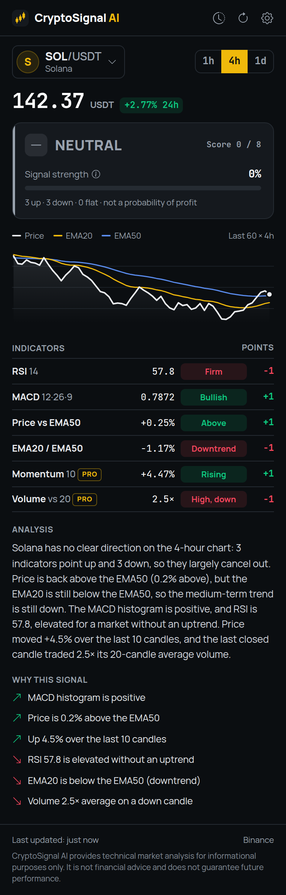 |

| Loading | Error | Rate limited | Stale data |
| --- | --- | --- | --- |
| 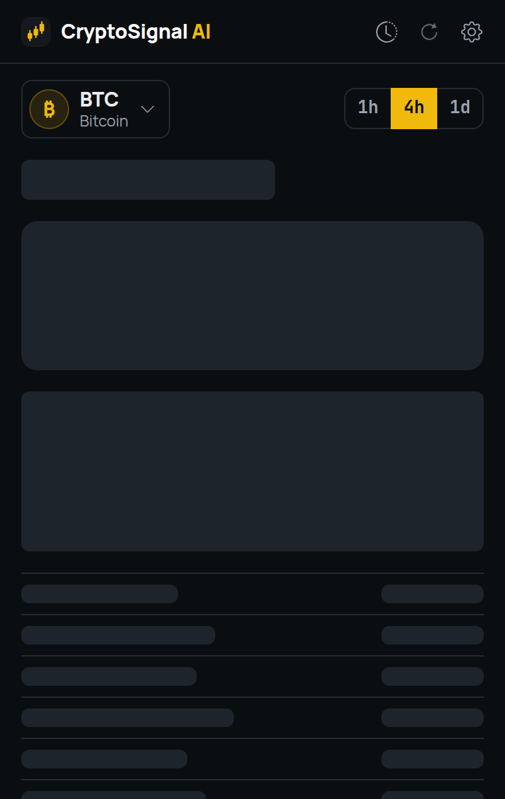 | 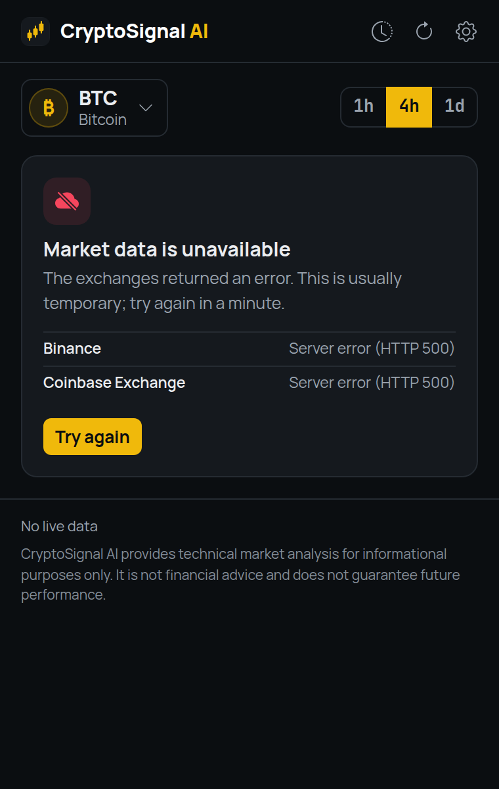 |  | 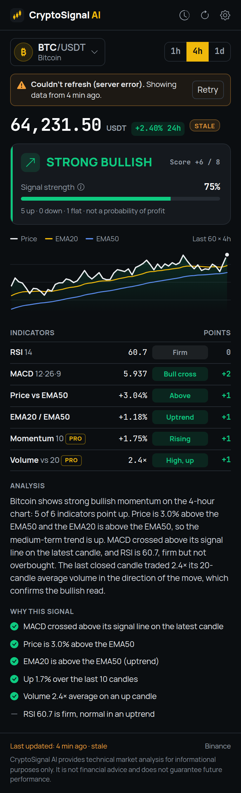 |

| Search | History | Snapshot | Settings |
| --- | --- | --- | --- |
| 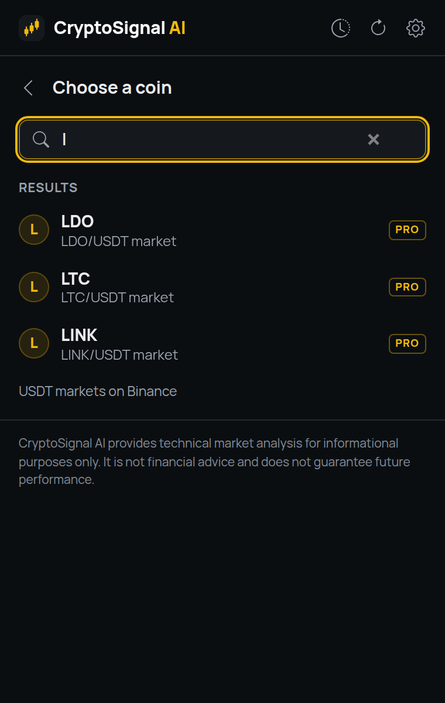 | 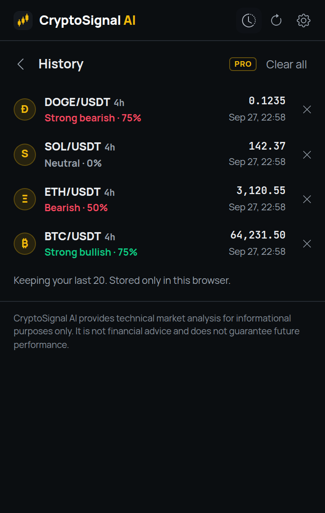 | 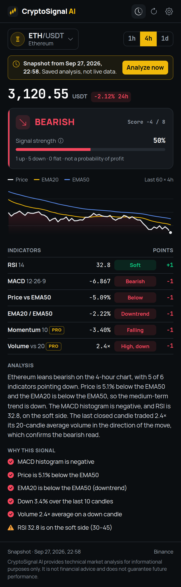 | 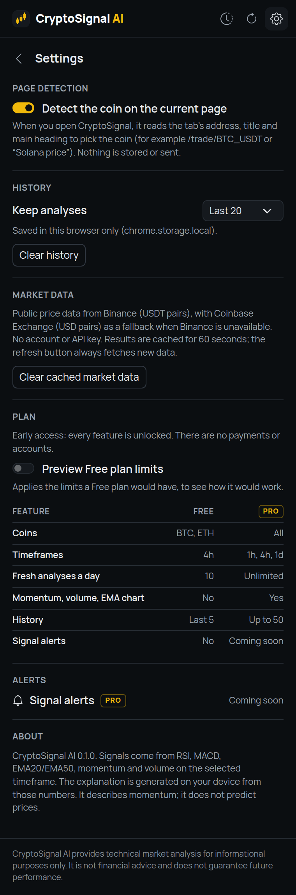 |

| Detected on page | Coinbase fallback | Free plan preview | Popup at 380 × 600 |
| --- | --- | --- | --- |
| 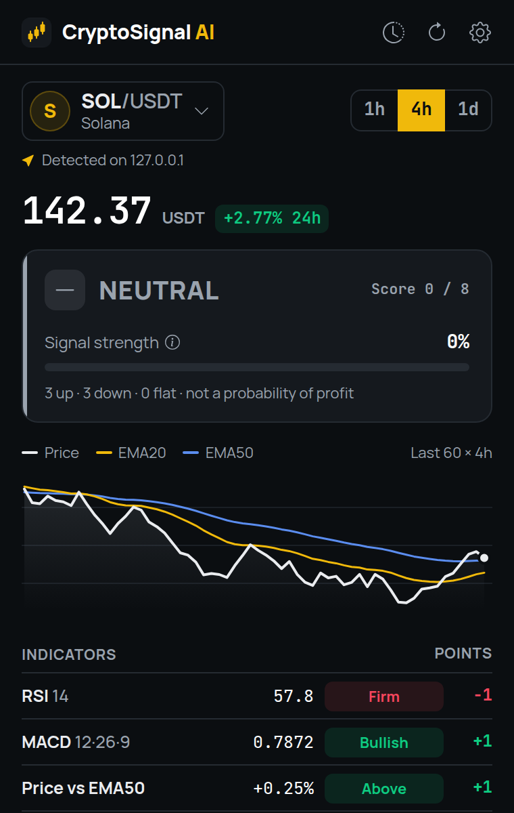 | 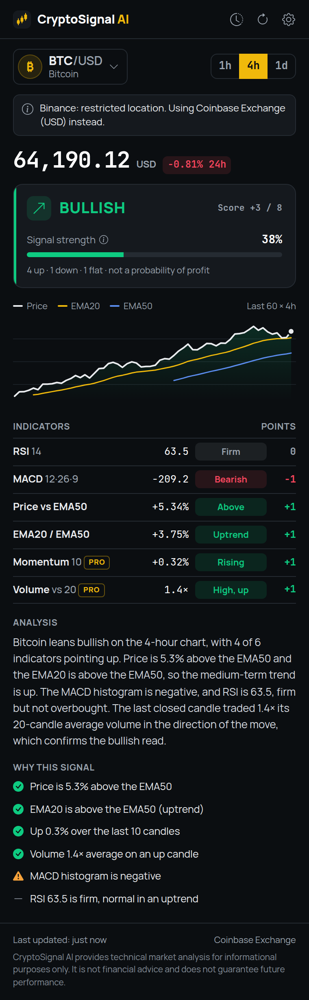 | 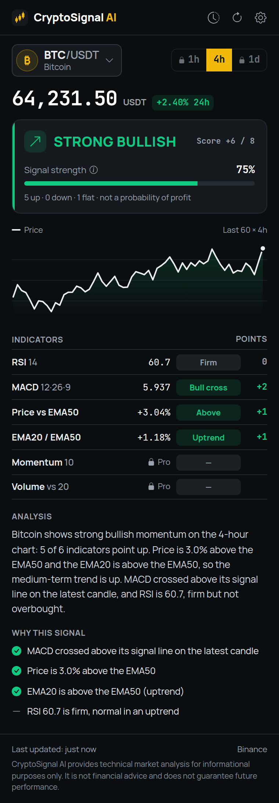 | 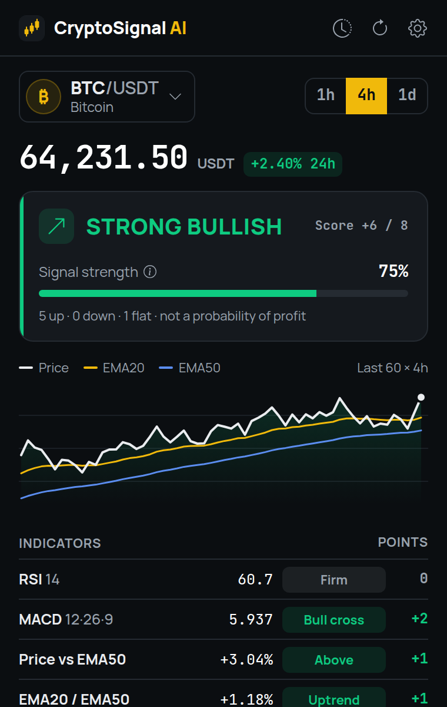 |

Screenshots are generated by the e2e suite from fixture data (`UPDATE_SCREENSHOTS=1 npm run test:e2e`).

## Features

- **Signal card:** STRONG BULLISH / BULLISH / NEUTRAL / BEARISH / STRONG BEARISH, the score
  (−8…+8), a signal-strength bar and how many indicators point up, down or flat.
- **Price** with the 24h change, from the exchange's 24h ticker.
- **Indicators:** RSI 14, MACD 12·26·9, price vs EMA50, EMA20 vs EMA50, momentum (10-candle rate
  of change), volume vs the 20-candle average. Each row shows its value, state and points; hover a
  row for its scoring rule.
- **Mini chart** (plain SVG, no chart library): close, EMA20, EMA50, last price marked. Hover it or
  focus it and use ←/→ for a crosshair with each candle's values.
- **Analysis:** two to four sentences generated from the indicator values, plus **Why this signal**:
  ✓ what supports the signal, ⚠ what goes against it or doesn't confirm it (for a neutral market:
  which readings lean up, down or flat).
- **Timeframes:** 1h, 4h, 1d.
- **Coins:** BTC, ETH, SOL, XRP, DOGE, BNB, ADA, AVAX by default; search finds any other USDT market
  on Binance (debounced; falls back to Coinbase USD markets).
- **Page detection:** opening the popup on an exchange or price page picks that coin
  (`/trade/BTC_USDT`, `/BTCUSDT`, `/coins/bitcoin`, "Solana price" …). Defaults to your last coin, or BTC.
- **Context menu:** select a ticker or coin name → right-click → **CryptoSignal AI → Analyze selected coin**.
- **History:** the last analyses (20 by default) as dated snapshots; reopening one shows exactly what
  was shown then, clearly marked as not live.
- **Honest states:** loading skeleton, errors that say what happened and what to do, rate-limit
  countdown, stale cached data marked as stale, "not enough history" for new listings. No fake prices
  or signals, ever; the UI never prints NaN, Infinity or undefined.

## Signal engine

`src/core/signal.ts`, pure and UI-independent. `analyze(candles, { now })` validates the candles,
computes the indicators and returns the score, label, strength and every intermediate value.

| Indicator | Rule | Points |
| --- | --- | --- |
| RSI (14, Wilder smoothing) | below 30 | +2 |
| | 30 to below 45 | +1 |
| | 45 to 55 | 0 |
| | above 55 up to 70 | 0 in an uptrend (EMA20 above EMA50), −1 otherwise |
| | above 70 | −2 |
| MACD (12, 26, 9) | histogram turned positive on one of the last 3 candles (bullish crossover) | +2 |
| | histogram positive | +1 |
| | histogram within 0.001% of the price (flat) | 0 |
| | histogram negative | −1 |
| | histogram turned negative on one of the last 3 candles (bearish crossover) | −2 |
| Price vs EMA50 | above / below | +1 / −1 |
| EMA20 vs EMA50 | above / below | +1 / −1 |
| Momentum (rate of change over 10 candles) | above +0.1% / below −0.1% / in between | +1 / −1 / 0 |
| Volume (last closed candle vs mean of the 20 before it) | above average on an up candle / on a down candle / otherwise | +1 / −1 / 0 |

- **Score** = sum of the points, from −8 to +8.
- **Label:** ≥ +5 STRONG BULLISH · +2 … +4 BULLISH · −1 … +1 NEUTRAL · −4 … −2 BEARISH · ≤ −5 STRONG BEARISH.
- **Signal strength** = round(|score| ÷ 8 × 100)%. It measures how strongly the indicators agree. It
  is labelled as such in the UI and is **not** a probability of the price moving or of a profitable trade.
- 200 candles are requested; at least 60 are required (EMA50 plus room for the crossover lookback
  and the volume window). Fewer → "Not enough price history", never a guess.
- Candles with NaN/Infinity, non-positive prices, negative volume, high below close, out-of-order or
  duplicate times are rejected as invalid data. Flat prices give RSI 50, a flat MACD and NEUTRAL 0%.

Decisions worth knowing:

- **RSI 55–70 depends on the trend.** In an uptrend a firm RSI is normal (0); without one it's a
  rally into a weak market (−1). "Trend" is EMA20 vs EMA50.
- **Volume confirms a direction.** The brief said "volume above average +1". Taken literally, a
  heavy sell-off would add a bullish point. Here above-average volume adds a point *in the direction
  of the candle that carried it* (+1 up candle, −1 down candle), which keeps the scale symmetric
  (−8…+8). For up candles this is exactly the brief's +1.
- **Volume uses the last closed candle** (the in-progress candle's volume is partial). Price-based
  indicators include the in-progress candle, like exchange charts do. "Closed" is judged at fetch
  time, so a cached result reads the same later.
- **MACD crossover** = the histogram changed sign into its current sign on one of the last 3
  candles. If it has flipped back since, it's just the current histogram sign.

## Explanation

`AIExplanationService` (`src/core/explain.ts`) has one async method, `explain(input)`, returning 2–4
sentences and the "Why this signal" items. The MVP implementation, `LocalExplanationService`, is a
deterministic generator: it only restates the indicator values ("Price is 3.0% above the EMA50 and
the EMA20 is above the EMA50, so the medium-term trend is up."), never predicts, never mentions news
or causes, and doesn't call itself "AI". An LLM-backed service can replace it by implementing the
same interface; the UI already awaits it and history stores the text it produced.

## Market data

`MarketDataProvider` (`src/data/provider.ts`): `getCandles(symbol, interval, limit)`,
`getTicker(symbol)`, `searchSymbols(query)`. Symbols are base tickers ("BTC"); each provider picks its quote.

| Provider | Role | Endpoints (public, no API key) |
| --- | --- | --- |
| Binance Spot (`https://api.binance.com`) | primary, USDT pairs | `/api/v3/klines`, `/api/v3/ticker/24hr`, `/api/v3/ticker/price` (search) |
| Coinbase Exchange (`https://api.exchange.coinbase.com`) | fallback, USD pairs | `/products/{id}/candles`, `/products/{id}/stats`, `/products` (search) |

- Coinbase has no 4-hour candles; 4h candles are built from hourly ones in UTC-aligned buckets, like
  Binance's (a partial leading bucket is dropped). Coinbase returns at most 300 candles, so its 4h
  view has ~75 candles.
- Every response is validated strictly (documented shape, plain decimal strings, consistent OHLC,
  ordered times). Anything off is a "malformed" error, never a signal.
- **Fallback:** Binance is tried first. On 451/403 (restricted location), 5xx, network errors,
  timeouts (10 s), malformed data or "invalid symbol", Coinbase is tried. A geo-block is remembered
  for 30 minutes so Binance isn't asked on every open. The popup says when it's showing Coinbase data.
- **Rate limits:** 429 and 418 honour `Retry-After` (seconds or HTTP date; 60 s if missing). The
  provider isn't asked again until then, even on manual refresh, and the popup shows a countdown.
- **Cache:** per symbol + timeframe in `chrome.storage.session` for 60 s (24 entries max). The
  refresh button bypasses it. "Last updated: 12 sec ago" is shown under the analysis.
- **Stale data:** if every provider fails, cached data up to two candles old (at least 30 min) is
  shown with a STALE badge and a notice saying why it couldn't refresh. Live data left open for
  more than 5 minutes is also marked stale. Without usable cache: an error, no numbers.
- The 24h ticker is optional: if only it fails, the price comes from the latest candle and the 24h
  change is shown as unavailable.

No API keys or configuration are needed.

## Page detection and the context menu

`src/core/detect.ts` is a pure function over the tab URL, the page title and the first `<h1>` (the
only things read, and only when the popup is opened: `activeTab` + a one-off `scripting` call).

- URLs of exchanges and price sites win: pairs like `BTC_USDT`, `BTCUSDT`, `BTC-USD`, `BTC/USDT`,
  `BINANCE:ETHUSDT`, and slugs like `/coins/bitcoin`, `/currencies/xrp`, `/price/solana`. Unknown
  tickers in pairs (e.g. `PEPE_USDT`) are trusted only on known crypto sites.
- Text matches are whole words: "Canada" never yields ADA and "solution" never yields SOL.
  Tickers and names that are ordinary words (ETH Zurich, ADA compliance, DOGE the agency, avalanche,
  ripple) count only next to crypto words (price, chart, token, USDT, …).
- The context-menu handler uses looser rules for the explicit selection (a lone "ada" or "$sol" is
  taken at face value), stores the result in `chrome.storage.session` and opens the popup with
  `chrome.action.openPopup()` (Chrome 127+). Where that fails it puts a badge on the toolbar icon;
  the request waits five minutes. A selection without a coin says so and falls back to your last coin.

## Plans and feature gating

`src/core/features.ts` defines Free vs Pro and `isEnabled(feature, plan, policy)`; every check in the
UI goes through it.

| Feature | Free | Pro |
| --- | --- | --- |
| Coins | BTC, ETH | all |
| Timeframes | 4h | 1h, 4h, 1d |
| Fresh analyses per day | 10 | unlimited |
| Advanced indicators (momentum, volume rows, EMA chart overlays) | no | yes |
| History | last 5 | up to 50 |
| Alerts | no | planned |

**MVP decision:** there are no payments, so the extension ships in *early access*: plan hard-coded
to `free`, policy `early-access`, everything unlocked. Small **PRO** badges mark what a paid plan
would cover. Settings has a **Preview Free plan limits** switch that enforces the Free column
(locked coins/timeframes, hidden advanced rows, daily counter), so the gated experience can be
reviewed and tested today. Turning on real plans later means changing the policy and supplying the
plan, not touching the UI. The signal itself always uses all six indicators.

## Alerts

Architecture only (`src/core/alerts.ts`): an `AlertRule` (signal changed, signal becomes X,
strength ≥ N, RSI crosses, price crosses) and `evaluateAlert(rule, previous, current)`, which is
edge-triggered (fires once when a condition becomes true, never without a previous analysis to
compare with). There is no background polling yet.

## Privacy and permissions

No account, no backend, no analytics, no third-party code. The only network requests go to the two
market-data APIs, and they carry nothing but the coin and timeframe. Settings, history and the
Free-plan counter stay in `chrome.storage.local`; the price cache and context-menu hand-off live in
`chrome.storage.session`.

| Permission | Why |
| --- | --- |
| `storage` | Settings, history, the price cache and the context-menu hand-off |
| `contextMenus` | "CryptoSignal AI → Analyze selected coin" |
| `activeTab` | Read the current tab's URL and title when you open the popup, to detect the coin |
| `scripting` | Read the page's first heading (one injected function, only when the popup opens) |
| `https://api.binance.com/*` | Candles, 24h ticker and symbol list (primary) |
| `https://api.exchange.coinbase.com/*` | Candles, 24h stats and product list (fallback) |

No wallet access, no keys, no trading, no content scripts, no broad host access.

## Development

Requires Node.js 22.12+.

```bash
npm install
npm run build        # production build -> dist/
npm run dev          # rebuild on change (inline source maps) -> dist/
npm run typecheck    # extension code + build config
npm test             # unit tests (vitest)
npm run check        # typecheck + unit tests + build
npm run test:e2e     # builds dist/ and dist-e2e/, then drives dist-e2e/ in real Chromium
```

Build: Vite 8 with two entries, `src/popup.html` and `src/background/index.ts` (a module service
worker, `"type": "module"`; shared code goes to `chunks/shared.js`). Bootstrap 5.3 is compiled from
Sass with the brand theme (`src/styles/_theme.scss`), Bootstrap Icons are inlined as SVG, and
Manrope / JetBrains Mono are bundled (Latin, Latin Extended, Cyrillic subsets). JavaScript is left
unminified for Chrome Web Store review; there are no source maps in `dist/`.

`--mode e2e` builds `dist-e2e/`: it points both providers at a local fixture server
(`http://127.0.0.1:47831`), exposes the context-menu handler to the test, lets the test say which
tab the popup belongs to (`?tab=`), and has broad host access because automation can't grant
`activeTab`. All of that is compiled out of `dist/`, and the e2e suite asserts it.

### Tests

- **Unit (vitest, 275 tests):** indicators (incl. the Wilder RSI reference series), scoring rules
  and thresholds, crossover detection, representative bullish / bearish / neutral series, edge cases
  (too few candles, flat prices, zero volume, NaN / Infinity / negative / out-of-order data),
  explanation wording rules, page and selection detection (incl. false positives), provider parsing
  and error mapping against hand-written payloads in the documented formats (`test/fixtures/`),
  Coinbase 4h aggregation, the market service (cache, fallback, Retry-After, stale, eviction),
  feature gating, alerts, history/settings sanitizing and storage.
- **E2E (Playwright + Chromium, 21 tests):** loads the built extension and covers every popup state
  against `e2e/fixture-server.mjs`, which replays recorded-style payloads
  (`e2e/fixtures/api/`, generated by `e2e/fixtures/make-fixtures.mjs`) and can switch each provider
  to 451 / 429 / 500 / malformed / connection reset. `test/fixtures.test.ts` pins down which signal
  each fixture produces.

`test:e2e` needs a Chromium build; it is auto-detected in some environments, otherwise set
`CHROMIUM_PATH`. Screenshots go to `e2e/output/`; `UPDATE_SCREENSHOTS=1` also refreshes `screenshots/`.
Toolbar icons are rendered from `scripts/icon.svg` with `node scripts/make-icons.mjs`.

### Load the extension in Chrome

1. `npm install && npm run build`
2. Open `chrome://extensions`, turn on **Developer mode**
3. **Load unpacked** → select `dist/`

For the Chrome Web Store, zip the *contents* of `dist/`. Listing copy: [`store/listing.md`](store/listing.md).

## Project structure

```
src/
  core/        Pure logic: indicators, signal engine, explanation, detection, features,
               alerts, formatting, chart geometry, history/settings models, sanitizers
  data/        Market-data providers (Binance, Coinbase), HTTP + error mapping, market service
  storage/     chrome.storage wrappers
  background/  Service worker: context menu, hand-off to the popup
  popup/       Popup controller, views, chart, messages
  styles/      Bootstrap theme, fonts, popup styles
  ui/          DOM builder, inlined icons
  popup.html, manifest.json
test/          Unit tests and hand-written API payloads
e2e/           Chromium smoke test, fixture server, fixture pages and payloads
public/icons/  Toolbar icons (rendered from scripts/icon.svg)
screenshots/   Curated screenshots (generated by the e2e suite)
store/         Chrome Web Store listing
```

## Known limitations

- Live Binance/Coinbase access has not been exercised (see the note at the top). Formats follow
  the public documentation as of 2026; a format change would surface as "Unexpected data", not as
  a wrong signal.
- Coinbase doesn't list every default coin (the fixtures assume no BNB); if Binance is unavailable
  those coins show "isn't available". Coinbase 4h has ~75 candles, so its chart shows EMA50 only for
  the last part.
- Binance search lists USDT pairs from `/api/v3/ticker/price` (pairs with a zero price are treated
  as not trading); it has no full coin names, so unknown coins are shown by ticker.
- Page detection sees only the URL, title and first `<h1>`; single-page apps that change the coin
  without changing those are detected by whatever they show.
- `chrome.action.openPopup()` needs Chrome 127+; older versions get a toolbar badge instead.
- Signals use fixed parameters; there is no backtesting and no claim of predictive value.
- The chart's price line is drawn in the text colour (primary series) next to the gold/blue EMAs;
  the dataviz palette validator flags that as outside its categorical lightness band, while the
  colour-blind separation and contrast checks pass. Series are also identified by the legend and tooltip.

## Ideas for v2

- LLM-backed `AIExplanationService` (with the same guardrails: no predictions, cite the numbers).
- Background alerts using `AlertRule` + `chrome.alarms` + notifications.
- Kraken as a second fallback; multi-coin watchlist with mini signals.
- User-tunable indicator parameters and a "how the score is built" breakdown view.
- Real plans (licensing/payments) behind the existing `features.ts` policy.
- Store-size (1280 × 800) promotional screenshots composed from the popup captures.
