# Chrome extensions: product and design concepts

The source of truth for what each extension in this repo is, who it's for, how it looks and how
we decide whether it lives. A visual version with screenshots (Ukrainian) is published as a Claude
artifact: https://claude.ai/artifact/J9b6bbHjcxsH2Mt4teVLap Read this before changing any of them. UI rules live in
[`design-system.md`](design-system.md).

## Strategy: 10 shots

- Ship many small, focused extensions instead of betting a month on one "perfect" idea.
  $0 budget → ~12 listings → 30 days → keep what moves, kill what doesn't.
- Each extension is its own Chrome Web Store listing aimed at its own search queries ("table to
  csv", "clean copy", "video speed controller"), even when the code overlaps. That's why Clean
  Copy, Table Copy and Universal Copy are three products, and Chat Exporter and AI Chat Search are two.
- Don't fall in love with any of them. Traction decides which one becomes a real product.
- Every extension follows the same skeleton (MV3, TypeScript, Bootstrap theme, local-only data,
  unit tests + Chromium e2e), so the next one is "swap the engine", not "start from zero".

### Tiers (effort, and the order to ship)

| Tier | Extensions | Why |
| --- | --- | --- |
| A, ~1 day each | Clean Copy, Table Copy, Video Speed+, Progress Tab | Simple, proven demand, cheap to test |
| B, ~2 days each | Pastebot, Universal Copy, Snippets (text expander), Chat Exporter | More logic, clear value |
| C, only if tier A/B show signal | AI Chat Search, Page Watch | Harder to get right, need retention |
| Experiments | CryptoSignal AI, Polymarket AI Analyzer | Trend-driven niches, need live data and careful claims |

Suggested release rhythm: Clean Copy → Table Copy → Pastebot → Video Speed+ → Progress Tab →
Chat Exporter → Snippets → Universal Copy, then the rest.

### What we measure (per listing, weekly)

Impressions, installs, install conversion (installs ÷ listing views), uninstalls, weekly active
users, reviews and rating, organic search queries that bring people in, and above all **feature
requests** ("can you add X?"). 30 installs with 3 real requests beat 500 silent installs.

### Kill / keep rules after 30 days

- **Kill**: < 50 installs and no feature requests, or uninstall rate > 50%.
- **Keep and iterate**: steady organic installs, or any repeated feature request.
- **Promote to a product**: WAU growing week over week and users asking for things worth paying
  for (sync, more formats, alerts, teams).

### Shared principles

- Local-first: no accounts, no analytics, no tracking, no remote code. Network access only when
  the feature is the network (Page Watch, CryptoSignal, Polymarket), and only to the exact hosts.
- Minimal permissions, each justified in the extension's README and in the store listing.
- Honest copy: no "AI predicts", no fake accuracy, no guaranteed outcomes.
- Monetization later: a clean feature-gating seam where Pro makes sense; no payments in MVPs.

---

## Portfolio

| # | Extension | Folder | One-liner | Tier | Monetization idea |
| --- | --- | --- | --- | --- | --- |
| 1 | Pastebot | [`pastebot/`](../pastebot) | Selected text → ready-to-paste AI prompt | B | Pro templates, custom prompt library |
| 2 | Universal Copy | [`universal-copy/`](../universal-copy) | Copy anything as clean text / Markdown / HTML / table formats | B | Pro formats, per-site rules |
| 3 | Clean Copy | [`clean-copy/`](../clean-copy) | Copy without formatting and junk | A | Pro: rules, auto-clean on Ctrl+C |
| 4 | Table Copy | [`table-copy/`](../table-copy) | Any HTML table → CSV / Excel / Markdown / JSON | A | Pro: multi-table export, XLSX |
| 5 | Snippets | [`text-expander/`](../text-expander) | `;sig` → your signature, anywhere | B | $20/year: sync, team snippets |
| 6 | Chat Exporter | [`chat-exporter/`](../chat-exporter) | ChatGPT / Claude conversations → Markdown / PDF / JSON | B | One-time Pro: bulk export |
| 7 | AI Chat Search | [`ai-chat-search/`](../ai-chat-search) | Full-text search across your AI chats | C | Subscription: sync, semantic search |
| 8 | Page Watch | [`page-watch/`](../page-watch) | Alert when a page or part of it changes | C | Subscription: more watches, faster checks |
| 9 | Video Speed+ | [`video-speed/`](../video-speed) | Speed control for any video | A | Pro: per-site rules, profiles |
| 10 | Progress Tab | [`progress-tab/`](../progress-tab) | New tab: year / month / week / day progress + countdowns | A | Themes and widgets |
| 11 | CryptoSignal AI | [`crypto-signal/`](../crypto-signal) | Simple, transparent crypto momentum signal | Exp. | Pro: all coins, timeframes, alerts |
| 12 | Polymarket AI Analyzer | [`polymarket-analyzer/`](../polymarket-analyzer) | What's happening in this Polymarket market, and why | Exp. | Pro: alerts, comparisons, related markets |

---

## 1. Pastebot

- **Problem**: people paste raw selections into ChatGPT and then type the same instructions every
  time ("explain this error, I'm a Java dev..."). Good prompts are tedious to write.
- **For**: developers, analysts, students, anyone who uses an AI chat daily.
- **Search queries**: "prompt generator", "AI prompt from selection", "ChatGPT prompt helper".
- **Core flow**: select → right-click → Pastebot → action → prompt in the clipboard (< 2 s).
  Actions: Analyze, Summarize, Explain, Extract, Compare, Rewrite, Custom.
- **Smarts**: detects errors / code (with language) / tables / prose and adapts the prompt; cleans
  UI noise; keeps URLs, numbers, code and table cells exact; optional page title + URL.
- **UI**: small panel next to the selection (shadow DOM), keyboard-first (`1`–`7`, `Enter`, `Esc`);
  toast for direct actions; popup for manual text and history; settings page.
- **Brand**: burnt orange `#c4450d` on warm paper `#fffdf8`; icon = clipboard with a `>_` caret.
- **Permissions**: activeTab, scripting, contextMenus, storage, offscreen, clipboardWrite.
- **Pro later**: user templates, template marketplace, AI-optimized prompts, sync.

- **Screens**:

| | | |
| --- | --- | --- |
|  |  |  |

## 2. Universal Copy

- **Problem**: copying from the web brings broken formatting; developers and writers want
  Markdown, clean HTML or plain text.
- **For**: writers, devs, note-takers (Notion, Obsidian users).
- **Search queries**: "copy as markdown", "copy without formatting", "html to markdown".
- **Core flow**: select → right-click → Copy as → Clean text / Markdown / Clean HTML, plus table
  formats when the selection is in a table; popup lists tables on the page.
- **Brand**: deep teal `#0b7285`.

- **Screens**:

| | | |
| --- | --- | --- |
| 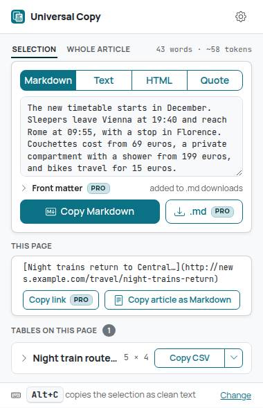 | 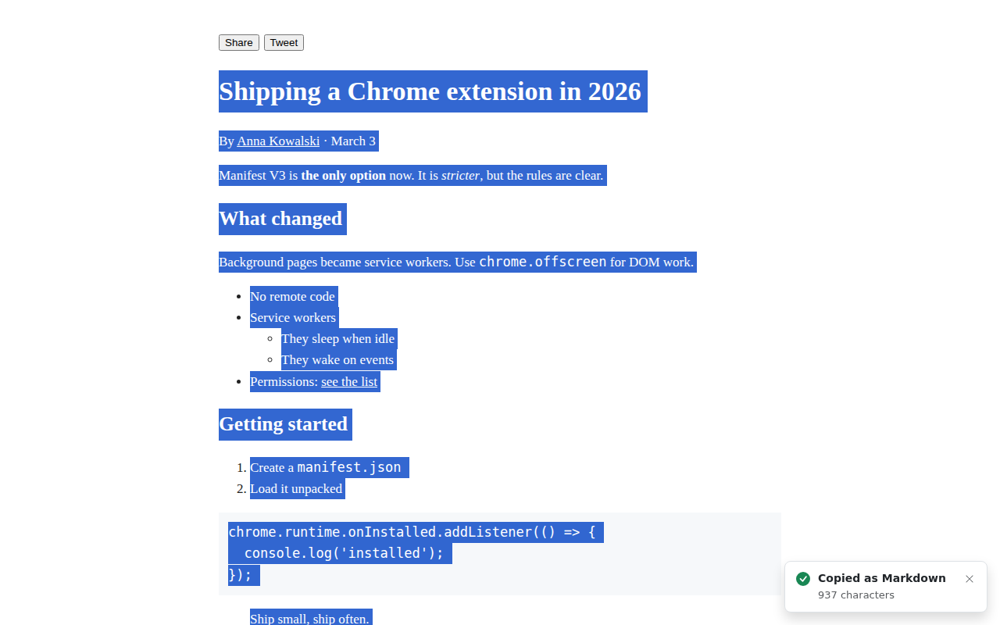 | 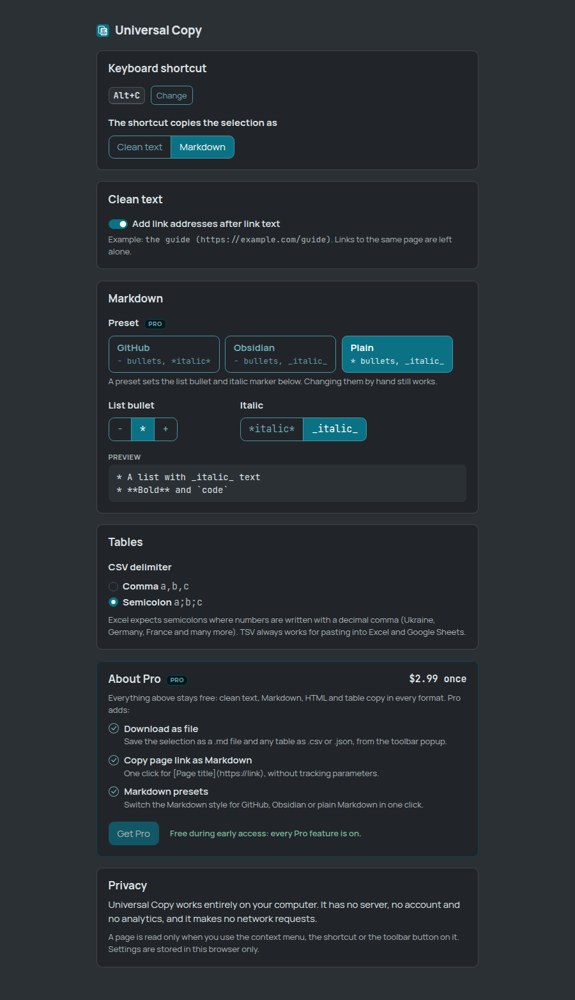 |

## 3. Clean Copy

- **Problem**: pasted text drags fonts, colors, links and invisible junk into emails and docs.
- **Core flow**: select → shortcut or right-click → clean plain text in the clipboard.
- **Brand**: blue `#1971c2`, minimal, lots of whitespace.

## 4. Table Copy

- **Problem**: getting an HTML table into Excel/Sheets or Markdown is painful (merged cells,
  commas, locales).
- **Core flow**: select inside a table → right-click → CSV / TSV (Excel) / Markdown / JSON; the
  popup lists all tables with previews. Semicolon CSV option for European Excel.
- **Brand**: spreadsheet green `#2b8a3e`, grid motif.

## 5. Snippets (text expander)

- **Problem**: typing the same replies, addresses, signatures and code over and over.
- **Core flow**: type `;abbr` in any field → expands; variables `{date}`, `{time}`, `{cursor}`.
  Manager page with search, import/export.
- **Brand**: raspberry `#c2255c`.
- **Note**: needs a content script on all sites (it has to see typing); nothing is read beyond
  matching abbreviations locally. Skips password and payment fields.

- **Screens**:

| | | |
| --- | --- | --- |
| 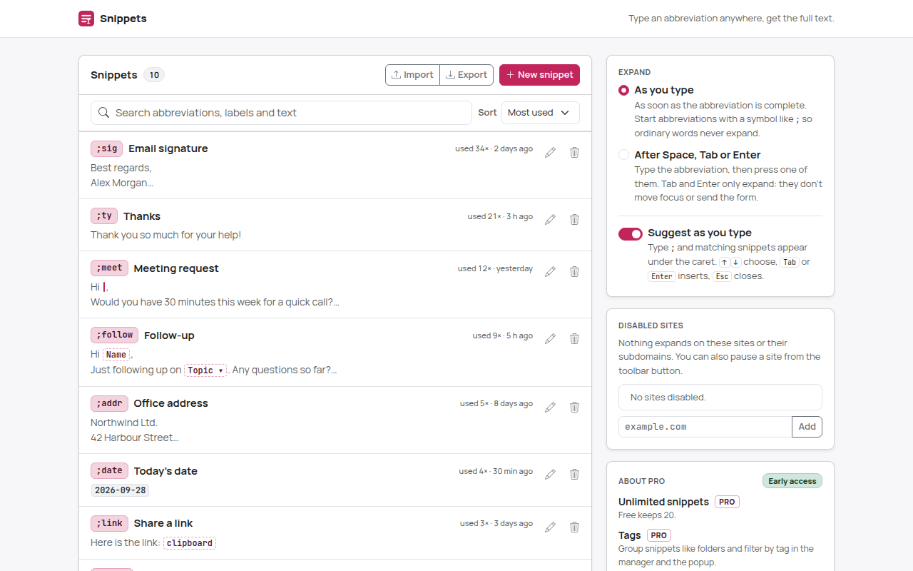 | 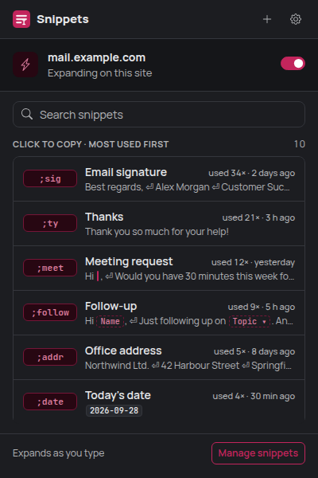 | 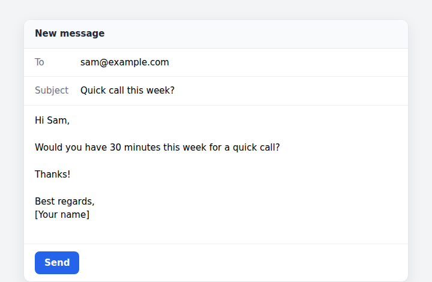 |

## 6. Chat Exporter

- **Problem**: valuable ChatGPT/Claude conversations are stuck in the chat UI.
- **Core flow**: open a conversation → Export button → Markdown / JSON / text / PDF, or copy as
  Markdown.
- **Brand**: cyan `#1098ad`.
- **Risk**: depends on the sites' DOM; selectors isolated per site so fixes are one file.

- **Screens**:

| | | |
| --- | --- | --- |
| 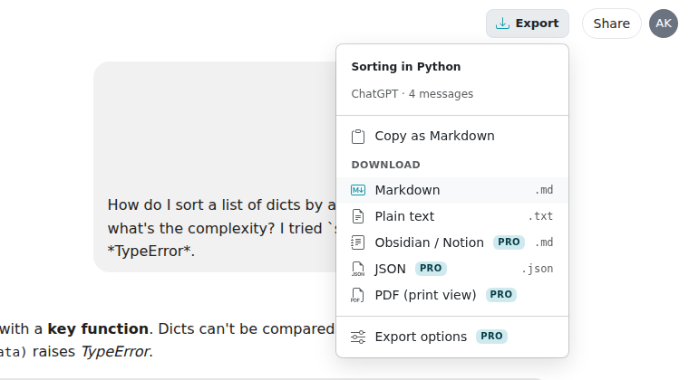 | 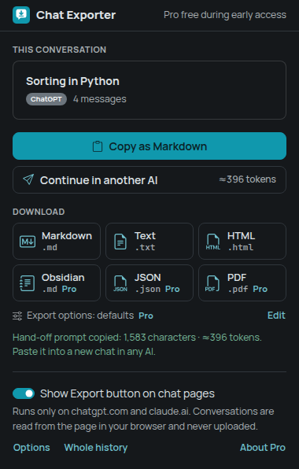 | 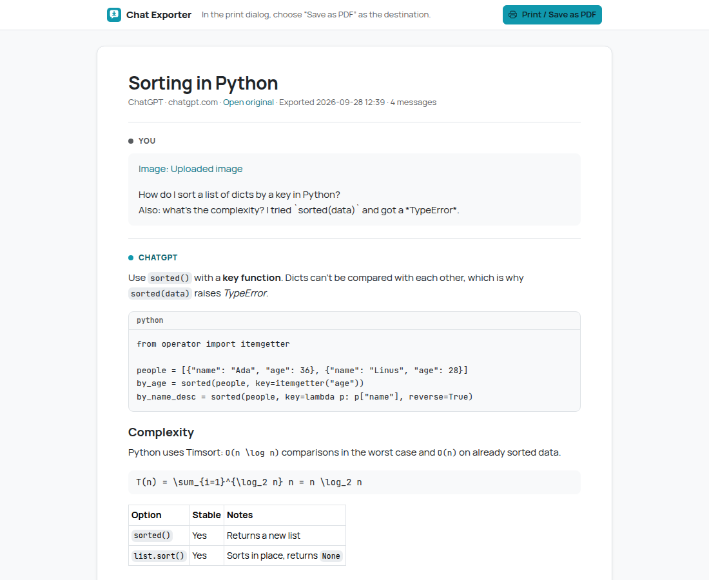 |

## 7. AI Chat Search

- **Problem**: finding "that one answer" across hundreds of AI chats.
- **Core flow**: conversations are indexed locally as you open them (clearly explained, can be
  turned off) → search page with ranking and highlighted snippets.
- **Brand**: amber `#e67700`.

- **Screens**:

| | | |
| --- | --- | --- |
|  |  |  |

## 8. Page Watch

- **Problem**: waiting for a price drop, a job post, a docs change, an appointment slot.
- **Core flow**: popup → watch this page or pick an element → interval → notification with a
  diff when it changes.
- **Brand**: alert red `#e03131`.
- **Limit**: pages rendered by JavaScript can't be watched in the MVP (fetch gets server HTML).

- **Screens**:

| | | |
| --- | --- | --- |
|  |  |  |

## 9. Video Speed+

- **Problem**: built-in players cap speed at 2x or hide the control; sites reset your speed.
- **Core flow**: `S`/`D` slower/faster, `R` reset, `G` preferred speed, `Z`/`X` seek; small
  overlay on the video; remembers speed per site and re-applies it when sites reset it.
- **Brand**: magenta `#d6336c`, dark-first overlay.

- **Screens**:

| | | |
| --- | --- | --- |
|  |  |  |

## 10. Progress Tab

- **Problem**: time slips by; the owner's Telegram bot already posts year progress, this brings it
  to every new tab.
- **Core flow**: new tab shows year / month / week / day progress and personal countdowns.
- **Brand**: mint `#0ca678`, big calm typography, user themes (future paid themes/widgets).

- **Screens**:

| | | |
| --- | --- | --- |
|  |  |  |

## 11. CryptoSignal AI

- **Problem**: casual crypto users want a quick read on momentum without learning TA.
- **Core flow**: open the popup on a crypto page (coin auto-detected) → signal (strong bullish …
  strong bearish), signal strength, RSI / MACD / EMA / momentum / volume, short explanation, mini
  chart, history.
- **Honesty**: "signal strength" is not a probability of profit; explanation is a deterministic
  generator behind an `AIExplanationService` interface (swappable for an LLM later); disclaimer.
- **Brand**: dark `#0b0e11`, gold `#f0b90b`, up `#0ecb81`, down `#f6465d`.
- **Data**: public exchange APIs (no keys), exact host permissions only.

- **Screens**:

| | | |
| --- | --- | --- |
| 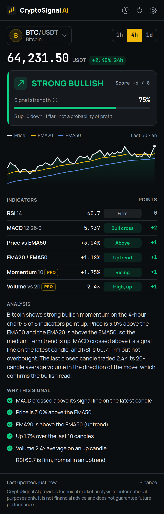 | 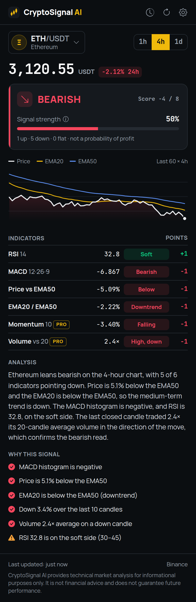 | 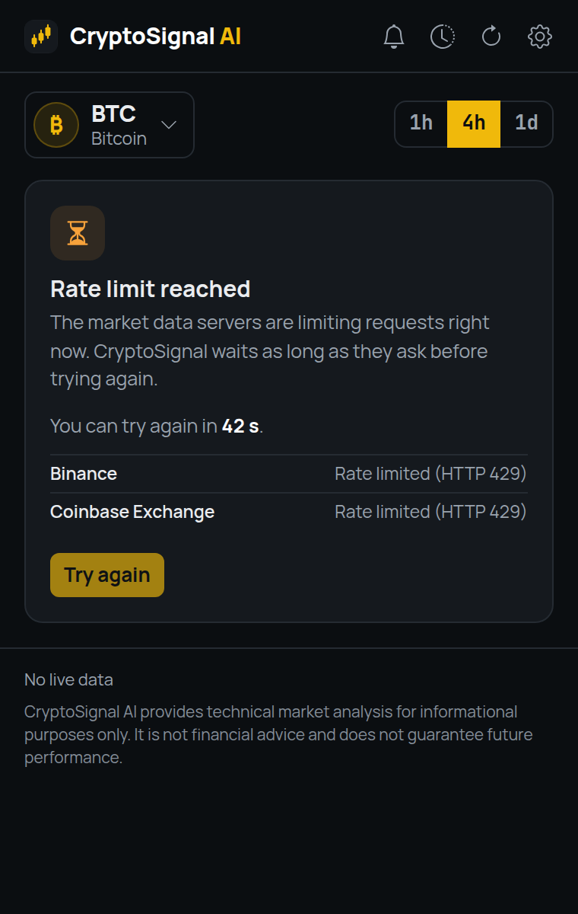 |

## 12. Polymarket AI Analyzer

- **Problem**: a market's price moves and you don't know if it's noise or real activity.
- **Core flow**: open the popup on a Polymarket market → probability, 24h/7d change, volume,
  liquidity, momentum label + strength, unusual-activity flags, chart, explanation; watchlist,
  history, compare.
- **Honesty**: momentum describes price movement, not who will win; no "best bet", no arbitrage
  claims; deterministic explanation behind `AIExplanationService`.
- **Brand**: dark `#0b1020`, blue `#2e5cff`.
- **Data**: Polymarket public Gamma + CLOB APIs, exact host permissions only.

- **Screens**:

| | | |
| --- | --- | --- |
| 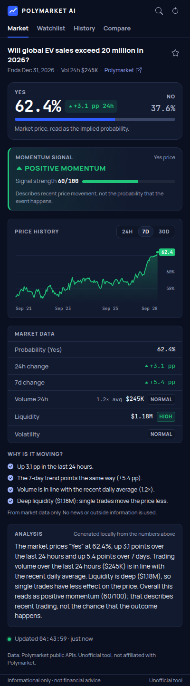 | 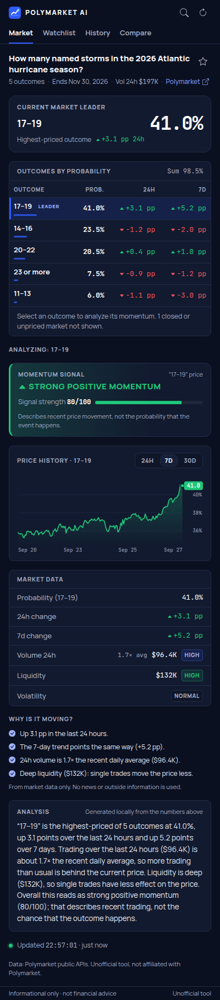 | 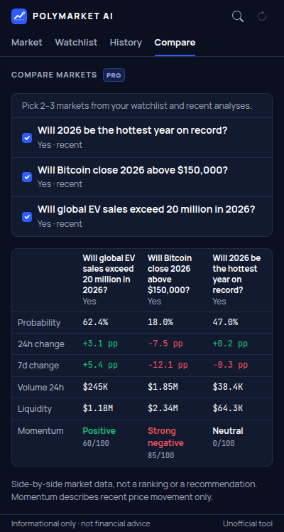 |

---

## Status

Filled in as each extension lands: tests, e2e, what's verified and what isn't.

| Extension | Unit tests | E2E | Verified live | Notes |
| --- | --- | --- | --- | --- |
| Pastebot | 146 | 27 | Local fixtures only | Pro: custom templates, history search, pins |
| Universal Copy | 114 | 26 | Local fixtures only | Pro: page link as Markdown, downloads, presets |
| Clean Copy | 103 | 15 | Local fixtures only | Pro: auto-clean on Ctrl+C per site, custom rules; real permission prompt unverified |
| Table Copy | 82 | 18 | Local fixtures only | Pro: .xlsx, column picker, basket merge; not opened in real Excel/Sheets |
| Snippets | 96 | 39 | Local fixtures only | Pro: unlimited, tags, fill-in fields; real editors untested |
| Chat Exporter | 144 | 24 | Fixtures only | chatgpt.com / claude.ai never tested; selectors are guesses |
| AI Chat Search | 137 | 19 | Fixtures only | Same unverified selectors; Pro: unlimited index, stars, tags |
| Page Watch | 143 | 30 | Local server only | Pro: price-below rule, quiet hours; real sites unverified |
| Video Speed+ | 82 | 31 | Local fixtures only | Pro: per-site defaults, presets; skip silence not shipped |
| Progress Tab | 416 (+75 zone skips) | 22 | Yes (no network) | Pro: theme pack, Life in weeks, unlimited countdowns |
| CryptoSignal AI | 297 | 25 | Fixtures only | Live APIs unverified; Pro: background alerts, watchlist |
| Polymarket AI Analyzer | 177 | 26 | Fixtures only | Live APIs unverified; Pro: background alerts, compare, 30D |
| YouTube Focus | 90 | 22 | Fixtures only | All YouTube selectors unverified; Pro: schedule, allowlist |

## 13. YouTube Focus

- **Problem**: YouTube's Shorts, recommendations and comments pull you away from what you came for.
- **Core flow**: switches for Shorts, home feed, Up next, end screens and comments; calm home card
  or redirect to Subscriptions; pause for 15 minutes. Pro: schedule, channel allowlist,
  subscriptions-only mode.
- **Brand**: olive `#4d7c0f`. Not affiliated with YouTube; listing may need the name "Focus for YouTube".
- **Permissions**: storage only; content script on YouTube origins only.
