# Page Watch

Get notified when a web page, or just the part of it you care about, changes: prices, stock status,
job postings, docs, government pages.

Page Watch checks the pages you choose in the background, compares each version with the previous
one and tells you what changed: a notification ("Price changed: $129.00 → $99.00"), a count on
the toolbar icon, and a diff in the popup. **What changes on every visit (timestamps, "12 people
are viewing this", request ids, rotating recommendations, shuffled lists) is learned and ignored
automatically**, so you hear about real changes only.

| Your watches | Noise filtered out | Price history | Pick an element |
| --- | --- | --- | --- |
| 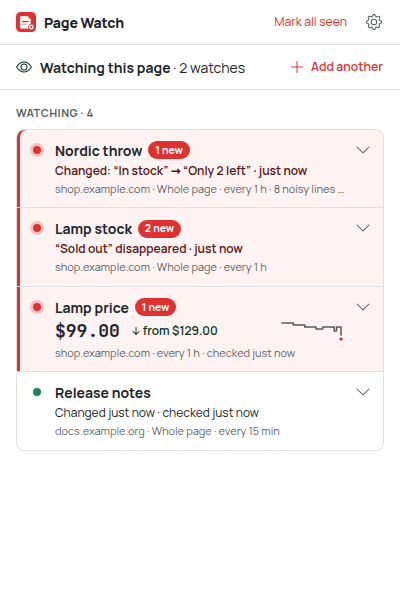 | 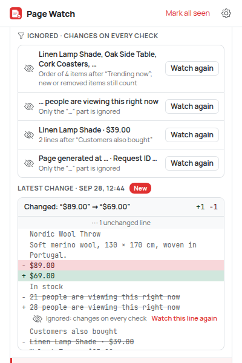 | 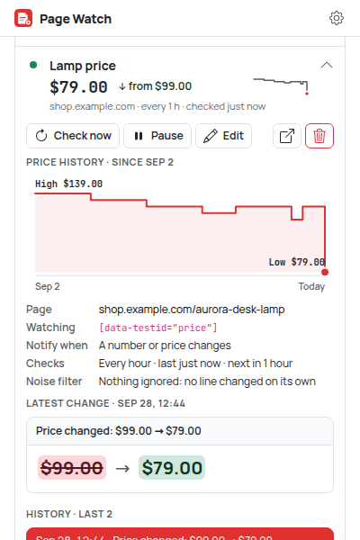 | 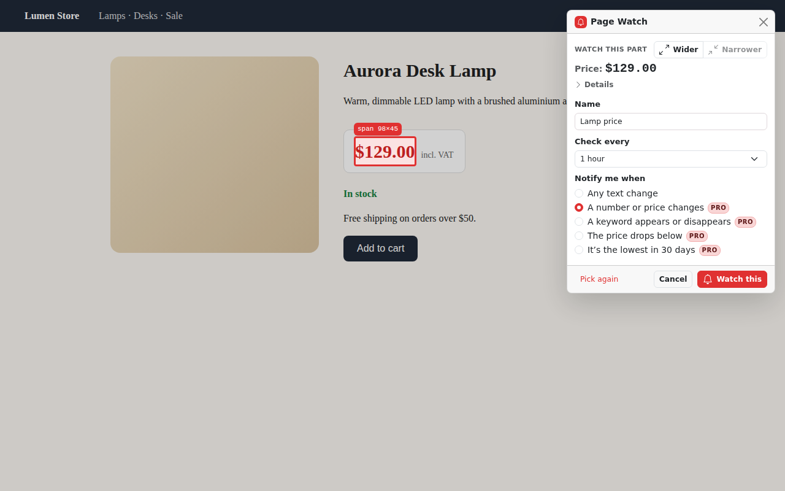 |

## How to use

1. **Install it.** Build it and load `dist/` as an unpacked extension (see
   [Load the extension in Chrome](#load-the-extension-in-chrome)). Pin the Page Watch icon to the
   toolbar so the badge is visible.
2. **Open the page you want to follow** in a tab, for example a product page.
3. **Click the Page Watch icon.** The popup shows the current tab with two choices (if you
   already watch this page it's a single line, *Watching this page · 2 watches*, and **Add
   another** brings the choices back):
   - **Watch this page** watches all the text on the page. Fill in the form:
     - *Name*: defaults to the page title.
     - *Check every*: 1 h, 6 h or 24 h; with Pro also 1, 5, 15 or 30 min (shown greyed out with
       a `PRO` marker on the free plan).
     - *Notify me when*: any text changes; with Pro also a number or price changes, a keyword
       appears or disappears (type the keyword, e.g. `In stock`), **the price drops below** a
       target (type it, e.g. `99.99`, `$100` or `1 500 грн`), or **it's the lowest in 30 days**.
       Rules marked `PRO` can't be picked on the free plan.

     Then click **Start watching**.
   - **Pick an element…** watches just one part of the page (a price, a stock label, a list).
     The popup closes and the page shows the picker:
     - Move the mouse: the element under it is outlined, with its size.
     - Click the part you want. The page doesn't react to clicks while you pick.
     - The card says what you picked in plain words (`Price: $129.00`, `Text: In stock`,
       `Section: 5 lines`), with the full text when there's more. The CSS selector, element and
       size are under **Details**.
     - Adjust the choice with **Wider** / **Narrower**, set name, interval and rule (with Pro, a
       short region with a number preselects "a number or price changes"), then click
       **Watch this**.
     - Keyboard only: <kbd>↑</kbd> wider, <kbd>↓</kbd> narrower, <kbd>←</kbd>/<kbd>→</kbd>
       neighbours, <kbd>Enter</kbd> select, <kbd>Esc</kbd> cancel.
4. **Allow access when Chrome asks.** Page Watch asks for access to that one site (for example
   `https://shop.example.com`) the moment you add a watch, and only uses it to fetch the pages you
   watch there. If you decline, nothing is saved and the popup explains why.
5. **Page Watch checks the page right away** to make sure it can see what you picked, then on your
   schedule. If the page only shows its content after JavaScript runs, it tells you so instead of
   saving a watch that would never work. **A few seconds later it takes a second look** (the
   noise filter, see [below](#noise-filter)); you don't wait for it.
6. **When something changes** (by your rule), you get a notification. Click it to open the page;
   the change is then marked as seen. The number on the toolbar icon counts changes you haven't
   looked at yet.
7. **Open the popup to review.** Watches with news are highlighted. Each row leads with what it
   has to say (the latest change, or for number and price watches the value: `$99.00 ↓ from
   $129.00` with a small trend line); the site, type, interval and ignored lines come second.
   Click one to see the change and the last 10 changes, and to **Check now**,
   **Pause**/**Resume**, **Edit**, open the page, or delete it (click the trash icon, then
   **Confirm delete**). Short parts (a price, a label) show a large word-level `before → after`;
   longer ones a line diff (added lines green, removed lines red, ignored ones greyed). Number and
   price watches also show a **chart of their value** (high, low, dates; hover or use the arrow
   keys to read each check). Problems (server errors, the element disappearing, lost site access)
   are shown on the watch with what to do about them.
8. **Settings** (gear icon): turn change or error notifications on or off, turn on the **sound**
   (off by default; *Play a test sound* to hear it), set **quiet hours** (Pro), choose the default
   interval, see or remove the sites Page Watch can access, **export or import** your watches,
   and read **About Pro**. While sounds are on, each watch has a speaker button in the popup to
   mute just that one.
9. **Quiet hours** (Pro): in Settings, turn on *Hold notifications during quiet hours* and choose
   the hours (e.g. 22:00 to 07:00, this computer's time). Checks keep running and the badge keeps
   counting, but no notification pops up. When the quiet hours end (or you turn them off) you get
   **one summary notification** ("3 changes and 1 problem on 2 watches", one line per watch).
   Changes you already looked at in the popup and problems that fixed themselves are left out.
10. **Export and import** (Settings): *Export watches* downloads `page-watch-<date>.json` with
    each watch's page, element, rule, interval and sound setting (no page text or history).
    *Import…* reads such a file (or a plain array of watches), checks every entry and shows what
    it will do before anything is added: new watches and their sites, ones you already have (same
    page and element, left out), invalid entries with the reason, and on the free plan the ones
    set to free options or over the limit. **Import** asks Chrome for access to the new sites,
    adds the watches and says what happened ("Added 3 watches. 1 was already watched…"). Each
    imported watch takes its starting point with a first check right away, then learns its
    noise like a new one.

### Noise filter

Pages change on every visit without anything really changing: "Updated 14:05:32", "12 people are
viewing this", a request id in the footer, "Customers also bought" rotating, a "Trending" list in
a new order. Page Watch learns those automatically, per watch:

1. When you add a watch it saves the page as usual, then fetches it again a few seconds later
   (10 s requested; Chrome runs it after about 30 s at the earliest). Whatever differs between
   the two is noise.
2. It learns it as narrowly as it can:
   - **part of a line**: only the changing part, found by the words around it
     (`… people are viewing this`, `Page generated at … · Request ID …`); the rest of the line
     is still compared, so a price on the same line still alerts;
   - **a block**: lines between two unchanged lines that appear once on the page (rotating
     recommendations with their prices), used when the lines have too little in common;
   - **a list's order**: items that only moved; a new or removed item still counts.
   It never learns the whole page, and never a bare value like `$…` that could match the price
   you care about.
3. The next 3 checks confirm it: a rule that doesn't fire again was a one-off change and is
   dropped (that line is watched as usual again).

The row says `2 noisy lines ignored`. Expand the watch to see them under *Ignored · changes on
every check*, each with **Watch again**. In a change's diff, ignored lines are greyed with
"Ignored: changes on every check" and **Watch this line again**. Keyword, number and price rules
read the page with the noise masked too (a "Sold out" in a rotating recommendation isn't your
product selling out).

Limits: noise that changes slower than the few seconds between the two fetches (a clock with
minutes, "5 minutes ago") isn't learned, since it can't be told apart from a real change at that
point; watch an element instead, or use a number/keyword rule. Watches created before this
version have no learned noise.

### Price and number history

Number and price watches (the number, price, "drops below" and "lowest in 30 days" rules, and
picked elements that are just a short value like `$129.00`) record the value on every check, up
to 500 points (a value that stays the same only moves the end of its run, so months of hourly
checks fit). The popup row shows it large with where it came from and a sparkline of the last 30
checks; the expanded watch shows a chart with the high, the low and the dates. Free shows the
last 7 days in the chart (older points are kept, not deleted); Pro shows the full history.

**It's the lowest in 30 days** (Pro) notifies when a check sees a value lower than every value
checked in the last 30 days: `Lowest in 30 days: $72.00 (was $75.00)`. While the history is
younger than 30 days it says so: `Lowest since Sep 20: …`. Equal isn't lower; going back up is
quiet.
### What counts as a change

| Rule | Notifies when | Good for |
| --- | --- | --- |
| Any text change | the watched text differs in any way | docs, announcements, small regions |
| A number or price changes (Pro) | a number or price in the region changes; wording changes are ignored | prices, counts, rates |
| A keyword appears or disappears (Pro) | the keyword (case-insensitive) shows up or goes away | "In stock", "Sold out", "Applications open" |
| The price drops below (Pro) | the price goes from at or above your target to below it | "tell me when it's under $100" |
| It's the lowest in 30 days (Pro) | the value is lower than every value checked in the last 30 days | "tell me when it's a real deal" |

Summaries look like `Price changed: $129.00 → $99.00`, `“Sold out” appeared`,
`Changed: “Out of stock” → “In stock”`, `Price dropped below $100: $109.00 → $95.00` or
`+3 lines, −1 line`.

**How "the price drops below" reads prices.** It follows the *first* price in the watched part, so
pick the price element rather than the whole page. Grouping and decimal separators are read in any
common style (`$1,299.00`, `1.299,00 €`, `1 299,50 ₴` are all 1299), and three digits after a single
separator count as thousands (`1,299` is 1299, `12,50` is 12.5). Currencies are recognized from
symbols and codes (`$`, `US$`, `C$`, `€`, `£`, `₴`/`грн`, `zł`, `USD`, `EUR`…). If your target
has a currency (`$100`), only prices in that currency count; without one (`100`), the first price
in any currency does, and plain numbers are used only when the region has no price with a
currency. You're notified once when it crosses below the target; further drops stay quiet until it
goes back up. When you add the watch, Page Watch tells you the price it found (or that it's already
below), and refuses to save if it can't find a price there.

## Free vs Pro

Free is a complete page watcher; Pro is for people who watch many pages or need answers fast.

| | Free | Pro ($3.99 one-time) |
| --- | --- | --- |
| Watches | 3 | Unlimited (up to 100, a storage safety limit) |
| Check every | 1 h, 6 h, 24 h | also 1, 5, 15, 30 min |
| Rules | Any text change | also number/price, keyword, **the price drops below**, **lowest in 30 days** |
| **Noise filter** (learned, with Watch again) | ✓ | ✓ |
| Value row and sparkline for number/price watches | ✓ | ✓ |
| Price/number chart | last 7 days | full history (up to 500 checks) |
| Sound with notifications (per watch) | ✓ | ✓ |
| Export / import (JSON) | ✓ | ✓ |
| Quiet hours | – | Hold notifications, one summary afterwards |
| Element picker, diffs, change history, badge, errors, privacy | ✓ | ✓ |

**Early access:** payments aren't set up yet, so every Pro feature is currently on for everyone
(`EARLY_ACCESS = true` in `src/core/plan.ts`). Settings → **About Pro** lists the Pro features and
the price; its *Get Pro* button is disabled and says "Free during early access".

On the free plan nothing you set up is taken away: watches over the limit keep working (only
adding a new one is blocked, with a calm "Free keeps 3 watches. Pro removes the limit." and a link
to About Pro), and a watch that already uses a Pro rule or a faster interval keeps it, including
when you edit its name. Only *new* Pro choices need Pro. Quiet hours are ignored on free
(notifications show right away). On free the chart shows the last 7 days; the older values stay
stored and reappear with Pro. Imported watches that use a Pro rule or interval are set to free
options (and the import summary says so).

## Screenshots

Generated by the e2e test (`SCREENSHOTS=1 npm run test:e2e`), light and dark.

| | Light | Dark |
| --- | --- | --- |
| Empty state | 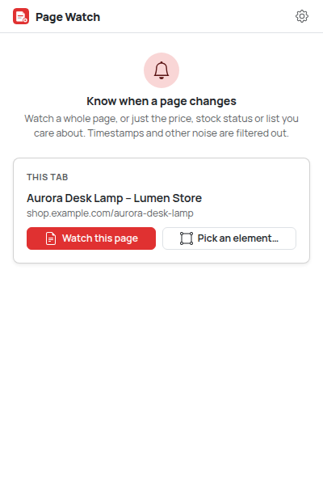 | 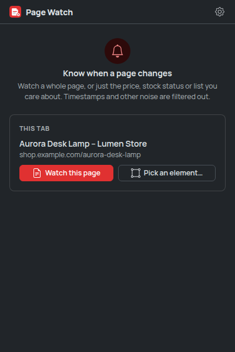 |
| Adding a whole page | 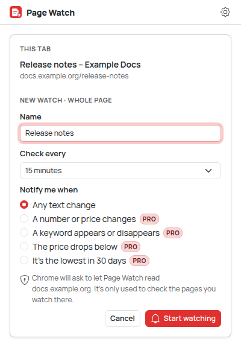 | 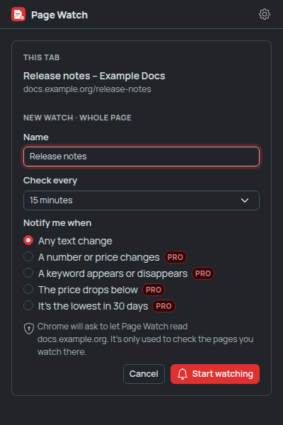 |
| Watches with unseen changes (value-first rows, one-line tab block) |  | 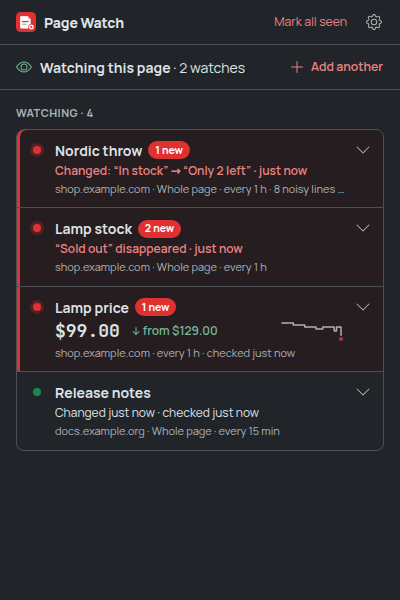 |
| Noise filter: ignored lines, greyed in the diff |  | 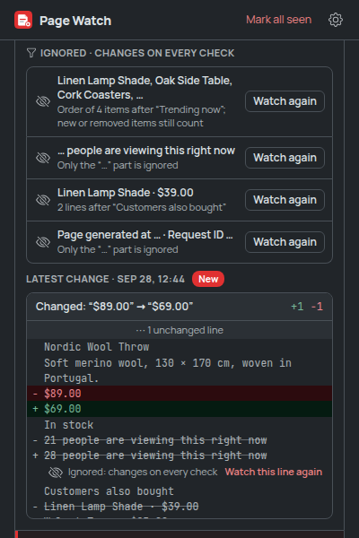 |
| Price history and a large before → after |  | 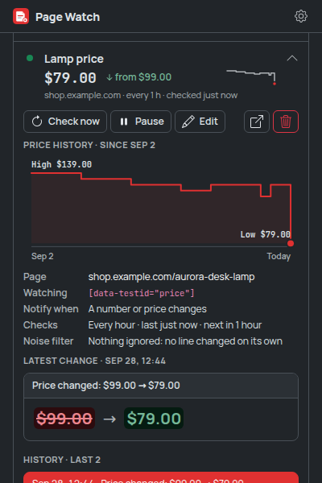 |
| Diff viewer (whole page) | 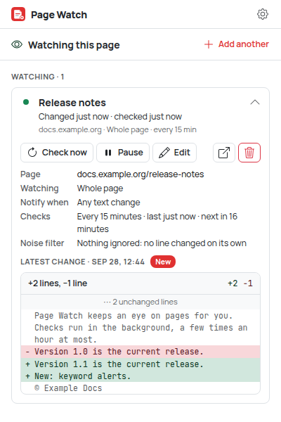 | 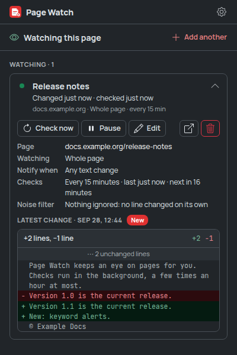 |
| Error state (HTTP 500) | 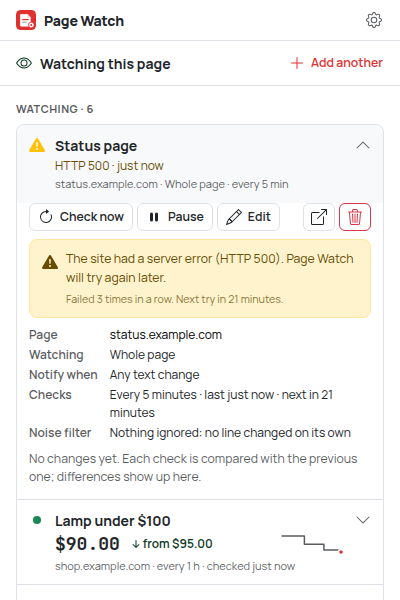 | 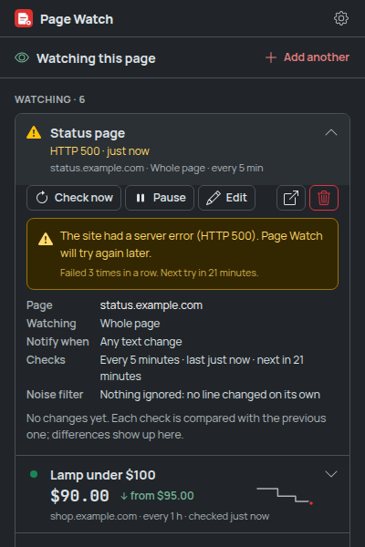 |
| JavaScript-rendered page | 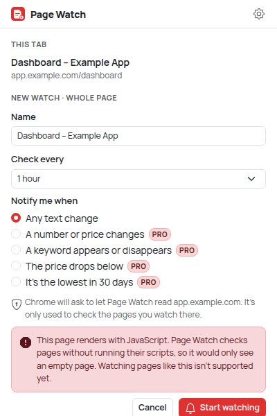 | 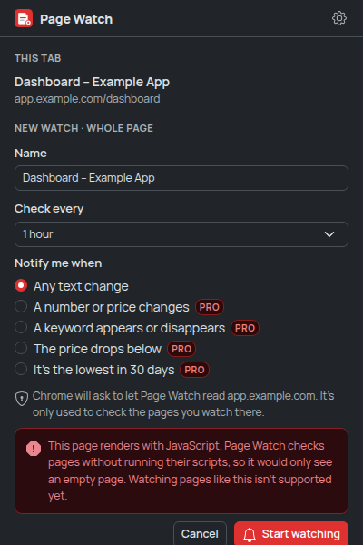 |
| Picker: hovering | 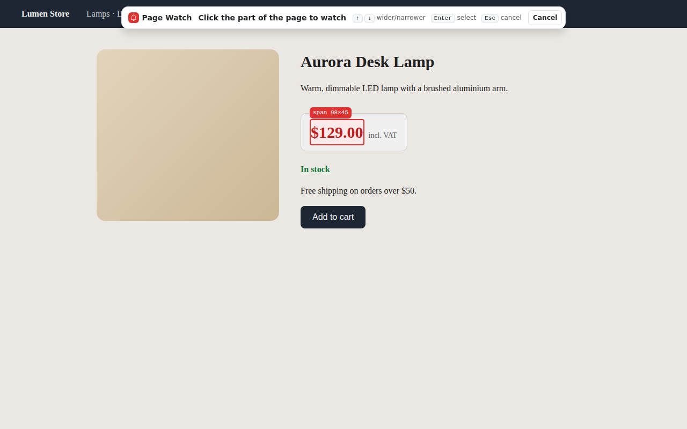 | 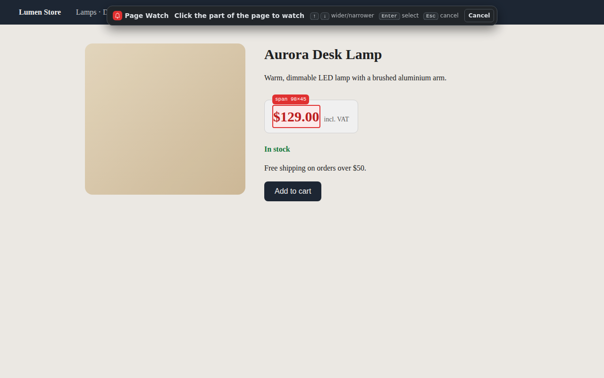 |
| Picker: confirm |  | 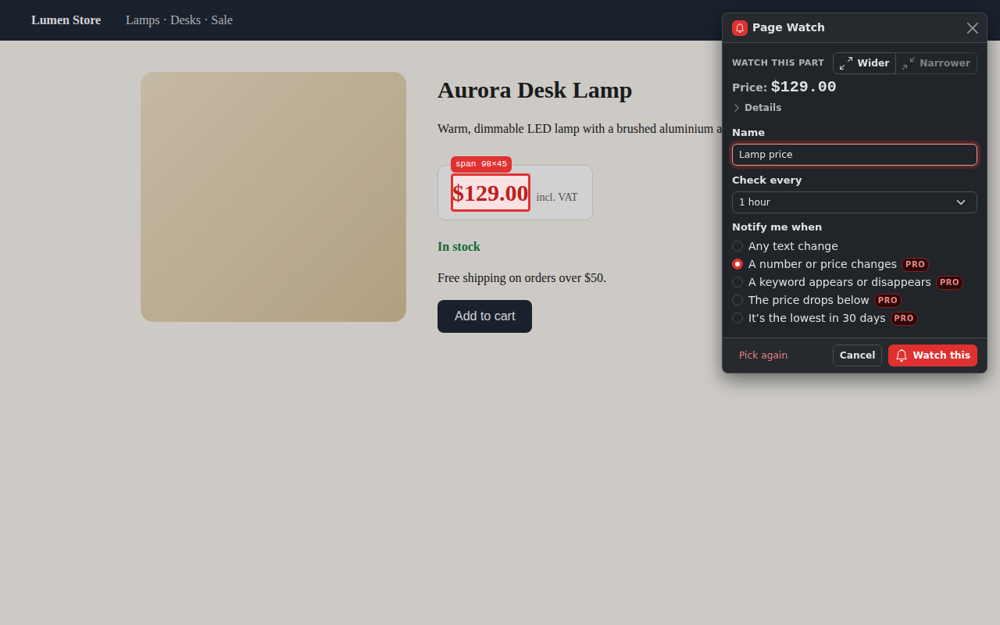 |
| Adding a price watch (Pro rule) | 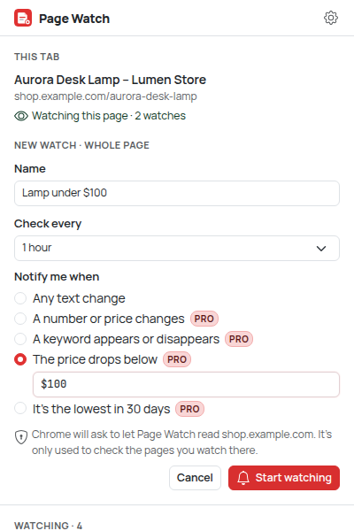 | 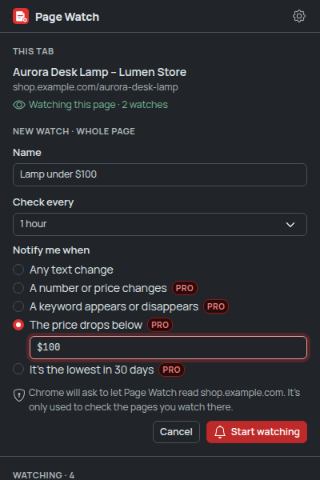 |
| Free plan at its limit | 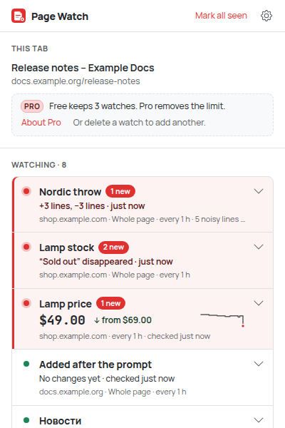 | 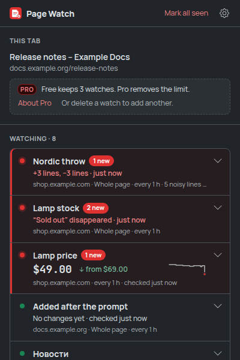 |
| Free plan: editing (Pro choices locked) | 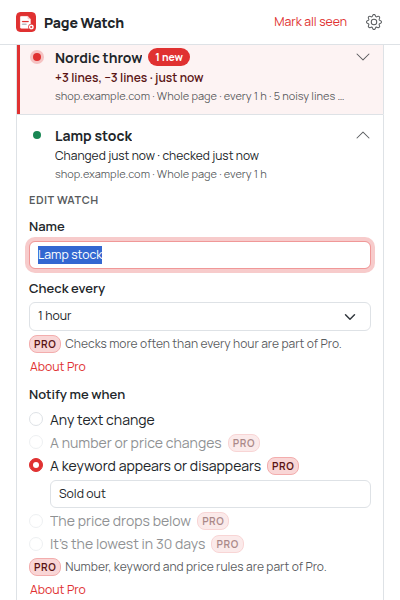 | 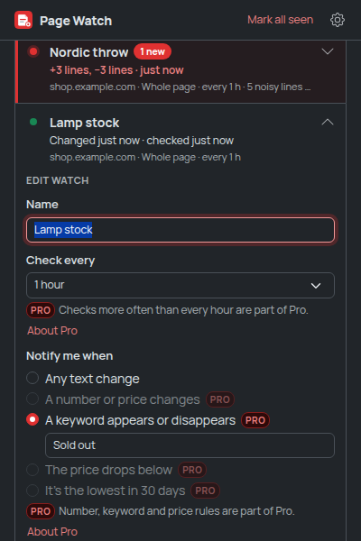 |
| Settings (sound, quiet hours, site access, export/import, About Pro) | 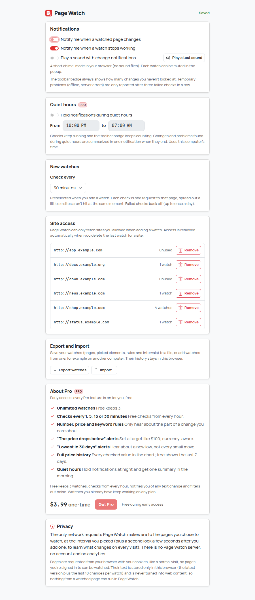 | 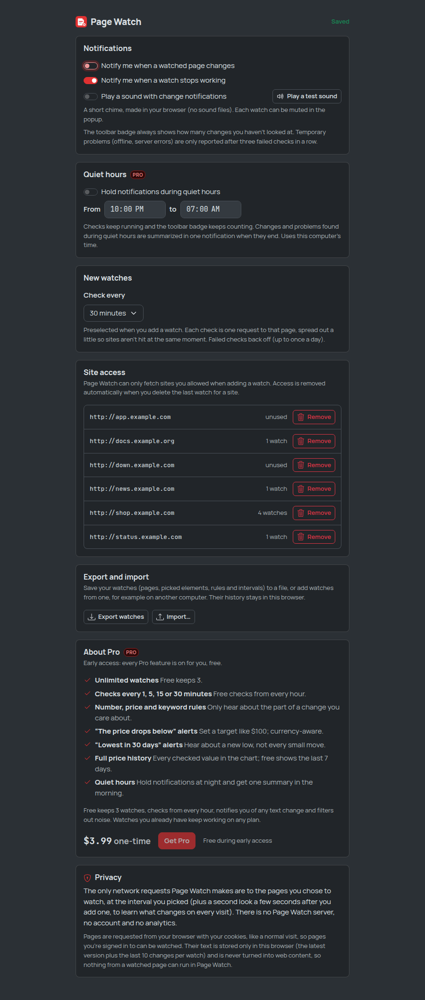 |
| Import preview with a merge summary | 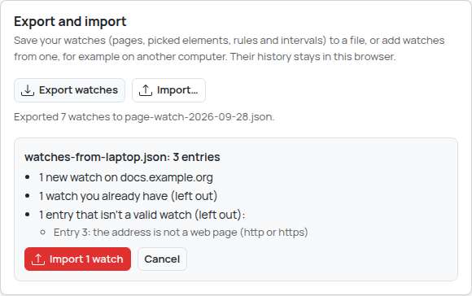 | 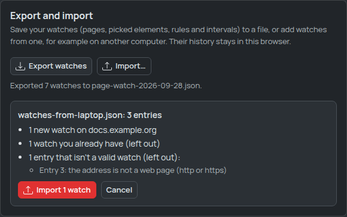 |

The e2e test serves its fixture pages as `shop.example.com`, `docs.example.org` and so on (Chromium
maps those names to a local server). The price chart's earlier weeks are seeded test data; every
other value comes from real checks.

## Privacy

**The only network requests Page Watch makes are to the pages you chose to watch**, at the
interval you picked (plus one when you add a watch, a second look a few seconds later for the
noise filter, and one when you press Check now). There is no Page Watch server, no account, no
analytics and no third-party code; fonts and icons are bundled and the chime is synthesized.
See [PRIVACY.md](PRIVACY.md) for every storage key.

- Pages are requested from your browser with your cookies, like a normal visit, so pages you're
  signed in to can be watched where Chrome allows it.
- Only text is kept, in `chrome.storage.local` in this browser: the latest version of each watched
  page or element, its last 10 changes, the lines its noise filter ignores and, for number and
  price watches, the value of each check. Nothing is synced. Exports contain settings only.
- Fetched pages are parsed with `DOMParser`, which never runs their scripts or loads their
  resources, and their text is only ever shown as text. Nothing from a watched page can run in the
  extension.
- Site access is per site and optional. It's removed automatically when you delete the last watch
  for a site (or cancel the picker without saving), and can be removed any time in Settings or
  Chrome's extension settings.

### Permissions

| Permission | Why |
| --- | --- |
| `optional_host_permissions` (`https://*/*`, `http://*/*`) | Declared as *optional*: Page Watch has access to no site by default. When you add a watch it asks for that one site (`https://shop.example.com/*`) so it can fetch the page in the background. |
| `storage` | Your watches, their latest text and last changes, learned noise filters, value history, settings, the plan, and notifications held during quiet hours, in this browser only |
| `alarms` | One alarm per watch schedules its next check (plus a one-off for the noise filter's second look after adding, and one for the end of quiet hours); alarms survive the service worker going to sleep and waking up |
| `notifications` | The "something changed" (and optional "watch stopped working") notifications |
| `offscreen` | One hidden document, created with two reasons: `DOM_PARSER` to parse fetched HTML with `DOMParser` (the service worker has no DOM), and `AUDIO_PLAYBACK` to play the optional chime (WebAudio, no audio files). Chrome allows one offscreen document per extension, so both jobs share it; it's closed when no check is running |
| `activeTab` | When you click the toolbar icon: read the current tab's title, URL and visible text (to detect JavaScript-rendered pages) and inject the picker, without access to all tabs |
| `scripting` | Inject the element picker and read the page text, on demand only (no content scripts run on pages you visit) |

## How checking works

- **Scheduling.** Each active watch has its own `chrome.alarms` alarm for its next check. After a
  check the next one is set to the interval ±10% jitter (at least 30 seconds, Chrome's minimum
  since version 120, which is why `minimum_chrome_version` is 120: 1-minute checks with jitter
  and the noise filter's quick second look need it), so watches added together don't fire
  together. On browser start (and install/update) alarms are reconciled: missing ones are
  recreated, overdue checks are spread over the next few minutes.
- **Politeness.** At most **2 pages are fetched at once**, globally; a watch already being checked
  isn't queued twice. Failed checks back off: the interval doubles with each consecutive failure
  (capped at a day), and a `Retry-After` header is respected.
- **Fetching.** `fetch` from the service worker with `credentials: 'include'`, redirects followed,
  no cache, a 20-second timeout (`AbortController`) and a 5 MB cap. Only HTML (or plain text, for
  whole-page watches) is accepted. The charset comes from the byte-order mark, the `Content-Type`
  header or a `<meta charset>`, so legacy encodings (e.g. windows-1251) decode correctly.
- **Extracting.** In the offscreen document, `DOMParser` builds the page, the selector (or `body`)
  picks the region, and the text is extracted with scripts, styles, templates, `noscript`, SVG,
  form fields and elements hidden by markup (`hidden`, `aria-hidden`, inline `display:none` /
  `visibility:hidden`, closed dialogs) left out. Blocks become lines, table rows become
  `cell | cell`, whitespace is normalized. Snapshots are capped at 100,000 characters.
- **Comparing.** The noise filter masks what it explains (see [Noise filter](#noise-filter)), then
  a line diff (Myers' algorithm, after trimming the common prefix and suffix) is computed and the
  rule decides whether it counts. Lines explained by the noise filter stay in the diff, marked
  ignored. The baseline moves forward either way, so the
  next diff only shows what's new. Diffs are stored folded (changed lines with 2 lines of
  context, at most 80 changed lines).
- **Errors** are shown on the watch: offline, unreachable, timeout, HTTP status (with advice for
  401/403, 404, 429, 5xx), not a web page, too large, **the picked element no longer on the page**,
  **site access removed** (with an "Allow access" button), and pages that suddenly come back almost
  empty (a bot wall or a switch to client-side rendering). Temporary problems notify only after 3
  failures in a row; the others notify right away (both can be turned off).

### Picking a good selector

The picker builds several candidate selectors, most robust first, and only keeps those that match
exactly the picked element on the live page: a stable `id`, then test/automation attributes
(`data-testid`, `data-test`, `data-qa`, `data-cy`, …, `itemprop`, `name`), then the shortest path
from the nearest such anchor using meaningful class names, and finally a positional path.
Generated names are skipped: CSS-in-JS and CSS-module hashes (`css-1x2y3z`, `sc-bdVaJa`,
`Price_price__Xy1Z2`), atomic classes (`x1n2onr6`), framework ids (`:r1:`, `ember123`) and state
classes (`active`, `is-open`). When the watch is saved, the fetched HTML decides: the first
candidate that finds the same text there wins.

### JavaScript-rendered pages

Background checks read the page's HTML without running it. When a watch is added, Page Watch
compares that HTML with what the tab shows. If the picked element isn't in the HTML, is empty
there, or shows different content, or the whole page's HTML is (nearly) empty compared to the tab,
it says "This page renders with JavaScript… Watching pages like this isn't supported yet" and saves
nothing. There is no headless-tab renderer.

## Known limitations

- Pages that render with JavaScript (single-page apps, many dashboards) can't be watched, see
  above. Parts of a server-rendered page that JavaScript updates later are seen as the server sent
  them.
- Signed-in pages work only where Chrome sends your cookies with the extension's request.
  Third-party cookie blocking or `SameSite` rules can make the site see a signed-out visit; the
  watch then shows the signed-out version or an HTTP 401/403 with advice. Not verified against real
  sites (the test environment has no internet access).
- Text hidden only by the site's stylesheets (not by markup) is included, because the parser has
  no layout. The noise filter takes care of most content that changes on every visit; what it
  can't learn (see its limits) is best avoided by watching an element or using a number or
  keyword rule.
- Elements inside iframes or inside a page's own shadow DOM can't be picked individually (the
  picker selects the surrounding element in the main page).
- A redirect to a different site that Page Watch has no access to fails as "Couldn't reach the
  site".
- Checks only run while Chrome is running; Chrome may delay alarms slightly. 1-minute checks
  depend on Chrome keeping that pace for a packed extension (30-second alarm minimum); verified
  only in the unpacked test build, where Chrome applies no minimum.
- The noise filter only learns what changes within the few seconds between its two fetches (see
  [Noise filter](#noise-filter)). Its rules match text: if a site rewords a noisy line, the new
  wording is watched as usual. It's tested on fixture pages that imitate real ones (counters,
  timestamps, request ids, rotating recommendations, shuffled lists); **unverified on real
  sites**.
- The sound plays from the offscreen document; it was checked in headless Chromium (the audio
  context runs), not heard on real speakers. If the OS or Chrome mutes the extension, only the
  sound is lost. Quiet hours use this
  computer's clock; if Chrome is closed when they end, the summary comes when it starts again.
- "The price drops below" follows the first price in the watched part. Pages that show several
  prices in the same currency (old and new price, per-unit prices) need the right element picked.
  Amounts like `1.299` are read as thousands; a price written with three decimals would be misread.
- There is no payment flow yet: the plan is always the stored `free` unless a future payments
  adapter sets `pro`, and early access currently unlocks everything.
- Storage is `chrome.storage.local` without `unlimitedStorage` (10 MB). Limits keep it bounded
  (100 watches, 100,000 characters per snapshot, 10 changes per watch); if it still fills up,
  fewer old changes are kept and the watch says storage is full.
- Import asks for access to all the new sites in one prompt; if you decline, nothing is imported.
- On some platforms Chrome's permission prompt closes the popup. Page Watch remembers the pending
  add and finishes it when access is granted (the picker opens, or a "Now watching" notification
  appears). This fallback is covered by the e2e test through the same event handler, but the real
  prompt can't be clicked in automation, so it hasn't been seen on a real macOS/Windows popup.

## Development

Requires Node.js 22.12+ (vitest 5).

```bash
npm install
npm run build        # production build -> dist/
npm run dev          # rebuild on change (with source maps) -> dist/
npm run typecheck
npm test             # unit tests (vitest; DOM tests use happy-dom)
npm run check        # typecheck + unit tests + build
npm run test:e2e     # builds dist/ and dist-e2e/, drives dist-e2e/ in real Chromium
SCREENSHOTS=1 npm run test:e2e   # also refreshes screenshots/
```

`test:e2e` needs a Chromium build. It's auto-detected in some environments; otherwise set
`CHROMIUM_PATH=/path/to/chromium`. All screenshots go to `e2e/output/` (git-ignored); with
`SCREENSHOTS=1` the curated ones are copied to `screenshots/`. After changing
`static/icons/icon.svg`, run `CHROMIUM_PATH=… node scripts/make-icons.mjs` and commit the PNGs.

The e2e suite runs a local HTTP server whose pages it changes between checks, served to Chromium
under realistic host names (`shop.example.com`, `docs.example.org`, `status.example.com`,
`app.example.com`, `news.example.com`; `down.example.com` maps to a closed port and
`private.example.net` stands for a site without access) with `--host-resolver-rules`, so no
screenshot shows `127.0.0.1` or a port. It covers: the noise filter (learning from the second
fetch, fired by the test and once by the real alarm; noise-only checks stay quiet; a real change
still notifies with the noise greyed; confirmation; Watch again from the list and from a diff),
value-first rows, the price chart (labels, keyboard and pointer readout, the free 7-day window),
the "lowest in 30 days" rule, the sound (off by default, played by the offscreen document when on,
muted per watch), 1-minute intervals, export and import (download content, invalid files,
preview, merge summary, first check and learning of imported watches), the one-line tab block,
the picker's plain-words summary and Details, the word-level diff; and adding
whole-page and element watches (driving the picker with the mouse and keyboard), no-change and
change detection with the diff, number and keyword rules, notifications and the badge, notification
clicks, the "price drops below" rule added from the popup (validation, currency, "already
below"), quiet hours (held while checks run, summary when they end), the free plan (limit message,
locked Pro choices in the add/edit forms and the picker, service-worker enforcement, existing watches
kept working, About Pro), HTTP 500 with backoff and recovery, element-not-found, timeouts, non-HTML, 404, refused
connections, JavaScript-rendered pages (page and element), a denied permission, lost site access,
redirects, windows-1251 decoding, pause/resume/edit/delete, alarms and the 2-fetch concurrency
limit, settings, the permission-prompt fallback, startup alarm reconciliation, "no request to other
hosts", and a real service worker restart (stopped via `chrome://serviceworker-internals`).

Automation can't click native permission prompts or notifications or fast-forward alarms, so the
e2e build (`dist-e2e/`) differs from `dist/` in these ways: it is granted the test sites up
front, the service worker exposes the handlers Chrome would call (`__pageWatchTest`, including
`setLearnDelay` so the tests fire the noise filter's second look themselves, and the log of
played chimes; the popup also accepts `?tab=` and `?deny=` and marks when it has read the tab's
text), and early access can be switched off through a storage key (`e2e:earlyAccess`) to test the
free plan. All are guarded by `__E2E__` and compiled out of `dist/`; the first e2e test checks
that.

### Load the extension in Chrome

1. `npm install`
2. `npm run build`
3. Open `chrome://extensions`
4. Turn on **Developer mode** (top right)
5. Click **Load unpacked**
6. Select the `dist/` directory

After a rebuild, press the reload icon on the Page Watch card in `chrome://extensions`.

### Packaging for the Chrome Web Store

`dist/` is the complete extension: no source maps, no test code, unminified identifiers so review
is easy. `npm run package` runs the type check and unit tests, builds, checks the manifest and
every referenced file, and writes a deterministic `release/page-watch-<version>.zip`. The listing
text, permission justifications and graphics are in [`store/`](store) (`node
scripts/store-assets.mjs` renders the graphics from `screenshots/`); the privacy policy is
[PRIVACY.md](PRIVACY.md).

## Project structure

```
src/
  core/         Pure logic, no Chrome APIs: text extraction and normalization, Myers diff,
                change rules and summaries, number/price parsing, selector generation, watch
                model (sanitizing, applying check results, backoff), creation checks
                (JavaScript-rendered detection), concurrency limiter, charset decoding,
                plan.ts (Free vs Pro: hasFeature, limitsFor, EARLY_ACCESS), quiet.ts (quiet
                hours and the held-notification summary), noise.ts (the noise filter: learning,
                masking, diff annotation), history.ts (value history, 30-day lows, chart
                geometry), words.ts (tokens, word diffs), describe.ts (the picker's plain
                words), transfer.ts (export/import validation and merge)
  background/   Service worker: alarms, fetching, checks, notifications and badge,
                permissions, message handling
  offscreen/    Offscreen document: parses fetched HTML with DOMParser, plays the chime
  content/      Element picker (shadow DOM), injected only when you pick an element
  popup/        Toolbar popup: current tab, add form, watch list, diff viewer
  options/      Settings page
  platform/     Messages between contexts
  storage/      chrome.storage wrappers (serialized writes, sanitized reads)
  styles/       Sass: Bootstrap 5.3 subset + theme (popup, options, picker)
  ui/           DOM builder, Bootstrap Icons, formatting, the shared options form, charts
                (sparkline, history chart), the synthesized chime
static/         manifest.json, HTML, icons
test/           Unit tests (vitest)
e2e/            Chromium end-to-end test
screenshots/    Curated screenshots for this README
store/          Web Store listing, graphics config and rendered graphics
scripts/        build, icons, package (store zip), store-assets (store graphics)
```

UI: Bootstrap 5.3 compiled from Sass (only the partials used, dark mode follows the OS),
Bootstrap Icons inlined from their SVG files, Manrope and JetBrains Mono bundled (latin,
latin-ext, cyrillic). The picker's stylesheet is compiled separately with `:root` → `:host` and
`rem` → `px`, so page styles and the page's root font size can't affect it; it uses the system
font.
