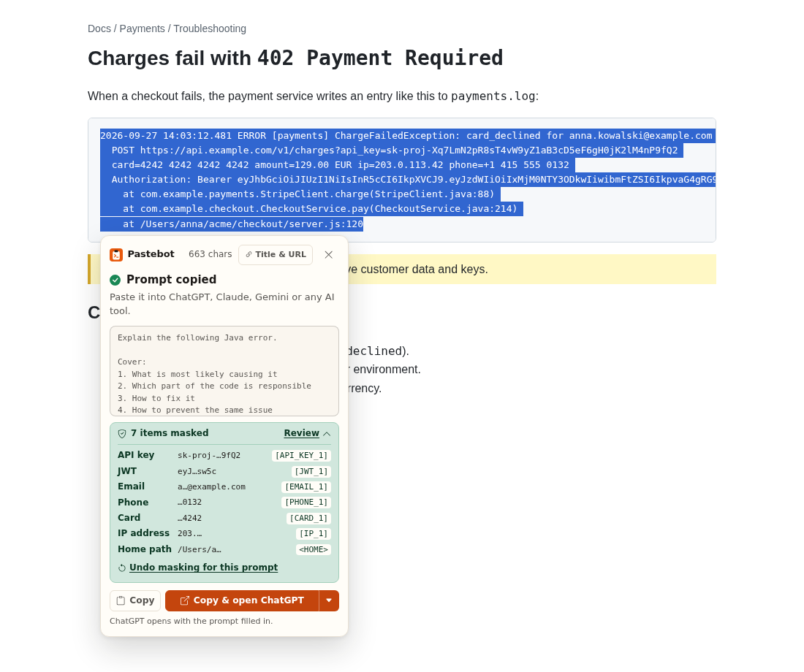
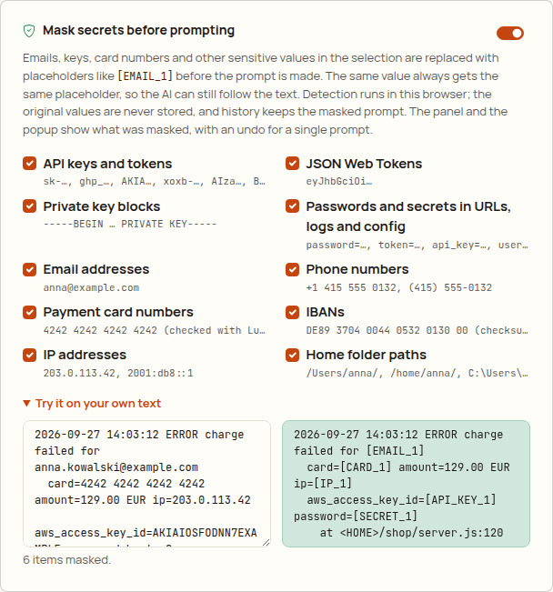
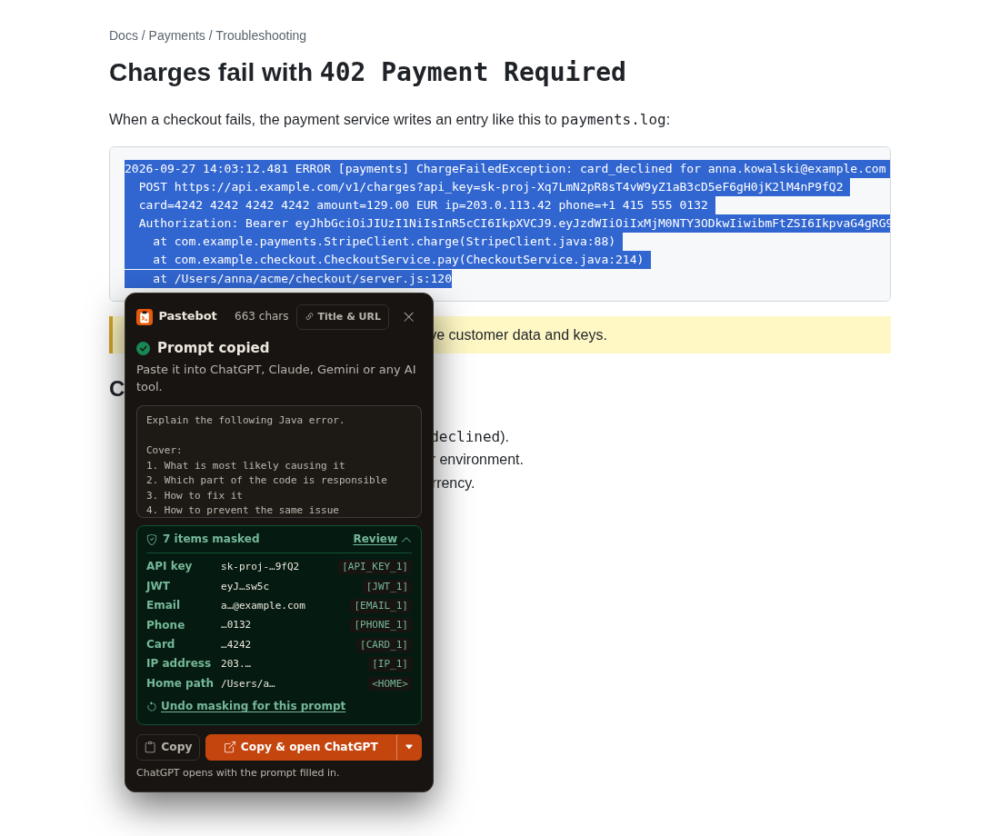
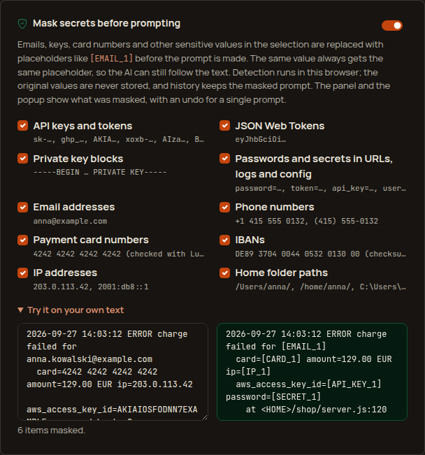

# Pastebot

Turn selected web content into ready-to-use AI prompts, with secrets masked first.

Select text → right-click → **Pastebot** → pick an action → a polished prompt is in your clipboard.
Paste it into ChatGPT, Claude, Gemini, Cursor or whatever AI tool you already use, or let Pastebot
open the AI for you (**Copy & open**).

Pastebot is not a chatbot and doesn't answer anything itself. It packages your selection and your
intent into a prompt another AI can work with. Before it does, it replaces emails, API keys, card
numbers and other sensitive values with placeholders like `[EMAIL_1]`, so a log or a support ticket
can go to an AI without leaking what's in it.

## Screenshots

| In-page panel | Prompt copied, Copy & open |
| --- | --- |
|  |  |
|  |  |

| Secrets masked in a log (Free) | Settings: what to mask |
| --- | --- |
|  |  |
|  |  |

| Popup: Compose | Popup: History search and pins (Pro) | Template editor with variables (Pro) |
| --- | --- | --- |
|  |  |  |
|  |  |  |

More: [a template asking for its variables](screenshots/variables-light.png),
[the Copy & open menu](screenshots/open-menu-light.png),
[settings with About Pro](screenshots/options-light.png) ([dark](screenshots/options-dark.png)),
[toast after a context-menu action](screenshots/toast-light.png),
[too-long selection](screenshots/too-long-light.png).
The screenshots are generated by `npm run test:e2e` on local fixture pages.

## How to use

1. **Select text** on any page: an article, an error message, a log, a code snippet, a table, a job
   post.
2. **Right-click → Pastebot**:
   - **Make Prompt…** opens a small panel next to the selection. Press `1`–`7` for an action
     (Analyze, Summarize, Explain, Extract, Compare, Rewrite, Translate), `Enter` for the
     highlighted default, or `8` for **Custom** and type your own instruction ("Turn this into an
     email to my team"). `9` runs your first template (Pro).
   - Or pick an action directly from the menu to copy the prompt without the panel. The menu names
     the Translate target ("Translate to Ukrainian").
   - Your own **custom templates** (Pro) are listed below the built-in actions, in the menu and in
     the panel.
3. The prompt is **in your clipboard**. Paste it into any AI tool, or use the split button in the
   panel: **Copy** copies it again, **Copy & open ChatGPT** copies it and opens ChatGPT in a new tab
   with the prompt filled in. `▾` switches to Perplexity, Claude or Gemini; the choice is
   remembered. The line under the button says what will happen (Claude and Gemini open empty:
   press `Ctrl+V`/`⌘V` there).

**Mask secrets before prompting** (Free, on by default):

- Before a prompt is made (panel, menu actions, shortcut and popup), Pastebot replaces sensitive
  values with placeholders: emails `[EMAIL_1]`, phone numbers `[PHONE_1]`, payment cards
  (Luhn-checked) `[CARD_1]`, IBANs (checksum-checked) `[IBAN_1]`, IPv4/IPv6 addresses `[IP_1]`, JWTs
  `[JWT_1]`, API keys by their documented formats (AWS `AKIA…`, GitHub `ghp_…`/`github_pat_…`,
  OpenAI/Anthropic `sk-…`, Stripe `sk_live_…`/`rk_live_…`/`whsec_…`, Slack `xox…`, Google `AIza…`,
  GitLab, npm, SendGrid, Hugging Face) `[API_KEY_1]`, `Bearer …`/`Authorization: Basic …` tokens
  `[TOKEN_1]`, secrets in URLs, logs and config (`password=`, `token=`, `api_key=`, `secret=`,
  quoted JSON/YAML values, `user:password@host`) `[SECRET_1]`, private key blocks
  `[PRIVATE_KEY_1]`, and home folders (`/Users/anna/`, `/home/anna/`, `C:\Users\anna\` → `<HOME>`).
- The same value always gets the same placeholder within a prompt (also across the content, the
  page title and the URL), so the AI can still follow who did what.
- The panel says what it will mask before you pick an action ("Masks 7 items: API key, JWT,
  email, …"). After the prompt is made, "7 items masked · **Review**" lists each item's category, a
  safe preview (`sk-proj-…9fQ2`, `a…@example.com`, `…4242`) and its placeholder, with **Undo masking
  for this prompt** (copies the original once, then **Mask again**). The popup shows the same review.
- Originals are never stored or logged: history keeps the masked prompt and a masked preview; an
  undone prompt is never saved, and editing it in the popup doesn't touch history.
- Settings → **Mask secrets before prompting**: turn it off, or turn single categories off. "Try
  it on your own text" runs the real masker on whatever you paste.

**Translate** (Free) is the seventh built-in action. It translates into the language chosen in
Settings → **Translate to** (default: the browser's language). Code keeps its logic and only
comments and strings are translated; tables keep their structure.

Custom templates (Pro):

1. Open **Settings** (gear icon in the popup) → **Custom templates** → **New template**.
2. Give it a name ("Email to my team") and write the instruction. The chips above the instruction
   insert variables at the cursor:
   - `{content}` (or `{selection}`) is where the selected text goes; leave it out and the text is
     added after your instruction.
   - `{title}`, `{url}` and `{date}` are filled in with the page title, its cleaned address and
     today's date (`YYYY-MM-DD`).
   - `{{Audience}}` or `{{Language=English}}` (with a default) are asked for when you run the
     template: the panel and the popup show a small form first. Templates that ask end with `…`.
   The preview shows the exact prompt on sample text and a sample page.
3. Save. The template appears right away in the right-click menu, the panel and the popup. Edit,
   reorder (↑ ↓) or delete templates on the same card; the menu follows.
4. **Export** saves your templates as a JSON file; **Import** (Pro) adds templates from one:
   same-named templates are updated in place, new ones are added, invalid ones are skipped and
   counted.

Templates go through the same generator as the built-in actions: cleanup, content detection
(code and errors are fenced), masking, prompt style and "Title & URL" all apply.

Other ways in:

- **Keyboard:** select text and press `Alt+P` (`⌘⇧P` on macOS).
- **Toolbar button:** opens the popup with two tabs, **Compose** and **History**.
  - Compose starts from the page selection when there is one, or paste text. The same numbered
    chips as the panel (`1`–`8`, `9` for the first template; numbers work when the cursor isn't in a
    text field) make and copy the prompt. The text then folds into one line (click it to edit) so
    the prompt, the masking review and the split **Copy / Copy & open** button stay in view without
    scrolling. "Title & URL" sits next to "From <page>" when the text came from a page.
  - History is one click away; its tab shows the count.
- **History** (popup): search by any word in the prompt, its page or its source (Pro), and pin the
  prompts you reuse (Pro). Pinned prompts stay on top, are never rotated out by the history size,
  and survive **Clear unpinned**; only unpinning or deleting removes them. Click a prompt to reopen
  it in Compose, ready to edit, copy or open.
- **Title & URL** (icon toggle in the panel header, next to "From" in the popup, or a switch in
  settings) adds where the text came from. Off by default.
- **Settings**: default action, Translate target, prompt style (concise / balanced / detailed),
  history size, masking, custom templates, the shortcut, and what Pro includes.

## Free vs Pro

Pastebot's core job is free. Pro is for people who use it every day.

| Free | Pro ($2.99 once) |
| --- | --- |
| All 8 actions (incl. Translate and Custom), context menu, in-page panel, shortcut, popup | Everything in Free |
| **Mask secrets before prompting**, with review and per-category settings | **Custom templates**: your own actions in the menu, panel and popup |
| **Copy & open** ChatGPT, Perplexity, Claude or Gemini | **Template variables**: `{title}`, `{url}`, `{date}`, `{{Asked}}` |
| Last 20 prompts in history | **Import** templates from JSON (export is always available for templates you have) |
| | History up to 500 prompts, **search**, **pinned** favourites |

**Right now everything is free (early access).** Payments aren't set up yet, so every Pro feature
is on for everyone. The About Pro card in settings shows the price and a disabled button that reads
"Free during early access". Pro features carry a small `PRO` badge.

When early access ends (`EARLY_ACCESS = false` in `src/core/plan.ts`), a free user sees:

- History keeps 20 prompts. Once it is full, the History tab shows one calm line ("Free keeps the
  last 20 prompts. Pro keeps up to 500, with search and pins.") with a link to About Pro. Asking for
  more than 20 in settings saves 20 and shows the same line.
- The search box is disabled; pin buttons appear only on prompts that are already pinned (so they
  can be unpinned).
- Custom templates (and with them variables) are no longer offered in the menu, panel or popup.
  They stay in settings, where they can still be read, edited, deleted and **exported**, but no new
  ones can be added or imported. Exporting stays free on purpose: it's the user's own data.
- **Nothing is ever deleted because of the plan.** If history already holds more than 20 prompts
  (from Pro), it keeps its size and rotates the oldest unpinned prompt out, instead of shrinking.
  Pins, templates and history are kept as they are. Only the user's own actions (lowering the
  history size, Clear, Delete) remove anything.

How it's wired (see [`docs/MONETIZATION.md`](../docs/MONETIZATION.md)): `src/core/plan.ts` is pure
and unit-tested (`Plan`, `ProFeature` incl. `template-variables` and `template-sharing`,
`EARLY_ACCESS`, `PRO_PRICE`, `hasFeature`, `limitsFor`, calm `limitMessage`s). The stored plan is
the `plan` key in `chrome.storage.local`, sanitized on read (anything but `'pro'` is `'free'`).
Every Pro check in the background, panel, popup and settings goes through `hasFeature` /
`limitsFor`. There's no payment code; a future `src/payments/` adapter would verify a license and
store `plan: 'pro'`, and the context menu rebuilds when it changes.

## Features

- **Context menu:** `Pastebot → Make Prompt…` opens a small panel next to the selection.
  `Analyze`, `Summarize`, `Explain`, `Extract`, `Compare`, `Rewrite` and `Translate to <language>`
  copy a prompt right away (templates with `{{variables}}` open the panel to ask first).
- **Panel:** a numbered chip grid, `1`–`7` actions, `8` Custom, `9` the first template, `Enter` the
  highlighted default, `Esc` closes (or goes back from Custom / a template form). The header shows
  the selection size and the **Title & URL** icon toggle. After copying: the prompt preview, the
  masking review and the split **Copy / Copy & open <AI> ▾** button (arrow keys, `Enter` and `Esc`
  work in its menu). The panel closes by itself after a few seconds only when nothing was masked
  and you didn't interact with it.
- **Keyboard shortcut:** `Alt+P` (Windows, Linux, ChromeOS) / `⌘⇧P` (macOS) opens the panel for
  the current selection. It can be changed at `chrome://extensions/shortcuts`.
- **UI:** Bootstrap 5.3 with a Pastebot theme, Bootstrap Icons, Manrope and JetBrains Mono (all
  bundled, nothing loaded from the web). Light and dark follow the system. The in-page panel lives
  in a shadow root, so page CSS can't break it and it can't break the page. Shared rules:
  [`docs/design-system.md`](../docs/design-system.md).
- **Content-aware templates:** errors and stack traces, source code (with a language guess), tables
  and plain text each get a fitting prompt. "Explain" on `NullPointerException at UserService.java:142`
  asks for the cause, the responsible code, the fix and prevention, for an experienced Java developer.
- **Conservative cleanup:** strips invisible characters, runs of blank lines, duplicated lines and
  UI labels ("Share", "Read more", "Copy code"...). URLs, numbers, prices, names, dates, code
  indentation and table cells are kept as is.
- **Masking** (`src/core/mask.ts`): pattern rules with validation (Luhn, IBAN mod-97 and country
  length, IPv6 structure, documented key prefixes) and guards against false positives: versions
  (`1.0.0.1`, `v2.3.4.5`), dates and times, UUIDs, order and tracking numbers, commit hashes and
  short hex, loopback/netmask addresses, `@2x.png`, package versions, `git@host`, identifiers
  (`getApiKey()`, `token: this.token`), counters (`prompt_tokens=1234`) and stand-ins
  (`${DB_PASSWORD}`, `<your token>`, `****`).
- **Popup:** Compose and History tabs, numbered chips, folding input, masking note and review, split
  Copy button.
- **Settings:** page context on/off, default action, Translate target, prompt style, history size,
  mask secrets (on/off, per category, try it), custom templates (add / edit / reorder / delete /
  import / export, variable chips, live preview), About Pro.
- **History (Pro: up to 500, search, pins):** see [Free vs Pro](#free-vs-pro).

## Privacy

Everything runs locally. Pastebot has no backend, no account, no analytics and no third-party code.
It makes no network requests of its own. Selected text only leaves your computer when you paste the
prompt somewhere yourself, or when you choose **Copy & open**.

- Nothing is read from a page until you invoke Pastebot on it (context menu, shortcut or toolbar
  button). It uses `activeTab`, not access to all sites.
- Only the selection is read, as plain text. With "Title & URL" on, the page title and URL are added
  too. Tracking parameters (`utm_*`, `fbclid`, ...) and secret-looking ones (`token`, `session`,
  `code`, ...) are removed from the URL. Non-web URLs (`file://` etc.) are never included.
- Masking runs in the browser before the prompt exists. The original values are never stored:
  history keeps the masked prompt and a masked preview.
- **Copy & open** opens `chatgpt.com`, `www.perplexity.ai`, `claude.ai` or `gemini.google.com` in a
  new tab, from a fixed list (a page can't make Pastebot open anything else). For ChatGPT and
  Perplexity the prompt is part of the address (`?q=`), so that site receives it, as if you had
  pasted it; prompts over 6,000 characters (or 16,000 once encoded) are not put in the address and
  you paste them instead. Claude and Gemini always open empty. Masking applies before any of this.
- History and custom templates are stored in `chrome.storage.local` in this browser only. Each
  history entry keeps the prompt, the first words of the (masked) source text and the (cleaned)
  title and address of the page it came from, even when they weren't added to the prompt. History
  can be cleared or turned off.
- Full privacy policy: [`PRIVACY.md`](PRIVACY.md).
- Pro adds no network access: nothing is checked online while early access lasts.

### Permissions

No new permissions were needed for masking, Translate, variables or Copy & open
(`chrome.tabs.create` needs none; the downloaded export is a plain link with `download`).

| Permission       | Why                                                                         |
| ---------------- | --------------------------------------------------------------------------- |
| `activeTab`      | Read the selection on the current tab after you invoke Pastebot             |
| `scripting`      | Inject the selection reader and the panel on demand (no always-on scripts)  |
| `contextMenus`   | The Pastebot right-click menu                                               |
| `storage`        | Settings, custom templates and local history                                |
| `offscreen`      | A hidden document for writing to the clipboard from the background          |
| `clipboardWrite` | Put the prompt in the clipboard                                             |

## Development

Requires Node.js 22.12+ (vitest 5). Building alone works on Node 18+.

```bash
npm install
npm run build        # production build -> dist/
npm run dev          # rebuild on change (with source maps) -> dist/
npm run typecheck
npm test             # unit tests (vitest)
npm run check        # typecheck + unit tests + build
npm run test:e2e     # builds dist-e2e/ and drives it in real Chromium
npm run package      # typecheck + tests + release/pastebot-<version>.zip
```

`test:e2e` needs a Chromium build. It's auto-detected in some environments; otherwise set
`CHROMIUM_PATH=/path/to/chromium`. Fixture pages are served under realistic host names
(`news.example.com`, `qa.example.com`, `docs.example.com`, ...) mapped to a local server with
`--host-resolver-rules`, so no screenshot shows `127.0.0.1` or a port. The AI sites of Copy & open
are answered by a stub page (the test checks the address the extension opened). Debug screenshots
go to `e2e/output/` (ignored); the README screenshots in `screenshots/` are regenerated too.

### Load the extension in Chrome

1. `npm install`
2. `npm run build`
3. Open `chrome://extensions`
4. Turn on **Developer mode** (top right)
5. Click **Load unpacked**
6. Select the `dist/` directory

After a rebuild, press the reload icon on the Pastebot card in `chrome://extensions`. Tabs that
were open before the reload may need a refresh.

### Packaging for the Chrome Web Store

`npm run package` builds `dist/` and checks and zips it into `release/`. `dist/` is the complete
extension: no source maps, no test code (the e2e hook is compiled out), unminified identifiers so
review is easy. Store texts and graphics: [`store/`](store/listing.md).

## Project structure

```
src/
  core/         Pure logic, no DOM or Chrome APIs: cleanup, content detection,
                prompt generation, settings/history models, limits,
                plan.ts (Free vs Pro), customTemplates.ts (incl. import/export),
                mask.ts (secret masking), variables.ts (template variables),
                destinations.ts (Copy & open), languages.ts (Translate targets)
  templates/    One file per action. Each template describes the prompt; the
                generator handles layout and prompt style
  background/   Service worker: context menu, shortcut, prompt pipeline, clipboard, Copy & open
  content/      In-page panel (shadow DOM), injected only when invoked
  popup/        Toolbar popup
  options/      Settings page
  offscreen/    Offscreen document that writes to the clipboard
  platform/     Messages between contexts, selection reading
  storage/      chrome.storage wrappers
  ui/           DOM helpers, Bootstrap Icons, formatting, split Copy button, masking review
  styles/       Sass: Bootstrap theme, fonts, popup and options stylesheets, shared prompt tools
static/         manifest.json, HTML, icons
screenshots/    README screenshots (generated by the e2e test)
store/          Chrome Web Store listing and graphics
test/           Unit tests
e2e/            Chromium smoke test and fixture pages
```

`generatePrompt({ action, selectedText, pageContext, style, customInstruction, targetLanguage, mask, variables })`
in `src/core/generate.ts` is the single entry point for prompt generation. It's synchronous and has
no side effects, so every UI shares one implementation and it's easy to test. It cleans the text,
detects the content on the original, then masks (one `Masker` for the content, the page title/URL
and `{title}`/`{url}`), and returns the prompt with the list of masked items (previews only). A
custom template is the `custom` action with the template's instruction: the background looks the
template up by id (so the menu, the panel and the popup never send instruction text around);
`{content}` places the fenced/quoted content inside the instruction and variables are filled on
each side of it, so an answer can never move the content.

### Adding an action

1. Add the id to `PROMPT_ACTIONS` in `src/core/types.ts`.
2. Create `src/templates/<action>.ts` returning a `PromptSpec` (task, steps, guidance, output).
3. Register it in `src/templates/index.ts`.

Menus, the panel, the popup and settings pick it up automatically (the panel and the popup number
the chips in `PROMPT_ACTIONS` order).

### Limits

- Selections are capped at **100,000 characters** after cleanup (`MAX_INPUT_CHARS` in
  `src/core/limits.ts`). Longer selections get a message and a "Use first 100,000" option; nothing
  is cut silently.
- At most 1,000,000 characters are read from a page at all (`MAX_CAPTURE_CHARS`), so "select all"
  on a huge page can't flood the extension.
- History: 20 prompts on Free, up to 500 on Pro (`FREE_HISTORY_LIMIT` / `PRO_HISTORY_LIMIT` in
  `src/core/plan.ts`); the "Recent prompts to keep" setting can only lower it. Pinned prompts don't
  count against rotation. `chrome.storage.local` holds about 10 MB, so 500 very long prompts may not
  fit; when storage is full the oldest unpinned prompts are dropped instead of failing.
- Custom templates: at most 50 (`MAX_TEMPLATES`, a sanity cap for the menu, not a plan limit),
  names up to 40 characters, instructions up to 2,000, `{content}`/`{selection}` at most once, at
  most 6 different `{{variables}}` (names up to 32 characters, defaults up to 100, answers up to
  500). Import files up to 1 MB.
- Copy & open prefills the address only for prompts up to 6,000 characters and addresses up to
  16,000 characters (`MAX_PREFILL_CHARS` / `MAX_PREFILL_URL_CHARS` in `src/core/destinations.ts`).

### Known limitations

- **Unverified:** the prefill behaviour of the AI sites. `https://chatgpt.com/?q=<prompt>` and
  `https://www.perplexity.ai/search?q=<prompt>` are expected to open with the prompt filled in (and
  may send it right away), and Claude (`https://claude.ai/new`) and Gemini
  (`https://gemini.google.com/app`) to open an empty chat for pasting. The sandbox can't reach those
  sites; the e2e test only checks the exact address Pastebot opens and the clipboard. These sites can
  change or drop query prefill at any time; the prompt is always copied first, so pasting still
  works.
- Masking is pattern-based. It covers the formats listed above; it won't recognise a password in
  free text ("my password is hunter2"), names or street addresses, keys of providers without a
  documented prefix (unless they sit after a key like `api_key=`), or phone numbers in local formats
  without a label ("Phone:", "tel.") other than North American ones. Short secrets (under 3
  characters after `=`, under 4 unquoted after `:`) are left alone to avoid false positives. The
  review lets you check what was replaced; masking is a safety net, not a guarantee.
- Pages Chrome doesn't let extensions script (`chrome://`, the Chrome Web Store, the built-in PDF
  viewer) can't show the in-page panel. There Pastebot uses the text Chrome reports for the
  selection (line breaks are lost) and continues in the toolbar popup. `chrome.action.openPopup()`
  needs Chrome 127+; older versions show a badge on the toolbar icon instead.
- Selections inside cross-origin iframes fall back to the same Chrome-reported text.
- Canvas-rendered editors (e.g. Google Docs) expose no selectable text to extensions.
- `Ctrl+Shift+P` can't be the default shortcut on Windows/Linux: Chrome reserves it (as far as we
  know for "Print using system dialog") and silently refuses to assign it, which is why the default
  is `Alt+P`. `⌘⇧P` on macOS hasn't been verified on a Mac yet.
- The e2e test switches early access off through a storage key that only the e2e build reads, to
  check the free-plan behavior; the production build always uses `EARLY_ACCESS`. Real payments and
  license checks don't exist yet.
- Content detection is heuristic. When unsure it falls back to a generic prompt rather than
  guessing a wrong language.
