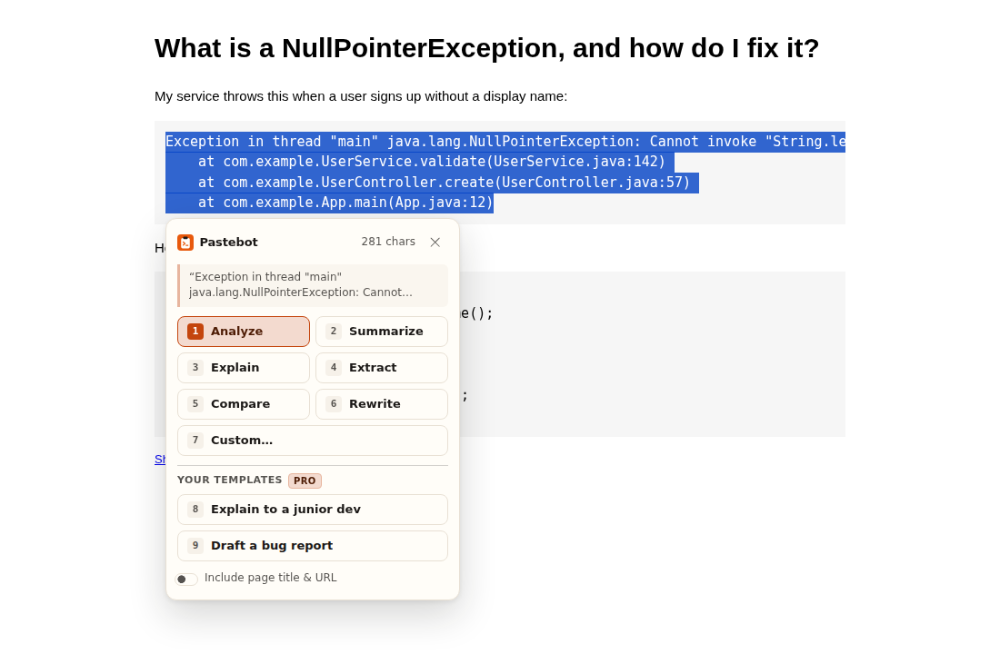
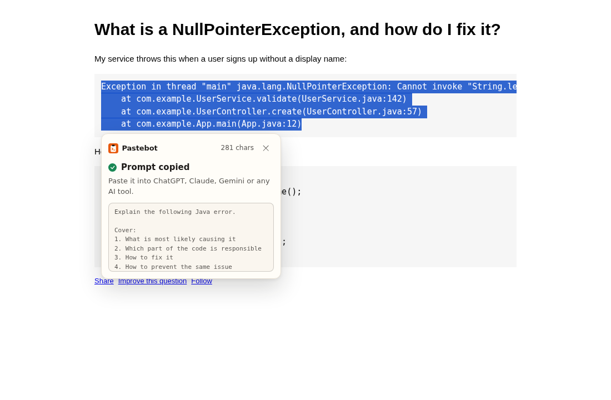
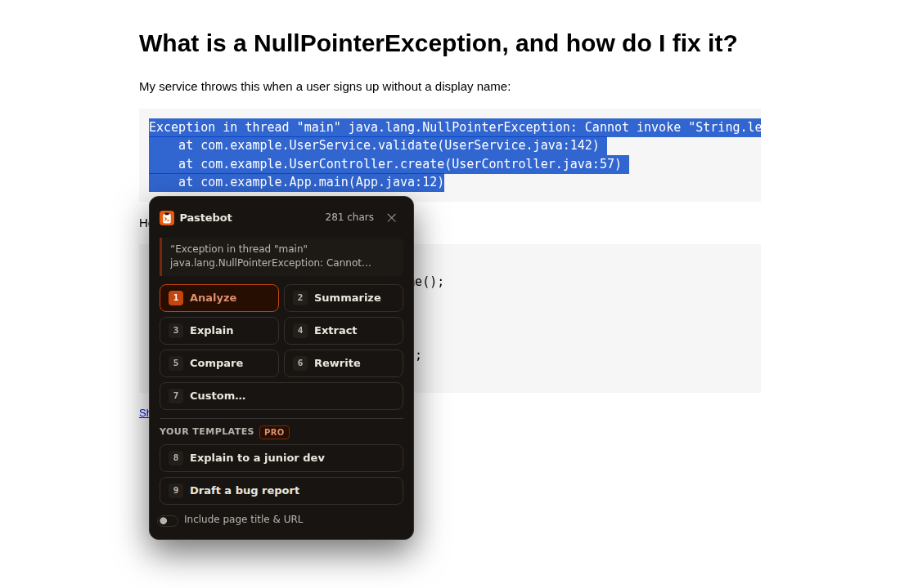
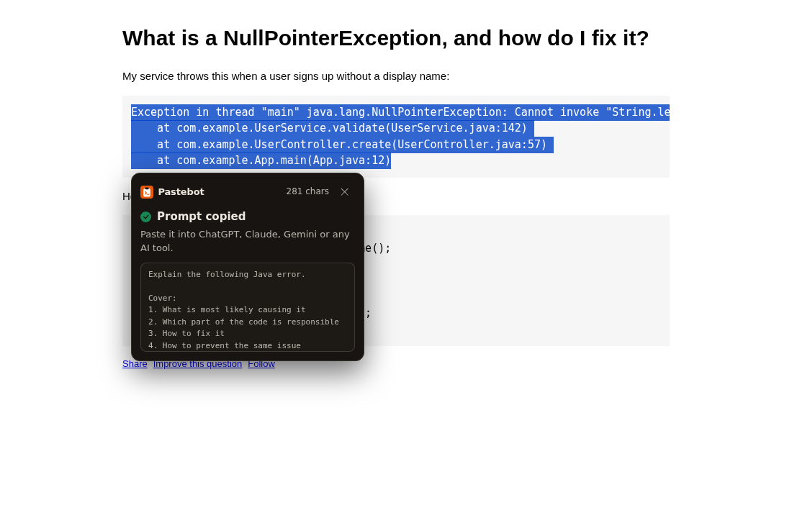
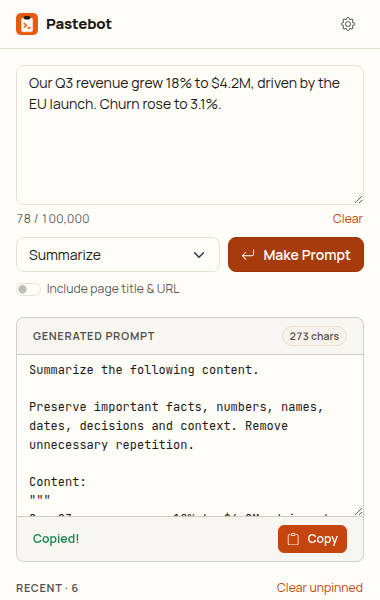
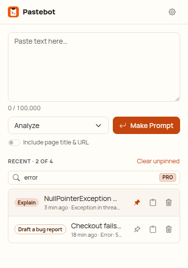
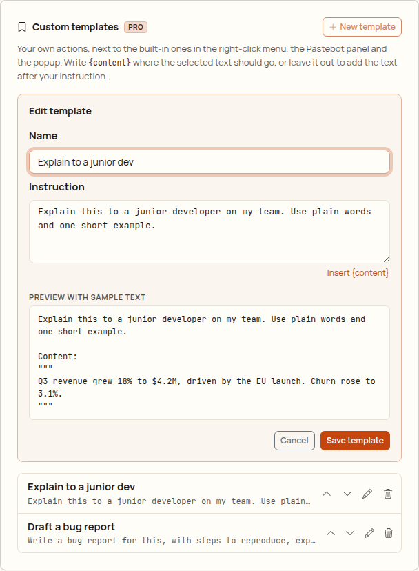
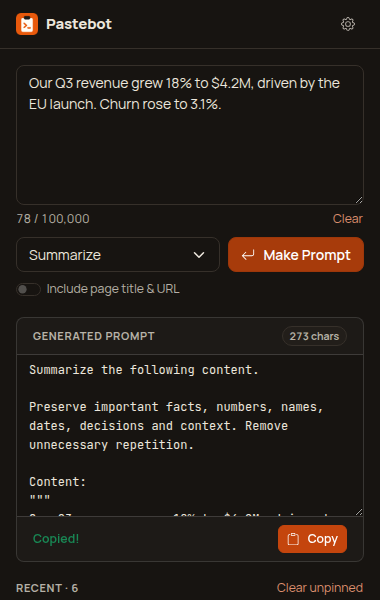
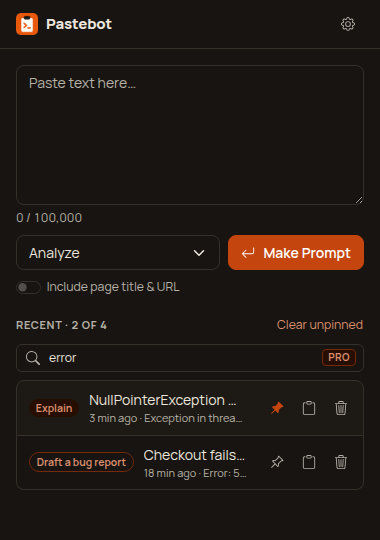
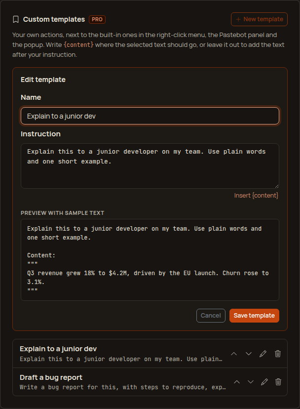

# Pastebot

Turn selected web content into ready-to-use AI prompts.

Select text → right-click → **Pastebot** → pick an action → a polished prompt is in your clipboard.
Paste it into ChatGPT, Claude, Gemini, Cursor or whatever AI tool you already use.

Pastebot is not a chatbot and doesn't answer anything itself. It packages your selection and your
intent into a prompt another AI can work with.

## Screenshots

| In-page panel | Prompt copied |
| --- | --- |
|  |  |
|  |  |

| Popup | History search and pins (Pro) | Custom template editor (Pro) |
| --- | --- | --- |
|  |  |  |
|  |  |  |

More: [settings with About Pro](screenshots/options-light.png) ([dark](screenshots/options-dark.png)),
[toast after a context-menu action](screenshots/toast-light.png),
[too-long selection](screenshots/too-long-light.png).
The screenshots are generated by `npm run test:e2e`.

## How to use

1. **Select text** on any page: an article, an error message, a code snippet, a table, a job post.
2. **Right-click → Pastebot**:
   - **Make Prompt…** opens a small panel next to the selection. Press `1`–`6` for an action
     (Analyze, Summarize, Explain, Extract, Compare, Rewrite), `Enter` for the highlighted default,
     or `7` for **Custom** and type your own instruction ("Turn this into an email to my team").
   - Or pick an action directly from the menu to copy the prompt without the panel.
   - Your own **custom templates** (Pro) are listed below the built-in actions, in the menu and in
     the panel (`8` and `9` pick the first two).
3. The prompt is **in your clipboard**. Paste it into ChatGPT, Claude, Gemini, Cursor or any AI tool.

Custom templates (Pro):

1. Open **Settings** (gear icon in the popup) → **Custom templates** → **New template**.
2. Give it a name ("Email to my team") and write the instruction. Put `{content}` where the selected
   text should go ("Rewrite {content} as a short email to my team."), or leave it out and the text
   is added after your instruction. The preview shows the exact prompt on sample text.
3. Save. The template appears right away in the right-click menu, the panel and the popup's action
   list. Edit, reorder (↑ ↓) or delete templates on the same card; the menu follows.

Templates go through the same generator as the built-in actions: cleanup, content detection
(code and errors are fenced), prompt style and "Include page title & URL" all apply.

Other ways in:

- **Keyboard:** select text and press `Alt+P` (`⌘⇧P` on macOS).
- **Toolbar button:** opens the popup. It starts from the page selection when there is one, or
  paste text manually, pick an action (or one of your templates), edit the prompt and press
  **Copy**. Recent prompts are listed below; click one to reopen it.
- **History** (popup): search by any word in the prompt, its page or its source (Pro), and pin the
  prompts you reuse (Pro). Pinned prompts stay on top, are never rotated out by the history size,
  and survive **Clear unpinned**; only unpinning or deleting removes them.
- **Include page title & URL** (switch in the panel, popup or settings) adds where the text came
  from. Off by default.
- **Settings** (gear icon in the popup): default action, prompt style (concise / balanced /
  detailed), history size, custom templates, the shortcut, and what Pro includes.

## Free vs Pro

Pastebot's core job is free. Pro is for people who use it every day.

| Free | Pro ($2.99 once) |
| --- | --- |
| All 7 actions, context menu, in-page panel, shortcut, popup | Everything in Free |
| Last 20 prompts in history | History up to 500 prompts |
| | **Search** in history |
| | **Pinned** favourites |
| | **Custom templates**: your own actions in the menu, panel and popup |

**Right now everything is free (early access).** Payments aren't set up yet, so every Pro feature
is on for everyone. The About Pro card in settings shows the price and a disabled button that reads
"Free during early access". Pro features carry a small `PRO` badge.

When early access ends (`EARLY_ACCESS = false` in `src/core/plan.ts`), a free user sees:

- History keeps 20 prompts. Once it is full, the popup shows one calm line ("Free keeps the last
  20 prompts. Pro keeps up to 500, with search and pins.") with a link to About Pro. Asking for more
  than 20 in settings saves 20 and shows the same line.
- The search box is disabled; pin buttons appear only on prompts that are already pinned (so they
  can be unpinned).
- Custom templates are no longer offered in the menu, panel or popup. They stay in settings, where
  they can still be read, edited and deleted, but no new ones can be added.
- **Nothing is ever deleted because of the plan.** If history already holds more than 20 prompts
  (from Pro), it keeps its size and rotates the oldest unpinned prompt out, instead of shrinking.
  Pins, templates and history are kept as they are. Only the user's own actions (lowering the
  history size, Clear, Delete) remove anything.

How it's wired (see [`docs/MONETIZATION.md`](../docs/MONETIZATION.md)): `src/core/plan.ts` is pure
and unit-tested (`Plan`, `ProFeature`, `EARLY_ACCESS`, `PRO_PRICE`, `hasFeature`, `limitsFor`,
calm `limitMessage`s). The stored plan is the `plan` key in `chrome.storage.local`, sanitized on read
(anything but `'pro'` is `'free'`). Every Pro check in the background, panel, popup and settings
goes through `hasFeature` / `limitsFor`. There's no payment code; a future `src/payments/` adapter
would verify a license and store `plan: 'pro'`, and the context menu rebuilds when it changes.

## Features

- **Context menu:** `Pastebot → Make Prompt…` opens a small panel next to the selection.
  `Analyze`, `Summarize`, `Explain`, `Extract`, `Compare` and `Rewrite` copy a prompt right away.
- **Panel:** number keys `1`–`7` pick an action, `Enter` runs the highlighted default, `7` opens
  Custom (write your own instruction), `8` and `9` run your first two templates, `Esc` closes.
- **Keyboard shortcut:** `Alt+P` (Windows, Linux, ChromeOS) / `⌘⇧P` (macOS) opens the panel for
  the current selection. It can be changed at `chrome://extensions/shortcuts`.
- **UI:** Bootstrap 5.3 with a Pastebot theme, Bootstrap Icons, Manrope and JetBrains Mono (all
  bundled, nothing loaded from the web). Light and dark follow the system. The in-page panel lives
  in a shadow root, so page CSS can't break it and it can't break the page. Shared rules:
  [`docs/design-system.md`](../docs/design-system.md).
- **Content-aware templates:** errors and stack traces, source code (with a language guess), tables
  and plain text each get a fitting prompt. "Explain" on `NullPointerException at UserService.java:142`
  asks for the cause, the responsible code, the fix and prevention, for an experienced Java developer.
- **Conservative cleanup:** strips invisible characters, runs of blank lines, duplicated lines and
  UI labels ("Share", "Read more", "Copy code"...). URLs, numbers, prices, names, dates, code
  indentation and table cells are kept as is.
- **Popup:** paste text manually (or start from the page selection), choose an action, edit the
  prompt, copy it. Shows the most recent prompts.
- **Settings:** page context (title + URL) on/off, default action, prompt style
  (concise / balanced / detailed), history size, custom templates (add / edit / reorder / delete
  with a live preview), About Pro.
- **Custom templates (Pro):** a name plus an instruction, with optional `{content}` placement.
  Shown after the built-in actions in the context menu (rebuilt whenever templates change), in the
  panel under "Your templates" and in the popup's action list.
- **History (Pro: up to 500, search, pins):** see [Free vs Pro](#free-vs-pro).

## Privacy

Everything runs locally. Pastebot has no backend, no account, no analytics and no third-party code.
It makes no network requests. Selected text only leaves your computer when you paste the prompt
somewhere yourself.

- Nothing is read from a page until you invoke Pastebot on it (context menu, shortcut or toolbar
  button). It uses `activeTab`, not access to all sites.
- Only the selection is read, as plain text. With "Include page context" on, the page title and
  URL are added too. Tracking parameters (`utm_*`, `fbclid`, ...) and secret-looking ones
  (`token`, `session`, `code`, ...) are removed from the URL. Non-web URLs (`file://` etc.) are
  never included.
- History and custom templates are stored in `chrome.storage.local` in this browser only. History
  can be cleared or turned off.
- Pro adds no network access: nothing is checked online while early access lasts.

### Permissions

| Permission       | Why                                                                         |
| ---------------- | --------------------------------------------------------------------------- |
| `activeTab`      | Read the selection on the current tab after you invoke Pastebot             |
| `scripting`      | Inject the selection reader and the panel on demand (no always-on scripts)  |
| `contextMenus`   | The Pastebot right-click menu                                               |
| `storage`        | Settings, custom templates and local history                                |
| `offscreen`      | A hidden document for writing to the clipboard from the background          |
| `clipboardWrite` | Put the prompt in the clipboard                                             |

## Development

Requires Node.js 22.12+ (vitest 5). Building alone works on Node 18+.

```bash
npm install
npm run build        # production build -> dist/
npm run dev          # rebuild on change (with source maps) -> dist/
npm run typecheck
npm test             # unit tests (vitest)
npm run check        # typecheck + unit tests + build
npm run test:e2e     # builds dist-e2e/ and drives it in real Chromium
```

`test:e2e` needs a Chromium build. It's auto-detected in some environments; otherwise set
`CHROMIUM_PATH=/path/to/chromium`. Debug screenshots go to `e2e/output/` (ignored); the README screenshots in `screenshots/` are regenerated too.

### Load the extension in Chrome

1. `npm install`
2. `npm run build`
3. Open `chrome://extensions`
4. Turn on **Developer mode** (top right)
5. Click **Load unpacked**
6. Select the `dist/` directory

After a rebuild, press the reload icon on the Pastebot card in `chrome://extensions`. Tabs that
were open before the reload may need a refresh.

### Packaging for the Chrome Web Store

`dist/` is the complete extension: no source maps, no test code (the e2e hook is compiled out),
unminified identifiers so review is easy. Zip the *contents* of `dist/` and upload that.

## Project structure

```
src/
  core/         Pure logic, no DOM or Chrome APIs: cleanup, content detection,
                prompt generation, settings/history models, limits,
                plan.ts (Free vs Pro), customTemplates.ts
  templates/    One file per action. Each template describes the prompt; the
                generator handles layout and prompt style
  background/   Service worker: context menu, shortcut, prompt pipeline, clipboard
  content/      In-page panel (shadow DOM), injected only when invoked
  popup/        Toolbar popup
  options/      Settings page
  offscreen/    Offscreen document that writes to the clipboard
  platform/     Messages between contexts, selection reading
  storage/      chrome.storage wrappers
  ui/           DOM helpers, Bootstrap Icons, formatting
  styles/       Sass: Bootstrap theme, fonts, popup and options stylesheets
static/         manifest.json, HTML, icons
screenshots/    README screenshots (generated by the e2e test)
test/           Unit tests
e2e/            Chromium smoke test and fixture pages
```

`generatePrompt({ action, selectedText, pageContext, style, customInstruction })` in
`src/core/generate.ts` is the single entry point for prompt generation. It's synchronous and has no
side effects, so every UI shares one implementation and it's easy to test. A custom template is the
`custom` action with the template's instruction: the background looks the template up by id (so
the menu, the panel and the popup never send instruction text around) and `{content}`, if present,
places the fenced/quoted content inside the instruction.

### Adding an action

1. Add the id to `PROMPT_ACTIONS` in `src/core/types.ts`.
2. Create `src/templates/<action>.ts` returning a `PromptSpec` (task, steps, guidance, output).
3. Register it in `src/templates/index.ts`.

Menus, the panel, the popup and settings pick it up automatically.

### Limits

- Selections are capped at **100,000 characters** after cleanup (`MAX_INPUT_CHARS` in
  `src/core/limits.ts`). Longer selections get a message and a "Use first 100,000" option; nothing
  is cut silently.
- At most 1,000,000 characters are read from a page at all (`MAX_CAPTURE_CHARS`), so "select all"
  on a huge page can't flood the extension.
- History: 20 prompts on Free, up to 500 on Pro (`FREE_HISTORY_LIMIT` / `PRO_HISTORY_LIMIT` in
  `src/core/plan.ts`); the "Recent prompts to keep" setting can only lower it. Pinned prompts don't
  count against rotation. `chrome.storage.local` holds about 10 MB, so 500 very long prompts may not
  fit; when storage is full the oldest unpinned prompts are dropped instead of failing.
- Custom templates: at most 50 (`MAX_TEMPLATES`, a sanity cap for the menu, not a plan limit),
  names up to 40 characters, instructions up to 2,000, `{content}` at most once.

### Known limitations

- Pages Chrome doesn't let extensions script (`chrome://`, the Chrome Web Store, the built-in PDF
  viewer) can't show the in-page panel. There Pastebot uses the text Chrome reports for the
  selection (line breaks are lost) and continues in the toolbar popup. `chrome.action.openPopup()`
  needs Chrome 127+; older versions show a badge on the toolbar icon instead.
- Selections inside cross-origin iframes fall back to the same Chrome-reported text.
- Canvas-rendered editors (e.g. Google Docs) expose no selectable text to extensions.
- `Ctrl+Shift+P` can't be the default shortcut on Windows/Linux: Chrome reserves it (as far as we
  know for "Print using system dialog") and silently refuses to assign it, which is why the default
  is `Alt+P`. `⌘⇧P` on macOS hasn't been verified on a Mac yet.
- The e2e test switches early access off through a storage key that only the e2e build reads, to
  check the free-plan behavior; the production build always uses `EARLY_ACCESS`. Real payments and
  license checks don't exist yet.
- Content detection is heuristic. When unsure it falls back to a generic prompt rather than
  guessing a wrong language.
