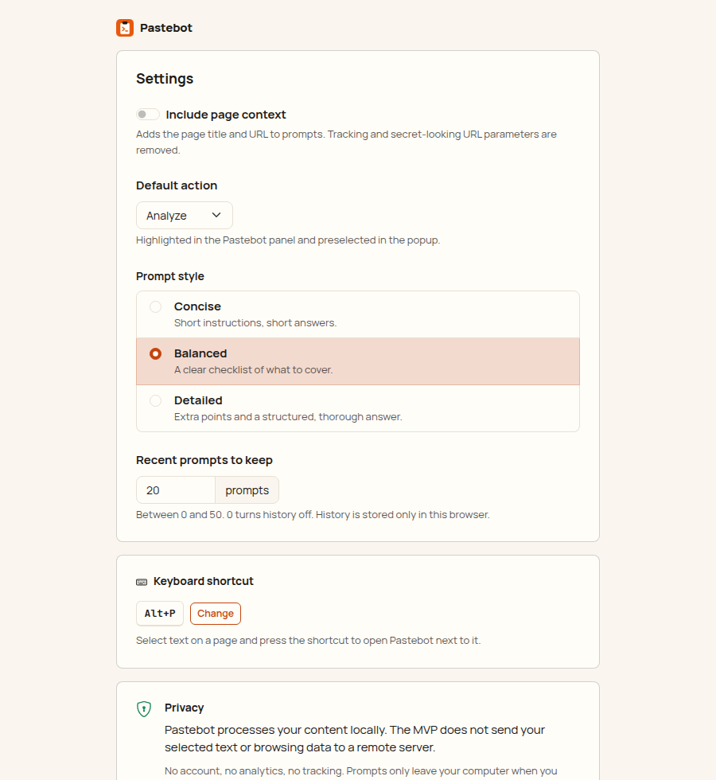

# Pastebot

Turn selected web content into ready-to-use AI prompts.

Select text → right-click → **Pastebot** → pick an action → a polished prompt is in your clipboard.
Paste it into ChatGPT, Claude, Gemini, Cursor or whatever AI tool you already use.

Pastebot is not a chatbot and doesn't answer anything itself. It packages your selection and your
intent into a prompt another AI can work with.

## Screenshots

| In-page panel | Prompt copied |
| --- | --- |
|  |  |
|  |  |

| Popup | Popup (dark) | Settings |
| --- | --- | --- |
|  |  |  |

More: [toast after a context-menu action](screenshots/toast-light.png),
[too-long selection](screenshots/too-long-light.png), [settings (dark)](screenshots/options-dark.png).
The screenshots are generated by `npm run test:e2e`.

## How to use

1. **Select text** on any page: an article, an error message, a code snippet, a table, a job post.
2. **Right-click → Pastebot**:
   - **Make Prompt…** opens a small panel next to the selection. Press `1`–`6` for an action
     (Analyze, Summarize, Explain, Extract, Compare, Rewrite), `Enter` for the highlighted default,
     or `7` for **Custom** and type your own instruction ("Turn this into an email to my team").
   - Or pick an action directly from the menu to copy the prompt without the panel.
3. The prompt is **in your clipboard**. Paste it into ChatGPT, Claude, Gemini, Cursor or any AI tool.

Other ways in:

- **Keyboard:** select text and press `Alt+P` (`⌘⇧P` on macOS).
- **Toolbar button:** opens the popup. It starts from the page selection when there is one, or
  paste text manually, pick an action, edit the prompt and press **Copy**. Recent prompts are listed
  below; click one to reopen it.
- **Include page title & URL** (switch in the panel, popup or settings) adds where the text came
  from. Off by default.
- **Settings** (gear icon in the popup): default action, prompt style (concise / balanced /
  detailed), history size, and the shortcut.

## Features

- **Context menu:** `Pastebot → Make Prompt…` opens a small panel next to the selection.
  `Analyze`, `Summarize`, `Explain`, `Extract`, `Compare` and `Rewrite` copy a prompt right away.
- **Panel:** number keys `1`–`7` pick an action, `Enter` runs the highlighted default, `7` opens
  Custom (write your own instruction), `Esc` closes.
- **Keyboard shortcut:** `Alt+P` (Windows, Linux, ChromeOS) / `⌘⇧P` (macOS) opens the panel for
  the current selection. It can be changed at `chrome://extensions/shortcuts`.
- **UI:** Bootstrap 5.3 with a Pastebot theme, Bootstrap Icons, Manrope and JetBrains Mono (all
  bundled, nothing loaded from the web). Light and dark follow the system. The in-page panel lives
  in a shadow root, so page CSS can't break it and it can't break the page. Shared rules:
  [`docs/design-system.md`](../docs/design-system.md).
- **Content-aware templates:** errors and stack traces, source code (with a language guess), tables
  and plain text each get a fitting prompt. "Explain" on `NullPointerException at UserService.java:142`
  asks for the cause, the responsible code, the fix and prevention, for an experienced Java developer.
- **Conservative cleanup:** strips invisible characters, runs of blank lines, duplicated lines and
  UI labels ("Share", "Read more", "Copy code"...). URLs, numbers, prices, names, dates, code
  indentation and table cells are kept as is.
- **Popup:** paste text manually (or start from the page selection), choose an action, edit the
  prompt, copy it. Shows the most recent prompts.
- **Settings:** page context (title + URL) on/off, default action, prompt style
  (concise / balanced / detailed), history size.

## Privacy

Everything runs locally. Pastebot has no backend, no account, no analytics and no third-party code.
It makes no network requests. Selected text only leaves your computer when you paste the prompt
somewhere yourself.

- Nothing is read from a page until you invoke Pastebot on it (context menu, shortcut or toolbar
  button). It uses `activeTab`, not access to all sites.
- Only the selection is read, as plain text. With "Include page context" on, the page title and
  URL are added too. Tracking parameters (`utm_*`, `fbclid`, ...) and secret-looking ones
  (`token`, `session`, `code`, ...) are removed from the URL. Non-web URLs (`file://` etc.) are
  never included.
- History is stored in `chrome.storage.local` in this browser only and can be cleared or turned off.

### Permissions

| Permission       | Why                                                                         |
| ---------------- | --------------------------------------------------------------------------- |
| `activeTab`      | Read the selection on the current tab after you invoke Pastebot             |
| `scripting`      | Inject the selection reader and the panel on demand (no always-on scripts)  |
| `contextMenus`   | The Pastebot right-click menu                                               |
| `storage`        | Settings and local history                                                  |
| `offscreen`      | A hidden document for writing to the clipboard from the background          |
| `clipboardWrite` | Put the prompt in the clipboard                                             |

## Development

Requires Node.js 22.12+ (vitest 5). Building alone works on Node 18+.

```bash
npm install
npm run build        # production build -> dist/
npm run dev          # rebuild on change (with source maps) -> dist/
npm run typecheck
npm test             # unit tests (vitest)
npm run check        # typecheck + unit tests + build
npm run test:e2e     # builds dist-e2e/ and drives it in real Chromium
```

`test:e2e` needs a Chromium build. It's auto-detected in some environments; otherwise set
`CHROMIUM_PATH=/path/to/chromium`. Debug screenshots go to `e2e/output/` (ignored); the README screenshots in `screenshots/` are regenerated too.

### Load the extension in Chrome

1. `npm install`
2. `npm run build`
3. Open `chrome://extensions`
4. Turn on **Developer mode** (top right)
5. Click **Load unpacked**
6. Select the `dist/` directory

After a rebuild, press the reload icon on the Pastebot card in `chrome://extensions`. Tabs that
were open before the reload may need a refresh.

### Packaging for the Chrome Web Store

`dist/` is the complete extension: no source maps, no test code (the e2e hook is compiled out),
unminified identifiers so review is easy. Zip the *contents* of `dist/` and upload that.

## Project structure

```
src/
  core/         Pure logic, no DOM or Chrome APIs: cleanup, content detection,
                prompt generation, settings/history models, limits
  templates/    One file per action. Each template describes the prompt; the
                generator handles layout and prompt style
  background/   Service worker: context menu, shortcut, prompt pipeline, clipboard
  content/      In-page panel (shadow DOM), injected only when invoked
  popup/        Toolbar popup
  options/      Settings page
  offscreen/    Offscreen document that writes to the clipboard
  platform/     Messages between contexts, selection reading
  storage/      chrome.storage wrappers
  ui/           DOM helpers, Bootstrap Icons, formatting
  styles/       Sass: Bootstrap theme, fonts, popup and options stylesheets
static/         manifest.json, HTML, icons
screenshots/    README screenshots (generated by the e2e test)
test/           Unit tests
e2e/            Chromium smoke test and fixture pages
```

`generatePrompt({ action, selectedText, pageContext, style, customInstruction })` in
`src/core/generate.ts` is the single entry point for prompt generation. It's synchronous and has no
side effects, so every UI shares one implementation and it's easy to test.

### Adding an action

1. Add the id to `PROMPT_ACTIONS` in `src/core/types.ts`.
2. Create `src/templates/<action>.ts` returning a `PromptSpec` (task, steps, guidance, output).
3. Register it in `src/templates/index.ts`.

Menus, the panel, the popup and settings pick it up automatically.

### Limits

- Selections are capped at **100,000 characters** after cleanup (`MAX_INPUT_CHARS` in
  `src/core/limits.ts`). Longer selections get a message and a "Use first 100,000" option; nothing
  is cut silently.
- At most 1,000,000 characters are read from a page at all (`MAX_CAPTURE_CHARS`), so "select all"
  on a huge page can't flood the extension.

### Known limitations

- Pages Chrome doesn't let extensions script (`chrome://`, the Chrome Web Store, the built-in PDF
  viewer) can't show the in-page panel. There Pastebot uses the text Chrome reports for the
  selection (line breaks are lost) and continues in the toolbar popup. `chrome.action.openPopup()`
  needs Chrome 127+; older versions show a badge on the toolbar icon instead.
- Selections inside cross-origin iframes fall back to the same Chrome-reported text.
- Canvas-rendered editors (e.g. Google Docs) expose no selectable text to extensions.
- `Ctrl+Shift+P` can't be the default shortcut on Windows/Linux: Chrome reserves it (as far as we
  know for "Print using system dialog") and silently refuses to assign it, which is why the default
  is `Alt+P`. `⌘⇧P` on macOS hasn't been verified on a Mac yet.
- Content detection is heuristic. When unsure it falls back to a generic prompt rather than
  guessing a wrong language.
