# Polymarket AI Analyzer

Chrome extension (Manifest V3) that answers: **what is happening with this Polymarket market right
now, and why?**

Open it on a Polymarket market page and it shows the current probability, a momentum signal with a
strength score, volume and liquidity context, a price chart with significant moves marked, a
"Why is it moving?" list, unusual-activity flags and a short plain-language summary. It also has
search, a watchlist, a history of dated snapshots and a side-by-side comparison.

It is a market-analysis tool. It does not predict outcomes, claim inside knowledge, or point out
"mispriced" markets, arbitrage or guaranteed profit. No wallet, no trading, no betting. The momentum
signal describes recent price movement, not the probability of the event.

> **Live data was not verified.** The development sandbox blocks polymarket.com and its APIs, so the
> data layer is written from Polymarket's public API documentation and tested against hand-written
> fixtures in the documented format (see [Data sources](#data-sources-and-api-assumptions)). Check it
> against the live API before publishing.

## Screenshots

All screenshots are generated by the e2e test from fixture data (fictional prices).

| Binary market, positive momentum | Multi-outcome event | Unusual activity |
| --- | --- | --- |
|  |  | 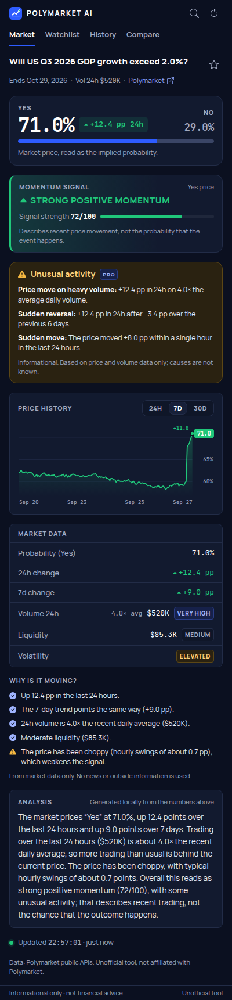 |

| Strong negative momentum | Neutral | Low liquidity |
| --- | --- | --- |
| 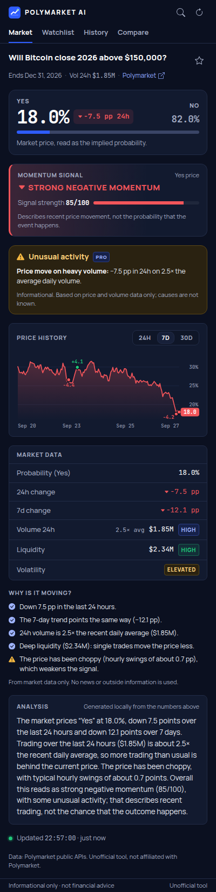 | 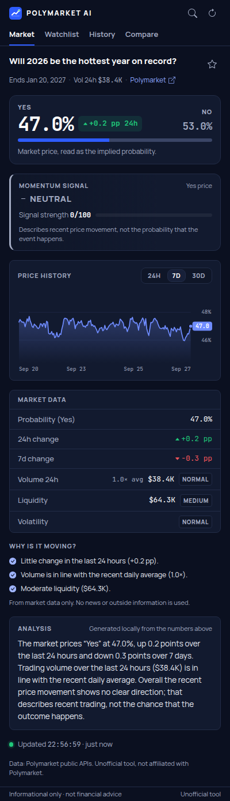 | 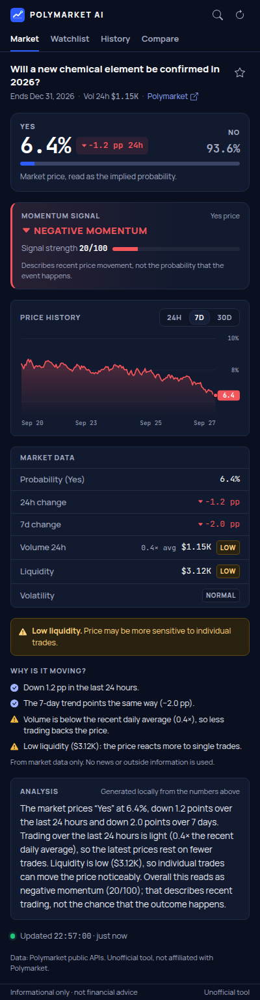 |

| Popup as opened | 24H chart | No price history |
| --- | --- | --- |
| 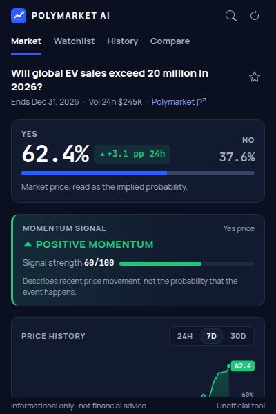 | 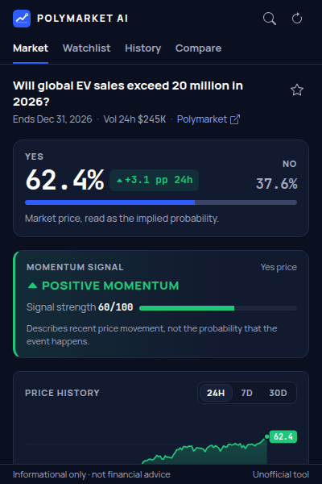 | 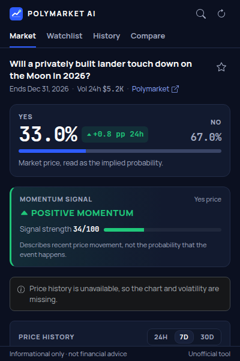 |

| Loading | Stale data | Network error |
| --- | --- | --- |
| 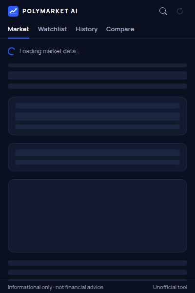 | 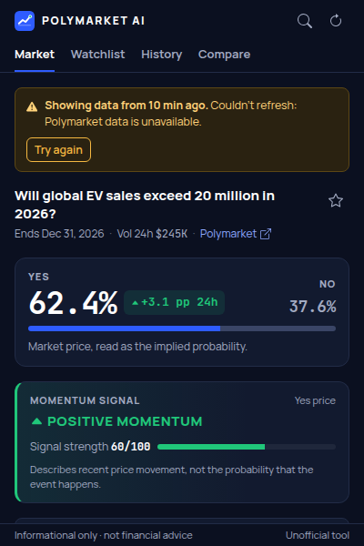 | 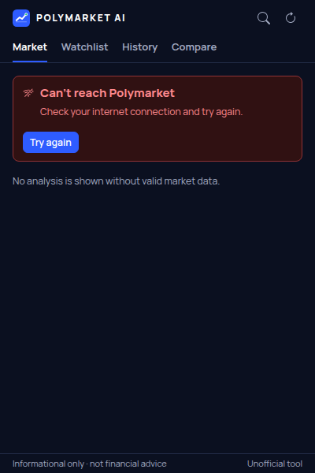 |

| Not found | Rate limited | Malformed response |
| --- | --- | --- |
| 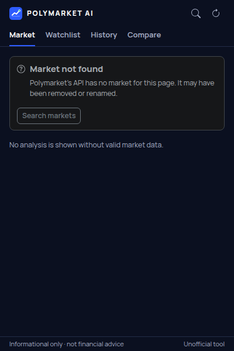 | 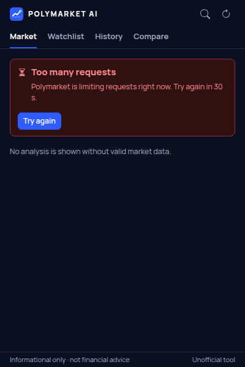 | 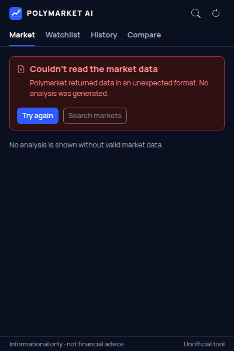 |

| Search | Watchlist | History |
| --- | --- | --- |
| 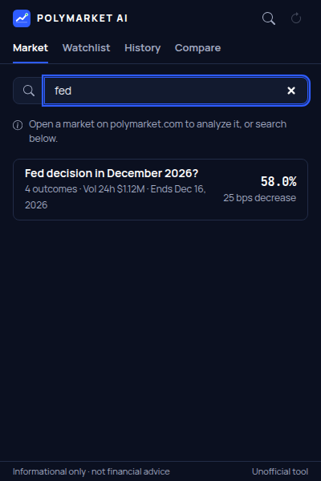 | 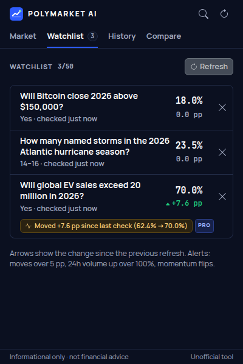 | 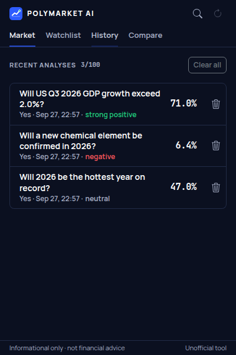 |

| Snapshot | Compare |
| --- | --- |
| 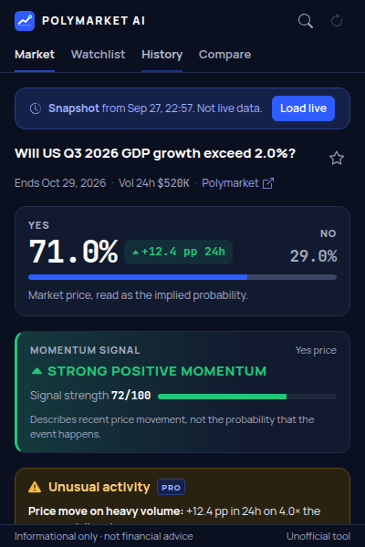 |  |

## Features

- **Detection.** When the popup opens on `polymarket.com`, the market is taken from the URL:
  `/event/<event-slug>`, `/event/<event-slug>/<market-slug>`, `/market/<market-slug>` (an optional
  locale prefix like `/es/` is accepted). On other Polymarket pages (e.g. sports game pages) the
  popup reads the page's canonical link once. Elsewhere it opens search.
- **Search.** "Search Polymarket markets…", debounced (300 ms), previous request aborted.
- **Context menu.** `Polymarket AI → Analyze this market` on Polymarket market pages, and on any
  selected text (the selection becomes the search query). Both hand off to the toolbar popup
  (`chrome.action.openPopup()`, Chrome 127+; older versions get a badge).
- **Binary markets.** Yes/No price, 24h change, momentum signal and strength, data rows (probability,
  24h/7d change, 24h volume with volume activity, liquidity class, volatility), chart (24H/7D/30D),
  "Why is it moving?", unusual activity, summary, related markets from the same event.
- **Multi-outcome events.** Outcomes sorted by probability with 24h and 7d changes. The top one is
  the "Current market leader" / "Highest-priced outcome", never a "winner". Clicking an outcome
  (mouse or keyboard) analyzes its momentum. Prices of mutually exclusive outcomes are checked to add
  up to about 100%.
- **Watchlist** (local): add/remove with the star, refresh to see the current probability and an
  arrow for the change since the previous refresh, plus in-popup alert notes.
- **History** (local): each fresh analysis is saved as a dated snapshot (same market within 10
  minutes replaces the previous one). Reopening shows the snapshot read-only with a "Load live"
  button.
- **Compare**: 2–3 markets from the watchlist and recent analyses side by side (probability, 24h/7d
  change, volume, liquidity, momentum). Columns keep the order you picked; nothing is ranked.
- **Caching**: API responses are cached for 60 s (per market and per history range) in session
  storage; the refresh button bypasses it. When a refresh fails, cached data up to 6 h old is shown
  with a stale warning. After 60 s the status line turns "Stale".
- **Errors**: not found, closed/unsupported market, malformed response, rate limit (with
  `Retry-After`), server error, timeout, network failure and missing history each have their own
  message. None of them produce an analysis.

## How the analysis works

Everything is in `src/core/` as pure functions (no DOM, no Chrome APIs, no Polymarket shapes).
Internally probabilities are 0..1, changes are probability units (0.05 = 5 percentage points, "pp"),
timestamps are milliseconds, and every number is finite or `null`. The UI formats `null` as "—", so
NaN/Infinity/undefined can't be shown.

**Changes.** The 24h and 7d changes come from the market data (`oneDayPriceChange`,
`oneWeekPriceChange`). If missing, they are measured on the 7-day price history (only if the history
covers the window). If both are missing, there is no momentum signal ("Not enough data").

**Momentum** (`src/core/momentum.ts`):

| 24h change | Score |
| --- | --- |
| > +5 pp | +3 |
| +2 … +5 pp | +2 |
| +0.5 … +2 pp | +1 |
| −0.5 … +0.5 pp | 0 |
| −2 … −0.5 pp | −1 |
| −5 … −2 pp | −2 |
| < −5 pp | −3 |

- 7d trend: +1 if the 7d change is above +0.5 pp, −1 if below −0.5 pp.
- Volume: HIGH or VERY HIGH volume adds 1 point in the direction of the score (never flips it).
- Score range −5…+5 → label: ≥ +4 STRONG POSITIVE, +1…+3 POSITIVE, 0 NEUTRAL, −1…−3 NEGATIVE,
  ≤ −4 STRONG NEGATIVE MOMENTUM.
- Strength 0–100 = |score| / 5 × liquidity factor (HIGH 1.0, MEDIUM 0.85, LOW 0.6, unknown 0.7) ×
  volatility factor (NORMAL 1.0, ELEVATED 0.85, EXTREME 0.65) × volume factor (LOW 0.85, else 1.0).

**Volume activity**: 24h volume ÷ average daily volume of the last 7 days (markets younger than a
week are averaged over their age): LOW < 0.5×, NORMAL 0.5–1.5×, HIGH 1.5–3×, VERY HIGH ≥ 3×.

**Liquidity** (Polymarket's `liquidity` figure, USD): LOW < $10K, MEDIUM $10K–$100K, HIGH ≥ $100K.
LOW shows "Price may be more sensitive to individual trades."

**Volatility**: standard deviation of hourly price changes in pp over the 7-day history (absolute
changes, because relative returns of a probability explode near 0): NORMAL < 0.5, ELEVATED 0.5–1.2,
EXTREME ≥ 1.2. Needs at least 12 hourly changes.

**Unusual activity** (`src/core/unusual.ts`), informational only, never speculating about causes:

| Flag | Rule |
| --- | --- |
| Price move on heavy volume | \|24h\| ≥ 5 pp and volume ≥ 2× average (replaces the two below) |
| Large 24h move | \|24h\| ≥ 10 pp |
| Volume spike | 24h volume ≥ 3× average |
| Sudden reversal | \|24h\| ≥ 3 pp against a ≥ 3 pp move over the previous 6 days |
| Sudden move | one hour moved ≥ 5 pp within the last 24 h (price history) |
| Large move with low liquidity | \|24h\| ≥ 5 pp while liquidity is LOW |

**Chart**: SVG drawn by hand (`src/core/chartGeometry.ts` + `src/popup/components/chart.ts`), no
chart library. Significant moves are marked (24H: ≥ 3 pp within 1 h; 7D: ≥ 4 pp within 6 h; 30D:
≥ 6 pp within 1 day; at most 3, one per window). Hover shows price and time; the SVG has a text
summary for screen readers.

**Explanation** (`src/core/explanation.ts`): `AIExplanationService` is the interface
(`explain(input) → { sentences, text, source }`). The MVP ships `LocalExplanationService`, a
deterministic generator that writes 2–4 sentences from the numbers in the analysis only: no news,
people, causes or predictions (unit-tested against a list of forbidden words for every fixture). A
language-model implementation can replace it without touching the UI.

## Plans and feature gating (MVP decision)

`src/core/features.ts` defines `Plan = 'free' | 'pro'`:

- free: basic analysis, watchlist up to 5, history up to 10, 24H/7D charts
- pro: alerts, related markets, unusual activity, comparisons, extended history (30D chart, history
  up to 100), watchlist up to 50

**MVP behaviour: early access.** `EARLY_ACCESS = true` makes every user's effective plan `pro`.
Every plan-dependent decision still goes through `hasFeature()` / `limitsFor()`, and Pro features
carry a small "PRO" badge ("Pro feature, free during early access"), so introducing paid plans later
is a data change, not a UI rewrite. There are no payments, accounts or license checks.

**Alerts** (`src/core/alerts.ts`): `AlertService` interface + rule evaluator with three rule kinds:
probability moved more than X pp, 24h volume up more than Y %, momentum flip (positive ↔ negative).
Defaults: 5 pp, 100 %, flip. They are evaluated when the watchlist is refreshed and shown inline on
the item. There are no background checks or notifications in the MVP.

**Consistency checks** (`src/core/consistency.ts`): prepared extension point for related-market
checks (e.g. "by March" priced above "by June"). The interface and registry exist and run on every
event; nothing is registered in the MVP.

## Data sources and API assumptions

Only Polymarket's public, unauthenticated APIs are used. **None of this was verified against the live
API** (blocked in the development environment). Assumptions are also marked in
`src/data/gamma.ts` and `src/data/clob.ts`.

**Gamma API** — `https://gamma-api.polymarket.com`

| Request | Used for |
| --- | --- |
| `GET /events?slug=<event-slug>` → array of events | event pages, multi-outcome events, related markets |
| `GET /markets?slug=<market-slug>` → array of markets | `/market/<slug>` pages |
| `GET /public-search?q=<text>&limit_per_type=10` → `{ events: [...] }` | search (endpoint and parameters are assumptions) |

Market fields read: `id`, `slug`, `question` (required); `outcomes`, `outcomePrices`,
`clobTokenIds` (**JSON-encoded string arrays**, e.g. `"[\"Yes\", \"No\"]"`; real arrays are also
accepted); `groupItemTitle`; `oneDayPriceChange`, `oneWeekPriceChange` (assumed: change of the first
outcome's price in probability units); `volume24hr`, `volume1wk`; `volumeNum`/`volume`;
`liquidityNum`/`liquidity` (numbers or numeric strings); `startDate`, `endDate` (ISO);
`closed`, `active`, `archived`; `negRisk`; `events[0].slug` (parent event of a market).
Event fields: `id`, `slug`, `title`, `markets` (required); `negRisk`/`enableNegRisk` (assumed to
mean "exactly one outcome resolves Yes"); `volume24hr`, `liquidity`, `endDate`, `closed`.

**CLOB API** — `https://clob.polymarket.com`

`GET /prices-history?market=<token id>&interval=<1d|1w|1m>&fidelity=<minutes>` →
`{ "history": [ { "t": <unix seconds>, "p": <price> } ] }`. Assumed: `interval=1m` is one month and
`t` is in seconds (millisecond values are accepted too). Used with 24H = `1d`/10 min,
7D = `1w`/60 min, 30D = `1m`/360 min. History is requested for the first outcome's token ("Yes").

**Validation.** Responses are parsed strictly (`src/data/gamma.ts`, `src/data/clob.ts`):
malformed objects → "Couldn't read the market data"; out-of-range prices are rejected, never
rescaled; unreadable or unpriced markets inside an event are left out and counted ("1 closed or
unpriced market not shown"). Malformed responses are never cached. Cached responses are stored raw
and parsed again on every read, so stored data goes through the same validation.

**Configuration.** None for users. The API origins are compile-time constants; the e2e build points
them at a local fixture server (`vite build --mode e2e`), never the production build.

## Privacy and permissions

No account, backend, analytics or remote code. Requests go only to the two API origins and contain
the market slug or the search text. Watchlist and history stay in `chrome.storage.local`; the API
cache and the context-menu hand-off live in `chrome.storage.session`.

| Permission | Why |
| --- | --- |
| `activeTab` | Read the current tab's URL after the user opens the popup or uses the context menu |
| `scripting` | On Polymarket pages without a market in the URL, read the page's canonical link once (one injected function, after a user action) |
| `contextMenus` | "Polymarket AI → Analyze this market" on market pages and on selected text |
| `storage` | Watchlist, history, 60 s API cache, context-menu hand-off |
| `https://gamma-api.polymarket.com/*` | Market, event and search data |
| `https://clob.polymarket.com/*` | Price history |

No access to polymarket.com pages themselves, no `tabs`, no `<all_urls>`, no content scripts. The
e2e test checks the production manifest has exactly these permissions.

## Development

Requires Node.js 22.12+ (Vite 8, Vitest 5).

```bash
npm install
npm run build        # production build -> dist/
npm run dev          # rebuild on change, inline source maps -> dist/ (don't package this)
npm run typecheck    # src, tests, configs
npm test             # unit tests (vitest)
npm run check        # typecheck + unit tests + build
npm run test:e2e     # production build + e2e build (dist-e2e/) + Chromium test
UPDATE_SCREENSHOTS=1 npm run test:e2e   # also refresh screenshots/
npm run fixtures     # regenerate fixtures/clob/ from fixtures/gamma/
npm run icons        # re-render public/icons/*.png from assets/icon.svg
```

`test:e2e` needs Chromium (auto-detected at `/opt/pw-browsers/chromium-1194/chrome-linux/chrome`,
otherwise set `CHROMIUM_PATH`). It uses port 47931 for the fixture API (`E2E_API_PORT` changes it at
build time). Screenshots go to `e2e/output/`.

### Build

Vite 8 with two entries: `src/popup.html` (popup page, its Sass and fonts) and
`src/background/index.ts` (the service worker, an ES module: `"type": "module"` in the manifest).
There are no content scripts. Output is unminified but tree-shaken (easy Web Store review), with no
source maps. `__E2E__` is a compile-time constant, so the test hook and the `?tab=` popup parameter
are removed from `dist/` (the e2e test checks this).

### Load the extension in Chrome

1. `npm install && npm run build`
2. Open `chrome://extensions`, turn on **Developer mode**
3. **Load unpacked** → select `dist/`

### Packaging

Run `npm run build` (not `dev`) and zip the *contents* of `dist/`. See `store/listing.md` for the
listing text, privacy answers and permission justifications.

## Tests

- **Unit (Vitest, `test/`)**: number/format guards, probability normalization and sum sanity, price
  series maths, the momentum table and factors, volume/liquidity/volatility classes, every unusual
  activity rule, the analysis on every fixture scenario (positive, neutral, negative, high volume,
  low liquidity, sudden movement, multi-outcome, missing history, malformed responses), explanation
  rules, Gamma/CLOB parsing, HTTP error mapping, the TTL cache (fresh, forced, stale, gone,
  concurrent), the service against fixture payloads, URL detection, alerts, feature gating,
  storage sanitizers and concurrency, compare and chart geometry.
- **E2E (`e2e/smoke.mjs`)**: loads `dist-e2e/` into Chromium with Playwright. A local server answers
  in the Gamma/CLOB formats from `fixtures/`; `polymarket.com` pages are routed to tiny local pages so
  the popup sees real Polymarket URLs. Covers every popup state, errors, loading, cache, stale data,
  search, both context-menu items (real popup via `chrome.action.openPopup()`), watchlist with
  alerts, history, snapshots, compare, corrupted storage and "no requests outside the API".

**Fixtures.** `fixtures/gamma/` holds hand-written `/events` and `/markets` responses in the
documented format (JSON-encoded arrays, numeric strings, extra fields the parser must ignore, a
malformed event, a closed event). `fixtures/clob/` is generated by `scripts/make-fixture-history.mjs`
from those numbers so that the history agrees with `oneDayPriceChange`/`oneWeekPriceChange`
(unit-tested); the e2e server shifts the timestamps to "now".

## Project structure

```
src/
  core/         Pure logic: types, analysis engine, momentum, metrics, unusual activity, series,
                chart geometry, explanation service, alerts, features, saved models, URL parsing
  data/         Polymarket service (interface + implementation), Gamma/CLOB parsing, HTTP, TTL cache
  storage/      chrome.storage wrappers (sanitize on read), context-menu hand-off
  background/   Service worker: context menu → popup hand-off
  popup/        Popup controller, views (analysis, search, watchlist, history, compare), chart
  styles/       Bootstrap 5.3 theme and popup styles (Sass)
  ui/           DOM helper, Bootstrap Icons (inlined SVG), logo
  popup.html    Popup page
  manifest.json Manifest template (version and e2e additions are filled in at build time)
fixtures/       Gamma and CLOB fixture payloads
scripts/        Fixture history generator, icon renderer
e2e/            Chromium smoke test
test/           Unit tests
store/          Chrome Web Store listing
screenshots/    Curated screenshots (from the e2e test)
```

## Known limitations

- **Live API unverified** (see above): endpoint names, the search endpoint and parameters, the
  meaning of `oneDayPriceChange`/`oneWeekPriceChange`, `negRisk`, and the CLOB `interval`/`t` units
  are assumptions. If a field is missing the analysis degrades (history fallback, "—", "Not enough
  data") rather than inventing numbers.
- Momentum and history always refer to the market's **first outcome** ("Yes", or the first team in
  a two-sided sports market).
- Volume activity compares against a 7-day average that includes the last 24 hours (so the ratio is
  at most 7×); markets younger than a week are averaged over their age.
- Liquidity thresholds are fixed dollar amounts; they don't adapt to market size.
- Alerts are evaluated only when the watchlist is refreshed in the popup; no background checks.
- The canonical-link fallback depends on Polymarket pages having a `<link rel="canonical">` or
  `og:url` pointing at an event/market URL.
- The explanation is template-based (no language model yet).
- `chrome.action.openPopup()` from the context menu needs Chrome 127+; older versions show a badge.
- English UI only.

## Ideas for v2

- A language-model `AIExplanationService` (opt-in, clearly labelled, still numbers-only input).
- Optional background alerts (`chrome.alarms` + notifications) for watchlist rules, with per-item
  thresholds.
- Consistency checks for date and threshold ladders using the prepared extension point.
- Order-book depth and spread from the CLOB book endpoint to replace fixed liquidity thresholds.
- Per-outcome charts overlaid for multi-outcome events; export a snapshot as an image.
- Settings page (default chart range, alert thresholds), localisation.
