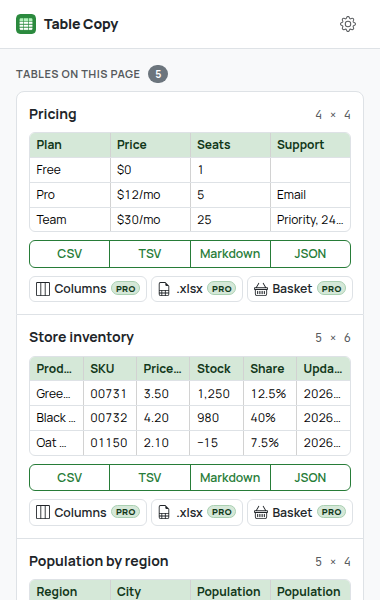
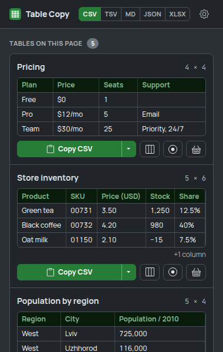
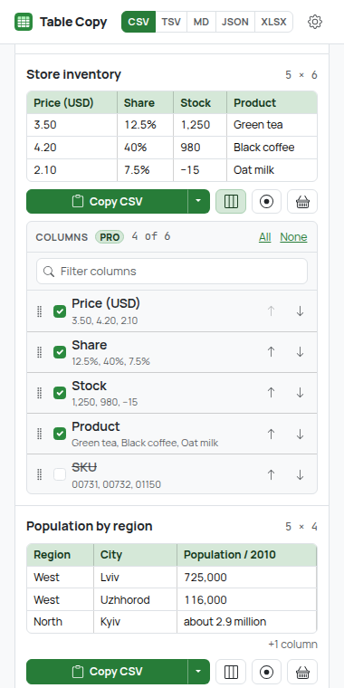
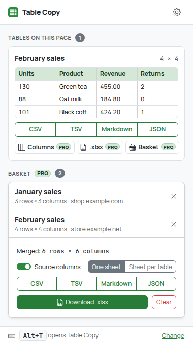
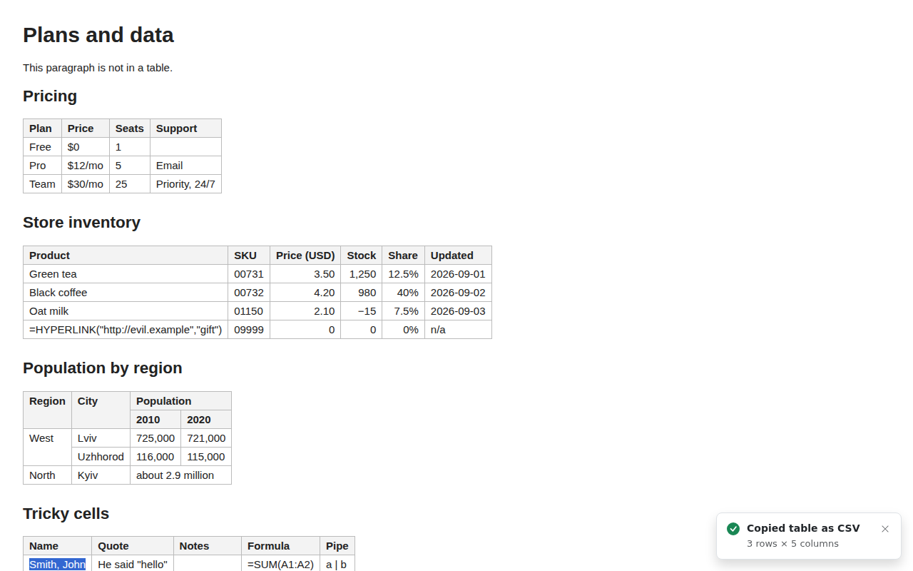
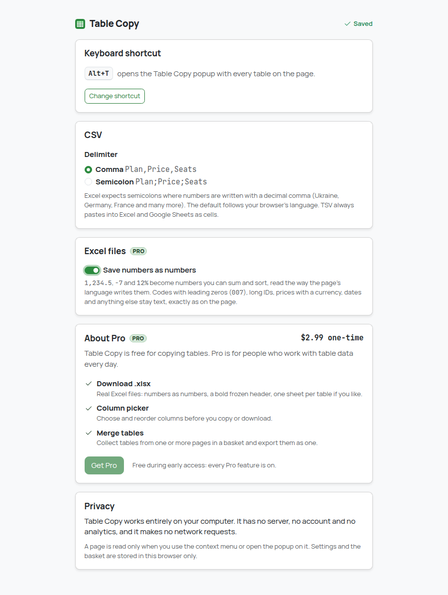
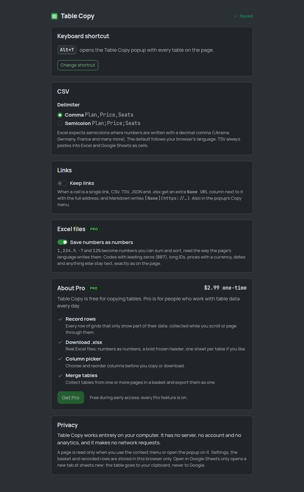
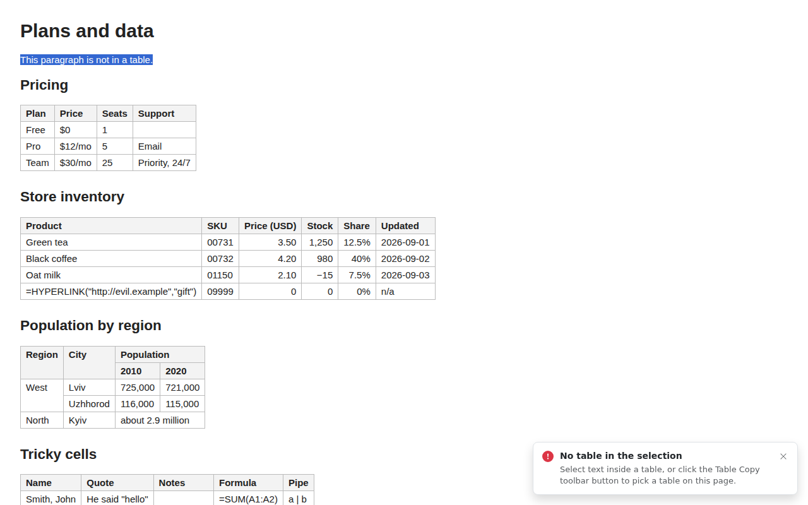

# Table Copy

Get any HTML table out of a web page as data: **CSV**, **TSV** (pastes into Excel and Google
Sheets as cells), **Markdown** or **JSON**, or as a real **Excel file (.xlsx)**. Pick and reorder
columns first, and collect tables from several pages into one merged export.

| Every table on the page | Dark mode |
| --- | --- |
|  |  |

| Column picker (Pro) | Basket: merge tables (Pro) |
| --- | --- |
|  |  |



## How to use

### Copy a table from the page

1. Select some text inside the table (a single word is enough).
2. Right-click and open **Table Copy**.
3. Pick **Copy table as CSV**, **TSV (Excel, Sheets)**, **Markdown** or **JSON**.
4. A small confirmation appears in the bottom-right corner with the size of what was copied.

### Pick a table in the popup

Click the Table Copy toolbar icon, or press **Alt+T** (change it at
`chrome://extensions/shortcuts`). The popup lists every table on the page with its title (caption
or nearest heading), its size (rows × columns) and a preview of the first rows. Under each table:

- **CSV / TSV / Markdown / JSON** copy the table. The button turns into **Copied**.
- **Columns** (Pro) opens the column picker.
- **.xlsx** (Pro) downloads the table as an Excel file.
- **Basket** (Pro) adds the table to the basket.

Which format to pick:

| Format | Best for |
| --- | --- |
| TSV | Pasting into Excel or Google Sheets: every value lands in its own cell |
| CSV | Saving as a `.csv` file or importing into other tools |
| Markdown | GitHub, notes apps, AI chats |
| JSON | Code: an array of objects keyed by the column headers |
| .xlsx | Opening in Excel, Numbers, LibreOffice or Google Sheets with numbers ready to sum and sort |

### Choose and reorder columns (Pro)

Click **Columns** under a table. Every column is listed with a sample of its values. Untick the
ones you don't need, move the rest with the arrows, or use **All** / **None**. The preview shows
the result, and every copy, `.xlsx` download and basket add of that table uses it.

### Merge tables from several pages (Pro)

1. On each page, add a table to the basket: **Basket** in the popup, or right-click inside the
   table → **Table Copy → Add table to basket**.
2. Open the popup (on any page). The **Basket** section lists what you collected, with each
   table's size and site.
3. Export everything as one table: copy it as CSV / TSV / Markdown / JSON, or **Download .xlsx**.

Rows are stacked and columns are lined up **by header name**, so tables with the same columns in a
different order, or with a few extra columns, merge cleanly (missing values stay empty).
**Source columns** adds `Source` (the table's title) and `Source URL` in front. For `.xlsx` you
can choose **One sheet** (stacked) or **Sheet per table**. The basket lives in this browser until
you remove tables or press **Clear**; it holds up to 20 tables (250,000 cells).

### Settings

Right-click the toolbar icon → **Options** (or the gear in the popup):

| Options | Dark mode |
| --- | --- |
|  |  |

- **CSV delimiter**: comma, or semicolon for Excel in locales that write decimals with a comma
  (Ukraine, Germany, France...). The default follows the browser's language.
- **Save numbers as numbers** (.xlsx): on by default, see below.
- **About Pro**: what Pro adds and its price.

When something can't be copied, the message says what happened and what to do instead:



## Free vs Pro

| Free | Pro ($2.99 one-time) |
| --- | --- |
| Copy any table as CSV, TSV, Markdown or JSON from the context menu or the popup | **Download .xlsx** (one table, or the whole basket) |
| Popup with every table, previews and sizes | **Column picker**: choose and reorder columns before copying or downloading |
| Keyboard shortcut to open the popup, CSV delimiter setting, confirmations | **Merge tables**: a basket of tables from one or more pages, exported together |

Payments are not set up yet: during **early access every Pro feature is on for everyone**
(`EARLY_ACCESS = true` in `src/core/plan.ts`). Pro features carry a small `PRO` badge. Every Pro
check goes through `hasFeature()` / `limitsFor()` in `src/core/plan.ts`; the stored plan
(`chrome.storage.local`, key `plan`) is `free` unless a future `src/payments/` adapter sets it.
When early access ends, a free user who clicks a Pro feature gets one calm line ("Download .xlsx
is part of Table Copy Pro ($2.99, one-time).") with a link to **About Pro**; nothing is deleted
or blocked. See `docs/MONETIZATION.md` at the repository root.

## What the conversions do

**Reading tables**
- Only what's visible is copied: hidden rows and cells, hidden sort keys, screen-reader-only
  text, buttons, form controls, scripts and Wikipedia footnote markers (`[1]`) are skipped.
- Header rows: `<thead>`, otherwise leading rows of `<th>`, otherwise a first row of bold cells.
- `colspan`/`rowspan` are expanded into a rectangular grid (the value is repeated in every cell it
  covers), following the HTML table model.
- Nested tables stay inside their cell (as text). Layout tables (`role="presentation"`), hidden
  tables and one-cell tables are not listed.
- Empty rows and trailing empty columns are dropped; empty cells are kept.

**CSV** follows RFC 4180 (fields with the delimiter, quotes or line breaks are quoted, quotes
doubled). Values are never changed.

**TSV** also puts an HTML `<table>` on the clipboard, so spreadsheets get real cells. Cells that
would run as a formula when pasted (`=...`, `@...`, `+`/`-` followed by non-numbers) get a
leading `'`, which spreadsheets treat as "this is text". Numbers like `-5` are untouched.

**Markdown**: a GitHub pipe table. Several header rows are combined (`Population / 2010`), a
table without a header gets an empty header row, pipes and Markdown syntax are escaped
(`snake_case` stays readable), line breaks become `<br>`.

**JSON**: an array of objects keyed by the header, in column order. Empty names become
`Column N`, duplicates get ` 2`, ` 3`. Values stay strings.

**.xlsx**: a standard Office Open XML workbook written by Table Copy itself (a zip of the
SpreadsheetML parts, zipped with the small `fflate` library). The header row is bold and frozen,
columns are sized to their content, multi-line cells wrap. Cell text is always stored as text,
never as a formula, so `=HYPERLINK(...)` from a page can't run. With **Save numbers as numbers**
on, a cell becomes a number only when that's unambiguous:

- `42`, `-7`, `−7`, `3.50`, `1,250`, `2,952,301.5`, `10 000` become numbers; `12.5%` becomes
  0.125 shown as a percentage; grouped numbers keep a `#,##0` format.
- The decimal separator follows the page's language (`<html lang>`): on a German page `1.234,5`
  is 1234.5; on an English page `1,5` stays text.
- Leading zeros (`007`, ZIP codes), more than 15 significant digits (IDs, card numbers Excel
  would round), currency (`$12`), units, dates, versions and anything else stay text, exactly as
  on the page.
- A stacked basket sheet that mixes pages with different decimal separators keeps its cells as
  text.

## Privacy

Everything runs locally. Table Copy has no backend, no account, no analytics and no remote code,
and it makes no network requests (fonts, icons and the zip library are bundled).

- Nothing is read from a page until you use the context menu or open the popup on it. It uses
  `activeTab`, not access to all sites, and has no always-on content scripts.
- Settings and the basket are stored in `chrome.storage.local`, in this browser only. The basket
  keeps the tables' cell text, title and page address until you remove them.

Full privacy policy: [`PRIVACY.md`](PRIVACY.md).

### Permissions

| Permission | Why |
| --- | --- |
| `activeTab` | Read the tables of the current tab, only after you use the context menu or open the popup on it |
| `scripting` | Inject the table reader and the confirmation message into that tab on demand |
| `contextMenus` | The Table Copy right-click menu |
| `storage` | Settings, the basket, and a short-lived message for the popup when a page can't show one |
| `offscreen` | A hidden extension page that writes to the clipboard for the background worker (context menu) |
| `clipboardWrite` | Put the table (text, plus an HTML table for TSV) on the clipboard |

No `downloads` permission: `.xlsx` files are saved from the popup with a regular download link.

## Development

Requires Node.js 22.12+.

```bash
npm install
npm run build        # production build -> dist/
npm run dev          # rebuild on change (with source maps) -> dist/
npm run typecheck
npm test             # unit tests (vitest, jsdom for DOM-reading code)
npm run test:e2e     # builds dist/ and dist-e2e/, drives dist-e2e/ in real Chromium
npm run screenshots  # same as test:e2e, and refreshes screenshots/
npm run icons        # re-render the PNG icons after changing static/icons/icon.svg
npm run check        # typecheck + unit tests + build
```

`test:e2e` needs a Chromium build. It's auto-detected in some environments; otherwise set
`CHROMIUM_PATH=/path/to/chromium`. It serves local fixture pages, calls the context-menu handler
through a test hook (native menus can't be automated; the hook exists only in `dist-e2e/`), reads
the clipboard, catches `.xlsx` downloads and unzips them. All screenshots go to `e2e/output/`
(git-ignored); `npm run screenshots` also updates the curated ones in `screenshots/`.

The UI is Bootstrap 5.3 compiled from Sass (only the partials in use), Bootstrap Icons inlined as
SVG, and the Manrope and JetBrains Mono variable fonts (Latin, Latin Extended and Cyrillic
subsets), all bundled. See `docs/design-system.md` at the repository root. The in-page
confirmation uses a separate, smaller Sass entry scoped to its shadow root and system fonts.
The brand green `#2b8a3e` gives 4.4:1 with white text, so buttons and links use a 10% darker
shade (5.2:1).

### Load the extension in Chrome

1. `npm install`
2. `npm run build`
3. Open `chrome://extensions`
4. Turn on **Developer mode** (top right)
5. Click **Load unpacked**
6. Select the `dist/` directory

After a rebuild, press the reload icon on the Table Copy card in `chrome://extensions`.

### Packaging for the Chrome Web Store

`dist/` is the complete extension: no source maps, no test code (the e2e hook is compiled out and
the check is part of the e2e test), unminified identifiers so review is easy, and
`THIRD_PARTY_NOTICES.txt` with the licenses of Bootstrap, Bootstrap Icons, fflate (MIT), Manrope
and JetBrains Mono (SIL OFL 1.1). Zip the *contents* of `dist/` and upload that. Listing copy is
in `store/listing.md`.

## Project structure

```
src/
  core/        Pure logic, no DOM or Chrome APIs: the snapshot model, whitespace
               normalization, cell text, the table model (spans, headers), text formats,
               the .xlsx writer, number detection, column picker, basket/merge, plan, settings
  page/        Injected on demand: reads tables from the live DOM (visibility from computed
               styles) into a grid of cell texts, lists tables for the popup, shows the toast
  background/  Service worker: context menu, copy and basket flows, clipboard
  offscreen/   Offscreen document that writes text/plain + text/html to the clipboard
  popup/       Toolbar popup: tables, column picker, basket
  options/     Settings and About Pro
  platform/    executeScript wrapper and messages between contexts
  storage/     chrome.storage wrappers (settings, plan, basket)
  styles/      Sass: theme, extension pages, in-page toast
  ui/          DOM, icon, clipboard, download and formatting helpers
static/        manifest.json, HTML, icons
test/          Unit tests
e2e/           Chromium smoke test and fixture pages
screenshots/   Curated screenshots for this README
store/         Chrome Web Store listing copy
```

How a copy works: the background (or popup) injects `page.js` into the tab with
`chrome.scripting.executeScript`. It reads the table into a **snapshot** (a plain-data tree with
only whitelisted tags and attributes, visibility resolved from computed styles) and turns it into
a rectangular grid of cell texts right there, so only that grid leaves the page. Every format,
the column picker, the basket merge and the `.xlsx` writer work on that grid in `src/core/`. The
background writes to the clipboard through the offscreen document (a `copy` event listener sets
`text/plain` and `text/html` together); the popup writes directly.

The table engine (reader, span grid, CSV/TSV/JSON writers, formula protection) started as a copy
of Universal Copy's (`universal-copy/`); the folders share no code at build time.

## Limits

- At most 2,000,000 characters and 200,000 elements are read from a table; beyond that the first
  part is copied and the message says so.
- Tables: at most 1,000 columns, 100,000 rows and 2,000,000 cells after span expansion.
- The popup lists up to 100 tables and previews the first rows and 6 columns of each.
- A 5,000-row × 8-column table copies as CSV in under a second and downloads as `.xlsx` in about
  a second in the e2e test.
- Cells longer than Excel's 32,767-character limit are cut in `.xlsx` files.

## Known limitations

- Pages Chrome doesn't let extensions script (`chrome://`, the Chrome Web Store, the built-in PDF
  viewer) can't be read; the context menu shows a badge and the popup explains why. The basket
  can still be exported from there.
- Only the top frame is read by the popup. The context menu reads the frame you right-clicked
  in, if `activeTab` covers it (same site as the tab).
- "Tables" built from `<div>`s (CSS grids, some web apps' data grids) and tables inside shadow
  DOM aren't `<table>` elements and aren't found.
- The `.xlsx` output was checked by unzipping it and parsing every part in the unit and e2e tests,
  and by opening it with `openpyxl`; opening it in desktop Excel, Numbers and Google Sheets
  hasn't been tested here (no spreadsheet app in the test environment). **Unverified in real
  Excel.**
- The number detection uses the page's declared language; a page with the wrong `lang` (or none,
  which means `.`) can turn `1,5` into text or `1,234` into 1234 when the author meant 1.234.
- The apostrophe protection for formula-like cells in TSV is based on how Excel and Google Sheets
  treat a leading `'`; pasting into real Excel/Sheets hasn't been tested here. The TSV text and
  HTML on the clipboard are verified.
- `.xlsx` downloads use a download link in the popup. Verified in Chromium with the popup page
  opened as a tab (the e2e test); the same code runs in the real toolbar popup.
- The shortcut is **Alt+T** (checked by the e2e test to be really assigned by Chrome); it hasn't
  been verified on macOS (where Alt is Option).
