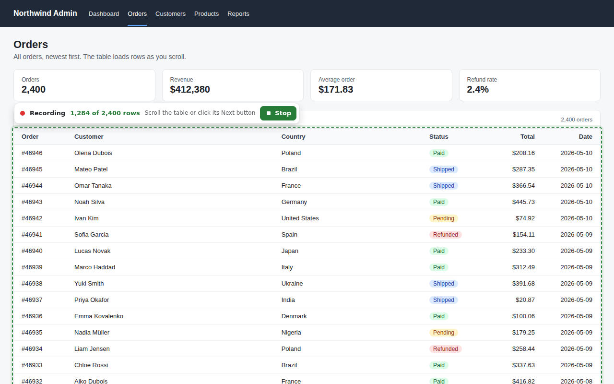
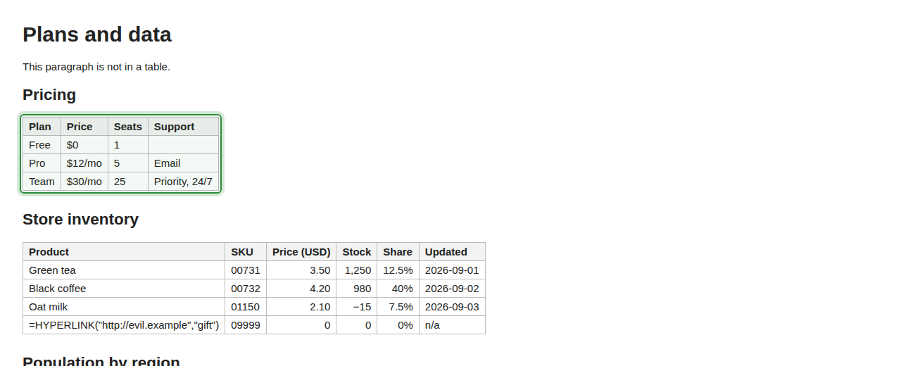
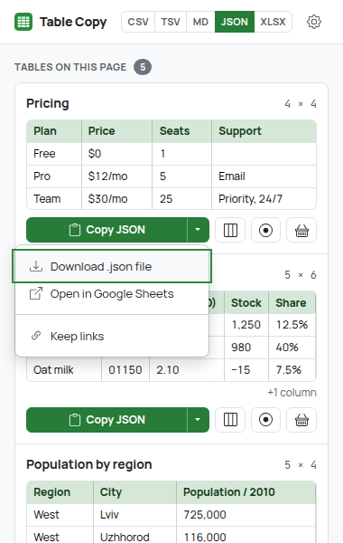
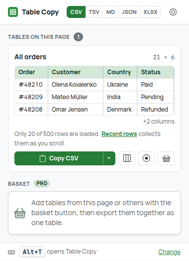
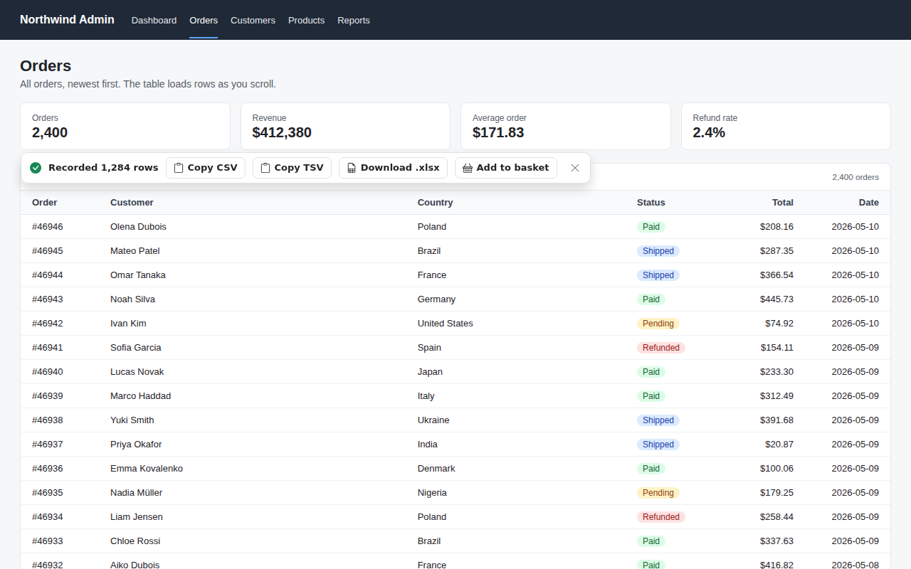
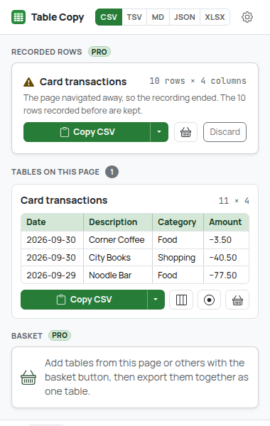

# Table Copy

Get any table out of a web page as data: **CSV**, **TSV** (pastes into Excel and Google Sheets
as cells), **Markdown** or **JSON**, as a file, or as a real **Excel file (.xlsx)**. It reads
`<table>`s and the data grids web apps build from `<div>`s (AG Grid, MUI DataGrid and other
ARIA grids). **Record rows** collects every row of grids that only show a few at a time
(virtualized or paginated) while you scroll or page through them. Pick and reorder columns first,
and collect tables from several pages into one merged export.

| Every table on the page | Dark mode |
| --- | --- |
|  |  |



| Column picker (Pro) | Basket: merge tables (Pro) |
| --- | --- |
|  |  |


## How to use

### Copy a table from the page

1. Right-click inside a table (no need to select anything; selecting a word works too).
2. Open **Table Copy**.
3. Pick **Copy table as CSV**, **TSV (Excel, Sheets)**, **Markdown** or **JSON**.
4. A small confirmation appears in the bottom-right corner with what was copied. After a
   right-click without a selection it names the table it picked ("Store inventory · 5 rows × 6
   columns"), so a wrong guess is obvious.

Without a selection Table Copy uses the table under the right-click: Chrome's menu gives
extensions no click position, but the right-click leaves the text caret there (and moves focus to
grid cells, which is how grids that block text selection are found). On a page with a single
table that one is used. **Add table to basket (merge later)** works the same way.

### Pick a table in the popup

Click the Table Copy toolbar icon, or press **Alt+T** (change it at
`chrome://extensions/shortcuts`). The popup lists every table and data grid on the page with its
title (caption, ARIA label or nearest heading), its size (rows × columns) and a preview of the
first rows. Headers show exactly as they will be exported (grouped headers combined:
`Population / 2010`, never cut off); columns that don't fit are counted (**+2 columns**) and named
in the tooltip. Hovering a card, or moving the keyboard focus into it, outlines that table on the
page and scrolls it into view; the outline goes away when the popup closes.



**The format switch** in the header (**CSV · TSV · MD · JSON · XLSX**) sets what every button in
the popup produces. It's remembered.

Under each table:

- **Copy CSV** (or TSV, Markdown, JSON; **Download .xlsx** when XLSX is selected) is the main
  button. It turns into **Copied**.
- **▾** opens a menu: **Download .csv file** (or `.tsv`, `.md`, `.json`), **Open in Google
  Sheets** and **Keep links**. Keyboard: ↓ opens it, arrows move, Esc closes.
- Icon buttons (with a tooltip on hover and focus): **Columns** (Pro), **Record rows** (Pro) and
  **Add to basket** (Pro).

| Copy ▾ menu | A virtualized grid |
| --- | --- |
|  |  |

Which format to pick:

| Format | Best for |
| --- | --- |
| TSV | Pasting into Excel or Google Sheets: every value lands in its own cell |
| CSV | Saving as a `.csv` file or importing into other tools |
| Markdown | GitHub, notes apps, AI chats |
| JSON | Code: an array of objects keyed by the column headers |
| .xlsx | Opening in Excel, Numbers, LibreOffice or Google Sheets with numbers ready to sum and sort |

**Download a file** (free): Copy ▾ → **Download .csv file** saves the table in the selected
format. CSV and TSV files start with a UTF-8 byte order mark so Excel reads accented and
Cyrillic text correctly. Files are saved with a regular download link, no extra permission.

**Open in Google Sheets** (free): Copy ▾ → **Open in Google Sheets** puts the table on the
clipboard as TSV (with an HTML table, so it pastes as cells) and opens a new, empty sheet at
`sheets.new`. Click cell A1 and paste with **Ctrl+V** (**⌘V** on a Mac); the popup says so before
the tab opens. Table Copy sends nothing to Google. **Unverified**: Google isn't reachable from the
test environment; the e2e test checks the clipboard and that the new tab opens `sheets.new`.

**Keep links** (free, off by default; in Copy ▾ and in the settings): when a cell is exactly one
link, CSV, TSV, JSON and `.xlsx` get an extra **"<Column> URL"** column right after it with the
full address, and Markdown writes the cell as `[text](url)`. Only `http`/`https` links count
(no `mailto:`), tracking parameters (`utm_*`, `fbclid`...) are removed, links in header cells
(sort links) are ignored, and a cell with text around its link is left as text.

### Record rows (Pro)

Data grids in web apps (AG Grid, MUI DataGrid, most dashboards) keep only the ~20-50 rows around
the scroll position in the page, and paginated tables replace their rows when you click Next.
Every other table tool copies just what's on screen. Record rows collects them all:

1. In the popup, click **Record rows** (the ⦿ button) under the table. Grids that say they have
   more rows than they show get a hint: "Only 20 of 500 rows are loaded."
2. The popup closes and a bar appears above the table: **Recording · 1,284 of 2,400 rows ·
   Stop** (the "of" part when the grid declares its size with `aria-rowcount`).
3. Scroll through the grid, or click the site's own **Next** button until the last page. Table
   Copy never scrolls or clicks anything itself.
4. Press **Stop**. The bar offers **Copy CSV**, **Copy TSV**, **Download .xlsx** and **Add to
   basket**. The popup keeps the recording (Copy ▾ in any format, basket) until you press
   **Discard**.



How rows are merged: rows with an `aria-rowindex` are the same row whenever that index comes back
and the result is in index order, whatever order the grid rendered them in. A grid that numbers
every page from 1 again is detected and its pages are appended (going back with Previous adds
nothing). Rows without an index are identified by their content: a row seen again is the same
row, identical rows on the same page are kept, and new rows are placed next to the rows they
appeared with. The header comes from the first capture; repeated header rows and empty rows are
skipped; a "Loading…" placeholder row never overwrites real data.

It works within one page: virtual scrolling and pages loaded with AJAX. If the page navigates
(a full reload or a link), the recording ends with it: the popup then says "The page navigated
away, so the recording ended" and keeps the rows recorded before. If the site replaces the whole
table element, the recording follows the new one (same header); if the table disappears for 3
seconds, it stops and says so.



### Choose and reorder columns (Pro)

Click **Columns** under a table. Every column is listed with a sample of its values. Untick the
ones you don't need, type in **Filter columns** to find one in a wide table, and reorder by
dragging the handle (⋮⋮) or with the ↑/↓ buttons (keyboard). **All** / **None** apply to the
columns the filter shows. The preview shows the result, and every copy, download, basket add and
recording of that table uses it.

### Merge tables from several pages (Pro)

1. On each page, add a table to the basket: the basket button in the popup, right-click inside
   the table → **Table Copy → Add table to basket**, or **Add to basket** on a recording.
2. Open the popup (on any page). The **Basket** section lists what you collected, with each
   table's size and site.
3. Check the preview: the first merged rows, and a chip per column: green when every table has
   it (matched by header), amber when only some tables do (left empty for the others).
4. Export everything as one table with the Copy ▾ button (any format).

Rows are stacked and columns are lined up **by header name**, so tables with the same columns in a
different order, or with a few extra columns, merge cleanly. **Source columns** adds `Source`
(the table's title) and `Source URL` in front. With the XLSX format you can choose **One sheet**
(stacked) or **Sheet per table**. The basket lives in this browser until you remove tables or
press **Clear**; it holds up to 20 tables (250,000 cells).

### Settings

Right-click the toolbar icon → **Options** (or the gear in the popup):

| Options | Dark mode |
| --- | --- |
|  |  |

- **CSV delimiter**: comma, or semicolon for Excel in locales that write decimals with a comma
  (Ukraine, Germany, France...). The default follows the browser's language.
- **Keep links**: see above.
- **Save numbers as numbers** (.xlsx): on by default, see below.
- **About Pro**: what Pro adds and its price.

When something can't be copied, the message says what happened and what to do instead:


## Free vs Pro

| Free | Pro ($2.99 one-time) |
| --- | --- |
| Copy any table or data grid as CSV, TSV, Markdown or JSON from the context menu (right-click anywhere in the table) or the popup | **Record rows**: every row of virtualized and paginated grids, collected as you scroll or page |
| Download CSV, TSV, Markdown and JSON files | **Download .xlsx** (one table, a recording, or the whole basket) |
| Open in Google Sheets, Keep links | **Column picker**: choose, filter and reorder columns before exporting |
| Popup with every table, previews, format switch, outline on the page | **Merge tables**: a basket of tables from one or more pages, exported together |
| Keyboard shortcut, CSV delimiter setting, confirmations | |

Payments are not set up yet: during **early access every Pro feature is on for everyone**
(`EARLY_ACCESS = true` in `src/core/plan.ts`). Pro shows once where it applies: a `PRO` badge
on the Basket and Recorded rows sections and in the column picker, "· Pro" in the tooltips of the
Columns, Record rows and basket buttons, and a lock icon on those buttons (and on XLSX in the
format switch) only when the plan doesn't include them. Every Pro check goes through
`hasFeature()` / `limitsFor()` in `src/core/plan.ts`; the stored plan (`chrome.storage.local`,
key `plan`) is `free` unless a future `src/payments/` adapter sets it. When early access ends, a
free user who clicks a Pro feature gets one calm line ("Record rows is part of Table Copy Pro
($2.99, one-time).") with a link to **About Pro**; nothing is deleted, and a recording made
earlier can still be copied from the popup. See `docs/MONETIZATION.md` at the repository root.

## What the conversions do

**Reading tables**
- Tables are `<table>` elements and ARIA grids: elements with `role="grid"`, `"table"` or
  `"treegrid"` built from `role="row"` and `columnheader` / `rowheader` / `cell` / `gridcell`
  (AG Grid, MUI DataGrid, TanStack-style and hand-made dashboards).
- Only what's visible is copied: hidden rows and cells, hidden sort keys, screen-reader-only
  text, buttons, form controls (row checkboxes), scripts and Wikipedia footnote markers (`[1]`)
  are skipped.
- Header rows: `<thead>`, otherwise leading rows of `<th>`, otherwise a first row of bold cells.
  In grids: leading rows made only of `columnheader` cells.
- `colspan`/`rowspan` are expanded into a rectangular grid (the value is repeated in every cell it
  covers), following the HTML table model. In grids, `aria-colspan` is honoured.
- Grids: rows are ordered by `aria-rowindex` and rows that share one are joined (AG Grid splits a
  row across its pinned and scrolling containers); cells go to the column their `aria-colindex`
  names, gaps become empty cells. Columns empty everywhere (checkbox and filler columns) are
  dropped.
- Nested tables stay inside their cell (as text). Layout tables (`role="presentation"`), hidden
  tables and one-cell tables are not listed.
- Empty rows and trailing empty columns are dropped; empty cells are kept.

**CSV** follows RFC 4180 (fields with the delimiter, quotes or line breaks are quoted, quotes
doubled). Values are never changed.

**TSV** also puts an HTML `<table>` on the clipboard, so spreadsheets get real cells. Cells that
would run as a formula when pasted (`=...`, `@...`, `+`/`-` followed by non-numbers) get a
leading `'`, which spreadsheets treat as "this is text". Numbers like `-5` are untouched.

**Markdown**: a GitHub pipe table. Several header rows are combined (`Population / 2010`), a
table without a header gets an empty header row, pipes and Markdown syntax are escaped
(`snake_case` stays readable), line breaks become `<br>`. With Keep links, linked cells are
`[text](url)` (parentheses and spaces in the URL are percent-encoded).

**JSON**: an array of objects keyed by the header, in column order. Empty names become
`Column N`, duplicates get ` 2`, ` 3`. Values stay strings.

**Files**: the same text as the clipboard, ending with a line break; `.csv` and `.tsv` start with
a UTF-8 byte order mark.

**.xlsx**: a standard Office Open XML workbook written by Table Copy itself (a zip of the
SpreadsheetML parts, zipped with the small `fflate` library). The header row is bold and frozen,
columns are sized to their content, multi-line cells wrap. Cell text is always stored as text,
never as a formula, so `=HYPERLINK(...)` from a page can't run. With **Save numbers as numbers**
on, a cell becomes a number only when that's unambiguous:

- `42`, `-7`, `−7`, `3.50`, `1,250`, `2,952,301.5`, `10 000` become numbers; `12.5%` becomes
  0.125 shown as a percentage; grouped numbers keep a `#,##0` format.
- The decimal separator follows the page's language (`<html lang>`): on a German page `1.234,5`
  is 1234.5; on an English page `1,5` stays text.
- Leading zeros (`007`, ZIP codes), more than 15 significant digits (IDs, card numbers Excel
  would round), currency (`$12`), units, dates, versions and anything else stay text, exactly as
  on the page.
- A stacked basket sheet that mixes pages with different decimal separators keeps its cells as
  text.

## Privacy

Everything runs locally. Table Copy has no backend, no account, no analytics and no remote code,
and it makes no network requests (fonts, icons and the zip library are bundled). **Open in Google
Sheets** opens a browser tab at `sheets.new`, like clicking a link; the table only goes to your
clipboard.

- Nothing is read from a page until you use the context menu or open the popup on it. It uses
  `activeTab`, not access to all sites, and has no always-on content scripts. A recording
  watches only the table you chose, only on that page, until you stop it or leave the page.
- Settings, the basket and the last recording are stored in `chrome.storage.local`, in this
  browser only. The basket and the recording keep the tables' cell text, title and page address
  until you remove them.

Full privacy policy: [`PRIVACY.md`](PRIVACY.md).

### Permissions

No new permissions were added for the features above.

| Permission | Why |
| --- | --- |
| `activeTab` | Read the tables of the current tab, only after you use the context menu or open the popup on it |
| `scripting` | Inject the table reader, the confirmation message, the outline and the recording bar into that tab on demand |
| `contextMenus` | The Table Copy right-click menu (on a selection, anywhere on a page and on links, since table cells are often links) |
| `storage` | Settings, the basket, the last recording, and a short-lived message for the popup when a page can't show one |
| `offscreen` | A hidden extension page that writes to the clipboard for the background worker (context menu, recording bar) |
| `clipboardWrite` | Put the table (text, plus an HTML table for TSV) on the clipboard |

No `downloads` permission: files are saved with a regular download link (from the popup, or from
the page for the recording bar's `.xlsx`). No `tabs` permission: `chrome.tabs.create` (Open in
Google Sheets, About Pro) needs none.

## Development

Requires Node.js 22.12+.

```bash
npm install
npm run build        # production build -> dist/
npm run dev          # rebuild on change (with source maps) -> dist/
npm run typecheck
npm test             # unit tests (vitest, jsdom for DOM-reading code)
npm run test:e2e     # builds dist/ and dist-e2e/, drives dist-e2e/ in real Chromium
npm run screenshots  # same as test:e2e, and refreshes screenshots/
npm run icons        # re-render the PNG icons after changing static/icons/icon.svg
npm run check        # typecheck + unit tests + build
npm run package      # typecheck + unit tests + release/table-copy-<version>.zip
```

`test:e2e` needs a Chromium build. It's auto-detected in some environments; otherwise set
`CHROMIUM_PATH=/path/to/chromium`. It serves local fixture pages under example host names
(`stats.example.org`, `shop.example.com`, `store.example.net`, `app.example.com`,
`docs.example.org`), calls the context-menu handler through a test hook (native menus can't be
automated; the hook exists only in `dist-e2e/`), right-clicks for real to test the menu without a
selection, reads the clipboard, catches downloads and unzips `.xlsx` files, and scrolls and pages
fixture grids like a user to test Record rows: a virtualized orders grid that renders 20 of 500
(and 2,400) rows by scroll position with `aria-rowindex`, and a transactions table whose Next
button replaces its rows. `sheets.new` resolves to a closed local port, so the test checks the
new tab without leaving the machine. All screenshots go to `e2e/output/` (git-ignored);
`npm run screenshots` also updates the curated ones in `screenshots/`.

The UI is Bootstrap 5.3 compiled from Sass (only the partials in use), Bootstrap Icons inlined as
SVG, and the Manrope and JetBrains Mono variable fonts (Latin, Latin Extended and Cyrillic
subsets), all bundled. See `docs/design-system.md` at the repository root. The in-page
confirmation, outline and recording bar use a separate, smaller Sass entry scoped to their shadow
roots and system fonts. The brand green `#2b8a3e` gives 4.4:1 with white text, so buttons and
links use a 10% darker shade (5.2:1).

### Load the extension in Chrome

1. `npm install`
2. `npm run build`
3. Open `chrome://extensions`
4. Turn on **Developer mode** (top right)
5. Click **Load unpacked**
6. Select the `dist/` directory

After a rebuild, press the reload icon on the Table Copy card in `chrome://extensions`.

### Packaging for the Chrome Web Store

`npm run package` checks and zips `dist/` into `release/table-copy-<version>.zip`. `dist/` is the
complete extension: no source maps, no test code (the e2e hook is compiled out and the check is
part of the e2e test), unminified identifiers so review is easy, and `THIRD_PARTY_NOTICES.txt`
with the licenses of Bootstrap, Bootstrap Icons, fflate (MIT), Manrope and JetBrains Mono (SIL
OFL 1.1). Listing copy and graphics are in `store/`.

## Project structure

```
src/
  core/        Pure logic, no DOM or Chrome APIs: the snapshot model, whitespace
               normalization, cell text, the table model (spans, headers), ARIA grid
               layout (grid.ts), Keep links (links.ts), row recording merge (recording.ts),
               text formats and files, the .xlsx writer, number detection, column picker,
               basket/merge, plan, settings
  page/        Injected on demand (page.js): reads tables and ARIA grids from the live DOM
               (visibility from computed styles) into a grid of cell texts, lists tables for
               the popup, finds the table under a right-click, shows the toast and the outline
  recorder/    Injected on demand (recorder.js) for Record rows: watches one table, merges
               captures, the recording bar
  background/  Service worker: context menu, copy and basket flows, clipboard
  offscreen/   Offscreen document that writes text/plain + text/html to the clipboard
  popup/       Toolbar popup: format switch, table cards and Copy ▾ menu, column picker,
               basket, recording, outline on hover
  options/     Settings and About Pro
  platform/    executeScript wrapper and messages between contexts
  storage/     chrome.storage wrappers (settings, plan, basket, recording)
  styles/      Sass: theme, extension pages, in-page toast/outline/bar
  ui/          DOM, icon, clipboard, download and formatting helpers
static/        manifest.json, HTML, icons
test/          Unit tests (grids and the page reader run in jsdom on AG Grid- and MUI-like markup)
e2e/           Chromium smoke test and fixture pages
screenshots/   Curated screenshots for this README
store/         Chrome Web Store listing copy and graphics
```

How a copy works: the background (or popup) injects `page.js` into the tab with
`chrome.scripting.executeScript`. It reads the table into a **snapshot** (a plain-data tree with
only whitelisted tags and attributes, visibility resolved from computed styles; an ARIA grid is
laid out into the same `<table>` shape first) and turns it into a rectangular grid of cell texts
right there, so only that grid leaves the page. Every format, the column picker, the basket merge
and the `.xlsx` writer work on that grid in `src/core/`. The background writes to the clipboard
through the offscreen document (a `copy` event listener sets `text/plain` and `text/html`
together); the popup writes directly.

How a recording works: the popup injects `recorder.js` and starts it on the chosen table. A
`MutationObserver` on the table (and a scroll listener) triggers a capture of the rows currently
in the DOM as soon as they change, at most every 50 ms (less often for huge tables); each capture
is merged by `src/core/recording.ts`. The recording is saved to `chrome.storage.local` as it
grows, so the popup can still export it after the page navigates away.

The table engine (reader, span grid, CSV/TSV/JSON writers, formula protection) started as a copy
of Universal Copy's (`universal-copy/`); the folders share no code at build time.

## Limits

- At most 2,000,000 characters and 200,000 elements are read from a table; beyond that the first
  part is copied and the message says so.
- Tables: at most 1,000 columns, 100,000 rows and 2,000,000 cells after span expansion.
- Recordings: at most 100,000 rows and 2,000,000 cells. Storage (for the popup and after a
  navigation) keeps the first 250,000 cells; the bar on the page has all of them, and the popup
  says when its copy is partial.
- The popup lists up to 100 tables and previews the first 3 rows and up to 6 columns of each.
- A 5,000-row × 8-column table copies as CSV in under a second and downloads as `.xlsx` in about
  a second in the e2e test.
- Cells longer than Excel's 32,767-character limit are cut in `.xlsx` files.

## Known limitations

- Pages Chrome doesn't let extensions script (`chrome://`, the Chrome Web Store, the built-in PDF
  viewer) can't be read; the context menu shows a badge and the popup explains why. The basket
  and the last recording can still be exported from there.
- Only the top frame is read by the popup (and recorded). The context menu reads the frame you
  right-clicked in, if `activeTab` covers it (same site as the tab).
- "Tables" made of plain `<div>`s without ARIA roles (CSS grids, card lists) and tables inside
  shadow DOM aren't found. ARIA grids are.
- **AG Grid and MUI DataGrid are unverified on the real libraries**: the unit and e2e tests use
  markup modelled on their current DOM (pinned containers, grouped headers, floating filters,
  checkbox columns, `aria-rowindex`/`aria-colindex`), not the live libraries or real sites.
- Record rows only sees rows while they're in the page. Scrolling very fast (dragging the
  scrollbar) can skip rows a grid renders for less than ~50 ms; the counter shows it ("1,284 of
  2,400 rows"), and scrolling back over the gap picks them up. Grids that also virtualize
  columns only give the columns that were on screen. Re-sorting or filtering the grid while
  recording, or live data that reorders rows, can mix or duplicate rows: stop, and record again.
  Rows without `aria-rowindex` are told apart by content, so an identical row on two different
  pages is kept once.
- Record rows ends when the page navigates (classic `?page=2` links reload the page): the rows
  recorded before are kept, but multi-page recording only works for pages loaded in place.
- The right-click without a selection uses the text caret and focus. On a page that blocks text
  selection (`user-select: none`) in a table whose cells can't take focus, it may pick the table
  where you last clicked; the confirmation names the table it copied. Select a word in the table
  or use the popup instead.
- **Open in Google Sheets is unverified** against Google: the sandbox can't reach it. Pasting the
  TSV (with its HTML table) into a new sheet is how Google Sheets imports clipboard tables, but
  it hasn't been tried here.
- The `.xlsx` output was checked by unzipping it and parsing every part in the unit and e2e tests,
  and by opening it with `openpyxl`; opening it in desktop Excel, Numbers and Google Sheets
  hasn't been tested here (no spreadsheet app in the test environment). **Unverified in real
  Excel.**
- The number detection uses the page's declared language; a page with the wrong `lang` (or none,
  which means `.`) can turn `1,5` into text or `1,234` into 1234 when the author meant 1.234.
- The apostrophe protection for formula-like cells in TSV is based on how Excel and Google Sheets
  treat a leading `'`; pasting into real Excel/Sheets hasn't been tested here. The TSV text and
  HTML on the clipboard are verified.
- Downloads use a download link in the popup (and in the page for the recording bar). Verified in
  Chromium with the popup page opened as a tab (the e2e test); the same code runs in the real
  toolbar popup.
- The shortcut is **Alt+T** (checked by the e2e test to be really assigned by Chrome); it hasn't
  been verified on macOS (where Alt is Option). On macOS a right-click selects the word under the
  pointer, so the menu uses the selection path; that's covered by the selection tests, not tested
  on a Mac.
