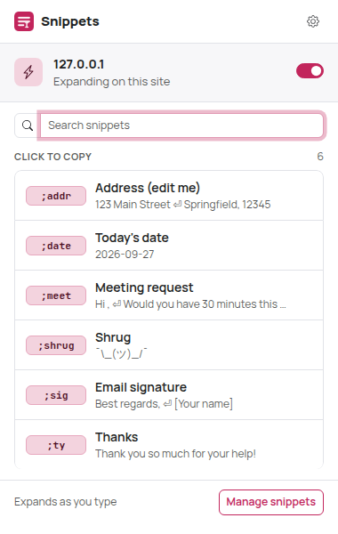
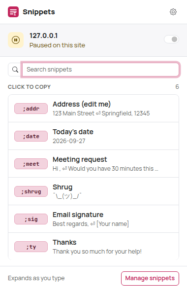
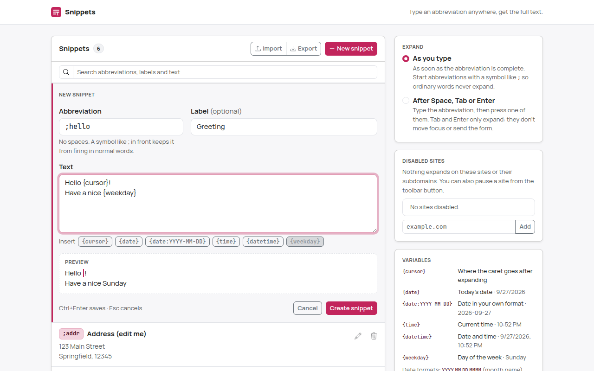
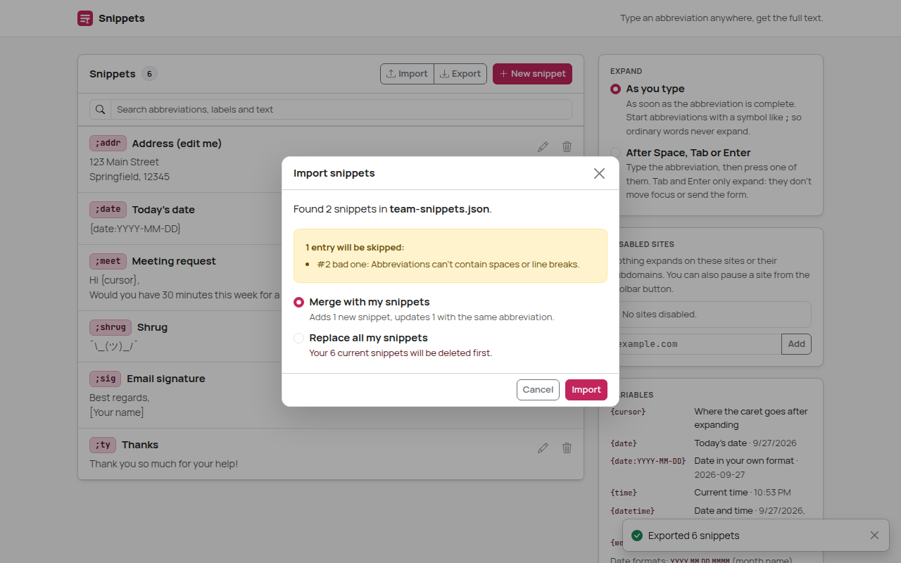
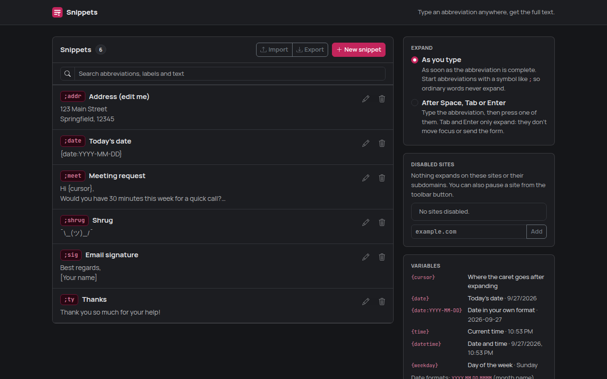

# Snippets: text expander

Type a short abbreviation like `;sig` in any text field and it turns into your saved text:
a signature, an address, a canned reply, today's date.

Snippets runs entirely in your browser. No account, no server, no analytics, no network requests.


| Toolbar popup | Paused on a site | Dark mode |
| --- | --- | --- |
|  |  |  |


## How to use

1. **Install it.** Build and load the extension (see [Load the extension in Chrome](#load-the-extension-in-chrome)).
   On first install Snippets adds six starter snippets: `;sig`, `;ty`, `;addr`, `;date`, `;meet`
   and `;shrug`. Tabs that were already open need a reload before snippets expand in them.
2. **Try one.** Click into any text field on a web page (a comment box, an email, a search field)
   and type `;ty`. As soon as you type the `y`, it becomes "Thank you so much for your help!".
3. **Undo if you didn't mean it.** Press **Backspace** right after an expansion and you get `;ty`
   back. **Ctrl+Z** (⌘Z on macOS) also works, through the page's own undo.
4. **Make your own.** Click the Snippets toolbar button → **Manage snippets** (or right-click the
   button → Options), then **New snippet**:
   - **Abbreviation**: what you type, e.g. `;hello`. No spaces. Start it with a symbol like `;`
     so it never fires in the middle of ordinary words. The manager warns you when an
     abbreviation is a plain word, or when one abbreviation is the start of another (`;s` and
     `;sig`: while you type `;sig`, `;s` fires first).
   - **Label** (optional): a name for lists and search, e.g. "Greeting".
   - **Text**: what gets inserted. Line breaks are kept (in single-line inputs they become spaces).
   - Save with the button or **Ctrl+Enter**. The new snippet works right away in every open tab.

   
5. **Use variables.** Click the chips under the text box to insert them:

   | Variable | Inserts |
   | --- | --- |
   | `{cursor}` | Nothing; the caret ends up here after expanding (e.g. `Hi {cursor},`) |
   | `{date}` | Today's date in your browser's format, e.g. 9/27/2026 |
   | `{date:YYYY-MM-DD}` | The date in your own format, e.g. 2026-09-27 |
   | `{time}` / `{time:HH:mm}` | The current time, e.g. 3:07 PM / 15:07 |
   | `{datetime}` | Date and time |
   | `{weekday}` | Day of the week, e.g. Sunday |

   Format tokens: `YYYY` `YY` `MMMM` (month name) `MMM` `MM` `M` `DD` `D` `dddd` (weekday) `ddd`
   `HH` `H` `hh` `h` `mm` `ss` `A`/`a` (AM/PM). Text in `[brackets]` is kept as is. Any other
   `{text in braces}` is left untouched, so code and templates are safe.
6. **Pick when snippets expand** (manager → *Expand*):
   - **As you type** (default): the moment the abbreviation is complete.
   - **After Space, Tab or Enter**: type the abbreviation, then press one of them. Space is kept
     after the text; Tab and Enter only expand (they don't move focus, submit a form or send a
     chat message).
7. **Pause it on a site.** Click the toolbar button and turn off the switch next to the site
   name. It applies immediately, also inside the site's iframes. The manager's *Disabled sites*
   list shows all paused sites; an entry covers its subdomains (`example.com` also pauses
   `mail.example.com`).
8. **Copy instead of typing.** In the toolbar popup, search and click a snippet (or press Enter
   for the first match) to copy its text, with variables filled in, to the clipboard. Handy
   where Snippets can't type (see [Where it works](#where-it-works)).
9. **Back up or share.** *Export* downloads all snippets as JSON. *Import* reads such a file
   (or a plain JSON list of `{ "abbreviation", "text", "label" }` objects), shows what will be
   added, updated or skipped, and lets you **merge** or **replace** your snippets.

   



## Where it works

- `<input>` of type text, search, email, url and tel; `<textarea>`; `contenteditable` editors.
- React/Vue-controlled fields: the page's state receives the expanded value.
- Inputs and editors inside open shadow roots (web components).
- Iframes, including cross-origin ones and `about:blank`/`srcdoc` frames that editors like
  TinyMCE use. Pausing a site also pauses the frames embedded in it.
- **Never** in password fields, fields marked `autocomplete="one-time-code"`, credit-card fields
  (`autocomplete="cc-…"`), revealed-password fields (`current-password`/`new-password`),
  read-only or disabled fields.
- IME composition (Chinese, Japanese, Korean input…) is never touched; neither are keys pressed
  with Ctrl, Alt or ⌘.

If a page cuts a snippet short (a `maxlength`) or refuses it, a small notice appears in the
corner of the page instead of failing silently.

### Known limitations

- **Canvas-based editors** (Google Docs, Google Sheets) draw text themselves and expose no
  editable text, so expansion can't work there. Use the popup's copy instead.
- **Editors that handle every keystroke themselves** may not notice or may undo the insertion:
  Slate-based editors, some chat apps, code editors built on a hidden textarea (Monaco,
  CodeMirror 5) and terminal emulators (xterm.js). ProseMirror, Lexical, Quill, TinyMCE and
  CKEditor use `contenteditable` and are expected to work, but none of these were tested
  against the real products (the build environment has no access to real websites; everything
  is verified against local fixture pages).
- In a `contenteditable`, only the text node that holds the caret is checked: an abbreviation
  split across formatting (`;s`**`ig`**) doesn't expand.
- Email inputs don't expose the caret position; Snippets assumes you type at the end there, and
  Ctrl+Z may not restore the abbreviation in them (Backspace does).
- Pages Chrome doesn't let extensions script: `chrome://` pages, the Chrome Web Store, the PDF
  viewer. Closed shadow roots can't be reached either.
- Tabs opened before installing or updating Snippets need a reload; the popup says so.
- `{clipboard}` is not supported: it would need the `clipboardRead` permission. The plan is an
  optional permission requested only when a snippet uses it; left out of the MVP.
- Abbreviations are case-sensitive. One that starts with a letter or digit (`brb`) only expands
  at the start of a word; one that starts with a symbol (`;brb`) expands anywhere.

## Privacy

Snippets never sends anything anywhere. There is no backend and no analytics, and the e2e test
asserts that no network request leaves the browser.

**Why it runs on every site.** A text expander has to notice what you type wherever you type it,
so the content script is declared for all sites and frames (`<all_urls>`, `all_frames`,
`match_about_blank`, `document_idle`). Chrome shows this as "Read and change all your data on all
websites". What the script actually does per keystroke: if the typed character can't be the last
character of any abbreviation (a Set lookup), it stops. Otherwise it reads only as many
characters before the caret as your longest abbreviation has (plus one), looks them up in a Map,
and replaces a match. Nothing you type is
stored, logged or sent; it never reads a page's other content.

**Storage.** Snippets and settings live in `chrome.storage.local`, in this browser only.
`chrome.storage.sync` would roam across devices, but its quota (100 KB in total, 8 KB per item)
is too small for a real snippet library, so there is no sync; use Export/Import to move snippets.
Everything read from storage is sanitized first.

### Permissions

| Permission | Why |
| --- | --- |
| Content script on `<all_urls>` | See typing in text fields on every site to expand abbreviations (see above) |
| `storage` | Keep snippets and settings in `chrome.storage.local` |
| `activeTab` | Read the current tab's address when you open the popup, to show and toggle "Expanding on this site". No `tabs` permission, no host permissions |

## Development

Requires Node.js 22.12+ (vitest 5). Building alone works on Node 18+.

```bash
npm install
npm run build        # production build -> dist/
npm run dev          # rebuild on change (with source maps) -> dist/
npm run typecheck
npm test             # unit tests (vitest)
npm run check        # typecheck + unit tests + build
npm run test:e2e     # builds dist/ and dist-e2e/, drives them in real Chromium
```

`test:e2e` needs a Chromium build. It's auto-detected in some environments; otherwise set
`CHROMIUM_PATH=/path/to/chromium`. `HEADED=1` shows the browser, `ONLY=text` runs only the tests
whose name contains `text`. Screenshots of every UI state go to `e2e/output/` (git-ignored); the
curated ones used in this README are copied to `screenshots/`.

Icons are rendered from `static/icons/icon.svg` with `node scripts/make-icons.mjs` (the PNGs are
committed).

### Load the extension in Chrome

1. `npm install`
2. `npm run build`
3. Open `chrome://extensions`
4. Turn on **Developer mode** (top right)
5. Click **Load unpacked**
6. Select the `dist/` directory

After a rebuild, press the reload icon on the Snippets card in `chrome://extensions`, then reload
the tabs you want to use it in.

### Packaging for the Chrome Web Store

`dist/` is the complete extension: no source maps, no test code (the e2e hooks are compiled out),
unminified identifiers so review is easy. Zip the *contents* of `dist/` and upload that.

## Project structure

```
src/
  core/         Pure logic, no DOM or Chrome APIs (unit-tested): snippet model and
                validation, abbreviation matcher, variables and date formats, settings and
                site list, field eligibility, import/export, starter snippets
  content/      Expansion engine: key/input listeners, caret reading, replacement and
                Backspace-undo in inputs and editors, the in-page notice
  background/   Service worker: adds the starter snippets on first install
  popup/        Toolbar popup: site switch, search, click to copy
  options/      Snippet manager and settings
  storage/      chrome.storage wrappers (sanitized reads, serialized writes)
  styles/       Bootstrap 5.3 theme (Sass) for the pages and the in-page notice
  ui/           DOM builder, Bootstrap Icons, clipboard helper
static/         manifest.json, HTML, icons
test/           Unit tests
e2e/            Chromium smoke test and fixture pages
screenshots/    Curated screenshots for this README
```

## How expansion works

- **Hot path.** Snippets are kept in a `Map` keyed by abbreviation, plus a `Set` of every
  abbreviation's last character and the list of distinct lengths. In "as you type" mode the
  `input` event's typed character is checked against the Set first, before the page is touched;
  only then the few characters before the caret are read and looked up, longest first. With
  2,000 snippets the e2e test measures a mean of about 0.01 ms of Snippets' own work per
  keystroke (95th percentile at the page timer's 0.1 ms resolution).
- **Inputs and textareas.** The abbreviation is selected with `setSelectionRange` and replaced
  with `document.execCommand('insertText')`. That is the only editing API that keeps the
  field's native undo (Ctrl+Z) and fires real `input` events, so React/Vue state updates. If the
  command is unavailable, it falls back to `setRangeText` plus a dispatched `input` event; email
  inputs, which have no caret API, use the native value setter (bypassing React's value tracker)
  plus an `input` event. The caret goes to the end of the text, or to `{cursor}`.
- **contenteditable.** The abbreviation is selected in the current text node and replaced with
  `execCommand('insertText')`, so line breaks become the editor's own paragraphs or `<br>`s and
  the page's undo history stays intact. `{cursor}` moves the caret back with
  `Selection.modify`, counting grapheme clusters.
- **Backspace-undo.** The first key after an expansion decides: Backspace with the caret exactly
  where the expansion left it restores what you typed (including the space in delimiter mode).
  In inputs the inserted text is verified and replaced; in rich editors the native undo step of
  our own edit is taken back and checked (the restored selection must be the abbreviation,
  otherwise it's redone). Any other key, click or focus change forgets the expansion.
- **Shadow DOM.** Events are read at `window` in the capture phase; `composedPath()[0]` gives
  the real field inside open shadow roots.
- **Live updates.** The content script listens to `chrome.storage.onChanged`, so snippet edits,
  the trigger mode and the site switch apply without reloading pages.

## Decisions

- **Default trigger: as you type.** It's what most people expect from a text expander; the
  manager warns about plain-word abbreviations and unreachable prefixes, which are the two ways
  it goes wrong. Delimiter mode is one click away.
- **Tab and Enter are consumed in delimiter mode**, so an expansion never submits a form, sends a
  chat message or moves focus by accident. Space is kept because it's part of the sentence.
- **Word boundaries.** Abbreviations starting with a letter or digit only expand at a word start
  (`sig` doesn't fire inside `design`); symbol-prefixed ones expand anywhere.
- **Site entries cover subdomains**, and the popup stores the exact host (`www.google.com` does
  not pause `mail.google.com`). Re-enabling a site removes every entry that covers it.
- **Frames inherit the page's pause** through `location.ancestorOrigins`, so an editor iframe from
  another domain is paused together with the site that embeds it.
- **Delete has Undo** (a toast) instead of a confirmation dialog.
- **Limits:** abbreviations 2–32 characters, text up to 50,000 characters, up to 2,000 snippets,
  import files up to 5 MB.
- **UI stack:** Bootstrap 5.3 compiled from Sass with the raspberry brand color `#c2255c`,
  Bootstrap Icons inlined as SVG, bundled Manrope and JetBrains Mono fonts (see
  `docs/design-system.md` at the repository root). The in-page notice uses the system font in a
  closed shadow root.

## Testing

- **Unit tests** (`npm test`, vitest): matcher and word boundaries, prefix shadowing, variables
  and date formats (including locale month cases), validation and sanitizing, search, site
  matching, field eligibility, import/export, and the storage layer against a fake
  `chrome.storage` with interleaving async writes.
- **E2E** (`npm run test:e2e`, Playwright + real Chromium, local fixture pages): every field type
  above, React-like controlled inputs (the fixture emulates React's value tracker), open shadow
  roots, a cross-origin iframe, a `srcdoc` editor frame, password/OTP/card fields, IME
  composition, native undo and Backspace-undo, `{cursor}`, variables, delimiter mode (Space, Tab,
  Enter in a form), live settings changes, the popup (site switch incl. frames, copy, keyboard,
  restricted and not-yet-loaded tabs, the real toolbar popup via `chrome.action.openPopup()`),
  manager CRUD, validation, warnings, undo delete, disabled sites, export/import, loading and
  error states, a 2,000-snippet performance check, the production build, and no network requests.
- Not automatable: clicking the real toolbar button. The e2e build gets host access (never
  shipped) so the popup sees `tab.url` exactly as an `activeTab` grant would provide it.
