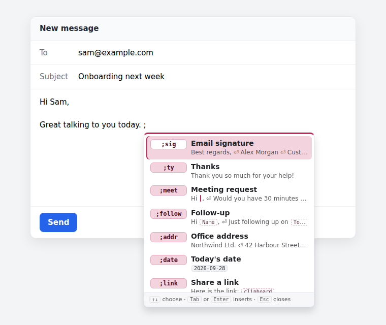
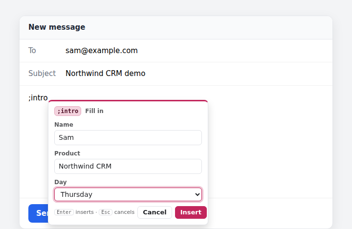
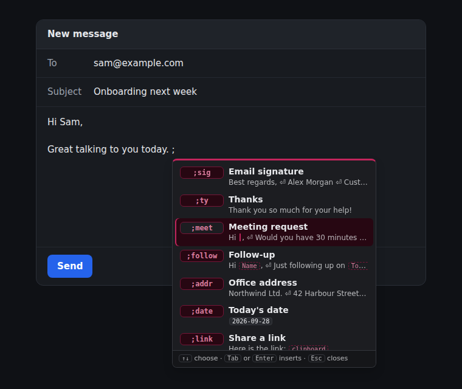
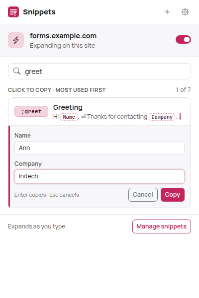
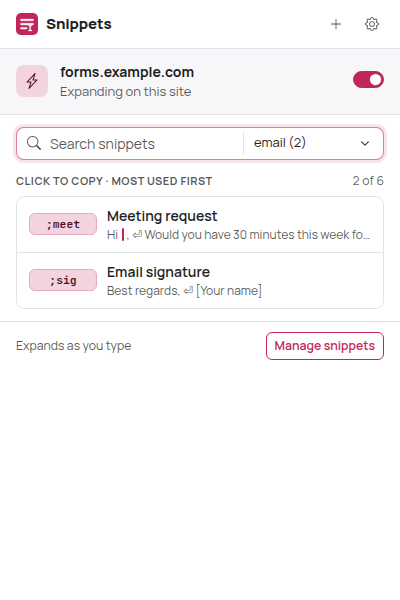
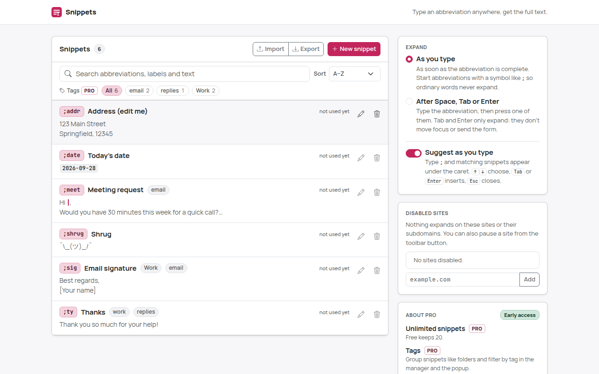
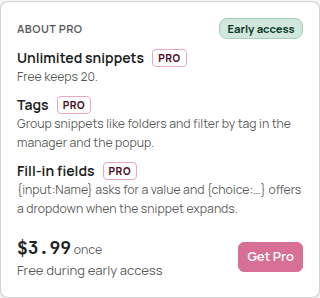
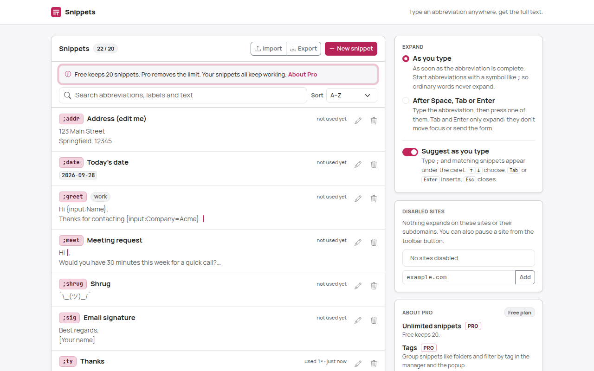

# Snippets: text expander

Type a short abbreviation like `;sig` in any text field and it turns into your saved text:
a signature, an address, a canned reply, today's date. Or type just `;` and pick the snippet
from a list under the caret.

Snippets runs entirely in your browser. No account, no server, no analytics, no network requests.



| Expanded as you type | Fill-in fields and dropdowns (Pro) | Suggestions in dark mode |
| --- | --- | --- |
|  |  |  |

| Toolbar popup (most used first) | Paused on a site | Dark mode |
| --- | --- | --- |
|  |  |  |


| Fill-in in the popup (Pro) | Tags in the popup (Pro) |
| --- | --- |
|  |  |

## How to use

1. **Install it.** Build and load the extension (see [Load the extension in Chrome](#load-the-extension-in-chrome)).
   On first install Snippets adds six starter snippets: `;sig`, `;ty`, `;addr`, `;date`, `;meet`
   and `;shrug`. Tabs that were already open need a reload before snippets expand in them.
2. **Try one.** Click into any text field on a web page (a comment box, an email, a search field)
   and type `;ty`. As soon as you type the `y`, it becomes "Thank you so much for your help!".
3. **Or pick from the list.** Type `;` at the start of a word: your snippets appear right under
   the caret, most used first, each with its abbreviation, name and a one-line preview.
   - Keep typing to filter: abbreviations that start with what you typed come first (`;me` →
     `;meet`), then snippets whose name has a word starting with it (`;thank` → "Thanks").
   - **↑/↓** move, **Tab** or **Enter** inserts the highlighted snippet (with its fill-in form
     if it has fields, like a normal expansion), **Esc** closes the list for the rest of that
     word. Clicking a snippet inserts it too; the caret stays in your field.
   - Enter and Tab are only taken while the list is showing. Without it, Enter sends or adds a
     line and Tab moves on, as always.
   - The list starts at any symbol your abbreviations start with (`;`, `/`, `!`...). In the
     middle of a word (`word;s`) it needs at least one character after the symbol. Typing the
     complete abbreviation still expands it at once.
   - It works in the same places as expansion (inputs, text areas, rich editors, iframes, open
     shadow roots), never in password fields, and not on paused sites. It opens above the caret
     when there's no room below. Turn it off in the manager (*Expand* → *Suggest as you type*).
4. **Undo if you didn't mean it.** Press **Backspace** right after an expansion and you get `;ty`
   back. **Ctrl+Z** (⌘Z on macOS) also works, through the page's own undo.
5. **Make your own.** Click the Snippets toolbar button → **+** (opens the manager with a new
   snippet), or **Manage snippets** (or right-click the button → Options) → **New snippet**:
   - **Abbreviation**: what you type, e.g. `;hello`. No spaces. Start it with a symbol like `;`
     so it never fires in the middle of ordinary words. The manager warns you when an
     abbreviation is a plain word, or when one abbreviation is the start of another (`;s` and
     `;sig`: while you type `;sig`, `;s` fires first).
   - **Label** (optional): a name for lists and search, e.g. "Greeting".
   - **Text**: what gets inserted. Line breaks are kept (in single-line inputs they become spaces).
     The box uses a monospace font so braces and `|` in variables are easy to read, and it grows
     with its text.
   - Save with the button or **Ctrl+Enter**. The new snippet works right away in every open tab.

   
6. **Use variables.** Click the chips under the text box to insert them; *What the variables
   do* under the chips explains each one. The preview under the editor (and every list in the
   popup, the manager and the suggestion list) shows dates as small chips with today's value,
   fill-in fields and `{clipboard}` as dashed chips, and `{cursor}` as a caret.

   | Variable | Inserts |
   | --- | --- |
   | `{cursor}` | Nothing; the caret ends up here after expanding (e.g. `Hi {cursor},`) |
   | `{date}` | Today's date in your browser's format, e.g. 9/27/2026 |
   | `{date:YYYY-MM-DD}` | The date in your own format, e.g. 2026-09-27 |
   | `{time}` / `{time:HH:mm}` | The current time, e.g. 3:07 PM / 15:07 |
   | `{datetime}` | Date and time |
   | `{weekday}` | Day of the week, e.g. Sunday |
   | `{clipboard}` | The plain text on your clipboard at that moment (needs clipboard access, see below) |
   | `{input:Name}` / `{input:Name=default}` | **Pro:** asks you for a value when the snippet expands (see step 11) |
   | `{choice:Name=A\|B\|C}` | **Pro:** a dropdown with these options when the snippet expands; the first is preselected |

   **`{clipboard}` and clipboard access.** Reading the clipboard needs Chrome's optional
   "Read data you copy and paste" permission. When you save a snippet that contains
   `{clipboard}`, Chrome asks for it (only then, and only once). Snippets reads the clipboard
   at the moment such a snippet is inserted or copied from the popup, never otherwise, and keeps
   nothing. If you don't allow it, `{clipboard}` inserts nothing and the editor says so, with an
   *Allow clipboard access* button. The manager's *Privacy* card shows whether access is on
   and has *Remove access*.

   Format tokens: `YYYY` `YY` `MMMM` (month name) `MMM` `MM` `M` `DD` `D` `dddd` (weekday) `ddd`
   `HH` `H` `hh` `h` `mm` `ss` `A`/`a` (AM/PM). Text in `[brackets]` is kept as is. Any other
   `{text in braces}` is left untouched, so code and templates are safe.
7. **Pick when snippets expand** (manager → *Expand*):
   - **As you type** (default): the moment the abbreviation is complete.
   - **After Space, Tab or Enter**: type the abbreviation, then press one of them. Space is kept
     after the text; Tab and Enter only expand (they don't move focus, submit a form or send a
     chat message).
8. **Pause it on a site.** Click the toolbar button and turn off the switch next to the site
   name. It applies immediately, also inside the site's iframes. The manager's *Disabled sites*
   list shows all paused sites; an entry covers its subdomains (`example.com` also pauses
   `mail.example.com`).
9. **Copy instead of typing.** In the toolbar popup, search and click a snippet (or press Enter
   for the first match) to copy its text, with variables filled in, to the clipboard. Handy
   where Snippets can't type (see [Where it works](#where-it-works)). The popup lists your most
   used snippets first (a search ranks by relevance, then by use); the order doesn't change
   under your pointer while the popup is open.
10. **See what you use.** Every insert counts: an expansion, a snippet picked from the list, a
    copy from the popup. Rows in the popup and the manager say "used 34× · 2 days ago" (the
    manager says "not used yet" for the others). The manager's **Sort** menu orders the list by
    **Most used**, **A–Z** (the default) or **Recent** (last used first, then the newest edits);
    the choice is remembered. Counts stay in this browser and aren't part of Export.
11. **Back up or share.** *Export* downloads all snippets as JSON. *Import* reads such a file
   (or a plain JSON list of `{ "abbreviation", "text", "label", "tags" }` objects), shows what
   will be added, updated or skipped, and lets you **merge** or **replace** your snippets.

   
12. **Ask for details as you type (fill-in fields and dropdowns, Pro).** Put `{input:Name}` in a
    snippet's text, or `{input:Name=default}` to prefill it; for a fixed set of answers use
    `{choice:Day=Tuesday|Wednesday|Thursday}` (options separated by `|`, the first is
    preselected). The editor's `{input:Name}` and `{choice:Name=A|B}` chips insert one and select
    "Name" so you can rename it. When the snippet expands, a small form opens next to the caret
    with one box or dropdown per field:
    - Type the value or pick an option (↑/↓ in a dropdown), **Tab** to the next field
      (Shift+Tab goes back; Tab wraps around inside the form), **Enter** inserts the snippet with
      your values.
    - **Esc** cancels: the abbreviation stays as you typed it and the caret goes back to it.
      Clicking somewhere else also cancels.
    - The same name used twice is asked once and fills both places. Variables and `{cursor}`
      work as usual next to fields; what you type into a field is inserted as plain text.
    - Works in inputs, textareas and `contenteditable` editors, in iframes and open shadow roots.
      In "After Space, Tab or Enter" mode the Space that opened the form is added after the
      text (or put back if you cancel).
    - In the toolbar popup, clicking such a snippet asks for the values right under it;
      **Enter** copies, **Esc** closes the form.

    Example: `Hi {input:Name},\n\nThanks for your interest in {input:Product=Northwind CRM}.
    Would {choice:Day=Tuesday|Wednesday|Thursday} work for a quick call?` typed as `;intro`
    (the picture at the top).
13. **Group snippets with tags (Pro).** In the editor, type tags separated by commas
    (`work, replies`) or click an existing tag under the box. Tags work like folders: the
    manager shows a filter row (**All**, then each tag with its count), and a tag on a snippet
    is a one-click filter too; search then looks only inside that tag. The popup has a tag menu
    next to its search box. Tags are case-insensitive (`Work` and `work` are one tag), up to 10
    per snippet, 24 characters each, and they are included in Export/Import.

    


## Free vs Pro

| | Free | Pro ($3.99 once) |
| --- | --- | --- |
| Snippets | Up to 20 | Unlimited (the technical ceiling of 2,000 applies to everyone) |
| **Suggestions under the caret** (type `;`, pick with ↑/↓ and Tab/Enter) | ✓ | ✓ |
| All variables (`{date}`, `{time}`, `{cursor}`, `{clipboard}`…), both trigger modes, per-site pause, popup copy, import/export | ✓ | ✓ |
| **Usage stats** ("used 34× · 2 days ago"), sort by most used / A–Z / recent, most used first in the popup | ✓ | ✓ |
| **Tags** (assign, filter in the manager and the popup) | | ✓ |
| **Fill-in fields** `{input:Name}` and **dropdowns** `{choice:Name=A\|B}` asked at expansion time | | ✓ |

**Early access: everything is free right now.** Payments aren't set up yet, so every install
gets all Pro features. The manager's **About Pro** card lists what Pro includes and the price;
its **Get Pro** button is disabled and says "Free during early access".

What Free will look like once payments exist (the e2e test already checks it):

- **Nothing you made is ever deleted or disabled.** With more than 20 snippets (say, after
  early access ends) every one of them keeps expanding and stays editable, deletable and
  exportable. Only *adding* a new one is blocked, with a calm message in the list: "Free keeps
  20 snippets. Pro removes the limit." and a link to the About Pro card. Import can still update
  existing snippets; it just can't add past the limit. Undoing a delete always works.
- **Tags** you added stay on your snippets and in exports, but can't be changed, and the tag
  filters are hidden.
- **Fill-in fields and dropdowns** aren't asked; `{input:…}` and `{choice:…}` are inserted
  exactly as written (like any other `{text in braces}`), previews show them as written, and
  the editor says so.




## Where it works

- `<input>` of type text, search, email, url and tel; `<textarea>`; `contenteditable` editors.
- React/Vue-controlled fields: the page's state receives the expanded value.
- Inputs and editors inside open shadow roots (web components).
- Iframes, including cross-origin ones and `about:blank`/`srcdoc` frames that editors like
  TinyMCE use. Pausing a site also pauses the frames embedded in it.
- **Never** in password fields, fields marked `autocomplete="one-time-code"`, credit-card fields
  (`autocomplete="cc-…"`), revealed-password fields (`current-password`/`new-password`),
  read-only or disabled fields.
- IME composition (Chinese, Japanese, Korean input…) is never touched; neither are keys pressed
  with Ctrl, Alt or ⌘.
- Suggestions and `{clipboard}` work in the same places.

If a page cuts a snippet short (a `maxlength`) or refuses it, a small notice appears in the
corner of the page instead of failing silently.

### Known limitations

- **Canvas-based editors** (Google Docs, Google Sheets) draw text themselves and expose no
  editable text, so expansion can't work there. Use the popup's copy instead.
- **Editors that handle every keystroke themselves** may not notice or may undo the insertion:
  Slate-based editors, some chat apps, code editors built on a hidden textarea (Monaco,
  CodeMirror 5) and terminal emulators (xterm.js). ProseMirror, Lexical, Quill, TinyMCE and
  CKEditor use `contenteditable` and are expected to work, but none of these were tested
  against the real products (the build environment has no access to real websites; everything
  is verified against local fixture pages).
- In a `contenteditable`, only the text node that holds the caret is checked: an abbreviation
  split across formatting (`;s`**`ig`**) doesn't expand.
- Email inputs don't expose the caret position; Snippets assumes you type at the end there, and
  Ctrl+Z may not restore the abbreviation in them (Backspace does).
- Pages Chrome doesn't let extensions script: `chrome://` pages, the Chrome Web Store, the PDF
  viewer. Closed shadow roots can't be reached either.
- Tabs opened before installing or updating Snippets need a reload; the popup says so.
- **Fill-in form:** while it's open, focus is in the form, so the page sees its field lose
  focus. Pages that react to that (closing a composer on blur, re-focusing their editor) may
  close the form or interfere; then the abbreviation simply stays. Only verified against local
  fixture pages. Its position next to the caret is measured with a hidden copy of the field;
  unusual field styling can put it a few pixels off.
- **Popup fill-in and Esc:** in the popup opened as a page (e2e), Esc closes only the fill-in
  form. In the real toolbar popup Chrome may also treat Esc as "close the popup"; unverified,
  since automation can't press keys in the real popup.
- **Suggestions** open only for abbreviations that start with a symbol (`;sig`, `/todo`), never
  for letters-only ones (`brb`), so ordinary typing never opens a list. A label match needs two
  letters (`;th` finds "Thanks", `;t` only abbreviations). In a `contenteditable` only the
  current text node is read, like for expansion. Sites with their own menu on the same key
  (Slack's or Notion's `/`) may show both lists; pause Snippets there or use `;`. The list's
  position is measured like the fill-in form's (see above). Screen readers: focus stays in your
  field and ARIA can't point from the page into Snippets' closed shadow root, so a polite live
  region inside the list announces the highlighted snippet ("`;meet`, Meeting request. 3 of 6
  snippets"); the list itself has `role=listbox`/`option` and `aria-activedescendant`. Only
  verified against local fixture pages and headless Chromium, not with a real screen reader.
- **`{clipboard}`** reads the clipboard with `document.execCommand('paste')` in the content
  script, which Chrome allows only to extensions holding `clipboardRead`: a `paste` event with
  the clipboard text fires at your field, Snippets takes the text and cancels the event before
  anything is pasted (focus and caret don't move). A page's own `paste` listeners on the field,
  the document or later on the window never see it; one registered on the window's capture
  phase before Snippets loaded would see a cancelled `paste` event. Only plain text is used
  (images and files on the clipboard insert nothing), capped at 100,000 characters. The real
  permission prompt couldn't be clicked in automation: the e2e build has the permission up
  front, and the production build is tested without it (`{clipboard}` inserts nothing).
- **Usage stats** count inserts in this browser only (no sync), per snippet id: a snippet
  replaced by *Import → Replace* starts again at zero.
- Abbreviations are case-sensitive. One that starts with a letter or digit (`brb`) only expands
  at the start of a word; one that starts with a symbol (`;brb`) expands anywhere.

## Privacy

Snippets never sends anything anywhere. There is no backend and no analytics, and the e2e test
asserts that no network request leaves the browser.

**Why it runs on every site.** A text expander has to notice what you type wherever you type it,
so the content script is declared for all sites and frames (`<all_urls>`, `all_frames`,
`match_about_blank`, `document_idle`). Chrome shows this as "Read and change all your data on all
websites". What the script actually does per keystroke: if the typed character can't be the last
character of any abbreviation (a Set lookup), it stops. Otherwise it reads only as many
characters before the caret as your longest abbreviation has (plus one), looks them up in a Map,
and replaces a match. For suggestions, only after you type a symbol one of your abbreviations
starts with (another Set lookup), it reads the current word before the caret, at most 42
characters, on each keystroke until the word ends. To place the list or the fill-in form in an
input or text area, it lays out a hidden copy of the text up to the caret inside its own shadow
root, measures it and removes it. The clipboard is read only for `{clipboard}` (see above).
Nothing you type is stored, logged or sent; it never reads a page's other content. The full
policy is in [PRIVACY.md](PRIVACY.md).

**Storage.** Snippets, settings (`settings`: trigger mode, suggestions on/off, the manager's
sort, paused sites) and usage counts (`usage`: per snippet id, a count and the last-used time)
live in `chrome.storage.local`, in this browser only. The service worker is the only writer of
`usage` (the content script and the popup send it a message), so two tabs never overwrite each
other's count.
`chrome.storage.sync` would roam across devices, but its quota (100 KB in total, 8 KB per item)
is too small for a real snippet library, so there is no sync; use Export/Import to move snippets.
Everything read from storage is sanitized first.

### Permissions

| Permission | Why |
| --- | --- |
| Content script on `<all_urls>` | See typing in text fields on every site to expand abbreviations and show suggestions (see above) |
| `storage` | Keep snippets, settings and usage counts in `chrome.storage.local` |
| `activeTab` | Read the current tab's address when you open the popup, to show and toggle "Expanding on this site". No `tabs` permission, no host permissions |
| `clipboardRead` (**optional**) | Only for `{clipboard}`: requested when you save a snippet that uses it (a user gesture), read only when such a snippet is inserted or copied. Remove it in the manager's Privacy card or at `chrome://extensions` |

Pro features need no extra permissions. The stored plan is a single `plan` value in
`chrome.storage.local` (sanitized on read, `free` unless a future payments adapter writes
`pro`).

## Development

Requires Node.js 22.12+ (vitest 5). Building alone works on Node 18+.

```bash
npm install
npm run build        # production build -> dist/
npm run dev          # rebuild on change (with source maps) -> dist/
npm run typecheck
npm test             # unit tests (vitest)
npm run check        # typecheck + unit tests + build
npm run test:e2e     # builds dist/ and dist-e2e/, drives them in real Chromium
npm run package      # typecheck + unit tests + build + store checks -> release/text-expander-<version>.zip
node scripts/store-assets.mjs   # store graphics from the screenshots -> store/assets/
```

`test:e2e` needs a Chromium build. It's auto-detected in some environments; otherwise set
`CHROMIUM_PATH=/path/to/chromium`. `HEADED=1` shows the browser, `ONLY=text` runs only the tests
whose name contains `text`. Screenshots of every UI state go to `e2e/output/` (git-ignored); the
curated ones used in this README (and in the store graphics) are copied to `screenshots/`. The
fixture pages are served under `forms.example.com`, `widgets.example.net` (the cross-origin
frame) and `mail.example.com` (the email demo): Chromium maps these names to the local test
server (`--host-resolver-rules`), so no screenshot shows a test address.

Icons are rendered from `static/icons/icon.svg` with `node scripts/make-icons.mjs` (the PNGs are
committed).

### Load the extension in Chrome

1. `npm install`
2. `npm run build`
3. Open `chrome://extensions`
4. Turn on **Developer mode** (top right)
5. Click **Load unpacked**
6. Select the `dist/` directory

After a rebuild, press the reload icon on the Snippets card in `chrome://extensions`, then reload
the tabs you want to use it in.

### Packaging for the Chrome Web Store

`dist/` is the complete extension: no source maps, no test code (the e2e hooks are compiled out),
unminified identifiers so review is easy, and `THIRD_PARTY_NOTICES.txt` with the licenses of the
bundled Bootstrap, Bootstrap Icons and fonts. `npm run package` builds it, checks it (manifest
equal to `static/manifest.json`, so the e2e build's test permissions can't ship; referenced files,
icon sizes, no source maps or remote code) and writes a deterministic zip to `release/`. The
listing text, permission justifications and graphics table are in
[`store/listing.md`](store/listing.md); the privacy policy is [`PRIVACY.md`](PRIVACY.md).

## Project structure

```
src/
  core/         Pure logic, no DOM or Chrome APIs (unit-tested): snippet model, tags and
                validation, abbreviation matcher, suggest.ts (suggestion queries and ranking),
                variables (fill-in fields, choices, {clipboard}, date formats), preview.ts (how
                a snippet looks in lists), usage.ts (counts, sorting, "used 34× · 2 days ago"),
                settings and site list, field eligibility, import/export, starter snippets,
                plan.ts (Free vs Pro: EARLY_ACCESS, hasFeature, limitsFor)
  content/      Expansion engine: key/input listeners, caret reading, replacement and
                Backspace-undo in inputs and editors, the suggestion list, the fill-in form,
                the in-page notice, caret position, {clipboard} reading
  background/   Service worker: starter snippets on first install, the usage counter
  popup/        Toolbar popup: site switch, search, most used first, click to copy
  options/      Snippet manager and settings
  storage/      chrome.storage wrappers (sanitized reads, serialized writes, plan limits, usage)
  styles/       Bootstrap 5.3 theme (Sass) for the pages and the in-page UI
  ui/           DOM builder, Bootstrap Icons, clipboard helpers, preview rendering
static/         manifest.json, HTML, icons
test/           Unit tests
e2e/            Chromium smoke test and fixture pages
scripts/        build, icons, package (store zip), store-assets (store graphics)
store/          Store listing text, graphics config and rendered graphics
screenshots/    Curated screenshots for this README and the store graphics
```

## How expansion works

- **Hot path.** Snippets are kept in a `Map` keyed by abbreviation, plus a `Set` of every
  abbreviation's last character and the list of distinct lengths. In "as you type" mode the
  `input` event's typed character is checked against the Set first, before the page is touched;
  only then the few characters before the caret are read and looked up, longest first. With
  2,000 snippets the e2e test measures a mean of about 0.03–0.05 ms of Snippets' own work per
  keystroke, suggestion checks included (95th percentile 0.1–0.2 ms, the page timer's
  resolution).
- **Inputs and textareas.** The abbreviation is selected with `setSelectionRange` and replaced
  with `document.execCommand('insertText')`. That is the only editing API that keeps the
  field's native undo (Ctrl+Z) and fires real `input` events, so React/Vue state updates. If the
  command is unavailable, it falls back to `setRangeText` plus a dispatched `input` event; email
  inputs, which have no caret API, use the native value setter (bypassing React's value tracker)
  plus an `input` event. The caret goes to the end of the text, or to `{cursor}`.
- **contenteditable.** The abbreviation is selected in the current text node and replaced with
  `execCommand('insertText')`, so line breaks become the editor's own paragraphs or `<br>`s and
  the page's undo history stays intact. `{cursor}` moves the caret back with
  `Selection.modify`, counting grapheme clusters.
- **Backspace-undo.** The first key after an expansion decides: Backspace with the caret exactly
  where the expansion left it restores what you typed (including the space in delimiter mode).
  In inputs the inserted text is verified and replaced; in rich editors the native undo step of
  our own edit is taken back and checked (the restored selection must be the abbreviation,
  otherwise it's redone). Any other key, click or focus change forgets the expansion.
- **Shadow DOM.** Events are read at `window` in the capture phase; `composedPath()[0]` gives
  the real field inside open shadow roots.
- **Live updates.** The content script listens to `chrome.storage.onChanged`, so snippet edits,
  the trigger mode, the site switch and the plan apply without reloading pages.
- **Fill-in fields.** When the matched snippet has `{input:…}` fields (and the plan allows
  them), nothing is replaced yet: the caret position is saved (an offset in inputs, a `Range`
  in editors) and the form opens in a closed shadow root appended to `<html>` (never inside
  `<body>`, which may itself be the editor). Its key events are stopped at the shadow root, so
  the page's handlers never see what you type there, and our own listeners ignore events from
  it (an abbreviation typed into the form doesn't expand). On Enter the field is focused again,
  the caret restored, the text before it re-read and checked to still end with the
  abbreviation, and the usual replacement runs with the values, so native undo and
  Backspace-undo work as for any expansion. The form is placed under the caret (above it when
  there's no room): editors give the caret's rectangle directly; for inputs and textareas a
  hidden copy with the same box and font, inside our own shadow root, is laid out to find it.
- **Suggestions.** The first characters of symbol-prefixed abbreviations are the trigger Set.
  Typing one (a Set lookup on `InputEvent.data`) arms the field; while armed or while the list
  is open, each keystroke reads the current word before the caret (at most 42 characters) and
  ranks the snippets (`core/suggest.ts`): the longest suffix of the word that starts with a
  trigger and has matches wins, so `a/b;me` still finds `;meet`. The list lives in a closed
  shadow root on `<html>` like the fill-in form and never takes focus; its keys are handled in
  the same capture-phase `keydown` listener, before the page's handlers, and only while it's
  showing. A `mousedown` inside it is cancelled so a click doesn't move focus. It's anchored at
  the start of the query so it doesn't jump while you type, repositioned on scroll and resize,
  and closed by caret-moving keys, clicks elsewhere, focus changes, IME composition, a pause or
  a settings change. Inserting goes through the same path as an expansion (fill-in form,
  `{cursor}`, `{clipboard}`, Backspace-undo, usage count), replacing what you typed.
- **In-page sizes.** The in-page stylesheet is compiled with `rem` turned into `px`, because
  in a page `rem` follows the page's root font size (some sites use 62.5%).
- **{clipboard}.** See the limitation above: `execCommand('paste')` with the `paste` event
  cancelled, synchronous, in the field's own frame. `navigator.clipboard.readText()` was tried
  first: it works in a top-level page but is blocked by a page's `Permissions-Policy` and in
  cross-origin iframes (checked in Chromium 141), so it isn't used in pages. The popup, an
  extension page, uses `readText()`.
- **Usage counts** go through the service worker (the single writer). The popup keeps its
  order while open and only updates the counts in place.

## Decisions

- **Default trigger: as you type.** It's what most people expect from a text expander; the
  manager warns about plain-word abbreviations and unreachable prefixes, which are the two ways
  it goes wrong. Delimiter mode is one click away.
- **Tab and Enter are consumed in delimiter mode**, so an expansion never submits a form, sends a
  chat message or moves focus by accident. Space is kept because it's part of the sentence.
- **Word boundaries.** Abbreviations starting with a letter or digit only expand at a word start
  (`sig` doesn't fire inside `design`); symbol-prefixed ones expand anywhere.
- **Site entries cover subdomains**, and the popup stores the exact host (`www.google.com` does
  not pause `mail.google.com`). Re-enabling a site removes every entry that covers it.
- **Frames inherit the page's pause** through `location.ancestorOrigins`, so an editor iframe from
  another domain is paused together with the site that embeds it.
- **Delete has Undo** (a toast) instead of a confirmation dialog.
- **Limits:** abbreviations 2–32 characters, text up to 50,000 characters, 20 snippets on Free
  and 2,000 on Pro, up to 10 tags of 24 characters per snippet, 12 fill-in fields per snippet,
  import files up to 5 MB.
- **Plan seam** as in `docs/MONETIZATION.md`: `src/core/plan.ts` is the only place that knows
  what Free and Pro include; the store (adding, importing, tag changes), the content script
  (fill-in form), the popup and the manager all ask `hasFeature` / `limitsFor`. The limit is
  enforced in the store as well as the UI, so a second window can't get around it.
- **Free limit counts additions only.** Being over it never removes, disables or hides
  anything; restoring a deleted snippet (Undo) isn't counted either.
- **Free and fill-in fields:** inserting `{input:…}` as written (rather than silently empty)
  shows exactly where a value belongs.
- **Tags, not nested folders:** one snippet can live in several groups, and a flat filter row
  stays fast to scan. Merging an import never removes tags: a file without tags (older
  exports) keeps the current ones.
- **Fill-in values are plain text:** `{date}` typed into a field is inserted literally, never
  expanded. The same goes for clipboard text in `{clipboard}`.
- **Suggestions, Free:** it's the fastest way to find a snippet and teaches the abbreviations,
  so it's part of the free core. Enter and Tab belong to the list only while it's visible; a
  lone `;` lists everything only at the start of a word, and label matches need two letters,
  so punctuation in ordinary text rarely opens a list. Esc closes it for the rest of that word.
- **`{clipboard}`, Free, optional permission:** requested at the moment the user saves a snippet
  that needs it (the only moment a prompt makes sense), never at install.
- **Previews look the same everywhere** (popup, manager rows, editor, in-page list): values
  known now (dates) as solid chips with the value, things filled in at insert time (fields,
  choices, the clipboard) as dashed chips with their name, `{cursor}` as a caret.
- **Manager sort defaults to A–Z** (predictable while editing); the popup is always most used
  first (it's for quick access).
- **UI stack:** Bootstrap 5.3 compiled from Sass with the raspberry brand color `#c2255c`,
  Bootstrap Icons inlined as SVG, bundled Manrope and JetBrains Mono fonts (see
  `docs/design-system.md` at the repository root). The in-page UI (notice, fill-in form,
  suggestion list) uses the system font in closed shadow roots.

## Testing

- **Unit tests** (`npm test`, vitest): matcher and word boundaries, prefix shadowing, variables
  and date formats (including locale month cases), fill-in field and choice parsing and filling,
  `{clipboard}` (plain text, line breaks, cap, detection), suggestion queries and ranking
  (trigger characters, word starts, cut-off text, surrogate pairs, exact/prefix/label order,
  usage order, caps), previews (caret, chips, free plan, one-line cutting), usage stats
  (sanitizing, counting, pruning, sort orders, relative times), validation and sanitizing, tags,
  search, site matching, field eligibility, import/export, the plan (early access, free limits,
  sanitized stored plan), and the storage layer against a fake `chrome.storage` with
  interleaving async writes (snippets, settings, concurrent usage counts), including the free
  plan with early access switched off.
- **E2E** (`npm run test:e2e`, Playwright + real Chromium, local fixture pages): every field type
  above, React-like controlled inputs (the fixture emulates React's value tracker), open shadow
  roots, a cross-origin iframe, a `srcdoc` editor frame, password/OTP/card fields, IME
  composition, native undo and Backspace-undo, `{cursor}`, variables, delimiter mode (Space, Tab,
  Enter in a form), live settings changes, the popup (site switch incl. frames, copy, keyboard,
  restricted and not-yet-loaded tabs, the real toolbar popup via `chrome.action.openPopup()`),
  manager CRUD, validation, warnings, undo delete, disabled sites, export/import, loading and
  error states, a 2,000-snippet performance check, the production build, and no network requests.
  Pro: the fill-in form in a textarea, input, contenteditable, React-like input, open shadow
  root, cross-origin and `srcdoc` iframes (Tab wraps, Enter inserts, Esc/click-outside cancel,
  delimiter mode, page handlers don't see its keys, `{cursor}` and Backspace-undo after it),
  the popup's fill-in form, tags (editor, suggestions, manager filter, popup filter, export),
  the About Pro card, and the free plan (the e2e build can switch early access off through a
  storage flag that doesn't exist in `dist/`): 22 snippets kept at a 20 limit, adding and
  import blocked with the calm message, tags read-only, `{input:…}` inserted as written.
  Suggestions: the list under the caret (position, ARIA attributes and announcement), filtering,
  label matches, ↑/↓ wrapping, Enter/Tab/click insert, the page never seeing the list's keys,
  Esc for the rest of the word, Enter/Tab untouched without a list, caret keys and clicks
  closing it, contenteditable, open shadow root, cross-origin and `srcdoc` frames, password
  fields, paused sites, the on/off switch, fill-in snippets (with a `{choice:}` dropdown),
  delimiter mode, flipping above the caret near the bottom, and the production build's closed
  shadow root. `{clipboard}`: read at expansion time on a page without its own clipboard
  permission, in a textarea, input, contenteditable and a cross-origin frame, no `paste` event
  reaching the page, focus kept, Backspace-undo, via the suggestion list, the popup copy, the
  manager's permission states (the "refused" state through a test-only storage flag), and the
  production build without the permission (inserts nothing). Usage stats: expansions,
  suggestions and copies counted, rows in the popup and manager, the three sort orders
  (remembered), live updates. The popup's "+" button, the single search control, and the
  variables help inside the editor.
- Not automatable: clicking the real toolbar button and Chrome's permission prompt. The e2e
  build gets host access and `clipboardRead` up front (never shipped) so the popup sees
  `tab.url` exactly as an `activeTab` grant would provide it and `{clipboard}` can be read.
