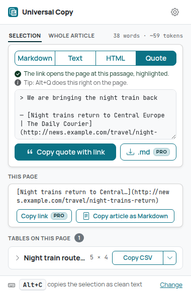
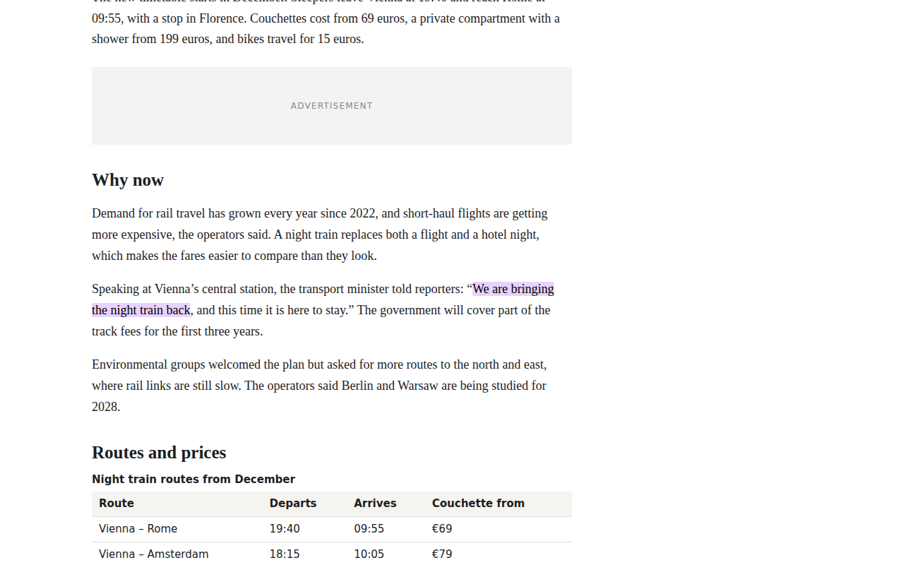
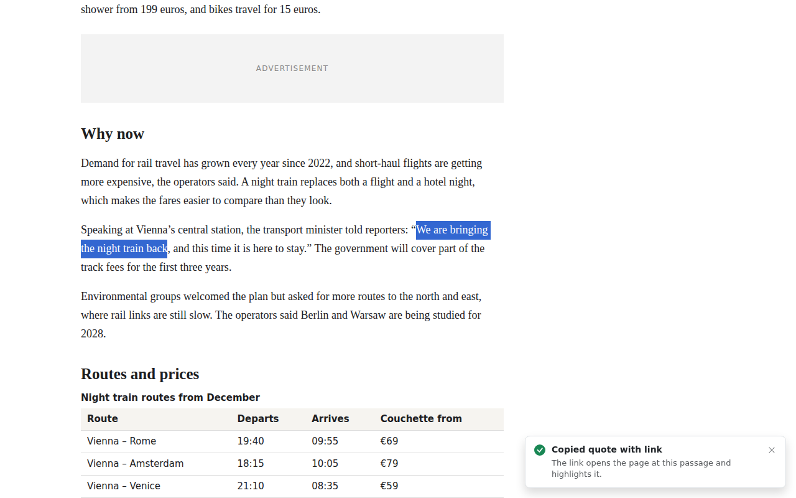
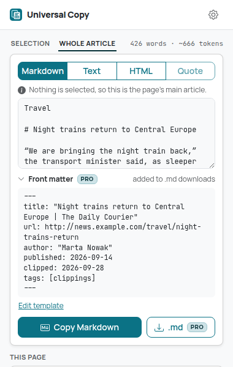
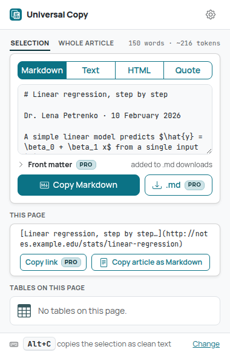
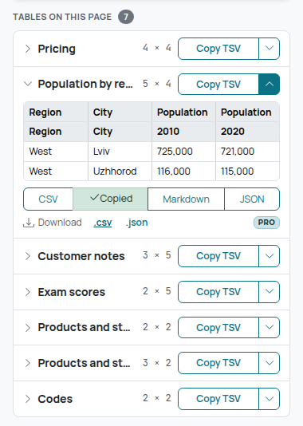
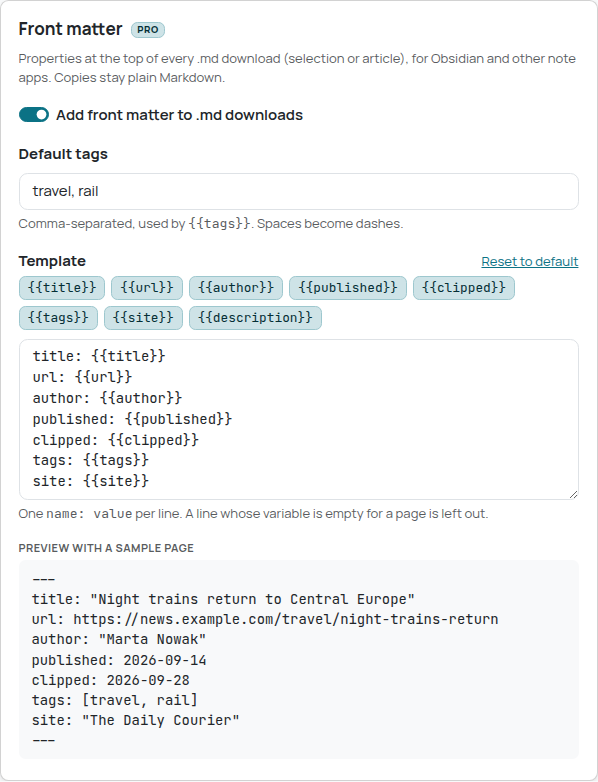

# Universal Copy

Copy what you read in the format you need, with a link back to where it came from: any
selection (or the page's main article, without selecting) as **Markdown**, **clean text** or
**clean HTML**, or as a **quote with a link that opens the page at exactly that passage**.
Formulas come through as LaTeX, and every table on the page copies as **CSV**, **TSV** (pastes
into Excel and Google Sheets as cells), **Markdown** or **JSON**. Pro adds `.md` downloads with
front matter for Obsidian and other note apps, table downloads, the page link as Markdown and
Markdown presets; during early access every Pro feature is free ([Free vs Pro](#free-vs-pro)).

| Toolbar popup | Dark mode |
| --- | --- |
|  |  |

| Quote with a link to the passage | …the link opens the page there, highlighted |
| --- | --- |
|  |  |

## How to use

### Quote with a link to the passage

1. Select a sentence or a few paragraphs.
2. Press **Alt+Q**, or right-click → **Universal Copy → Copy as quote with link**, or open the
   toolbar popup and pick **Quote**.
3. Paste. In Markdown apps you get:

   ```markdown
   > We are bringing the night train back

   — [Night trains return to Central Europe | The Daily Courier](https://news.example.com/travel/night-trains-return#:~:text=reporters%3A%20%E2%80%9C-,We%20are%20bringing%20the%20night%20train%20back)
   ```

The link ends in a [text fragment](https://developer.mozilla.org/en-US/docs/Web/URI/Reference/Fragment/Text_fragments)
(`#:~:text=…`): browsers that support it (Chrome, Edge, and recent Safari and Firefox) open the
page scrolled to the quoted words and highlight them.

- Short passages are quoted in full in the link; long or multi-paragraph ones as their first
  and last words (`text=The%20new%20timetable,for%2015%20euros.`), so the link stays short.
- If the same words also appear earlier on the page (a headline repeated in the text, a
  pull quote), the words just before or after the passage are added (`prefix-,` / `,-suffix`)
  so the browser finds the right copy. When even that can't tell the copies apart (identical
  comments in a thread), the quote links the page without jumping, and the confirmation says so.
- Tracking parameters and old fragments are removed from the address; an in-page `#anchor` is
  replaced by the text fragment. Hash routes of web apps (`#/inbox/42`) are kept.
- **Plain text** style (Settings → Quote with link): `“The quote” — Page title, https://…`.
- Google Docs, Word and email always get a formatted quote (`<blockquote>`) with a clickable
  link, whichever style you choose.
- Selections in text fields, and pages Chrome doesn't let extensions read, get a quote with a
  plain link to the page (no passage to point at); the confirmation says so.



### Copy a whole article as Markdown

No need to select anything:

- Right-click an empty part of the page → **Copy article as Markdown**, or
- open the toolbar popup: with nothing selected it shows the **Whole article** tab (the
  **Copy article as Markdown** button under **This page** copies it in one click).

Universal Copy picks the page's main content and leaves out navigation, sidebars, headers and
footers, ads, cookie and newsletter banners, share bars, "related" lists and comments. The
headline, standfirst, byline, images (with their alt text), headings, lists, code, tables,
formulas and links are kept. When no single article stands out (a home page, a web app), it
copies the whole page without that furniture and says so.



### Copy a selection

1. Select text on a page (a paragraph, a list, a code block, a formula...).
2. Right-click the selection and open **Universal Copy**:
   - **Copy as clean text**: plain text without the site's formatting, invisible characters or
     tracking junk. Lists become `- item`, code keeps its indentation.
   - **Copy as Markdown**: headings, bold/italic, links, images, lists, code blocks (with their
     language), quotes, tables and formulas.
   - **Copy as HTML (clean)**: the structure without the site's styling, for pasting into Google
     Docs, Word or an email.
   - **Copy as quote with link**: see above.
3. A small confirmation appears in the bottom-right corner of the page. Paste wherever you want.


Faster: select text and press **Alt+C**. It copies the selection as clean text (or as Markdown,
see Settings). Change either key at `chrome://extensions/shortcuts`.

### Preview and edit in the popup

Click the Universal Copy toolbar icon:

- **Selection / Whole article** tabs choose what to copy; the counts next to them show the words
  and an approximate token count for AI tools (characters ÷ 4).
- **Markdown | Text | HTML | Quote** picks the format. The preview shows exactly what will be
  copied, in that format (Markdown, HTML and quotes in a monospace font). The popup remembers the
  format you used last.
- The preview is editable: fix a typo, drop a paragraph, then **Copy**. "Edited: you copy what
  you see" appears with **Undo edits**. Edits are kept per format while the popup is open.
- **Download .md** (Pro) saves the Markdown (with your edits) as a file named after the page.



### Formulas as LaTeX

Formulas rendered with **KaTeX**, **MathJax 2** or **MathJax 3/4**, Wikipedia's math and plain
MathML are copied as their LaTeX source: `$\hat{y} = \beta_0 + \beta_1 x$` inline and a
`$$ … $$` block for display formulas, in Markdown, clean text and clean HTML. The TeX comes from
the page (KaTeX's annotation, MathJax's `<script type="math/tex">` or `data-latex`, Wikipedia's
alt text); when a page has only MathML (MathJax 3's assistive MathML), LaTeX is rebuilt from it.
Selecting part of a formula copies the whole formula.

### Copy a table

Either way works:

- **From the page**: select some text inside the table (a single word is enough), right-click,
  **Universal Copy → Copy table as → CSV / TSV (Excel, Sheets) / Markdown / JSON**.
- **From the toolbar**: the popup lists every table on the page as a compact row with its size.
  **Copy CSV** copies in the format you used last (it becomes **Copy TSV** after you use TSV).
  The caret (or the table's name) opens the row: a preview, all four formats and the downloads.



Which format to pick:

| Format | Best for |
| --- | --- |
| TSV | Pasting into Excel or Google Sheets: every value lands in its own cell |
| CSV | Saving as a `.csv` file or importing into other tools |
| Markdown | GitHub, notes apps, AI chats |
| JSON | Code: an array of objects keyed by the column headers |

### Copy the page link as Markdown (Pro)

Right-click anywhere on the page (not on a link or a selection) and choose **Copy page link as
Markdown**, or click **Copy link** under **This page** in the popup. You get
`[Page title](https://address)`: tracking parameters (`utm_*`, `fbclid`, `gclid`...) are removed,
the rest of the address (including `#section`) is kept, and characters in the title that would
turn into Markdown are escaped. Rich editors (Google Docs, email) get a normal link. With text
selected, the same item is at the bottom of the **Universal Copy** menu.

The popup's **This page** row shows that link string itself (a long title is shortened so the
address stays visible; hover for the full string), so you can see the tracking parameters are
gone.


### Download as a file (Pro)

In the toolbar popup:

- **Download .md** saves the selection or the article as Markdown, named after the page title,
  with front matter at the top (see below).
- Open a table row and use **Download .csv / .json**. The file is named after the table (its
  caption or heading), or `Page title - table N` when it has none. CSV uses the delimiter from
  Settings and starts with a UTF-8 byte order mark, so Excel opens accented and Cyrillic text
  correctly.

Files go to your usual download folder. Downloading is popup-only: see
[Known limitations](#known-limitations) for why there's no context-menu item.

### Front matter (Pro)

`.md` downloads start with a YAML block that Obsidian (Properties), Logseq, Jekyll, Hugo and
other tools read:

```yaml
---
title: "Night trains return to Central Europe | The Daily Courier"
url: https://news.example.com/travel/night-trains-return
author: "Marta Nowak"
published: 2026-09-14
clipped: 2026-09-28
tags: [clippings]
---
```

- **Author** and **published** come from the page's own metadata (`author` and
  `article:published_time` meta tags, schema.org JSON-LD or microdata, a `rel=author` link, the
  first `<time datetime>`). Dates become `YYYY-MM-DD`.
- A line whose only value is a variable that's empty for this page (no author) is left out.
- Values are escaped for YAML (quotes, backslashes, line breaks), so a page title can't break
  the block or add keys.
- Settings → **Front matter**: turn it off, set **default tags** (comma-separated; spaces become
  dashes), and edit the **template**. Click a variable chip (`{{title}}`, `{{url}}`,
  `{{author}}`, `{{published}}`, `{{clipped}}`, `{{tags}}`, `{{site}}`, `{{description}}`) to
  insert it; unknown variables, lines that aren't `name: value` and repeated names are pointed
  out, and a preview shows the result for a sample page.
- Copies stay plain Markdown: front matter is only added to downloads. The popup shows the
  block for the current page under **Front matter**, with a link to the template.



### Settings

Right-click the toolbar icon → **Options** (or the gear in the popup):

| Options | Dark mode |
| --- | --- |
|  |  |

- **Keyboard shortcuts**: both keys, what Alt+C copies (clean text or Markdown), and a link to
  change them.
- **Quote with link**: Markdown or plain text for plain-text apps, with a preview.
- **Clean text**: add link addresses after link text, e.g. `the guide (https://example.com/guide)`.
- **Markdown**: list bullet (`-`, `*` or `+`) and italic marker (`*italic*` or `_italic_`).
  **Presets** (Pro) set both in one click: **GitHub** (`-` bullets, `*italic*`), **Obsidian**
  (`-` bullets, `_italic_`) or **Plain** (`*` bullets, `_italic_`). Changing an option by hand
  still works; the preset then shows as unselected.
- **Front matter** (Pro): see above.
- **Tables**: CSV delimiter. Comma, or semicolon for Excel in locales that write decimals with a
  comma (Ukraine, Germany, France...). The default follows the browser's language.

When something can't be copied (no selection, no table in the selection, a page Chrome doesn't
let extensions read), the message tells you what happened and what to do instead:


## Free vs Pro

| Free | Pro ($2.99 once) |
| --- | --- |
| **Quote with a link to the passage** (menu, popup, Alt+Q), Markdown or plain text | **Download as file**: the selection or the article as `.md`, tables as `.csv` or `.json` |
| **Whole article as Markdown**, text or HTML (page menu, popup) | **Front matter** in `.md` downloads, with the template editor and default tags |
| Clean text, Markdown and clean HTML from any selection (menu, popup, Alt+C) | **Copy page link as Markdown**: `[title](url)` without tracking parameters |
| Formulas as LaTeX | **Markdown presets**: GitHub, Obsidian, Plain |
| Editable preview with word and token counts | |
| Every table as CSV, TSV, Markdown or JSON (menu and popup) | |
| All other settings | |

**Early access**: payments aren't set up yet, so every Pro feature is on for everyone. Pro
features carry a small `PRO` badge, and **Settings → About Pro** lists them with the price and a
**Get Pro** button that stays visibly disabled (grey, dashed, with a lock: "Free during early
access") until payments exist.

Once early access ends, a Free user who clicks a Pro feature gets a short note ("… is part of
Universal Copy Pro ($2.99 once). Everything else stays free.") with a link to About Pro. The
front matter block in the popup and the template editor show the same note. Nothing is blocked
or removed; every free feature keeps working. The plan is stored in `chrome.storage.local`
(`plan`, anything but `"pro"` reads as Free); all checks go through `src/core/plan.ts` (see
`docs/MONETIZATION.md`).

## What the conversions do

**Everything**
- Only what's visible is copied: hidden elements (`display: none`, `visibility: hidden`,
  `aria-hidden`, screen-reader-only text), scripts, styles, buttons, forms, iframes, SVG and
  `user-select: none` content (line numbers, UI labels) are skipped. (Whole articles ignore
  `user-select: none`: some sites put it on their whole text.)
- Wikipedia-style junk is dropped: `[edit]` links and footnote markers like `[1]` or
  `[citation needed]`.
- Invisible characters (zero-width spaces, BOM, soft hyphens) are removed; no-break spaces become
  normal spaces. Emoji sequences and bidi marks are kept.
- Links become absolute; tracking parameters (`utm_*`, `fbclid`, `gclid`, ...) are removed;
  `javascript:` and `data:` links are dropped.
- Formulas become LaTeX (`$…$`, `$$…$$`) in every format.

**Markdown**: ATX headings, `**bold**`, `*italic*`, `~~strike~~`, inline code (with longer
fences when the code contains backticks), fenced code blocks with the language taken from
classes such as `language-js`, `lang-py` or GitHub's `highlight-source-shell`, links, images
(``, lazy-loading placeholders resolved), ordered lists (keeping `start`), nested
lists, task lists (`- [x]`), blockquotes, pipe tables, hard line breaks and `---`. Page text is
escaped so it stays text (`*not bold*` doesn't turn bold), without escaping `snake_case`.

**Clean text**: paragraphs and headings separated by a blank line, lists as `- item` /
`1. item` with nested lists indented, table rows as tab-separated lines, code verbatim.
Line breaks the page preserves (chat messages, comments) are kept.

**Clean HTML**: rebuilt from a whitelist of tags (`p`, `h1`-`h6`, lists, tables, `a`, `img`,
`strong`, `em`, `code`, `pre`, `blockquote`...) and attributes (`href`, `src`, `alt`, `colspan`,
`rowspan`, `start`, a `language-*` class on code). No styles, classes, ids, event handlers,
scripts or frames. `text/plain` (the clean text) is put on the clipboard next to `text/html`.

**Quotes**: the selection as Markdown behind `> `, then `— [title](link)`; or `“text” — title,
link`; `text/html` is a `<blockquote cite>` with the clean HTML and a linked title. How the link
finds the passage: `src/core/textFragment.ts` models the page's visible text the way the
browser's find-in-page sees it (blocks, collapsed spaces), snaps the selection to whole words,
and checks candidate directives with a matcher that is slightly looser than the browser's
(case and accents folded, every non-letter a possible word boundary). A directive it accepts
finds no earlier match in the browser either.

**Whole article** (`src/core/article.ts`, a small Readability-style heuristic): elements are
classified by tag, ARIA role and class/id names (`main-nav` and `article-footer` are furniture,
`post-content` and `article-body` are content; fixed and sticky elements are furniture);
paragraphs score by length and commas, the score flows to their parent and grandparent, link-
heavy containers lose points; the best container wins, grown to its `<article>` and to siblings
that score nearly as well; link lists inside it are dropped and the page's `<h1>` is added when
it sits outside.

**Tables**
- Header rows: `<thead>`, otherwise leading rows of `<th>`, otherwise a first row of bold cells.
- `colspan`/`rowspan` are expanded into a rectangular grid (the value is repeated in every cell
  it covers), following the HTML table model (spans clipped at their row group, `rowspan="0"`).
- Nested tables stay inside their cell (as text) instead of being mixed into the outer table.
- Empty rows and trailing empty columns are dropped; empty cells are kept.
- Line breaks inside cells: kept in CSV (quoted) and JSON, `<br>` in Markdown, quoted in TSV the
  way Excel and Sheets write it.
- CSV follows RFC 4180 (fields with the delimiter, quotes or line breaks are quoted, quotes
  doubled). Values are never changed.
- TSV also puts an HTML `<table>` on the clipboard, so spreadsheets get real cells. Cells that
  would run as a formula when pasted (`=...`, `@...`, `+`/`-` followed by non-numbers) get a
  leading `'`, which spreadsheets treat as "this is text". Numbers like `-5` are untouched.
- JSON: an array of objects keyed by the header. Several header rows are combined
  (`Population / 2010`); empty names become `Column N`, duplicates get ` 2`, ` 3`. Keys keep
  the column order; values stay strings.
- Markdown: pipes escaped, a table without a header row gets an empty header row.

## Privacy

Everything runs locally. Universal Copy has no backend, no account, no analytics and no
third-party code, and it makes no network requests (fonts and icons are bundled). The full
policy, with every storage key, is in [PRIVACY.md](PRIVACY.md).

- Nothing is read from a page until you use the context menu, a shortcut or the toolbar button
  on it. It uses `activeTab`, not access to all sites, and has no always-on content scripts.
- Quotes: the page's visible text is read inside the page to find the passage; only the
  finished link leaves it, in the quote you copy.
- Settings, the Pro plan and the last popup formats are stored in `chrome.storage.local`, in
  this browser only. Nothing you copy is stored.
- Downloads are created inside the extension from the converted text (a Blob); nothing is
  uploaded.

### Permissions

| Permission | Why |
| --- | --- |
| `activeTab` | Read the selection, the article or the tables of the current tab, only after you invoke Universal Copy on it |
| `scripting` | Inject the reader and the confirmation message into that tab on demand |
| `contextMenus` | The Universal Copy right-click menu (on selections and on the page) |
| `storage` | Settings, the last popup formats, and a short-lived message for the popup when a page can't show one |
| `offscreen` | A hidden extension page that writes to the clipboard for the background worker |
| `clipboardWrite` | Put the converted text (and HTML) on the clipboard |

No new permissions came with quotes, articles, math or front matter. No `downloads`
permission: files are saved from the popup with a standard `<a download>` link. The page items
use the `page` context of `contextMenus`, which needs no extra permission.

## Development

Requires Node.js 22.12+.

```bash
npm install
npm run build        # production build -> dist/
npm run dev          # rebuild on change (with source maps) -> dist/
npm run typecheck
npm test             # unit tests (vitest, jsdom for DOM-reading code)
npm run test:e2e     # builds dist/ and dist-e2e/, drives dist-e2e/ in real Chromium
npm run screenshots  # same as test:e2e, and refreshes screenshots/
npm run icons        # re-render the PNG icons after changing static/icons/icon.svg
npm run check        # typecheck + unit tests + build
npm run package      # typecheck + unit tests + checked store zip in release/
node scripts/store-assets.mjs   # store graphics in store/assets/ from screenshots/
```

`test:e2e` needs a Chromium build. It's auto-detected in some environments; otherwise set
`CHROMIUM_PATH=/path/to/chromium`. Fixture pages are served under realistic host names
(`news.example.com`, `docs.example.org`, `notes.example.edu`, `blog.example.com`...) mapped to a
local server with `--host-resolver-rules`, so screenshots never show `localhost` or a port. All
screenshots are written to `e2e/output/` (git-ignored); `npm run screenshots` also updates the
curated ones in `screenshots/`.

The UI is Bootstrap 5.3 compiled from Sass (only the partials in use), Bootstrap Icons inlined
as SVG, and the Manrope and JetBrains Mono variable fonts (Latin, Latin Extended and Cyrillic
subsets), all bundled. See `docs/design-system.md` at the repository root. The in-page
confirmation uses a separate, smaller Sass entry scoped to its shadow root and system fonts.

### Load the extension in Chrome

1. `npm install`
2. `npm run build`
3. Open `chrome://extensions`
4. Turn on **Developer mode** (top right)
5. Click **Load unpacked**
6. Select the `dist/` directory

After a rebuild, press the reload icon on the Universal Copy card in `chrome://extensions`.

### Packaging for the Chrome Web Store

`npm run package` builds `dist/`, checks it (manifest is the shipped one, version, every
referenced file, icon sizes, no source maps, test code or remote scripts) and writes a
deterministic `release/universal-copy-<version>.zip`. The listing text, permission
justifications and hand checks are in [store/listing.md](store/listing.md); the graphics in
[store/assets/](store/assets) (settings in `store/assets.json`).

`dist/` is the complete extension: no source maps, no test code (the e2e hook is compiled out and
the check is part of the e2e test), unminified identifiers so review is easy, and
`THIRD_PARTY_NOTICES.txt` with the licenses of Bootstrap, Bootstrap Icons (MIT), Manrope and
JetBrains Mono (SIL OFL 1.1).

## Project structure

```
src/
  core/        Pure logic, no DOM or Chrome APIs: the snapshot model, whitespace
               normalization, clean text, Markdown, clean HTML, the table model and
               formats, text fragments (textFragment.ts), quotes, the article extractor,
               MathML to LaTeX, front matter, word/token counts, settings and presets,
               the Free/Pro plan (plan.ts), download file names, the page link
  page/        Injected on demand: reads the selection, the whole page, a table, formulas,
               page metadata and the page text model from the live DOM, converts, shows
               the toast
  background/  Service worker: context menus, shortcuts, copy flows, clipboard, notices
  offscreen/   Offscreen document that writes text/plain + text/html to the clipboard
  popup/       Toolbar popup: selection/article tabs, formats, editable preview, page link,
               compact table rows, downloads
  options/     Settings page, quote style, front matter editor, Markdown presets, About Pro
  platform/    executeScript wrappers and messages between contexts
  storage/     chrome.storage wrappers
  styles/      Sass: theme, extension pages, in-page toast
  ui/          DOM, icon, clipboard and formatting helpers
static/        manifest.json, HTML, icons
test/          Unit tests
e2e/           Chromium smoke test and fixture pages (news, docs, lecture notes, blog...)
screenshots/   Curated screenshots for this README
store/         Store listing, graphics settings and rendered graphics
```

How a copy works: the background (or popup) injects `page.js` into the tab with
`chrome.scripting.executeScript`. It reads the selection into a **snapshot**, a plain-data tree
with only whitelisted tags and attributes, visibility resolved from computed styles and URLs
made absolute. The pure converters in `src/core/` turn the snapshot into the requested format
right there, so only the result leaves the page. The background writes it to the clipboard
through the offscreen document (a `copy` event listener sets `text/plain` and `text/html`
together) and shows the toast.

## Limits

- At most 2,000,000 characters and 200,000 elements are read from a selection, an article or a
  table; beyond that the first part is copied and the message says so.
- Quote links are worked out on pages of up to 5,000,000 characters of visible text; beyond
  that (or if the page repeats a candidate thousands of times) the quote links the page.
- The popup preview is editable up to 150,000 characters; longer text is shown cut and
  read-only, and Copy still copies all of it.
- Tables: at most 1,000 columns, 100,000 rows and 2,000,000 cells after span expansion.
- The popup lists up to 100 tables and shows the first rows and 6 columns of an opened one.
- Front matter templates: up to 4,000 characters; default tags up to 300.
- A 5,000-row × 8-column table copies as CSV in about a second in the e2e test (budget 2.5 s).

## Known limitations

- **Deep links are verified in Chromium only.** The e2e test opens every copied link in
  Chromium and checks the page scrolled to the passage (not to an earlier copy of the same
  words). Chrome, Edge, Safari 16.1+ and Firefox 131+ document text-fragment support; opening
  the links in **Safari and Firefox is unverified**, and so is quoting on real sites (the build
  environment can't reach them). A text fragment stops matching if the page's text changes.
- Where a site hides the same text twice for layout (a desktop and a mobile copy of a
  paragraph), the link may need context words, or may open the page without jumping.
- **Whole-article extraction is a heuristic**, tested on fixture pages modelled on a news site,
  a docs site, a blog and lecture notes. Results on real sites are **unverified**: pages built
  without semantic markup or class names may keep a sidebar or lose a section. Selecting the
  part you want always works.
- Author and date for front matter are only as good as the page's metadata; pages without it
  get no `author` / `published` lines.
- Formula support is verified on markup that mirrors KaTeX, MathJax 2 and 3 output (fixtures),
  not on live KaTeX/MathJax sites (**unverified**). LaTeX rebuilt from MathML (MathJax 3
  without `data-latex`) covers the common elements (scripts, fractions, roots, accents, sums,
  matrices), not every MathML construct.
- **Downloads are popup-only.** The context menu is handled by the background service worker,
  which has no DOM to create a download link; saving from there would need the `downloads`
  permission (shown to users as "Manage your downloads"). The popup saves through an
  `<a download>` link instead, with no extra permission. With Chrome's "Ask where to save each
  file" turned on, the save dialog takes focus and may close the popup; whether the download
  still completes in that case hasn't been verified (e2e runs with that setting off).
- The page link and quotes use the address and title Chrome shows for the tab; a site's
  `canonical` URL is not used.
- Pages Chrome doesn't let extensions script (`chrome://`, the Chrome Web Store, the built-in PDF
  viewer) can't be read. There the context menu copies the text Chrome reports for the selection
  (plain, line breaks collapsed) and a badge on the toolbar icon confirms it; the popup explains
  why. Table copying, whole articles and passage links aren't possible there.
- Cross-origin iframes: `activeTab` covers the tab's own site, so selections inside frames from
  other sites fall back to Chrome's plain selection text. The shortcuts look in every frame they
  may read (the focused one first); the popup reads the top frame only.
- Formatting that exists only in CSS (a `<span>` styled bold) is not turned into Markdown
  emphasis; semantic tags (`<b>`, `<strong>`, `<em>`...) are.
- Content inside shadow DOM (some web components) isn't part of the page selection and isn't read.
- The shortcuts are **Alt+C** and **Alt+Q**. For copying, `Alt+Shift+C`, `Ctrl+Shift+C` and
  `Alt+Shift+X` were tried first: Chrome refuses to assign them (it keeps some combinations for
  itself and silently skips conflicting suggestions). The e2e test checks that Chrome really
  assigns both keys. Neither has been verified on macOS (where Alt is Option).
- The apostrophe protection for formula-like cells in TSV is based on how Excel and Google Sheets
  treat a leading `'`; pasting into real Excel/Sheets hasn't been tested here (no spreadsheet app
  in the test environment). The TSV text and HTML on the clipboard are verified.
- Cell values are always text; numbers and dates are not converted.
- Token counts are an estimate (characters ÷ 4, the usual rule of thumb for English with GPT-style
  tokenizers); real counts differ by model and language.
