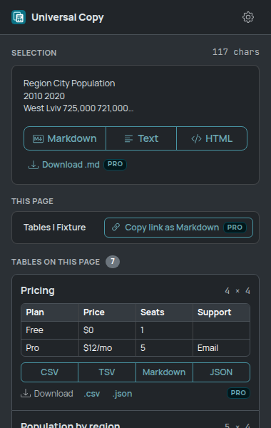
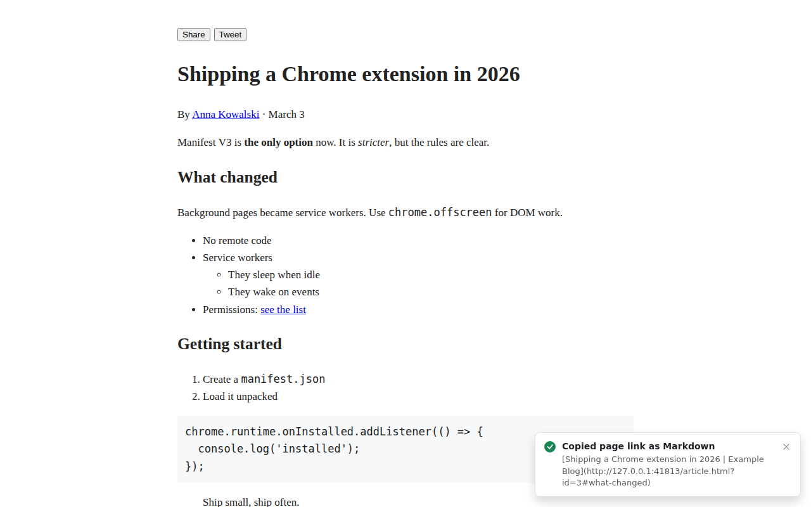
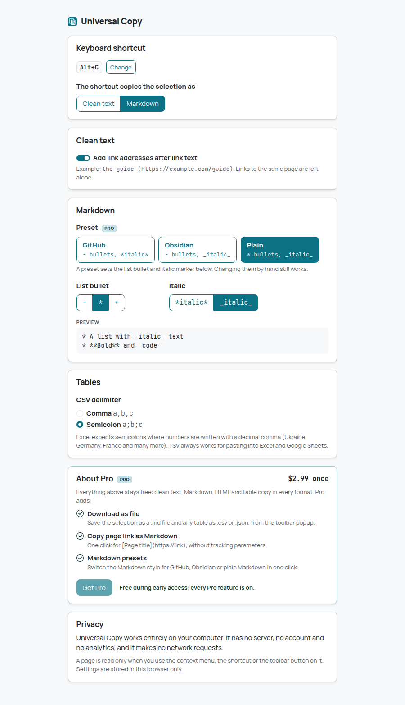
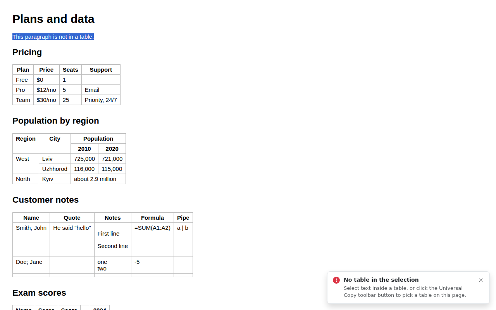

# Universal Copy

Copy anything on a web page the way you need it: as **clean text**, **Markdown** or **clean
HTML**, and any table as **CSV**, **TSV** (pastes into Excel and Google Sheets as cells),
**Markdown** or **JSON**. Pro adds downloads (`.md`, `.csv`, `.json`), the page link as
Markdown and Markdown presets; during early access every Pro feature is free
([Free vs Pro](#free-vs-pro)).

| Toolbar popup | Dark mode |
| --- | --- |
|  |  |


## How to use

### Copy a selection

1. Select text on a page (a paragraph, a whole article, a list, a code block...).
2. Right-click the selection and open **Universal Copy**.
3. Pick a format:
   - **Copy as clean text**: plain text without the site's formatting, invisible characters or
     tracking junk. Lists become `- item`, code keeps its indentation.
   - **Copy as Markdown**: headings, bold/italic, links, images, lists, code blocks (with their
     language), quotes and tables.
   - **Copy as HTML (clean)**: the structure without the site's styling, for pasting into Google
     Docs, Word or an email.
4. A small confirmation appears in the bottom-right corner of the page. Paste wherever you want.

Faster: select text and press **Alt+C**. It copies the selection as clean text (or as Markdown,
see Settings). Change the key at `chrome://extensions/shortcuts`.

### Copy a table

Either way works:

- **From the page**: select some text inside the table (a single word is enough), right-click,
  **Universal Copy → Copy table as → CSV / TSV (Excel, Sheets) / Markdown / JSON**.
- **From the toolbar**: click the Universal Copy icon. The popup lists every table on the page
  with its size and a preview; click **CSV**, **TSV**, **Markdown** or **JSON** under the one you
  want. The button turns into **Copied**.

Which format to pick:

| Format | Best for |
| --- | --- |
| TSV | Pasting into Excel or Google Sheets: every value lands in its own cell |
| CSV | Saving as a `.csv` file or importing into other tools |
| Markdown | GitHub, notes apps, AI chats |
| JSON | Code: an array of objects keyed by the column headers |

### Copy the page link as Markdown (Pro)

Right-click anywhere on the page (not on a link or a selection) and choose **Copy page link as
Markdown**, or click **Copy link as Markdown** under **This page** in the popup. You get
`[Page title](https://address)`: tracking parameters (`utm_*`, `fbclid`, `gclid`...) are removed,
the rest of the address (including `#section`) is kept, and characters in the title that would
turn into Markdown are escaped. Rich editors (Google Docs, email) get a normal link. With text
selected, the same item is at the bottom of the **Universal Copy** menu.



### Download as a file (Pro)

In the toolbar popup:

- **Download .md** under the selection saves it as Markdown, named after the page title.
- **Download .csv / .json** under each table saves that table. The file is named after the table
  (its caption or heading), or `Page title - table N` when it has none. CSV uses the delimiter
  from Settings and starts with a UTF-8 byte order mark, so Excel opens accented and Cyrillic
  text correctly.

Files go to your usual download folder. Downloading is popup-only: see
[Known limitations](#known-limitations) for why there's no context-menu item.

### Settings

Right-click the toolbar icon → **Options** (or the gear in the popup):

| Options | Dark mode |
| --- | --- |
|  |  |

- **Keyboard shortcut**: what Alt+C copies (clean text or Markdown), and a link to change the key.
- **Clean text**: add link addresses after link text, e.g. `the guide (https://example.com/guide)`.
- **Markdown**: list bullet (`-`, `*` or `+`) and italic marker (`*italic*` or `_italic_`).
  **Presets** (Pro) set both in one click: **GitHub** (`-` bullets, `*italic*`), **Obsidian**
  (`-` bullets, `_italic_`) or **Plain** (`*` bullets, `_italic_`). Changing an option by hand
  still works; the preset then shows as unselected.
- **Tables**: CSV delimiter. Comma, or semicolon for Excel in locales that write decimals with a
  comma (Ukraine, Germany, France...). The default follows the browser's language.

When something can't be copied (no selection, no table in the selection, a page Chrome doesn't
let extensions read), the message tells you what happened and what to do instead:



## Free vs Pro

| Free | Pro ($2.99 once) |
| --- | --- |
| Clean text, Markdown and clean HTML from any selection (menu, popup, Alt+C) | **Download as file**: the selection as `.md`, tables as `.csv` or `.json` |
| Every table as CSV, TSV, Markdown or JSON (menu and popup) | **Copy page link as Markdown**: `[title](url)` without tracking parameters |
| All settings (shortcut format, link addresses, bullet, italic, CSV delimiter) | **Markdown presets**: GitHub, Obsidian, Plain |

**Early access**: payments aren't set up yet, so every Pro feature is on for everyone. Pro
features carry a small `PRO` badge, and **Settings → About Pro** lists them with the price and a
**Get Pro** button that stays disabled ("Free during early access") until payments exist.

Once early access ends, a Free user who clicks a Pro feature gets a short note ("… is part of
Universal Copy Pro ($2.99 once). Everything else stays free.") with a link to About Pro. Nothing
is blocked or removed; every free feature keeps working. The plan is stored in
`chrome.storage.local` (`plan`, anything but `"pro"` reads as Free); all checks go through
`src/core/plan.ts` (see `docs/MONETIZATION.md`).

## What the conversions do

**Everything**
- Only what's visible is copied: hidden elements (`display: none`, `visibility: hidden`,
  `aria-hidden`, screen-reader-only text), scripts, styles, buttons, forms, iframes, SVG and
  `user-select: none` content (line numbers, UI labels) are skipped.
- Wikipedia-style junk is dropped: `[edit]` links and footnote markers like `[1]` or
  `[citation needed]`.
- Invisible characters (zero-width spaces, BOM, soft hyphens) are removed; no-break spaces become
  normal spaces. Emoji sequences and bidi marks are kept.
- Links become absolute; tracking parameters (`utm_*`, `fbclid`, `gclid`, ...) are removed;
  `javascript:` and `data:` links are dropped.

**Markdown**: ATX headings, `**bold**`, `*italic*`, `~~strike~~`, inline code (with longer
fences when the code contains backticks), fenced code blocks with the language taken from
classes such as `language-js`, `lang-py` or GitHub's `highlight-source-shell`, links, images
(``, lazy-loading placeholders resolved), ordered lists (keeping `start`), nested
lists, task lists (`- [x]`), blockquotes, pipe tables, hard line breaks and `---`. Page text is
escaped so it stays text (`*not bold*` doesn't turn bold), without escaping `snake_case`.

**Clean text**: paragraphs and headings separated by a blank line, lists as `- item` /
`1. item` with nested lists indented, table rows as tab-separated lines, code verbatim.
Line breaks the page preserves (chat messages, comments) are kept.

**Clean HTML**: rebuilt from a whitelist of tags (`p`, `h1`-`h6`, lists, tables, `a`, `img`,
`strong`, `em`, `code`, `pre`, `blockquote`...) and attributes (`href`, `src`, `alt`, `colspan`,
`rowspan`, `start`, a `language-*` class on code). No styles, classes, ids, event handlers,
scripts or frames. `text/plain` (the clean text) is put on the clipboard next to `text/html`.

**Tables**
- Header rows: `<thead>`, otherwise leading rows of `<th>`, otherwise a first row of bold cells.
- `colspan`/`rowspan` are expanded into a rectangular grid (the value is repeated in every cell
  it covers), following the HTML table model (spans clipped at their row group, `rowspan="0"`).
- Nested tables stay inside their cell (as text) instead of being mixed into the outer table.
- Empty rows and trailing empty columns are dropped; empty cells are kept.
- Line breaks inside cells: kept in CSV (quoted) and JSON, `<br>` in Markdown, quoted in TSV the
  way Excel and Sheets write it.
- CSV follows RFC 4180 (fields with the delimiter, quotes or line breaks are quoted, quotes
  doubled). Values are never changed.
- TSV also puts an HTML `<table>` on the clipboard, so spreadsheets get real cells. Cells that
  would run as a formula when pasted (`=...`, `@...`, `+`/`-` followed by non-numbers) get a
  leading `'`, which spreadsheets treat as "this is text". Numbers like `-5` are untouched.
- JSON: an array of objects keyed by the header. Several header rows are combined
  (`Population / 2010`); empty names become `Column N`, duplicates get ` 2`, ` 3`. Keys keep
  the column order; values stay strings.
- Markdown: pipes escaped, a table without a header row gets an empty header row.

## Privacy

Everything runs locally. Universal Copy has no backend, no account, no analytics and no
third-party code, and it makes no network requests (fonts and icons are bundled).

- Nothing is read from a page until you use the context menu, the shortcut or the toolbar button
  on it. It uses `activeTab`, not access to all sites, and has no always-on content scripts.
- Settings (and, later, the Pro plan) are stored in `chrome.storage.local`, in this browser only.
- Downloads are created inside the extension from the converted text (a Blob); nothing is
  uploaded.

### Permissions

| Permission | Why |
| --- | --- |
| `activeTab` | Read the selection or the tables of the current tab, only after you invoke Universal Copy on it |
| `scripting` | Inject the reader and the confirmation message into that tab on demand |
| `contextMenus` | The Universal Copy right-click menu |
| `storage` | Settings (and a short-lived message for the popup when a page can't show one) |
| `offscreen` | A hidden extension page that writes to the clipboard for the background worker |
| `clipboardWrite` | Put the converted text (and HTML) on the clipboard |

No `downloads` permission: files are saved from the popup with a standard `<a download>` link.
The page-link item uses the `page` context of `contextMenus`, which needs no extra permission.

## Development

Requires Node.js 22.12+.

```bash
npm install
npm run build        # production build -> dist/
npm run dev          # rebuild on change (with source maps) -> dist/
npm run typecheck
npm test             # unit tests (vitest, jsdom for DOM-reading code)
npm run test:e2e     # builds dist/ and dist-e2e/, drives dist-e2e/ in real Chromium
npm run screenshots  # same as test:e2e, and refreshes screenshots/
npm run icons        # re-render the PNG icons after changing static/icons/icon.svg
npm run check        # typecheck + unit tests + build
```

`test:e2e` needs a Chromium build. It's auto-detected in some environments; otherwise set
`CHROMIUM_PATH=/path/to/chromium`. All screenshots are written to `e2e/output/` (git-ignored);
`npm run screenshots` also updates the curated ones in `screenshots/`.

The UI is Bootstrap 5.3 compiled from Sass (only the partials in use), Bootstrap Icons inlined
as SVG, and the Manrope and JetBrains Mono variable fonts (Latin, Latin Extended and Cyrillic
subsets), all bundled. See `docs/design-system.md` at the repository root. The in-page
confirmation uses a separate, smaller Sass entry scoped to its shadow root and system fonts.

### Load the extension in Chrome

1. `npm install`
2. `npm run build`
3. Open `chrome://extensions`
4. Turn on **Developer mode** (top right)
5. Click **Load unpacked**
6. Select the `dist/` directory

After a rebuild, press the reload icon on the Universal Copy card in `chrome://extensions`.

### Packaging for the Chrome Web Store

`dist/` is the complete extension: no source maps, no test code (the e2e hook is compiled out and
the check is part of the e2e test), unminified identifiers so review is easy, and
`THIRD_PARTY_NOTICES.txt` with the licenses of Bootstrap, Bootstrap Icons (MIT), Manrope and
JetBrains Mono (SIL OFL 1.1). Zip the *contents* of `dist/` and upload that.

## Project structure

```
src/
  core/        Pure logic, no DOM or Chrome APIs: the snapshot model, whitespace
               normalization, clean text, Markdown, clean HTML, the table model
               (spans, headers) and table formats, settings and Markdown presets, the
               Free/Pro plan (plan.ts), download file names, the page link
  page/        Injected on demand: reads the selection or a table from the live DOM into a
               snapshot (visibility from computed styles), converts it, shows the toast
  background/  Service worker: context menu, shortcut, copy flows, clipboard, notifications
  offscreen/   Offscreen document that writes text/plain + text/html to the clipboard
  popup/       Toolbar popup: selection preview, page link, tables, downloads
  options/     Settings page, Markdown presets, About Pro
  platform/    executeScript wrappers and messages between contexts
  storage/     chrome.storage wrappers
  styles/      Sass: theme, extension pages, in-page toast
  ui/          DOM, icon, clipboard and formatting helpers
static/        manifest.json, HTML, icons
test/          Unit tests
e2e/           Chromium smoke test and fixture pages
screenshots/   Curated screenshots for this README
```

How a copy works: the background (or popup) injects `page.js` into the tab with
`chrome.scripting.executeScript`. It reads the selection into a **snapshot**, a plain-data tree
with only whitelisted tags and attributes, visibility resolved from computed styles and URLs
made absolute. The pure converters in `src/core/` turn the snapshot into the requested format
right there, so only the result leaves the page. The background writes it to the clipboard
through the offscreen document (a `copy` event listener sets `text/plain` and `text/html`
together) and shows the toast.

## Limits

- At most 2,000,000 characters and 200,000 elements are read from a selection or a table; beyond
  that the first part is copied and the message says so.
- Tables: at most 1,000 columns, 100,000 rows and 2,000,000 cells after span expansion.
- The popup lists up to 100 tables and shows the first rows and 6 columns of each.
- A 5,000-row × 8-column table copies as CSV in well under a second in the e2e test.

## Known limitations

- **Downloads are popup-only.** The context menu is handled by the background service worker,
  which has no DOM to create a download link; saving from there would need the `downloads`
  permission (shown to users as "Manage your downloads"). The popup saves through an
  `<a download>` link instead, with no extra permission. With Chrome's "Ask where to save each
  file" turned on, the save dialog takes focus and may close the popup; whether the download
  still completes in that case hasn't been verified (e2e runs with that setting off).
- The page link uses the address and title Chrome shows for the tab; a site's `canonical` URL
  is not used.

- Pages Chrome doesn't let extensions script (`chrome://`, the Chrome Web Store, the built-in PDF
  viewer) can't be read. There the context menu copies the text Chrome reports for the selection
  (plain, line breaks collapsed) and a badge on the toolbar icon confirms it; the popup explains
  why. Table copying isn't possible there.
- Cross-origin iframes: `activeTab` covers the tab's own site, so selections inside frames from
  other sites fall back to Chrome's plain selection text. The shortcut looks in every frame it may
  read (the focused one first); the popup reads the top frame only.
- Formatting that exists only in CSS (a `<span>` styled bold) is not turned into Markdown
  emphasis; semantic tags (`<b>`, `<strong>`, `<em>`...) are.
- Math rendered by KaTeX/MathJax is mostly hidden from copying (its visual part is
  `aria-hidden` and its accessible part is visually hidden), so it's skipped.
- Content inside shadow DOM (some web components) isn't part of the page selection and isn't read.
- The default shortcut is **Alt+C**. `Alt+Shift+C`, `Ctrl+Shift+C` and `Alt+Shift+X` were tried
  first: Chrome refuses to assign them (it keeps some combinations for itself and silently skips
  conflicting suggestions), which the e2e test checks. The shortcut hasn't been verified on macOS
  (where Alt is Option).
- The apostrophe protection for formula-like cells in TSV is based on how Excel and Google Sheets
  treat a leading `'`; pasting into real Excel/Sheets hasn't been tested here (no spreadsheet app
  in the test environment). The TSV text and HTML on the clipboard are verified.
- Cell values are always text; numbers and dates are not converted.
