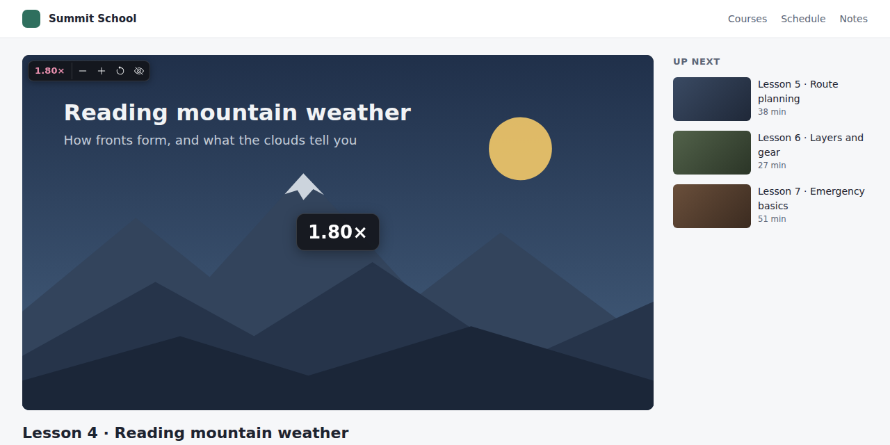
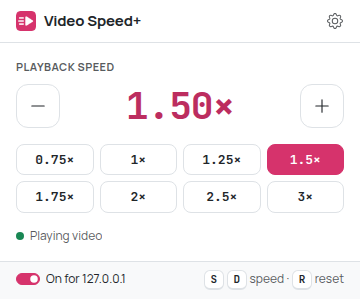
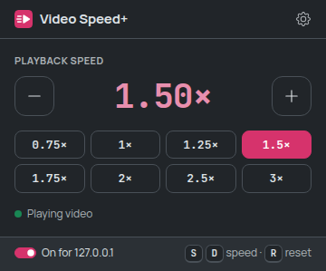
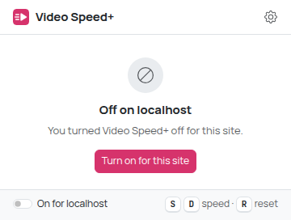
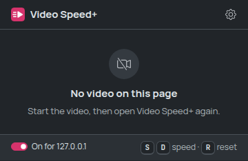
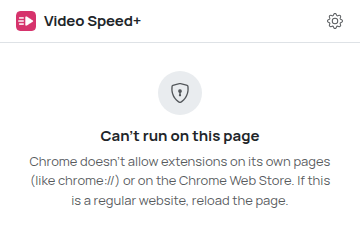
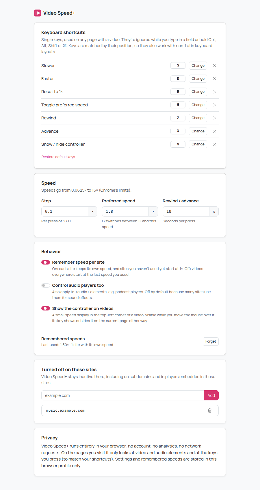
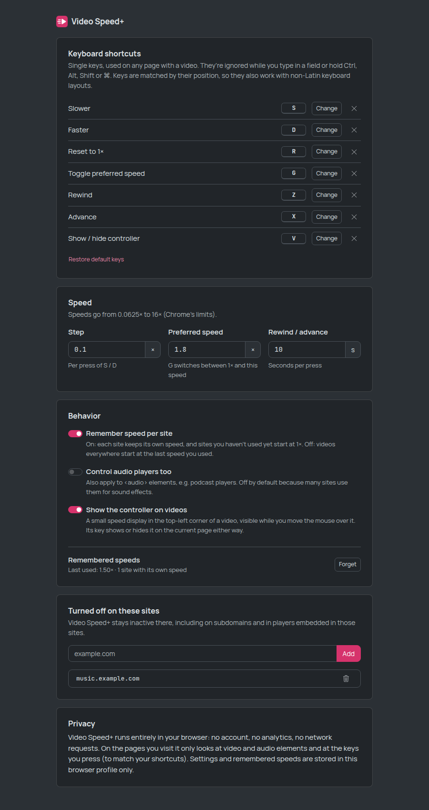

# Video Speed+

Reliable playback speed control for any HTML5 video: YouTube, course platforms, news sites,
social feeds, embedded players. Keyboard shortcuts, a small on-video controller, a toolbar popup,
and a remembered speed that survives sites resetting it.



## How to use

1. **Install it.** Until it's on the Chrome Web Store, load it unpacked (see
   [Load the extension in Chrome](#load-the-extension-in-chrome)).
2. **Open any page with a video** and start it. There's nothing to turn on.
3. **Press `D` to speed up and `S` to slow down** (0.1× per press). A short indicator in the middle
   of the video shows the new speed. `R` goes back to 1×, `G` jumps to your preferred speed (1.8×)
   and back.
4. **Move the mouse over the video** to see the controller in its top-left corner. Point at it for
   the −, +, reset and hide buttons. It fades out when the mouse rests or leaves.
5. **Or click the toolbar icon** for the current speed, presets (0.75× to 3×) and −/+. The switch
   at the bottom turns Video Speed+ off for the current site.
6. **Your speed is remembered.** The next video, on any site, starts at the last speed you used.
   YouTube-style players that reset the speed on every new video or ad are put back automatically.
7. **Adjust it in Settings** (gear icon in the popup, or right-click the toolbar icon → Options):
   keys, step, preferred speed, per-site memory, audio players, the controller, and sites where it
   should stay off.

Using an embedded player (a video inside an iframe, common on course sites)? Click the video once
so the keyboard goes to the player, then use the keys. The popup works either way.

### Keyboard shortcuts

| Key | Action | Notes |
| --- | --- | --- |
| `S` | Slower | −0.1× per press (the step is configurable); hold to repeat |
| `D` | Faster | +0.1× per press; hold to repeat |
| `R` | Reset to 1× | |
| `G` | Toggle preferred speed | Switches between 1× and 1.8× (configurable) |
| `Z` | Rewind | 10 s (configurable); hold to repeat |
| `X` | Advance | 10 s (configurable); hold to repeat |
| `V` | Show / hide the controller | On the current page; the shortcuts keep working while it's hidden |

- Every key can be changed or removed in Settings. Duplicates are refused with a message.
- Keys are ignored while you type in a text field, textarea, editor (`contenteditable`) or a
  search/text box, while Ctrl, Alt, Shift or ⌘ is held, and during IME composition.
- Keys are matched by position (`KeyboardEvent.code`), so they also work with Cyrillic and other
  non-Latin layouts.
- A key is only taken when there's a video to control. On pages without one, the site gets it as
  usual; when it's used, the site doesn't see it (so it can't trigger the site's own shortcut too).
- Speeds range from 0.0625× to 16× (Chrome's limits) and are shown with two decimals. They're
  computed in hundredths, so 1.1 + 0.1 is exactly 1.2.

## Screenshots

| Popup (light) | Popup (dark) |
| --- | --- |
|  |  |
| **Turned off for a site** | **No video on the page (dark)** |
|  |  |
| **Pages Chrome doesn't let extensions run on** | |
|  | |

| Settings (light) | Settings (dark) |
| --- | --- |
|  |  |

The screenshots are generated by the e2e test (`npm run test:e2e`) from local fixture pages.

## How it works

**Which video the keys control.** In order: the video you last interacted with (clicked on it or
its controller, or controlled with a key or the popup) while it's still visible or playing; else a
playing video (the largest visible one, then the most recently started); else the largest visible
video. Hidden, paused videos (preloaded ads) are never picked. The popup applies the same rule
across the page's frames. See `src/core/target.ts`.

**Sites that reset the speed.** YouTube and similar players set the speed back to 1× when a video
or an ad loads, or on play. Video Speed+ re-applies your speed on `loadedmetadata`/`play` and when
the rate changes right after such an event. A change right after you click or press a key on the
page (with no load/play around it) is you using the site's own speed menu, and is adopted instead
of fought. A page that undoes every correction would cause an endless loop, so corrections are
rate-limited (4 per 3 s); after that Video Speed+ stops and shows *"This page keeps changing the
speed back…"* on the video and in the popup. Setting the speed again, or a new video loading,
retries. See `src/core/rateGuard.ts`.

**Remembering.** By default one speed is remembered for everything: the last one you used. With
*Remember speed per site* on, each site keeps its own and sites you haven't used yet start at 1×.
Embedded players count as the site you're on (the top-level page).

**Finding videos.** Videos present at load, added later (a `MutationObserver` that only looks at
added nodes), inside open shadow roots and inside closed ones (via `chrome.dom`), and in iframes,
including `about:blank` ones written by the page. Shadow-root scanning runs in idle time.
`<audio>` elements are only controlled when *Control audio players too* is on (off by default:
many sites use them for sound effects).

**The controller** lives in a shadow root, so page CSS can't change it and it doesn't change the
page. It's positioned over the video rather than inserted into the site's player, and moves into
the player when the site goes fullscreen. Clicks on it don't reach the page, and it takes no clicks
at all while faded out.

## Privacy

Everything runs locally: no backend, no account, no analytics, no network requests (the e2e test
checks the last one). Settings and remembered speeds are stored in `chrome.storage.local` in this
browser profile only.

### Permissions

| Permission | Why |
| --- | --- |
| `storage` | Settings and remembered speeds |
| Content script on `<all_urls>`, `all_frames`, `match_about_blank` | See below |

That's the whole list: no `tabs`, no `scripting`, no host permissions, no background worker. The
popup talks to the page with `chrome.tabs.sendMessage`, which needs none of those.

**Why the content script runs on every page and frame.** A speed controller has to be ready before
you ask: shortcuts must work on the first key press, and remembered speeds must be re-applied when
a site resets them, with no click on the toolbar first. Videos often live in iframes (embedded
YouTube/Vimeo players, course platforms) and in `about:blank` frames that sites build themselves,
so every frame needs it. Chrome shows this as "Read and change all your data on all websites".
What the script actually does on a page: it looks for `<video>`/`<audio>` elements, listens to
key presses (only to match your shortcuts; nothing is recorded) and to pointer positions (to know
which video you're using and when to show the controller). It reads no page text, sends nothing
anywhere, and on pages without video it adds nothing to the page. On sites you turn off it only
listens for settings changes and for the popup.

## Development

Requires Node.js 22.12+ (vitest 5).

```bash
npm install
npm run build        # production build -> dist/
npm run dev          # rebuild on change (with source maps) -> dist/
npm run typecheck
npm test             # unit tests (vitest)
npm run check        # typecheck + unit tests + build
npm run test:e2e     # builds dist/ and dist-e2e/, drives dist-e2e/ in real Chromium
```

`test:e2e` needs a Chromium build. It's auto-detected in some environments; otherwise set
`CHROMIUM_PATH=/path/to/chromium` (`HEADED=1` shows the browser). It generates a WAV tone and a
poster image, serves fixture pages on `127.0.0.1` and `localhost` (two sites, for the blocklist,
per-site memory and cross-origin iframe tests), and writes curated screenshots to `screenshots/`
and debug ones to `e2e/output/` (git-ignored).

The e2e build differs from `dist/` only in test hooks: open shadow roots (so the test can look
inside), a `?tab=<id>` popup parameter (a popup opened as a tab would otherwise control itself) and
a generated manifest `key` (a known extension id without a background worker to ask).

### Load the extension in Chrome

1. `npm install`
2. `npm run build`
3. Open `chrome://extensions`
4. Turn on **Developer mode** (top right)
5. Click **Load unpacked**
6. Select the `dist/` directory

After a rebuild, press the reload icon on the Video Speed+ card in `chrome://extensions`, then
reload the tabs you want to use it in.

### Packaging for the Chrome Web Store

`dist/` is the complete extension: no source maps, no test code (the e2e hooks are compiled out),
unminified identifiers so review is easy. Zip the *contents* of `dist/` and upload that.

### Icons

`static/icons/icon.svg` is the source; the PNGs are committed. After changing the SVG run
`node scripts/make-icons.mjs`.

## Project structure

```
src/
  core/        Pure logic, no DOM or Chrome APIs (unit-tested): speed math, key matching,
               settings, hostnames and blocklist, remembered speeds, which video is the
               target, the rate-change guard, "can't run here" messages
  content/     Content script: media discovery, per-video speed management, the in-page
               controller and indicator (shadow DOM), keyboard and popup messages
  popup/       Toolbar popup
  options/     Settings page
  platform/    Popup ↔ page message types and validation
  storage/     chrome.storage wrappers
  styles/      Sass: _theme.scss (brand), ui.scss (extension pages), overlay.scss (in-page)
  ui/          DOM builder and Bootstrap Icons inlining
static/        manifest.json, HTML, icons
test/          Unit tests
e2e/           Chromium smoke test and fixture pages
screenshots/   Curated screenshots (generated by the e2e test)
```

UI follows `docs/design-system.md`: Bootstrap 5.3 compiled from Sass with only the partials in
use, primary `#d6336c`, Bootstrap Icons inlined as SVG, Manrope and JetBrains Mono bundled
(Latin, Latin Extended and Cyrillic only). The in-page UI is a separate, small Sass entry with the
system font, `:root` rewritten to `:host` and `rem` to `px` (sites change the root font size),
loaded through `adoptedStyleSheets` so it works under strict page CSP and Trusted Types. It's
dark in both OS themes because it sits on video.

## Known limitations

- **Keys go to the frame that has keyboard focus.** For a player in an iframe, click the video
  first. Forwarding keys between frames would need a background worker or messages a page could
  forge; the popup finds players in any frame.
- **Fullscreen of a bare `<video>` element** (the browser's own fullscreen button on a plain video)
  shows nothing but the video, so the controller and indicator can't appear there. Shortcuts still
  work. Site players that go fullscreen as a whole (YouTube and most others) are fine.
- **Tabs open before installing or updating** need a reload: Chrome doesn't add content scripts to
  existing tabs, and injecting them would need the `scripting` permission. After an update the old
  copy removes its controller instead of leaving a broken one behind.
- **The site's own speed menu may show a stale value** (e.g. YouTube says "Normal" while the video
  plays at 1.5×). The video's actual speed is what Video Speed+ shows.
- **Telling your clicks in a site's speed menu from the site's own resets is a heuristic** (a
  change within 1 s of a click or key press, with no load/play event around it, counts as yours).
- Players that don't use `<video>`/`<audio>` (Web Audio, canvas-rendered video) can't be
  controlled.
- Tested against local fixture pages in Chromium 141 (including YouTube-like reset behavior,
  shadow DOM, iframes, fullscreen, strict CSP). It has not been run against the real YouTube,
  Netflix, Coursera or X sites from this environment.
