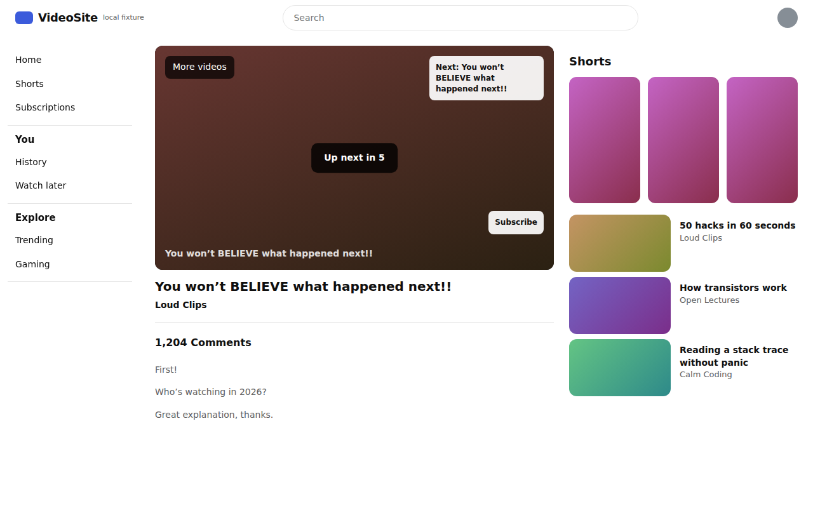
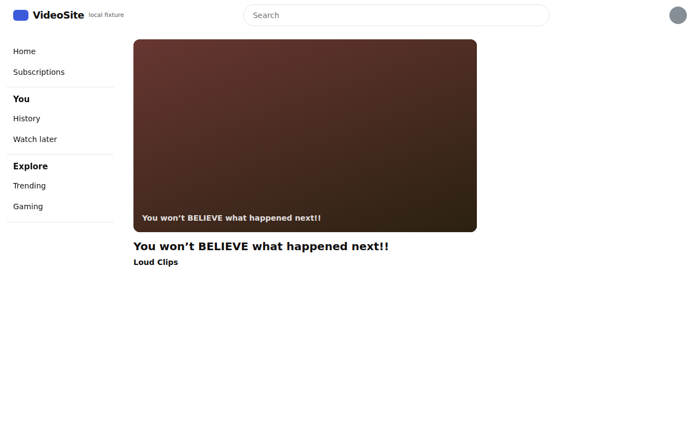
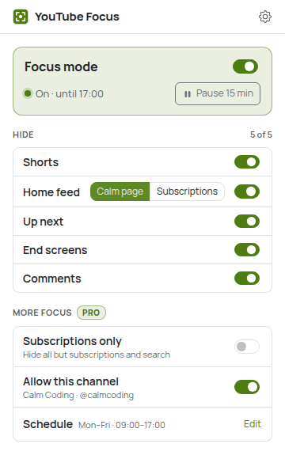
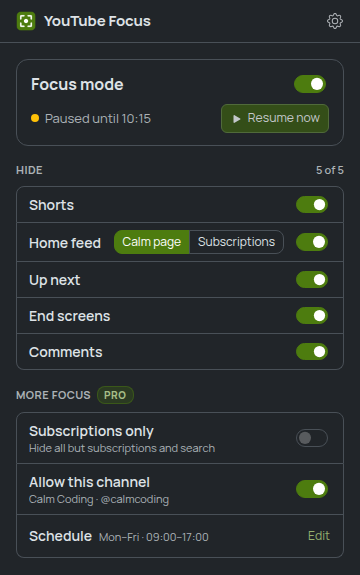
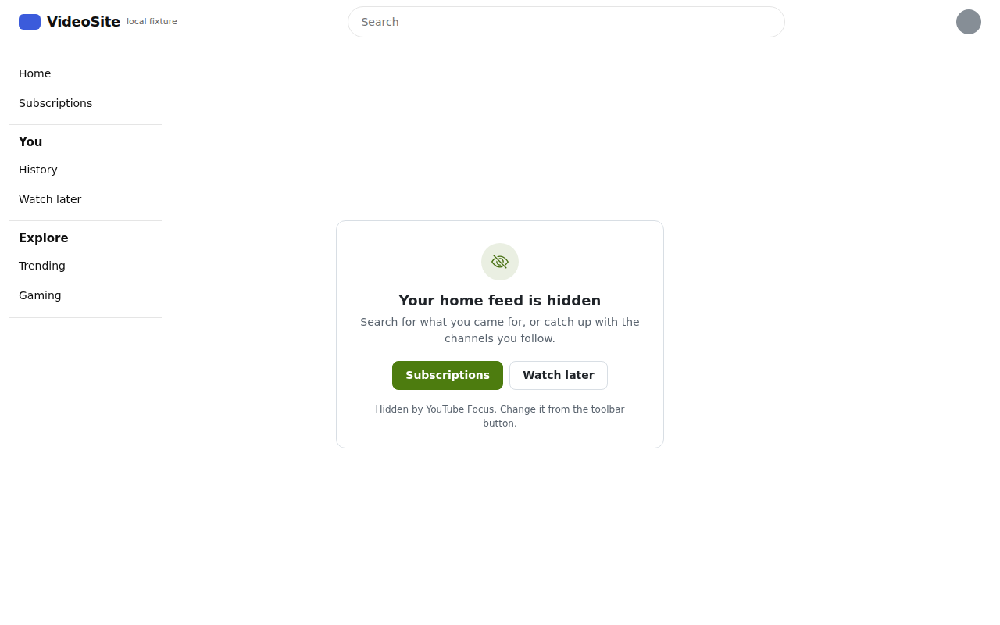
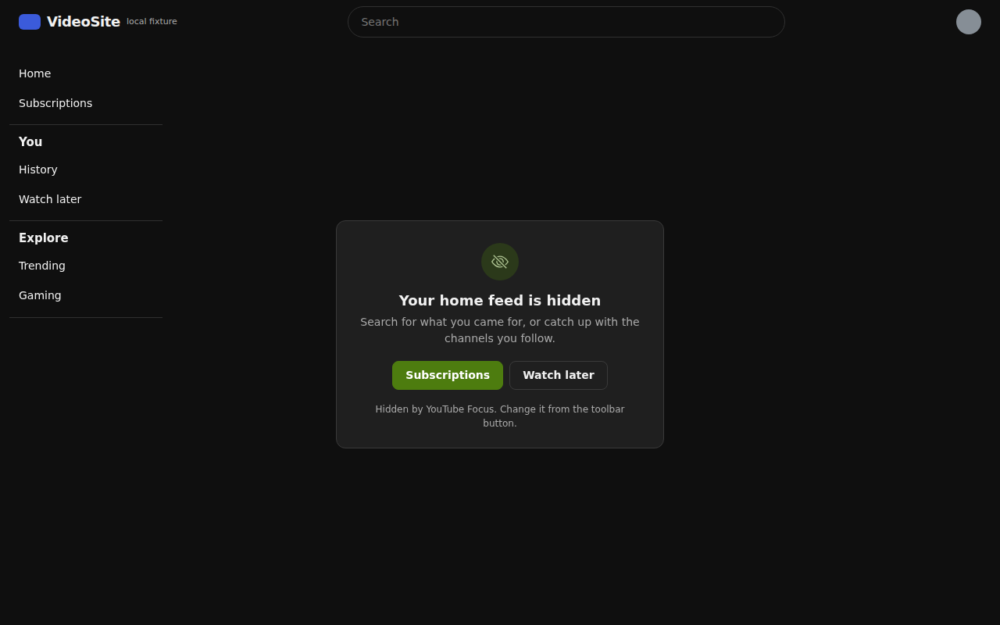
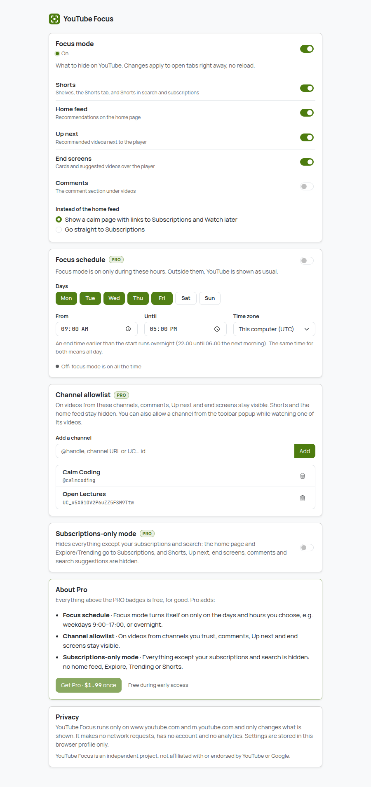
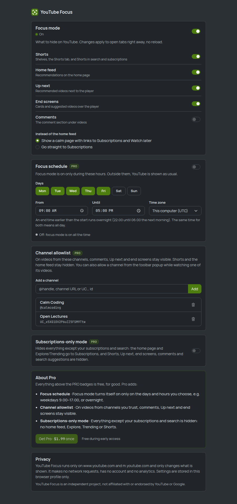

# YouTube Focus

Remove distractions from YouTube: Shorts, the recommended home feed, the "Up next" column, end
screens and autoplay suggestions, and (if you like) comments. Everything is a switch, and every
switch applies to open tabs instantly, without a reload. Need a break? **Pause for 15 minutes**.

Brand color: olive `#4d7c0f` (not used by any other extension in this repo, and far from
YouTube's red). Icon: a focus viewfinder, not YouTube's logo.

| Before | With YouTube Focus |
| --- | --- |
|  |  |

The pictures are local fixture pages that copy YouTube's element structure (see [Verified and
unverified](#verified-and-unverified)).

## How to use

1. **Install it.** Until it's on the Chrome Web Store, load it unpacked: `npm install && npm run
   build`, then `chrome://extensions` → Developer mode → Load unpacked → `youtube-focus/dist`.
2. **Open YouTube.** With the defaults, Shorts, the home feed, Up next and end screens are gone.
   The home page shows a calm card with links to Subscriptions and Watch later instead.
3. **Click the toolbar icon** to change what's hidden:
   - **Focus mode** switch: everything off or on at once.
   - **Pause 15 min**: YouTube as usual for a quarter of an hour, then focus comes back by itself
     (open tabs update on time, no reload). **Resume now** ends the pause early.
   - **Hide**: Shorts, Home feed, Up next, End screens, Comments. For the home feed, choose
     **Calm page** or **Subscriptions** (go straight to your subscriptions).
   - **More focus (Pro)**: Subscriptions only, **Allow this channel** (shown while you watch a
     video), and the schedule.
4. **Settings** (gear icon, or right-click the toolbar icon → Options): the same switches, the
   focus schedule, the channel allowlist, subscriptions-only mode and About Pro.

Details:

- **Shorts**: shelves on the home, subscriptions and search pages, the Shorts entry in the
  sidebar (and the bottom bar on m.youtube.com), Shorts inside search results and the
  subscriptions grid, and the Shorts tab on channel pages. A Shorts link you open anyway plays in
  the normal player (`/shorts/<id>` → `/watch?v=<id>`).
- **Home feed**: only the recommendations grid (and its topic chips) on the home page. Search, the
  sidebar and your subscriptions stay.
- **Up next**: the recommended-videos column on watch pages (and the list under the player on
  mobile). Playlists you opened stay.
- **End screens**: the cards over the last seconds of a video, the grid of suggestions when it
  ends, the "Up next in 5" autoplay card, info-card teasers and the "More videos" overlay on pause.
- **Comments**: off by default (they're often useful on tutorials); switch on to hide them.

## Free vs Pro

Per [`docs/MONETIZATION.md`](../docs/MONETIZATION.md): Pro is **$1.99 once**. Payments aren't set
up yet, so everything is included during early access (`EARLY_ACCESS = true` in
`src/core/plan.ts`).

| Free | Pro |
| --- | --- |
| Hide Shorts, home feed (calm page or redirect to Subscriptions), Up next, end screens, comments | **Focus schedule**: on only on chosen days and hours, overnight ranges (22:00–06:00), any time zone |
| Master switch, pause for 15 minutes | **Channel allowlist**: comments, Up next and end screens stay on videos from channels you trust |
| Live apply, SPA navigation, www. and m.youtube.com | **Subscriptions-only mode**: everything except subscriptions and search is hidden |

The plan seam: every Pro check goes through `hasFeature` / `limitsFor` (`src/core/plan.ts`). On
the free plan, Pro settings are **kept but not applied** (a schedule is ignored, so focus stays
on; the allowlist and subscriptions-only mode do nothing), the controls are disabled with a PRO
badge and one calm sentence. The e2e test checks this with early access switched off.

### Focus schedule

Days (Monday first) and a window From/Until, in this computer's time zone or one you pick.

- A window belongs to the day it starts on. Until earlier than From runs overnight: Friday
  22:00–06:00 covers Friday night until Saturday 06:00.
- From equal to Until means all day on the chosen days. No days chosen: focus never turns on.
- Open tabs switch at the edges on their own (the content script times the next change, and
  re-checks at least every minute, so sleep/wake and DST are caught). The popup and Settings
  show "until 17:00" / "starts tomorrow 09:00".
- A pause wins over the schedule; the master switch wins over both.

### Channel allowlist

Add channels in Settings by `@handle`, channel URL (`youtube.com/@name`, `/channel/UC…`) or `UC…`
id, or with **Allow this channel** in the popup while watching one of its videos. Handles match
case-insensitively; an entry added from the popup keeps the channel's name. Legacy `/c/Name` and
`/user/Name` URLs can't be mapped offline and are refused with a message.

YouTube keeps the previous video's metadata on screen for a moment after navigating. The channel
is only trusted once the player's `video-id` matches the URL, so an allowed channel never
"leaks" to the next video. Until the channel is known, things stay hidden.

### Subscriptions-only mode

Every hide switch is forced on; the home page and Explore/Trending/Gaming go to Subscriptions;
the sidebar's Home entry and Explore section, and "People also watched" / "People also search for"
shelves in search results are hidden. Search and your subscriptions work as usual. Allowlisted
channels still keep their comments and Up next.

## How it works

- **Pure CSS for hiding.** `src/sites/youtube.ts` lists every selector. The build turns it into
  `dist/content.css`, which Chrome injects at `document_start`, before YouTube renders. Each rule
  is gated on attributes on `<html>`: `data-ytf-hide="shorts home …"` and `data-ytf-route="home"`.
  The content script only sets those two attributes, so a switch in the popup is one attribute
  change: no reload, no removing YouTube's elements, nothing to restore when it's turned off.
- **One decision, shared.** `src/core/focus.ts` computes what's hidden, whether the calm panel
  shows and where to redirect, from the settings, the plan, the time and the page. The content
  script and the popup use the same function.
- **SPA navigation.** YouTube never reloads between pages. The content script follows
  `yt-navigate-finish`, the Navigation API (`currententrychange`, for URL changes without that
  event), `popstate`, and a 1 s URL check as a last resort.
- **Redirects** (home → Subscriptions, Shorts → player, Explore → Subscriptions) use
  `location.replace`, only after page loads, navigation or your own setting changes (never at a
  timer edge), and never twice to the same place within 3 s.
- **The calm panel** is a small card in its own closed shadow root, fixed over the empty home
  page. It follows YouTube's own theme (`html[dark]`), not the OS setting.
- **Extension updated or removed while YouTube is open**: the orphaned script removes its
  attributes and panel on the next event, so YouTube is back to normal.

## Privacy

Everything runs locally: no backend, no account, no analytics, no network requests (the e2e test
checks the last one). Settings are stored in `chrome.storage.local` in this browser profile.

### Permissions

| Permission | Why |
| --- | --- |
| `storage` | Settings (switches, pause end time, schedule, allowlist) |
| Content script on `https://www.youtube.com/*` and `https://m.youtube.com/*` (top frame) | Injects the hiding stylesheet and sets the two attributes, shows the calm home card, follows navigation |

That's all: no `tabs`, no `scripting`, no host permissions, no background worker. The popup asks
the content script for the current channel with `chrome.tabs.sendMessage`, which needs none of
those. Chrome shows the install warning as "Read and change your data on www.youtube.com and
m.youtube.com". Embedded YouTube players on other sites are not touched.

## Verified and unverified

YouTube can't be reached from the environment this was built in. Everything was tested against
**local fixture pages** (`e2e/fixtures/`) that copy YouTube's element structure: a
www.youtube.com-like SPA (ytd-* elements) on `127.0.0.1` and an m.youtube.com-like one (ytm-*) on
`localhost`. Only the e2e build adds those two origins to the content script; the e2e test
asserts that `dist/manifest.json` matches YouTube only.

**Verified in Chromium (e2e):** every switch hides and shows the right fixture elements, live;
master switch; SPA navigation with and without `yt-navigate-finish` and back/forward; redirect
option; Shorts → player; pause for 15 minutes including the real timer running out; schedule
with a controlled clock (same-day, overnight, time zones, set up in Settings); allowlist from
Settings and from the popup, including stale metadata after SPA navigation; subscriptions-only
mode; free-plan gating; mobile structure; all generated CSS rules parse in Chromium; no network
requests; test hooks absent from `dist/`.

**Unverified until checked on live YouTube** (all in `src/sites/youtube.ts`):

| Feature | Selectors |
| --- | --- |
| Shorts | `ytd-reel-shelf-renderer`, `ytd-rich-shelf-renderer[is-shorts]`, `ytd-rich-section-renderer:has(ytd-rich-shelf-renderer[is-shorts])`, `ytd-guide-entry-renderer:has(a#endpoint[title="Shorts"])`, `ytd-mini-guide-entry-renderer[aria-label="Shorts"]`, `ytd-mini-guide-entry-renderer:has(a[title="Shorts"])`, `ytd-rich-item-renderer:has(a[href^="/shorts/"])`, `ytd-grid-video-renderer:has(a[href^="/shorts/"])`, `ytd-video-renderer:has(a[href^="/shorts/"])`, `ytd-reel-item-renderer`, `ytm-shorts-lockup-view-model`, `ytm-shorts-lockup-view-model-v2`, `grid-shelf-view-model:has(ytm-shorts-lockup-view-model[-v2])`, `yt-tab-shape[tab-title="Shorts"]`; mobile: `ytm-reel-shelf-renderer`, `ytm-rich-section-renderer:has(ytm-reel-shelf-renderer)`, `ytm-pivot-bar-item-renderer:has(.pivot-shorts)`, `ytm-video-with-context-renderer:has(a[href^="/shorts/"])`, `ytm-rich-item-renderer:has(a[href^="/shorts/"])` |
| Home feed (home page only) | `ytd-browse[page-subtype="home"] ytd-rich-grid-renderer`; mobile: `ytm-browse ytm-rich-grid-renderer`, `ytm-browse ytm-section-list-renderer`, `ytm-browse ytm-feed-filter-chip-bar-renderer` |
| Up next (watch pages) | `ytd-watch-flexy #related`, `ytd-watch-next-secondary-results-renderer`; mobile: `ytm-item-section-renderer[section-identifier="related-items"]`, `ytm-single-column-watch-next-results-renderer ytm-item-section-renderer[data-content-type="related"]` |
| End screens | inside `.html5-video-player`: `.ytp-ce-element`, `.ytp-endscreen-content`, `.videowall-endscreen`, `.ytp-autonav-endscreen-countdown-overlay`, `.ytp-cards-teaser`, `.ytp-pause-overlay` |
| Comments | `ytd-comments#comments`, `ytd-engagement-panel-section-list-renderer[target-id="engagement-panel-comments-section"]`; mobile: `ytm-comment-section-renderer`, `ytm-comments-entry-point-header-renderer` |
| Subscriptions-only extras | `ytd-guide-section-renderer:has(a[href="/feed/trending"])`, `ytd-guide-entry-renderer:has(a#endpoint[href="/"])`, `ytd-mini-guide-entry-renderer:has(a[href="/"])`, `ytd-mini-guide-entry-renderer:has(a[href="/feed/trending"])`, `ytd-search ytd-shelf-renderer`, `ytd-search ytd-horizontal-card-list-renderer`; mobile: `ytm-pivot-bar-item-renderer:has(.pivot-w2w)` |
| Channel of the video (allowlist) | `ytd-watch-metadata ytd-channel-name a[href]`, `ytd-watch-metadata #owner a[href]`, `ytd-video-owner-renderer ytd-channel-name a[href]`, `ytm-slim-owner-renderer a[href]`; staleness check `ytd-watch-flexy[video-id]` |
| YouTube dark theme (calm card) | `html[dark]`, `html[darker-dark-theme]` |
| Navigation event | `yt-navigate-finish` (the Navigation API and `popstate` cover it if it changes) |

When YouTube changes its markup, that one file is the fix; a selector Chrome can't parse only
drops its own rule (one rule per selector).

## Limitations

- **Autoplay still plays the next video.** Hiding the "Up next in 5" card doesn't turn off
  YouTube's autoplay; use YouTube's own autoplay switch in the player (we don't change your
  YouTube settings).
- Hiding is visual: YouTube still loads the hidden recommendations in the background.
- Only YouTube itself: embedded players on other sites, YouTube Music and YouTube Kids aren't
  covered.
- The allowlist needs the channel link on the watch page; until YouTube renders it (a fraction of
  a second), comments and Up next stay hidden even on allowed channels.
- Time inputs in Settings use the browser's locale (12 or 24 h); the popup shows 24 h times.
- If YouTube is left open during an extension update, the old script cleans up on the next
  navigation or event, and the new one starts on the next page load.

## Development

```bash
npm install
npm run typecheck && npm test && npm run build   # dist/ is the loadable, store-ready build
npm run test:e2e   # builds dist-e2e/ and drives it in Chromium (set CHROMIUM_PATH if needed)
node scripts/make-icons.mjs   # only after changing static/icons/icon.svg
```

- `src/core/`: pure logic, unit-tested with vitest (`test/`): settings sanitizing, schedule
  evaluation (overnight, time zones, DST, next change), allowlist parsing and matching, routes,
  the focus decision, the plan seam.
- `src/sites/youtube.ts`: all selectors and the CSS generator.
- `src/content/`: the content script and the calm panel. `src/popup/`, `src/options/`: the pages
  (Bootstrap 5.3, light/dark from the OS, Manrope/JetBrains Mono bundled).
- e2e-only hooks (compiled out of `dist/`, asserted by the e2e test): the fixture origins in the
  manifest, `?tab=` for the popup, an open shadow root for the panel, a `data-ytf-e2e` apply
  counter, and the `e2e:clockOffset` / `e2e:earlyAccess` storage keys.
- Screenshots in `screenshots/` are written by `npm run test:e2e`; `e2e/output/` is scratch.

## Screenshots

| Popup (light) | Popup (dark, paused) |
| --- | --- |
|  |  |

| Home page (light) | Home page (YouTube dark theme) |
| --- | --- |
|  |  |

| Settings (light) | Settings (dark) |
| --- | --- |
|  |  |
